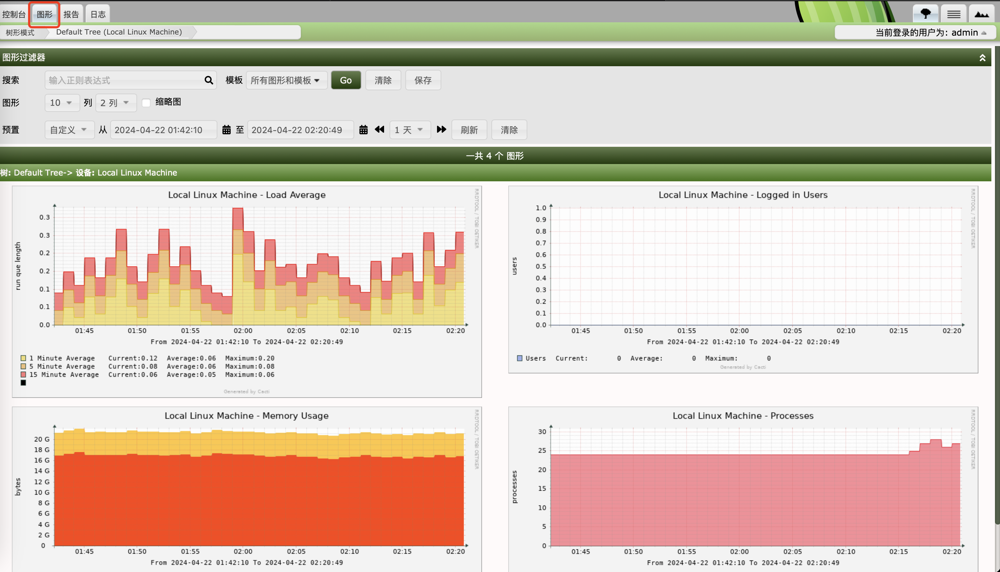

## 简介

cacti是用php写的，一个开源的网络监控工具，可以用于监控网络流量，并用图表化的方式呈现。

cacti将数据存储在MySQL里，同时还使用了RRDTool（Round Robin Database）即环状数据库。

cacti主要通过SNMP服务获取数据，用RRDTool存储数据和更新SNMP获取到的数据，需要时查看时可以查看RRDTool生成的图。MySQL则用于存储cacti用户信息模板等。

cacti的工作流程和架构如下：


## 环状数据库

RRDTool就是环状数据库，形象的理解为数据库存储在一个环中，环是头尾相接的。写数据沿着环以此写，当写到最开始的数据时，直接覆盖，相当于开始了第二圈的写环操作。

## 通过docker-compose启动

docker-compose.yml文件内容如下：

```yml
version: '3.5'
services:


  cacti:
    image: "smcline06/cacti"
    container_name: cacti
    domainname: example.com
    hostname: cacti
    ports:
      - "80:80"
      - "443:443"
    environment:
      - DB_NAME=cacti_master
      - DB_USER=user
      - DB_PASS=admin
      - DB_HOST=db
      - DB_PORT=3306
      - DB_ROOT_PASS=admin
      - INITIALIZE_DB=1
      - TZ=America/Los_Angeles
    volumes:
      - cacti-data:/cacti
      - cacti-spine:/spine
      - cacti-backups:/backups
    links:
      - db


  db:
    image: "mariadb:10.3"
    container_name: cacti_db
    domainname: example.com
    hostname: db
    ports:
      - "3306:3306"
    command:
      - mysqld
      - --character-set-server=utf8mb4
      - --collation-server=utf8mb4_unicode_ci
      - --max_connections=200
      - --max_heap_table_size=128M
      - --max_allowed_packet=32M
      - --tmp_table_size=128M
      - --join_buffer_size=128M
      - --innodb_buffer_pool_size=1G
      - --innodb_doublewrite=ON
      - --innodb_flush_log_at_timeout=3
      - --innodb_read_io_threads=32
      - --innodb_write_io_threads=16
      - --innodb_buffer_pool_instances=9
      - --innodb_file_format=Barracuda
      - --innodb_large_prefix=1
      - --innodb_io_capacity=5000
      - --innodb_io_capacity_max=10000
    environment:
      - MYSQL_ROOT_PASSWORD=admin
      - TZ=America/Los_Angeles
    volumes:
      - cacti-db:/var/lib/mysql

volumes:
  cacti-db:
  cacti-data:
  cacti-spine:
  cacti-backups:
```

登陆 http://localhost/cacti/auth_changepassword.php?ref=http://10.251.29.251/cacti/install/install.php，初次登陆时，用户名和密码都是admin

然后按照引导执行安装操作，安装完毕后页面如下：


## 可视化机器的进出流量

如果想要可视化某一台机器的一些指标，首先需要确认被监控的机器是否安装了snmp服务，没有则需要进行安装。确保snmp在该机器上运行。

要想查看某一台机器的指标情况，首先需要创建新设备：


输入主机名和描述，设备模板选择 Net-SNMP Device


然后点击 为设备创建图形：


因为我想监控进出网络数据包变化，拉到下面可以看到网卡列表。选择想要监控的网卡，图形类型选择 In/Out Bits：


点击确认创建完毕后点击上方的 图形 按钮：



可以查看流量变化（图上这个是我之前创建的，创建了好几个）。
