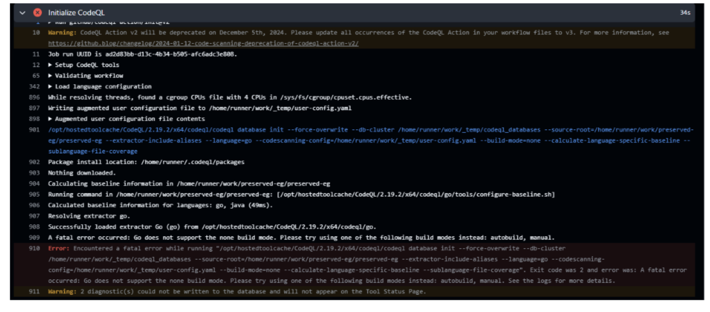
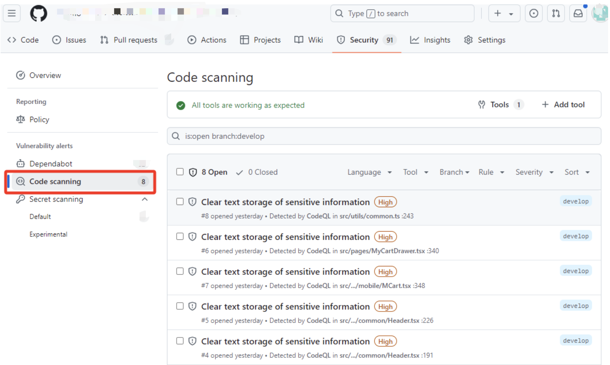
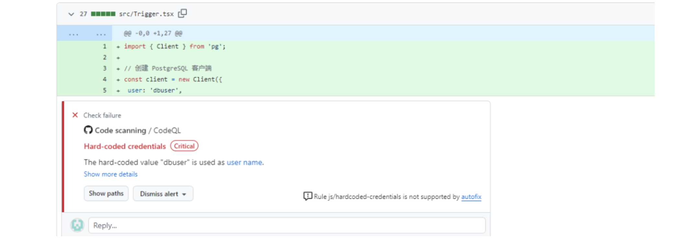
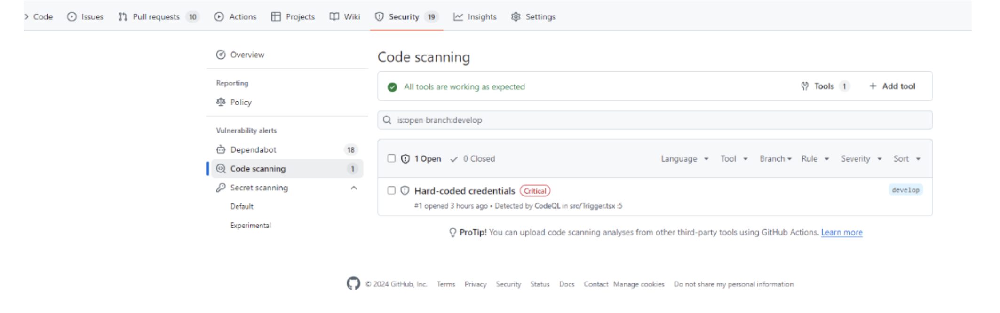
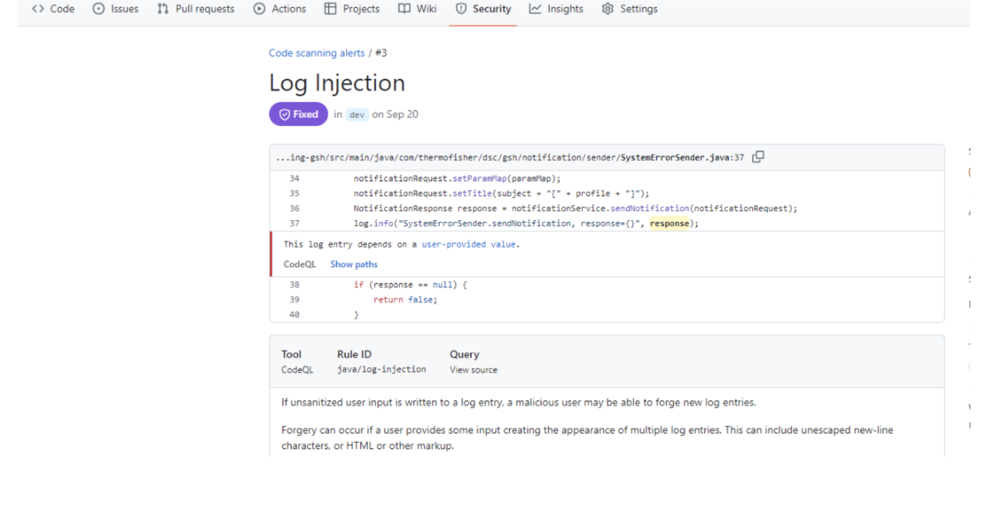
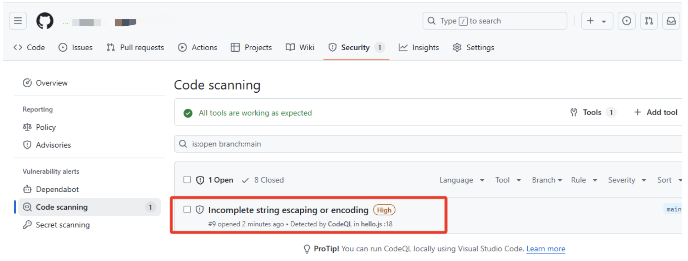
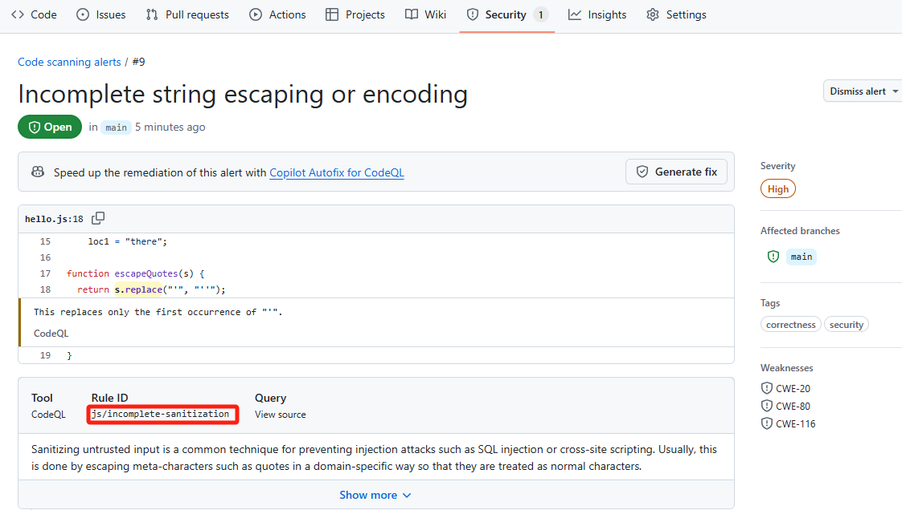
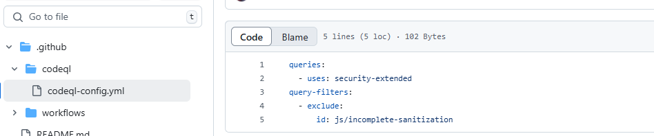
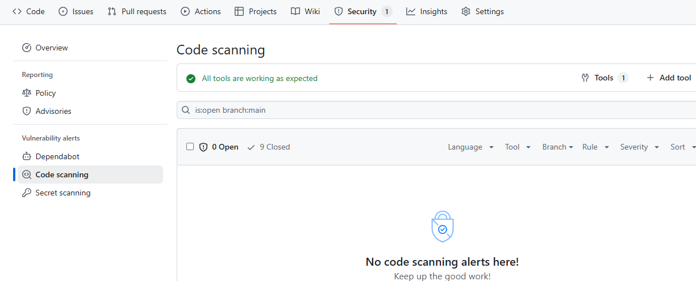

## CodeQL

## 简介

[CodeQL](https://codeql.github.com/)是Github出品的代码分析引擎，全称Code Query Language，顾名思义就是通过规定的语法查询代码中可能出现的安全隐患。CodeQL可以通过扫描一个项目的源代码，发现源代码存在的安全漏洞，然后自动将扫描结果上传给Github以便将结果在pull request中或者repository的Security Tab中展示。

CodeQL运行时的操作步骤如下：

- init：即初始化操作，在该操作中进行CodeQL的设置，设置CodeQL要分析的编程语言，设置查询集（查询集可以根据自己的规则和模式分析代码，识别潜在的安全漏洞，每个查询集的规则和模式都不一样。比如security-extended`、`security-and-quality等），设置CodeQL需要使用的数据库（CodeQL之后会往里写入AST、代码相关元数据等）。init中也可以配置编译操作。
- analyze：扫描代码并分析，将分析结果上传给Github。对于编译型语言，analyze依赖编译信息，所以需要在analyze之前执行编译操作（可以设置init中auto build，也可以在init之后手动指定编译命令）

CodeQL支持分析多种编程语言的源代码，即时一个源代码里有多种变成语言。CodeQL所有支持的编程语言可以参考 https://docs.github.com/en/code-security/code-scanning/creating-an-advanced-setup-for-code-scanning/codeql-code-scanning-for-compiled-languages。编程语言可以分为两类， 编译型和解释型，对于解释型语言，CodeQL直接分析源代码文件即可以检测出漏洞，对于编译型语言，则需要先执行编译操作（不管是CodeQL在init中auto build还是自定义编译的命令），因为CodeQL的分析依赖完整的编译信息。具体参见下文的`使用/init/build-mode`模块。

> 操作步骤提到的数据库是一个比较重要的概念，衔接了init和analyze。对于解释型语言可以忽略这块，对于编译型语言这块很重要。数据库无论什么情况下都会被创建，analyze的分析依赖数据库，数据库存储了**编译信息**和其他内容（其他内容无论是什么语言，只要运行了init就都会被创建）。对于编译型语言，如果analyze部分要运行分析，那么数据库的编译信息部分必须存在，如果要有编译信息，就一定要在analyze之前运行编译命令，否则会直接报错。

## 官方配置文档

下面介绍如何将CodeQL集成到Github Action中。

CodeQL运行时的两个操作步骤：init和analyze，分别对应了一个三方github action，init对应了github/codeql-action/init@v3，analyze对应了github/codeql-action/analyze@v3。这两个三方action在使用时根据官方文档，可以自定义一些参数

### 全局workflow参数配置

主要就是permission里的参数配置，一般配置成如下：

```yml
    permissions:
      actions: read # 定义工作流所需的权限
      contents: read # 设置CodeQL是否允许读取仓库源代码。对于私有仓库，需要设置为read，共有仓库不需要设置
      security-events: write # 允许codeql向github write分析结果
```

### init

所有可以传的参数参考官方文档：https://github.com/github/codeql-action/blob/main/init/action.yml 的inputs部分

### analyze

所有可以传的参数参考官方文档：https://github.com/github/codeql-action/blob/main/analyze/action.yml 的inputs部分，下面介绍其中比较重要的配置：

## 配置

下面介绍如何将CodeQL集成到Github Action中。

CodeQL运行时的两个操作步骤：init和analyze，分别对应了一个三方github action，init对应了github/codeql-action/init@v3，analyze对应了github/codeql-action/analyze@v3。这两个三方action在使用时根据官方文档，可以自定义一些参数，下面介绍两个步骤中一些比较重要的参数。

### 全局workflow参数配置

主要就是permission里的参数配置，一般配置成如下：

```yml
    permissions:
      actions: read # 定义工作流所需的权限
      contents: read # 设置CodeQL是否允许读取仓库源代码。对于私有仓库，需要设置为read，共有仓库不需要设置contents项
      security-events: write # 允许codeql向github security 报告分析结果
```

### init

所有可以传的参数参考官方文档：https://github.com/github/codeql-action/blob/main/init/action.yml 的inputs部分，下面介绍其中比较重要的配置：

#### **languages**

该文档里官方写的注释为：

```shell
  languages:
    description: >-
      A comma-separated list of CodeQL languages to analyze.

      Due to the performance benefit of parallelizing builds, we recommend specifying languages to
      analyze using a matrix and providing `\$\{{ matrix.language }}` as this input.

      For more information, see
      https://docs.github.com/en/code-security/code-scanning/creating-an-advanced-setup-for-code-scanning/customizing-your-advanced-setup-for-code-scanning#changing-the-languages-that-are-analyzed.
```

顾名思义，该参数用于设置CodeQL对于当前源代码应该分析哪些编程语言的漏洞。源代码中涉及java语言，此处填写java即可，如果涉及其他语言，则填写其他语言，如果有多种编程语言，则填写多种即可。建议手动填写。虽然CodeQL可以根据源代码各文件的后缀名分析出当前源代码使用了哪些编程语言，但是此操作消耗性能，故建议手动填写，通过${{ matrix.language }}的方式填写。

####  build-mode

该文档里官方写的注释为：

```shell
  build-mode:
    description: >-
      The build mode that will be used to analyze the language. This input is only available when
      analyzing a single CodeQL language per job, for example using a matrix.

      Available build modes will differ based on the language being analyzed. One of:

      - `none`:      The database will be created without building the source code.
                     Available for all interpreted languages and some compiled languages.
      - `autobuild`: The database will be created by attempting to automatically build the source
                     code. Available for all compiled languages.
      - `manual`:   The database will be created by building the source code using a manually
                     specified build command. To use this build mode, specify manual build steps in
                     your workflow between the `init` and `analyze` steps. Available for all
                     compiled languages.
```

在使用matrix传递输入的时候，可以设置该参数。一般不需要额外设置build-mode，一般CodeQL都会选择当前场景下合适的参数。所有可以设置的值如下：

- none：codeql不会尝试去编译源代码，database被创建了，但是不会存储编译相关信息。对于编译型语言，设置该模式时需要保证所有的编译操作都在init之前完成，且编译操作命令需要手动指定，比如：

  > 不是所有编译型语言这个参数都可以设置为none，比如golang就不可以，我测试了一下，设置了就会报错：
  >
  > 

  ```yml
  jobs:
   analyze:
     name: Analyze
     runs-on: ubuntu-latest
     steps:
     - name: Checkout repository
       uses: actions/checkout@v2
     - name: Set up JDK 11
       uses: actions/setup-java@v2
       with:
         java-version: '11'
     - name: Build project
       run: |
         mvn clean install # 手动指定的编译命令
  
     - name: Initialize CodeQL
       uses: github/codeql-action/init@v1
       with:
         languages: java
         build-mode: none  # 指定为 none 模式
  ```

- autobuild：CodeQL会努力去自动编译源代码生成数据库，比如对于maven项目，会运行maven构建命令。database会存储编译相关信息。

- manual：编译命令不再是CodeQL自己检测分析出来的，而是手动指定的，可以在init之后指定，指定之后运行到编译命令时CodeQL会将编译信息存储到数据库中。比如：

  ```shell
     - name: Initialize CodeQL
       uses: github/codeql-action/init@v1
       with:
         languages: java
         build-mode: manual  # 指定为 manual 模式
  
     - name: Build project
       run: |
         # 在这里添加你的编译命令，例如使用 Maven 进行构建
         mvn clean install
  
     - name: Perform CodeQL Analysis
       uses: github/codeql-action/analyze@v1
  ```

### analyze

所有可以传的参数参考官方文档：https://github.com/github/codeql-action/blob/main/analyze/action.yml 的inputs部分，下面介绍其中比较重要的配置：

#### upload

其官方文档上的注释为：

```yml
  upload:
    description: >-
      Upload the SARIF file to Code Scanning.
      Defaults to 'always' which uploads the SARIF file to Code Scanning for successful and failed runs.
      'failure-only' only uploads debugging information to Code Scanning if the workflow run fails, for users post-processing the SARIF file before uploading it to Code Scanning.
      'never' avoids uploading the SARIF file to Code Scanning, even if the code scanning run fails. This is not recommended for external users since it complicates debugging.
```

该参数用于设置CodeQL是否会将结果上传到github上，默认为always，即CodeQL会将结果上传到github上，这样在pull request中或者repository的Security Tab中可以看到CodeQL分析的结果。如果设置为failure-only，则只会在workflow运行失败的时候CodeQL才将自己debug的信息上传到github便于分析。never即在不管成功还是失败的时候都不上传上去。

## 使用

**下面以最常见的javascript项目和java项目为例子，分别为编译型语言和解释型语言，**

### javascript项目（前端）

解释型语言比较简单，在CodeQL中不用关心编译问题，以javascript为例，在`.github/workflows/codeql.yml`下创建如下内容，更新至github仓库。

可以配置为如下：

```yml
name: "CodeQL"

on:
 push:
   branches: 
     - develop # 更新该分支的代码会触发codeql
 workflow_dispatch: # 手动选择分支触发
 schedule:
    - cron: '0 14 * * *' # 这是需要写UTC时间，实际上会在北京时间运行每天晚上10点开始调度运行

jobs:
 analyze:
   name: Analyze
   runs-on: self-hosted
   permissions:
     actions: read
     contents: read
     security-events: write

   strategy:
     fail-fast: false
     matrix:
       language: [ 'typescript' ] # typescript 支持扫描分析.ts, .tsx, .mts, .cts后缀的文件

   steps:
   - name: Checkout repository
     uses: actions/checkout@v4

   - name: Get latest commit info
     run: |
      CURRENT_BRANCH=$(git branch --show-current)
      echo "Using branch: $CURRENT_BRANCH"
      COMMIT_ID=$(git log -1 --format="%H")
      echo "Latest Commit ID: $COMMIT_ID"
      COMMIT_MESSAGE=$(git log -1 --format="%s")
      echo "Latest Commit Message: $COMMIT_MESSAGE"
      COMMIT_AUTHOR=$(git log -1 --format="%an")
      echo "Latest Commit Author: $COMMIT_AUTHOR"

   - name: Initialize CodeQL
     uses: github/codeql-action/init@v3
     with:
       languages: ${{ matrix.language }}

   - name: Perform CodeQL Analysis
     uses: github/codeql-action/analyze@v3
     with:
       category: "/language:${{matrix.language}}"
```

### java项目（后端）

java用了自定义的编译命令gradle，运行这个命令之前需要设置java环境和gradle环境，这个分别是通过了actions/setup-java@v4和gradle/actions/setup-gradle@v3实现的。

可以参考如下写法：

```yml
name: "CodeQL"

on:
 push:
   branches: 
     - dev # 更新该分支的代码会触发codeql流程
 workflow_dispatch: # 手动选择分支触发codeql流程
 schedule:
    - cron: '0 14 * * *' # 这是需要写UTC时间，实际上会在北京时间运行每天晚上10点开始调度运行

jobs:
  analyze:
    name: Analyze
    runs-on: self-hosted
    permissions:
      actions: read
      contents: read
      security-events: write

    strategy:
      fail-fast: false
      matrix:
        language: ['java'] # 支持扫描分析 .java 后缀的文件

    steps:
    - name: Checkout repository
      uses: actions/checkout@v4

    - name: Setup Java
      uses: actions/setup-java@v4
      with:
        distribution: 'oracle'
        java-version: 17.0.12
    - name: Setup Gradle
      uses: gradle/actions/setup-gradle@v3
      with:
        gradle-version: 8.5

    # Initializes the CodeQL tools for scanning.
    - name: Initialize CodeQL
      uses: github/codeql-action/init@v3
      with:
        languages: ${{ matrix.language }}
        queries: security-extended
        
    # run 里写的是打包jar包的命令
    - run: |
        gradle clean jar -x test

    - name: Perform CodeQL Analysis
      uses: github/codeql-action/analyze@v3
      with:
        category: "/language:${{matrix.language}}"
```

## 验证

提交代码或者在Github Action中手动选择分支运行CodeQL后，查看项目的Security Tab，点击Code scanning，所有的漏洞都会类似如下显示：



如果项目Code scanning没有显示任何Open的漏洞，想查看效果的话可以自行搜索“codeql xx语言 漏洞模拟”提交漏洞代码等CodeQL运行完毕后查看Security Tab。

当漏洞修复后，重新运行codeql则漏洞会自动从Open状态变为Closed状态。

下面模拟一个漏洞：

假如我想手动模拟typescript的漏洞，让codeql检测出来，模拟方法就是新建一个tsx文件，写上如下内容：

```
import { Client } from 'pg';

// 创建 PostgreSQL 客户端
const client = new Client({
 user: 'dbuser',
 host: 'database.server.com',
 database: 'mydb',
 password: 'secretpassword',
 port: 5432,
});

client.connect();

async function getUserByUsername(username: string) {
 // 不安全的查询，直接使用用户输入构建 SQL 查询
 const query = `SELECT * FROM users WHERE username = '${username}'`;
 const res = await client.query(query);
 return res.rows;
}

// 模拟用户输入
const userInput = "admin' OR '1'='1";
getUserByUsername(userInput).then((user) => {
 console.log(user);
}).catch((err) => {
 console.error('Error executing query', err.stack);
});
```

codeql会报出如下错误：



且可以在项目的Security下看到codeql的反馈：



java模拟的话，可以参考：

```java
 public boolean sendNotification(String subject, Map<String, Object> paramMap) {
        NotificationRequest notificationRequest = new NotificationRequest();
        notificationRequest.setTemplateId(templateId);
        notificationRequest.setParamMap(paramMap);
        notificationRequest.setTitle(subject + "[" + profile + "]");
        NotificationResponse response = notificationService.sendNotification(notificationRequest);
        log.info("SystemErrorSender.sendNotification, response={}", response);
        if (response == null) {
            return false;
        }
```

主要是log那一行，会通过codeql被检测出来。检测效果参考



## 配置忽略一些规则

默认情况下，codeql会使用很多规则查询，然后将检查出来的所有漏洞在Security Tab的Open下展示。理论上所有的漏洞都是需要修复的，但是如果有一些漏洞是团队允许的，或者是该漏洞代码太多短时间没有时间修复，可以配置codeql忽略该漏洞，配置完毕之后重新运行codeql则被配置的漏洞不会显示在Open下。下面介绍如何配置。本次介绍使用的只是一个简单的项目，不是当前团队正在开发的项目，只是作为参考。

### 配置前codeql运行

比如某次运行codeql后，运行结果如图，假设开发人员没有时间修复红框内的“Incomplete string escaping or encoding”类型的漏洞，想配置该中漏洞不被检查出来，即让该漏洞不在Open下显示。下面介绍如何配置。



### 确定Rule ID

点击“Incomplete string escaping or encoding”查看具体内容，查看其Rule ID，由图上可见“Incomplete string escaping or encoding”类型的漏洞的Rule ID为js/incomplete-sanitization



### codeql的配置文件

在`.github`下新建`codeql`目录，在`codeql`下新建codeql-config.yml文件，填写如下内容：

```yml
queries:
  - uses: security-extended
query-filters:
  - exclude:
      id: js/incomplete-sanitization # 即上述提到的 Rule ID
```

最终的效果为：



再在workflow的配置文件添加对应的配置文件配置，即编辑`/github/workflows/codeql.yml`文件，在init action中添加配置文件参数，效果如下：

```yml
   - name: Initialize CodeQL
     uses: github/codeql-action/init@v3
     with:
       languages: ${{ matrix.language }}
       config-file: ./.github/codeql/codeql-config.yml # 添加该行
```

### 配置后codeql运行

提交上述变更，在github action中手动触发codeql的运行，执行完毕后结果为：




可见刚刚的漏洞已经被移动到了Closed下。

### 补充

**多条代码可能会触发同一个规则**：补充：在上述的yml中配置的`id: js/incomplete-sanitization`会把所有触发该规则ID的代码都忽略掉，不让其在Open下显示。实际开发的代码中可能有多行代码都触发了`id: js/incomplete-sanitization`规则，配置了`id: js/incomplete-sanitization`后Closed下会新增多条，对应触发规则的多行代码。

**忽略多条规则：**假设开发想配置忽略多条规则，在query-filters:下追加即可，参考如下：

```yml
query-filters:
  - exclude:
      id: js/incomplete-sanitization # 即上述提到的 Rule ID
  - exclude:
      id: {rule2}
```

**后续修复**：假设开发人员后续有空修复了上述的“Incomplete string escaping or encoding”类型的漏洞代码，则只需要将`id: js/incomplete-sanitization`从query-filters删除，如下：

````yml
query-filters:
  - exclude:
      id: {rule2}
````

然后在github action中手动触发codeql运行，则漏洞代码会从Closed下回到Open下。

漏洞代码修复完毕后，重新在github action中手动触发codeql运行，运行完毕后漏洞代码会自动从Open下转移到Closed下，表示漏洞代码修复完成。

###  下载插件源代码

除了直接指定uses: github/codeql-action/init@v3，也可以下载codeql的源代码，使用源代码检查，参考如下：

```shell
name: "CodeQL"

on:
#  push:
  #  branches: 
  #    - develop # 更新该分支的代码会触发codeql
 workflow_dispatch: # 手动选择分支触发
 schedule:
    - cron: '0 2 * * *' # 这是需要写UTC时间，实际上会在北京时间每天早上10点开始调度运行

jobs:
 analyze:
   name: Analyze
   runs-on: self-hosted
   permissions:
     actions: read
     contents: read
     security-events: write

   strategy:
     fail-fast: false
     matrix:
       language: [ 'typescript' ] # typescript 支持扫描分析.ts, .tsx, .mts, .cts后缀的文件

   steps:
   - name: Checkout repository
     uses: actions/checkout@v4
   - name: Get latest commit info
     run: |
      CURRENT_BRANCH=$(git branch --show-current)
      echo "Using branch: $CURRENT_BRANCH"
      COMMIT_ID=$(git log -1 --format="%H")
      echo "Latest Commit ID: $COMMIT_ID"
      COMMIT_MESSAGE=$(git log -1 --format="%s")
      echo "Latest Commit Message: $COMMIT_MESSAGE"
      COMMIT_AUTHOR=$(git log -1 --format="%an")
      echo "Latest Commit Author: $COMMIT_AUTHOR"
   - name: Download latest CodeQL v3
     run: |
      REPO="github/codeql-action"
      LATEST_V3_TAG=$(curl -s https://api.github.com/repos/$REPO/releases | jq -r '.[] | select(.tag_name | startswith("v3")) | .tag_name' | head -n 1) # 注意这部分❗ ❗ 
      TAR_URL="https://github.com/$REPO/tarball/$LATEST_V3_TAG"
      echo "Latest v3 Tag: $LATEST_V3_TAG"
      echo "Downloading CodeQL Action from: $TAR_URL"
      curl -L $TAR_URL -o codeql-action.tar.gz
      mkdir -p codeql-action
      tar -xzf codeql-action.tar.gz -C codeql-action --strip-components=1
      echo "CodeQL Action (v3) downloaded and extracted."

   - name: Initialize CodeQL
     uses: ./codeql-action/init
     with:
       languages: ${{ matrix.language }}
       queries: security-and-quality

   - name: Perform CodeQL Analysis
     uses: ./codeql-action/analyze
     with:
       category: "/language:${{matrix.language}}"
```

