## 报文格式

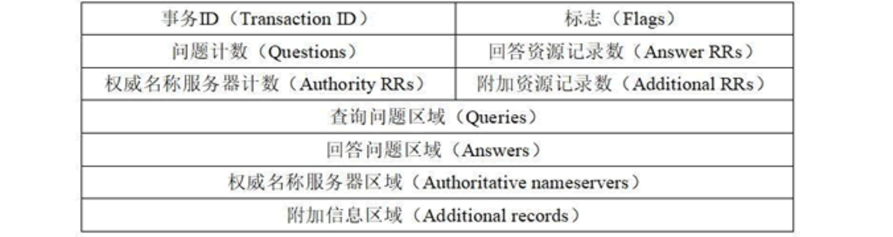

## 抓包

> PS：开启混杂模式的网卡可以捕获所有流过该网卡的帧，不开启则只能捕获广播帧以及发给该网卡的帧。一般都要开混杂模式。

### DNS报文之后的数据

我抓包的时候发现了这样的包：

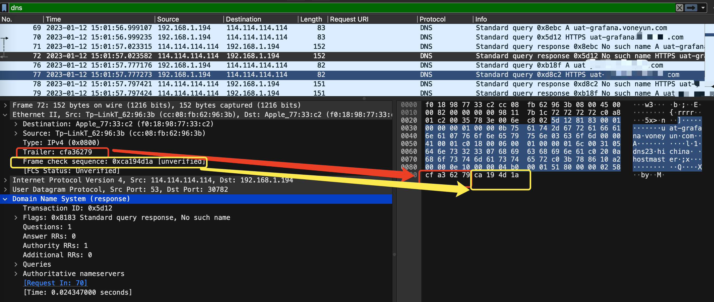

数据包在DNS之后还有2段数据，查阅资料后得知，这2段数据分别是以太网的Trailer和以太网帧校验序列（FCS）。

### 抓包概览

Authority RRs  权威名称服务器计数：权威名称服务器的数目。
Additional RRs  附加资源记录数：额外的记录数目（权威名称服务器对应 IP 地址的数目）。

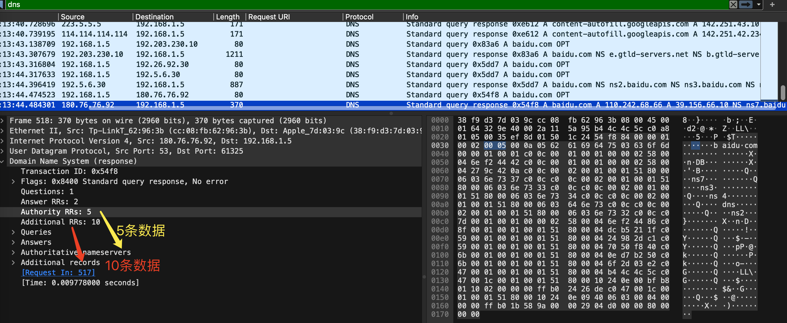

## 报文字段分析

### Answers

> Answers 部分的响应数据是根据查询所请求的 DNS 记录类型和查询类型（递归查询或迭代查询）而返回的。如果没有找到匹配的记录，则响应的 Answers 部分将为空。

Answers在有的Response里可能为空

#### Type

Answers里可能的Type的值我抓包时看到了以下几种（通过gopacket分析的）：

NS、A、CNAME、PTR、AAAA、SOA、Unknown

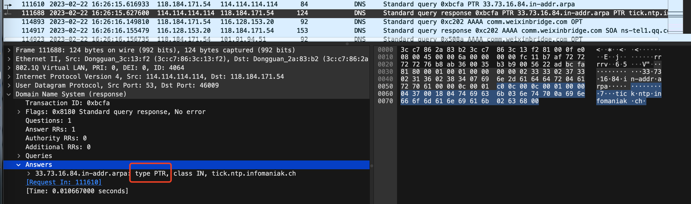

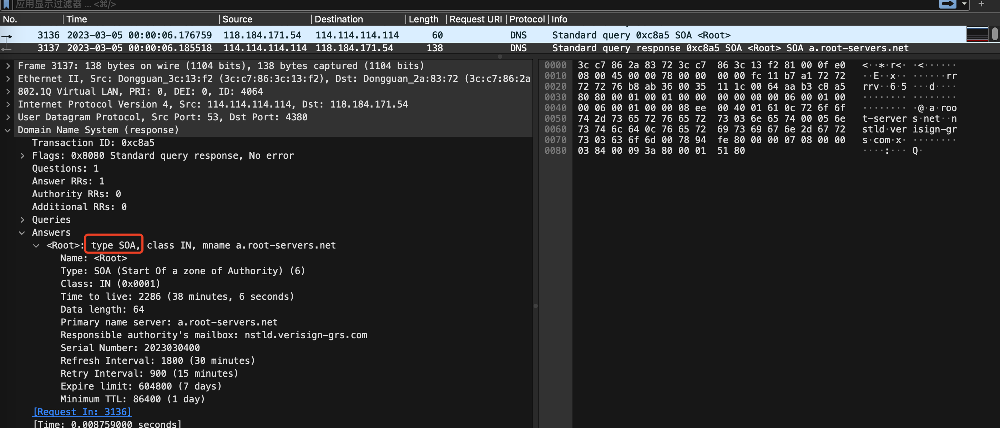

SOA对应的请求为

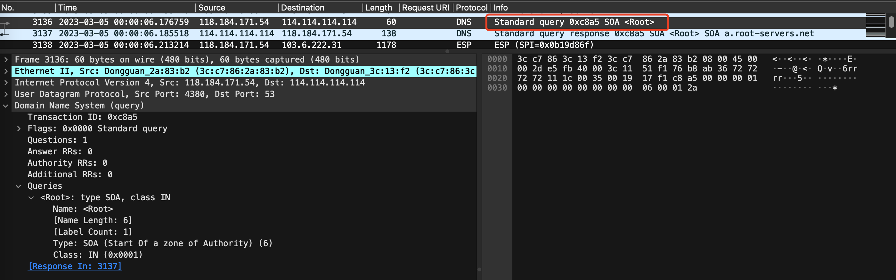

还有抓包抓到了一些gopacket里没有定义的类型，比如RRSIG，其对应的值为46

> DNS RRSIG (Resource Record Signature) 是一种 DNS 记录类型，用于提供 DNSSEC (DNS Security Extensions) 安全扩展的数字签名。RRSIG 记录对指定的 DNS 记录进行数字签名，并在签名中包含有关签名算法、签名有效期和其他信息。

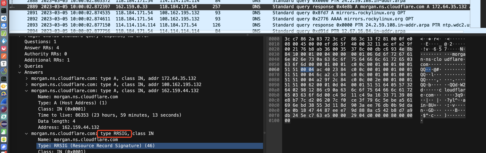

还有DS类型的，其对应的值为43

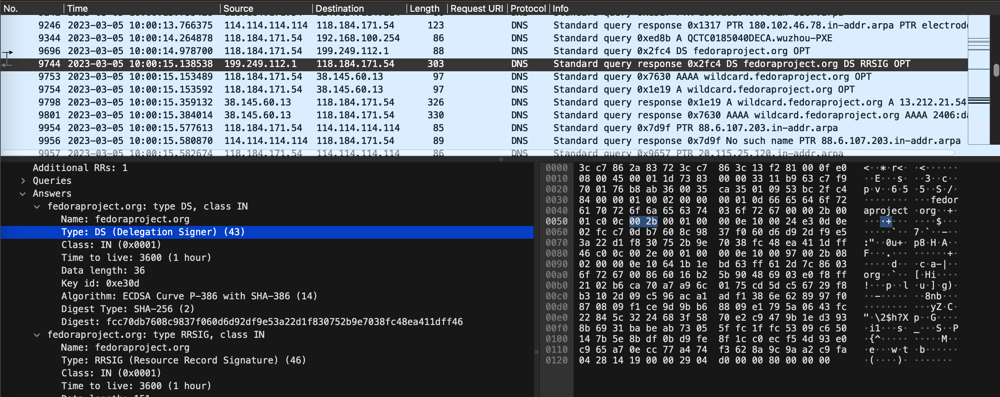

此外还有值为48的DNSKEY类型

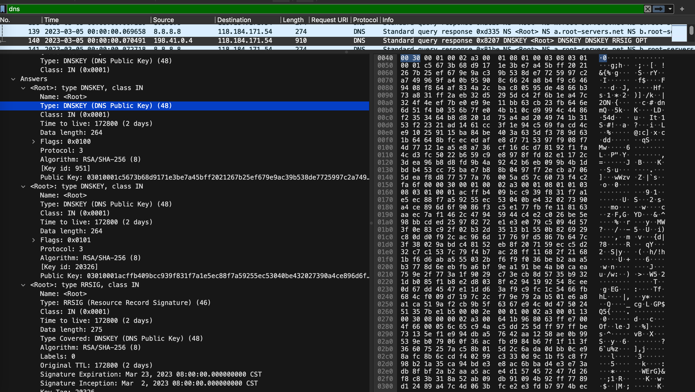

其对应的请求为：

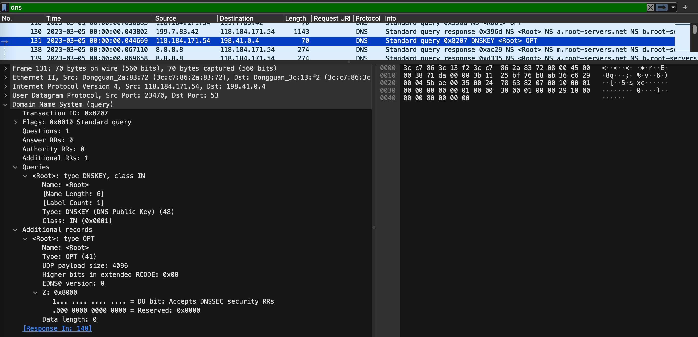

**我总结了下**：每台DNS服务器可以理解为一个表，表存储了一行行信息，每行信息可能是 域名- DNS类型- IP，或者是域名- DNS类型-域名。

这个类型在DNS请求和响应中都会出现：

常见的有以下这些，还有部分未统计：

- NS记录：NS记录是一个指针记录，它指向一组该域名授权的域名服务器的名称。当客户端要查询该域名下的某个主机的IP地址时，需要先向授权域名服务器查询，因此NS记录在DNS解析过程中非常重要。
- A记录：A记录是最基本的DNS记录类型，是Address Record的缩写，它将域名解析为IPv4地址。例如，将www.example.com解析为192.0.2.1。
- AAAA记录：和A记录类似，但是它将域名解析为IPv6地址
- CNAME：将一个别名解析为实际的主机名。
- MX记录（Mail Exchange Record）：指定邮件交换服务器的地址。
- PTR记录（Pointer Record）：反向解析记录，将IP地址解析为域名。
- SOA记录（Start of Authority Record）：区域文件的授权记录，指定了负责该域的DNS服务器。
- SRV记录（Service Record）：指定提供特定服务的服务器的地址。
- TXT记录（Text Record）：包含任意文本信息的记录。

在DNS报文中，NS记录和A记录都可以作为Answer Section的一部分返回给客户端。

**CNAME类型**

应当读作：

CNAME记录用于将一个[域名](https://zh.wikipedia.org/wiki/域名)（同名）映射到另一个域名（真实名称），[域名解析服务器](https://zh.wikipedia.org/wiki/域名解析服务器)遇到CNAME记录会以映射到的目标重新开始查询。

比如某个CNAME记录为

```
bar.example.com.        CNAME  foo.example.com.
```

这里*bar.example.com*的“CNAME”是*foo.example.com*，因为CNAME的意思是真实名称，而右侧才是真实名称，才是CNAME。

应当读作：

*bar.example.com*的真实名称是*foo.example.com*。请求访问*bar.example.com*的客户端会得到*foo.example.com*返回的结果。

这是一个方便理解的例子：若要同时运行[文件传输](https://zh.wikipedia.org/wiki/文件传输协议)服务和[Web服务](https://zh.wikipedia.org/wiki/Web服务)，则可以把*ftp.example.com*和*www.example.com*都指向DNS记录*example.com*，而后者则有一个指向IP地址的A记录。如此一来，若服务器IP地址改变，则只需修改*example.com*的A记录即可。那么当发起ftp.example.com的DNS解析时，DNS响应中会包含CNAME记录，请求方会重启查询，查询example.com的对应记录

查询名：一般为要查询的域名，有时也会是 IP 地址，用于反向查询。

#### Class

有以下这些可能值

IN（Internet类）

CS（CSNET类）、CH（CHAOS类）、HS（Hesiod）很少使用

### Flag

包含了以下这些字段：


**QR**：查询请求时，值为 0；响应时，值为 1。

**Opcode**：操作码。其中，0 表示标准查询；1 表示反向查询；2 表示服务器状态请求。

**AA**（Authoritative）：授权应答，该字段在响应报文中有效。值为 1 时，表示名称服务器是权威服务器；值为 0 时，表示不是**权威服务器**。我执行了一个`dig +trace baidu.com`请求，只有最后一个响应中的这个AA为1，如下。其他的都是0，为1表示这是一个权威服务器，这个服务器返回了baidu.com的IP。

> 什么叫权威服务器？？？
>
> 在DNS中，权威服务器（Authoritative Server）是指能够对某个域名或主机名提供官方答案的DNS服务器。权威服务器通常是负责管理域名解析信息的DNS服务器，**它们保存有该域名下所有主机的IP地址等DNS记录，可以直接回答该域名下主机的DNS查询请求。**而非权威服务器则是指没有权威性的DNS服务器，它们通常只是缓存了其他服务器的DNS查询结果，以提高DNS查询效率。

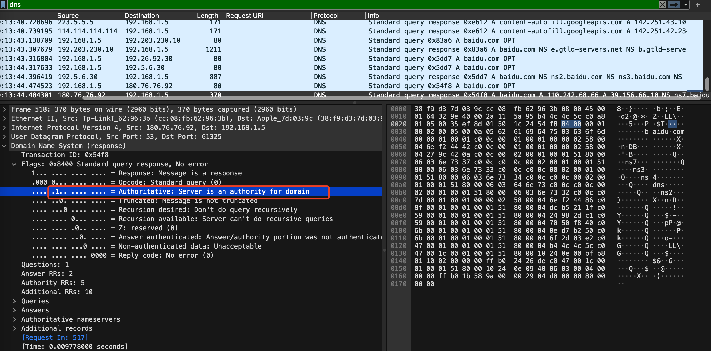

这个响应返回的baidu.com的IP在Answers里，展开如下：

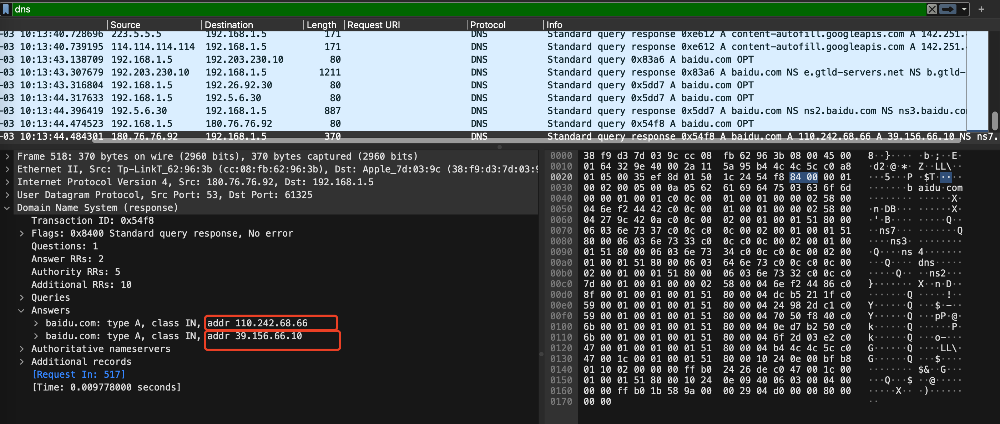

这里解析出来的2个IP和我执行 nslookup解析出来的结果是一样的：

```shell
nslookup baidu.com                
Server:		10.50.4.107
Address:	10.50.4.107#53

Non-authoritative answer:
Name:	baidu.com
Address: 39.156.66.10
Name:	baidu.com
Address: 110.242.68.66
```

**TC**

**RD**（Recursion Desired）：是否期望递归，值为1和为0分别表示递归查询和迭代查询。

值为1的情况

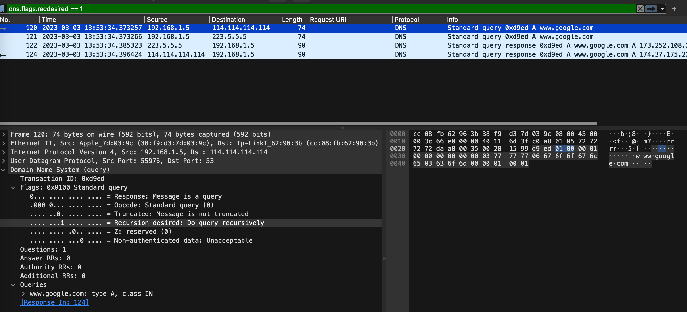

对应的响应为

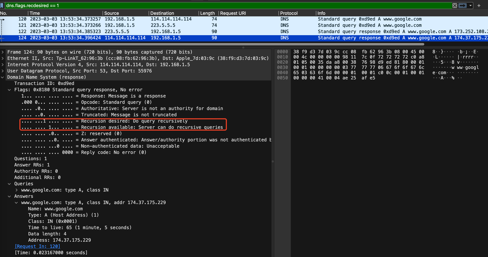

值为0的情况

这里执行`dig +trace baidu.com`，4个请求的RD都是0，请求方192.168.1.5进行了迭代查询。

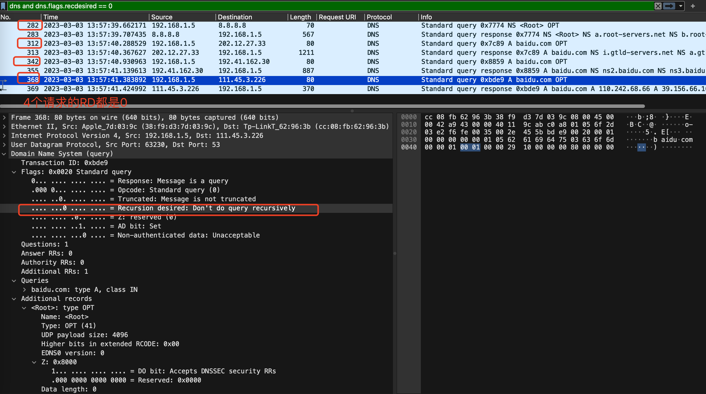

> **递归查询和迭代查询**
>
> **递归查询是默认方式**，迭代查询是以DNS客户端，也就是客户机器为中心查询。其实DNS客户端和本地名称服务器是递归，而本地名称服务器和其他名称服务器之间是迭代。
>
> 递归查询：当客户端向本地DNS服务器（可以通过系统设置查看或者 scutil --dns命令查看，比如我电脑的是8.8.8.8）发出查询请求时，如果本地DNS服务器发现没有命中自己的缓存，就会代替客户端查询，直到从权威服务器处得到了正确的解析结果，然后本地DNS服务器就告诉DNS客户端查询的结果。整个过程客户端只需要发出一次请求，也就是向本地DNS服务器发出的那次请求。本地DNS就像一个中介一样。
>
> 迭代查询：**客户端**向**本地DNS服务器**发出查询请求时，如果本地DNS服务器发现没有命中自己的缓存，本地DNS就会向**根域名服务器**发出请求，根域名服务器把请求中的DNS域名中的顶级域名对应的**顶级域名服务器**信息返回，本地DNS服务器会将返回的结果返回给客户端。客户端再向本地DNS服务器发出向顶级域名服务器的查询请求，顶级名称服务器在收到DNS查询请求后，也是先查询自己的缓存，如果有所请求的DNS域名的记录项，则相接把对应的记录项返回给本地域名服务器，然后再由本地域名服务器返回给DNS客户端，否则向本地名称服务器返回所请求的DNS域名中的二级域名所对应的二级名称服务器地址。以此类推，直到访问到**权威域名服务器**，权威域名服务器返回请求的域名对应的IP地址。整个过程本地DNS服务器就只是一个单纯的传输和转发作用，不会像递归查询一样主动查询最终结果，真正的驱动还是客户端。

**RA**：只有响应报文可能设置该字段。值为1时表示服务器支持递归查询。

**Z**：保留字段，值必须为0

**rcode**：响应的差错状态，0表示没有错误，非0表示出错了

### 附加资源Additional records

DNS报文中的附加信息Additional records字段包含了一些额外的记录，这些记录与查询结果相关但不是直接回答查询问题的。它们提供了关于所查询域名的更多信息，例如权威域名服务器的IP地址、域名服务器的版本信息、以及与所查询域名相关的其他域名。

在DNS查询中，附加记录可以帮助客户端更快地获取所需的信息，而不必进行额外的DNS查询。例如，当客户端需要连接某个Web服务器时，Web服务器通常会在DNS响应中返回其IP地址以及网站运行的操作系统版本等信息，客户端可以将这些信息缓存下来，以便更快地建立连接。


参考资料

[资料1]( http://c.biancheng.net/view/6457.html)

