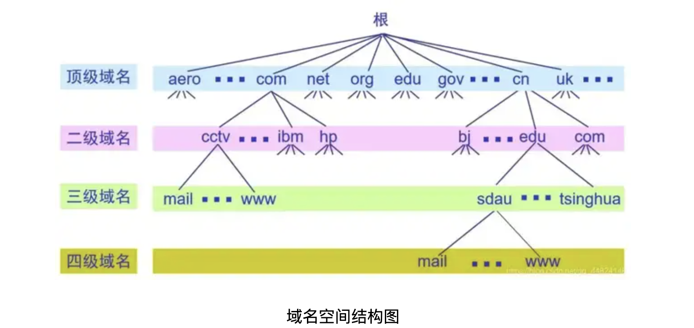
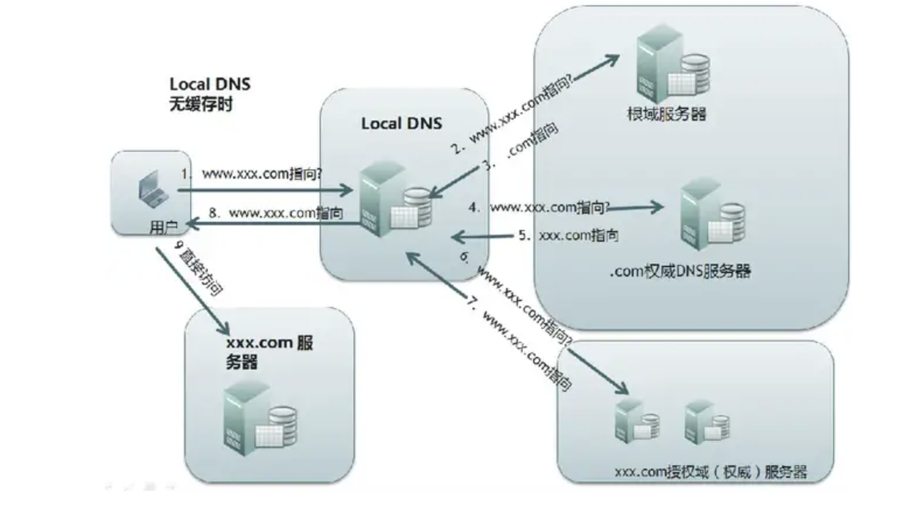

DNS

域名和与之关联的信息，就构成了一条 **DNS记录** （ *DNS record* ）。DNS记录可以理解成一个键值对：

- 键：域名；
- 值：与域名关联的值；

除了 IP 地址，DNS记录值还可以是 IPv6 地址、别名、文本等等。

| 类型   | 目的                                                                                    |
| ------ | --------------------------------------------------------------------------------------- |
| A      | 地址记录，用来指定域名的 IPv4 地址，如果需要将域名指向一个 IP 地址，就需要添加 A 记录。 |
| AAAA   | 用来指定主机名(或域名)对应的 IPv6 地址记录。                                            |
| CNAME  | 如果需要将域名指向另一个域名，再由另一个域名提供 ip 地址，就需要添加 CNAME 记录。       |
| MX     | 如果需要设置邮箱，让邮箱能够收到邮件，需要添加 MX 记录。                                |
| NS     | 域名服务器记录，如果需要把子域名交给其他 DNS 服务器解析，就需要添加 NS 记录。           |
| SOASOA | 这种记录是所有区域性文件中的强制性记录。它必须是一个文件中的第一个记录。                |
| TXT    | 可以写任何东西，长度限制为 255。绝大多数的 TXT记录是用来做 SPF 记录(反垃圾邮件)。       |

记录类型也就是 DNS 报文中，问题记录和资源记录的类型（ Type ）。

除此之外，还有一些不太常见的DNS类型：

AFSDB记录 - 此记录用于由Carnegie Melon开发的Andrew File System（AFS）的客户端。AFSDB记录用于查找其他AFS单元。

APL记录 - “地址前缀列表”是一个实验记录，用于指定地址范围列表。

CAA记录 - 这是“证书颁发机构授权”记录，它允许域所有者声明哪个证书颁发机构可以为该域颁发证书。如果不存在CAA记录，则任何人都可以为域颁发证书。这些记录也由子域继承。

DNSKEY记录 - “DNS密钥记录”包含用于验证域名系统安全扩展（DNSSEC）签名的公钥。

CDNSKEY记录 - 这是DNSKEY记录的子副本，旨在转移到父级。

CERT记录 - “证书记录”存储公钥证书。

DCHID记录 - “DHCP标识符”存储动态主机配置协议（DHCP）的信息，DHCP是IP网络上使用的标准化网络协议。

DNAME记录 - “委托名称”记录创建域别名，就像CNAME一样，但此别名也将重定向所有子域。例如，如果'example.com'的所有者购买了域名'website.net'并给了它一个指向'example.com'的DNAME记录，那么该指针也将扩展到'blog.website.net'和任何其他子域名。

HIP记录 - 此记录使用“主机标识协议”，一种分隔IP地址角色的方法; 此记录最常用于移动计算。

IPSECKEY记录 - “IPSEC密钥”记录与Internet协议安全性（IPSEC）一起使用，这是一种端到端安全协议框架，是Internet协议套件（TCP / IP）的一部分。

LOC记录 - “位置”记录包含经度和纬度坐标形式的域的地理信息。

NAPTR记录 - “‘name authority pointer”“域名权限指针”记录可以与SRV记录组合，以基于正则表达式动态创建指向的URI。

NSEC记录 - “next secure record”“下一个安全记录”是DNSSEC的一部分，它用于证明所请求的DNS资源记录不存在。

RRSIG记录 - “resource record signature”“资源记录签名”是用于存储用于根据DNSSEC验证记录的数字签名的记录。

RP记录 - 这是“responsible person”“负责人”记录，它存储负责该域的人员的电子邮件地址。

SSHFP记录 - 此记录存储“SSH公钥指纹”; SSH代表Secure Shell，它是一种加密网络协议，用于通过不安全的网络进行安全通信。

## dig命令

DNS 查询实用程序。

dig （域信息搜索器）命令是一个用于询问 DNS 域名服务器的灵活的工具。它执行 DNS 搜索，显示从受请求的域名服务器返回的答复。

dig 命令最典型的用法就是查询单个主机的信息。

```
$ dig baidu.com
```


dig 命令默认的输出信息比较丰富，大概可以分为 5 个部分。
第一部分显示 dig 命令的版本和输入的参数。
第二部分显示服务返回的一些技术详情，比较重要的是 status。如果 status 的值为 NOERROR 则说明本次查询成功结束。
第三部分中的 "QUESTION SECTION" 显示我们要查询的域名。
第四部分的 "ANSWER SECTION" 是查询到的结果。
第五部分则是本次查询的一些统计信息，比如用了多长时间，查询了哪个 DNS 服务器，在什么时间进行的查询等等。

默认情况下 dig 命令查询 A 记录，上图中显示的 A 即说明查询的记录类型为 A 记录。

我们可以在查**询时指定要查询的 DNS 记录类型：**

```shell
dig abc.filterinto.com CNAME                                                     

; <<>> DiG 9.10.6 <<>> abc.filterinto.com CNAME
;; global options: +cmd
;; Got answer:
;; ->>HEADER<<- opcode: QUERY, status: NXDOMAIN, id: 45256
;; flags: qr rd ra; QUERY: 1, ANSWER: 0, AUTHORITY: 1, ADDITIONAL: 1

;; OPT PSEUDOSECTION:
; EDNS: version: 0, flags:; udp: 1232
;; QUESTION SECTION:
;abc.filterinto.com.		IN	CNAME

;; AUTHORITY SECTION:
com.			900	IN	SOA	a.gtld-servers.net. nstld.verisign-grs.com. 1658127436 1800 900 604800 86400

;; Query time: 1021 msec
;; SERVER: 10.50.4.107#53(10.50.4.107)
;; WHEN: Mon Jul 18 14:57:25 CST 2022
;; MSG SIZE  rcvd: 120
```

这样结果中就只有 CNAME 的记录。其实我们可以在查询中指定任何 DNS 记录的类型。

**从指定的 DNS 服务器上查询**

使用@指定DNS服务器

```shell
dig @8.8.8.8 abc.filterinto.com
```

如果不指定 DNS 服务器，dig 会依次使用 /etc/resolv.conf 里的地址作为 DNS 服务器

**反向查询：查询IP地址对应的域名**

```shell
dig -x 8.8.8.8 +short                                                          
dns.google.
```

**查看TTL**

```shell
dig baidu.com                                                                    

; <<>> DiG 9.10.6 <<>> baidu.com
;; global options: +cmd
;; Got answer:
;; ->>HEADER<<- opcode: QUERY, status: NOERROR, id: 49394
;; flags: qr rd ra; QUERY: 1, ANSWER: 2, AUTHORITY: 5, ADDITIONAL: 8

;; OPT PSEUDOSECTION:
; EDNS: version: 0, flags:; udp: 1232
;; QUESTION SECTION:
;baidu.com.			IN	A

;; ANSWER SECTION:
baidu.com.		401	IN	A	220.181.38.148
baidu.com.		401	IN	A	220.181.38.251
```

ANSWER SECTION:的401 401就是TTL

**跟踪整个查询过程**

```shell
dig +trace baidu.com
```

## NS

上级 DNS 服务器通过 NS 记录，找到下级 DNS 服务器，直到域名查询完毕。

## mDNS

mdns 即多播dns（Multicast DNS），mDNS主要实现了在没有传统DNS服务器的情况下使局域网内的主机实现相互发现和通信，使用的端口为5353，遵从dns协议，使用现有的DNS信息结构、名语法和资源记录类型。并且没有指定新的操作代码或响应代码。

### mDNS的作用是

在局域网中，设备和设备之前相互通信需要知道对方的ip地址的，大多数情况，设备的ip不是静态ip地址，而是通过dhcp 协议动态分配的ip 地址，要进行通信，就必须知道对方的ip地址，
mDNS的作用就是解决这个问题

## 域名查找

域名体系：



**如果本地域名服务器无法对域名进行解析，就首先求助于根域名服务器。**

**权威域名服务器：**这就是前面已经讲过的负责一个区的域名服务器。当一个权限域名服务器还不能给出最后的查询回答时，就会告知发出查询请求的DNS客户，下一步应当找哪一个权威域名服务器。

**各个域的分层上都设有各自的域名服务器，各层域名服务器都了解该层以下分层中所有域名服务器的IP地址。因此它们从根域名服务器开始呈树状结构相互连接。**

一个完整的域名解析过程如下图所示：



这个根据资源名称(域名)来查找地址的过程, 就称为DNS, DNS查找通常会经过下面四步:

* 询问Resolver
* 询问根服务器
* 询问顶级域名服务器
* 询问次级域名服务器

### Resolver

`resolver`就是我们常说的DNS服务器,在Linux系统中可以查看 `/etc/resolv.conf`文件查看resolver地址,

resolver通常有个 `root-hints`文件, 其中硬编码了十三个**根域名服务器**的地址. 当我们向resolver发起DNS请求时,
resolver会**同时**向所有根域名服务器发出查找请求,并以最快返回的响应为结果执行下一步的操作. 实际上,
resolver会根据响应速度获得一个优先查找的根服务器,并将随后的查找都只向此根服务器进行请求.

这13个根域名服务器在wireshark中抓包可以看到：

[](https://imgse.com/i/zEHMa8)

### 询问根服务器

一般来说,根服务器处理DNS请求,并且告诉resolver下一步应该去询问哪个顶级服务器. 不过如果根服务器识别出了次级服务器的地址,就会把这个地址返回给resolver的.

### 询问顶级域名服务器

如果上一步根服务器没有识别出次级域名服务器的地址,那么就会给resolver返回顶级服务器的地址,从而resolver
需要**再次**向顶级域名服务器发起查询.

顶级域名服务器收到查询请求后,会将可以真正解析此请求的**次级域名服务器**地址返回给resolver.

### 询问次级域名服务器

resolver向次级域名服务器发起DNS查询请求, 次级域名
服务器接收到请求后即返回对应次级域名的IP地址.

值得一提的是,次级域名还有如下的别名:

* 用户DNS名称服务器(User DNS name server)
* 权威名称服务器(Authoritative name server)

其中后者更广为人知一些,因为SLD是查询到对应域名IP地址的最后一步(如果有的话), 而且这个域名服务器也负责
对应资源的DNS设置,如添加不同主机地址的记录等.

resolver从次级域名服务器获得了域名的IP地址,并将其返回给用户,只此便完成了一次DNS查询.

[参考1](https://www.cnblogs.com/pannengzhi/p/6262076.html)

[参考2](https://www.cnblogs.com/pannengzhi/p/6262076.html)
