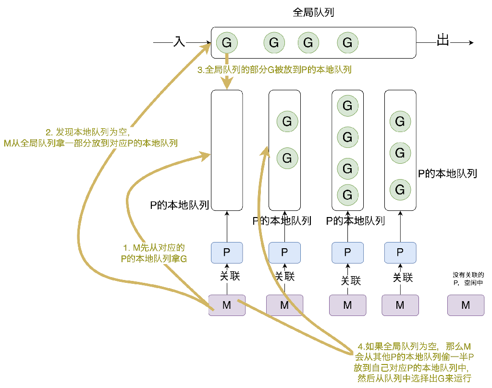

## 前言

goroutine是go语言的特色，是golang支持高并发的重要保障。go程序中可用创建成千上万个goroutine。goroutine的意思就是golang+coroutine（协程）。

goroutine也叫协程，一个goroutine的初始stack是2K（2*1024个字节），但是可以动态的伸缩其栈的大小。goroutine是用户态协程，goroutine比lua的协程要重一点。

goroutine是golang实现的协程，是用户级线程。所以下面对应的介绍线程模型。

## 线程模型

线程模型的分类：

内核级线程（Kernel Level Thread）模型，内核级线程是可被操作系统内核调度器调度的对象实体。

用户级线程（User Level Thread）模型，用户级线程即**协程**，由应用程序创建，必须和内核级线程绑定后才能执行。

两级线程模型，也称为混合型线程模型

## GMP模型

### 概览

golang实现了**GMP模型**，是golang对并发模型的抽象，也是goroutine的分配、负载、调度的模型。

G表示协程Goroutine，表示一个执行任务。

M表示线程Machine，是操作系统级的线程，是独立调度的基本单位，线程会归属于某个进程，线程是系统资源拥有的基本单位。

P表示逻辑处理器Processor，顾名思义为处理器，但是是虚拟处理器，用于限制当前正在运行的goroutine的数量。在不用`runtime.GOMAXPROCS`指定时，**P的数量和虚拟CPU核心数一样多**。P需要绑定一个M才可以运行，因为M才能真正的在**物理**CPU上运行。也就是说一般和虚拟CPU核心数一样多的P，每个P都需要绑定一个可以在物理CPU上运行的操作系统线程M，M的数量一般比P多。

golang在底层实现了两级线程模型，即混合型线程模型。一个M关联了一个内核调度实体**KSE**（Kernel Scheduling Entity），KSE是可被操作系统内核调度器调度的实体对象，是操作系统的最小调度单位，可以理解为内核级别线程。

下图是GMP模型的概览。



GMP调度流程大致如下（也就是图上我画的黄色箭头和黄色文字描述部分）

- 线程M想运行任务就需得获取 P，即与P关联。
- M从 P 的本地队列(LRQ)获取 G
- 若LRQ中没有可运行的G，M 会尝试从全局队列(GRQ)拿一批G放到P的本地队列，
- 若全局队列也未找到可运行的G时候，M会随机从其他 P 的本地队列偷一半放到自己 P 的本地队列。
- 拿到可运行的G之后，M 运行 G，G 执行之后，M 会从 P 获取下一个 G，不断重复下去。**M想拿到G是一定要通过P的。**

由上图可以看出，P的数量意味着程序执行的任意时刻，最多有P的数量个goroutine正在同时运行。

### 调度过程中阻塞

#### 用户态阻塞

包括I/O阻塞（比如请求某个外部服务时，外部服务迟迟没有返回），channel等待引起的阻塞等等。当阻塞时，G的状态从`_Gruning`变成`_Gwaitting`，M会跳过该G尝试获取并执行下一个G，但是如果没有runnable状态的G供M调用，那么M将解绑P然后进入休眠状态。

如果G又被唤醒了，比如之前IO阻塞的情况下外部服务返回了结果，或者之前channel阻塞的情况下channel接收到了数据可以继续执行了（假设该常见下是G2发送了数据使得G被唤醒），那么G将被标记为runnable，然后放入G2所在P的runnext也就是下一个被G2的P执行，G2的P执行完G后再继续执行自己的本地队列里的P。

#### 系统调用阻塞

当G被阻塞在某个系统调用时，此时G会阻塞在_Gsyscall状态，M也处于 block on syscall 状态，此时的M可被抢占调度：G对应的M对应的P会和M解绑，P会寻找idle空闲的M和其绑定，如果没有空闲的M但是P的本地队列中还有G需要执行，那么会创建新的M，P和这个新的M绑定到一起。

当G不再被阻塞时，G会尝试进入一个idle的P（也就是还没有和M绑定的P）的本地队列中，如果没有idle的P，那么G会被标记为runnext状态进入全局队列。

## 显示控制goroutine

### runtime.Gosched()

在goroutine中调用该方法时，表示当前goroutine需要显示的让出本次运行机会，停止本次运行。在GMP模型中，如果某个G正在被M运行，运行到了G的runtime.Gosched()代码时，那么M会停止运行G，G处于暂停运行的状态，G会被放到M对应的P的本地队列中等待下次调用。

调用runtime.Gosched()可以避免某个G一直在运行占用资源使得其他的G不能得到调用。

一般使用该函数的场景都是避免某个协程一直霸占资源，或者主动让出当前协程让其他协程执行因为想观察其他协程的运行情况。

下面是一个示例代码：

```go
func main() {
	  runtime.GOMAXPROCS(1)
    go func() {
        for i := 0; i < 5; i++ {
            fmt.Println("goroutine 1")
            runtime.Gosched()
        }
    }()

    go func() {
        for i := 0; i < 5; i++ {
            fmt.Println("goroutine 2")
            runtime.Gosched()
        }
    }()

    // 让主 goroutine 稍作等待，以便其他 goroutine 执行
    for i := 0; i < 5; i++ {
        fmt.Println("main goroutine")
        runtime.Gosched()
    }
}
```

运行结果为：

```shell
main goroutine
goroutine 1
main goroutine
goroutine 1
main goroutine
goroutine 1
goroutine 1
goroutine 1
main goroutine
main goroutine
```

如果把main goroutine的runtime.Gosched()去掉，那么打印出来的5个`main goroutine`的值必然连续，因为这个main goroutine一直在被运行，打印完了5个`main goroutine`后程序就退出了其他两个goroutine不会在5个`main goroutine`后输出任何结果。

但是加上runtime.Gosched()，那么每次打印1个`main goroutine`后，main goroutine都会主动让出资源被暂停执行，这样得以让其他两个goroutine有执行的机会。就不会有上述的一旦main goroutine得到执行机会就一直占用执行机会不给其他两个goroutine执行机会的情况了。

看起来似乎这个runtime.Gosched()效果很大但是不知道实际写代码时什么时候会用，一般如果某个goroutine可能会占用太多CPU或者可能要执行非常长时间以至于让其他goroutine一直等待，那么可以在写代码的时候就写runtime.Gosched()。

## goroutine调度调优

有如下方案，遵循如下规则：

- 控制并发数量，可以使用通道（channel）或信号量（semaphore）等机制来限制并发执行的goroutine数量。
- 避免goroutine里的过长时间的阻塞操作
- 使用slice的预分配来减少内存分配，对于频繁使用的对象，将对象放到pool里来实现复用内存

