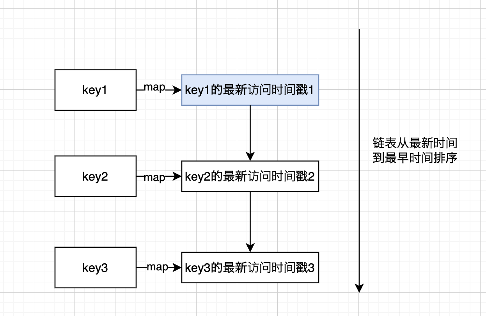
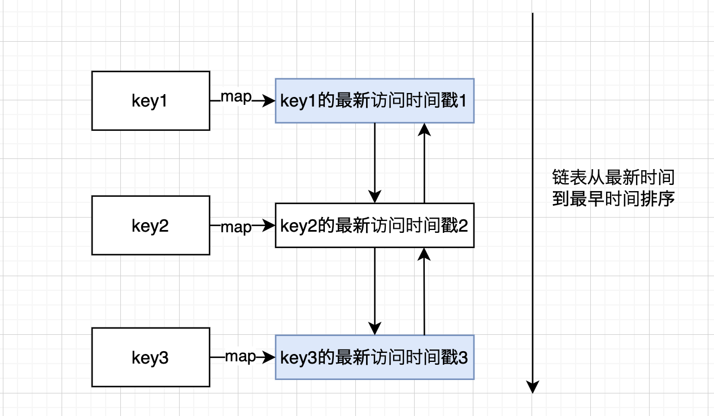

## 思想

LRU算法全程最少使用（Least Recently Used）算法。是一种缓存中使用的**缓存淘汰算法**，当缓存中的空间满了的时候，需要从已有的数据淘汰一部分以维持缓存的可用性，这个淘汰数据的算法可以通过LRU算法实现的。

> 当然除了LRU，还有其他的缓存淘汰算法，只是LRU使用得最多，比如：
>
> LFU（Least Frequently Used）：移除使用得最少的键
>
> FIFO（First In First Out）：移除最早存储的键
>
> Random：随机淘汰

其基本思想就是：如果一个数据最近被访问了，那么接下来的一段时间它很可能会再次被访问。所以LRU算法会选出最少使用的数据进行淘汰。

## 算法实现

### 初识方案

主要根据LRU的基本思想“如果一个数据最近被访问了，那么接下来的一段时间它很可能会再次被访问”来设计。

主要方案如下图：



有一个map，map里存储了key到时间戳信息的映射关系，用map存储是为了方便利用key快速更新时间戳和判断key是否存在。此外还有一个链表，从表头到表尾存储了从新到旧的访问时间戳，较新的时间戳的节点指向次新的时间戳的节点。

当访问新key的时候，将key的时间戳更新为当前时间，且把右侧的时间戳节点置于链表的表头。一旦检测到链表的大小超过指定容量，则从链表的表头开始计算有多少个节点，把队尾的多出来的节点都删除掉，同时也把map里的key也删除掉。

完整代码如下，里面还有个测试的例子：

```go
func main() {
	l := InitLRU(3)
	l.VisitKey("aaa")
	l.VisitKey("bbb")
	l.VisitKey("ccc")
	l.VisitKey("bbb")
	l.VisitKey("ddd")
}

type LRU struct {
	capacity     int
	cache        map[string]*Node
	firstVisited *Node
}

type Node struct {
	key  string
	time int64
	next *Node　// 这里必须使用 *Node 类型，否则链表会有无限递归的问题
}

func InitLRU(capacity int) *LRU {
	return &LRU{
		capacity: capacity,
		cache:    make(map[string]*Node, 0),
	}
}

func (l *LRU) VisitKey(key string) {
	defer func() {
		node := l.firstVisited
		fmt.Printf("cap:%d   ", len(l.cache))
		for {
			fmt.Printf("%s ->. ", node.key)
			if node.next == nil {
				fmt.Println()
				break
			}
			node = node.next
		}
	}()
	if l.firstVisited == nil {
		// 表明目前没有任何缓存数据
		node := &Node{
			key:  key,
			time: time.Now().Unix(),
		}
		l.cache[key] = node
		l.firstVisited = node
		return
	}
	if l.cache[key] == nil {
		// 表明缓存数据里没有该key，需将该key设置为最新访问
		// 仍需要判断缓存是否已满
		node := &Node{
			key:  key,
			time: time.Now().Unix(),
			next: l.firstVisited,
		}
		l.cache[key] = node
		node.next = l.firstVisited
		l.firstVisited = node
	} else {
		// 将key对应的节点设置为最新
		l.cache[key].time = time.Now().Unix()
		// 将 l.cache[key] 的上个节点和下个节点相连
		node := l.firstVisited
		for {
			// 寻找 l.cache[key] 的上个节点
			if node.next == l.cache[key] {
				break
			}
			node = node.next
		}
		node.next = l.cache[key].next
		l.cache[key].next = l.firstVisited
		l.firstVisited = l.cache[key]
	}
	// 判断是否超出了容量大小，超出了则淘汰多余的部分
	if len(l.cache) <= l.capacity {
		return
	}
	node := l.firstVisited
	nodeCount := 1
	for ; nodeCount <= l.capacity; nodeCount++ {
		if node.next == nil {
			break
		}
		nodeCount++
		node = node.next
	}
	firstNode := node
	if nodeCount > l.capacity {
		for {
			// 对应的 cache 也要删除
			if node.next == nil {
				break
			}
			node = node.next
			delete(l.cache, node.key)
		}
		firstNode.next = nil
	}
}
```

### 优化

初始方案写完后，很容易看出有如下几个问题：

- Node struct里的time其实不是必须的，就算去掉也不影响，如果调用端不想知道key的最新访问时间则可以删除time字段
- 寻找 l.cache[key] 的上个节点 里用了 for 遍历，从链表的表头开始遍历，只为了寻找 l.cache[key] 的上个节点。其实可以把单像链表优化为双向链表，这样就可以直接找到上个节点不用遍历了。
- 如果可以在LRU struct里直接存储第capacity个节点的信息，也就是存储链表最后一个节点的信息，那么删除时直接从这个Node开始操作，基于双向链表的话就会非常快。

下面是优化后的代码，多存储了链表的最后一个节点，也从单向链表变成了双向链表。这样会增加存储空间但是也大大提高了操作的速度，算是和map数据结构一样，以空间换时间的优化。

现在的方案如下：



优化后的代码如下：

```go
func main() {
	l := InitLRU(3)
	l.VisitKey("aaa")
	l.VisitKey("bbb")
	l.VisitKey("ccc")
	l.VisitKey("bbb")
	l.VisitKey("ddd")
}

type LRU struct {
	capacity  int
	cache     map[string]*Node
	firstNode *Node
	lastNode  *Node
}

type Node struct {
	key  string
	pre  *Node
	next *Node // 这里必须使用 *Node 类型，否则链表会有无限递归的问题
}

func InitLRU(capacity int) *LRU {
	return &LRU{
		capacity: capacity,
		cache:    make(map[string]*Node, 0),
	}
}

func (l *LRU) VisitKey(key string) {
	defer func() {
		node := l.firstNode
		fmt.Printf("cap:%d   ", len(l.cache))
		for {
			fmt.Printf("%s <->. ", node.key)
			if node.next == nil {
				fmt.Println()
				break
			}
			node = node.next
		}
	}()
	if l.firstNode == nil {
		// 表明目前没有任何缓存数据
		node := &Node{
			key: key,
		}
		l.cache[key] = node
		l.firstNode = node
		l.lastNode = node
		return
	}
	if l.cache[key] == nil {
		// 表明缓存数据里没有该key，需将该key设置为最新访问
		// 仍需要判断缓存是否已满
		node := &Node{
			key: key,
		}
		l.cache[key] = node
		node.next = l.firstNode
		l.firstNode.pre = node
		l.firstNode = node
		// 只有新增key的时候可能超过最大容量
		// 判断是否超出了容量大小，超出了则淘汰多余的部分
		if len(l.cache) <= l.capacity {
			return
		}
		node = l.lastNode
		delete(l.cache, node.key)
		node.pre.next = nil
		l.lastNode = node.pre
	} else {
		if l.firstNode.key == key {
			// 访问的节点就是当前的最新节点
			return
		}
		// 将key对应的节点设置为最新
		// 将 l.cache[key] 的上个节点和下个节点相连
		node := l.cache[key]
		if node.next == nil {
			// node 是链表的最后一个节点
			l.lastNode = node.pre
			node.pre.next = nil
		} else {
			node.pre.next = node.next
			node.next.pre = node.pre
		}
		node.next = l.firstNode
		l.firstNode.pre = node
		l.firstNode = node
	}
}
```


