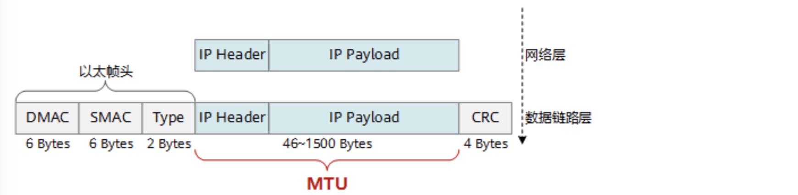
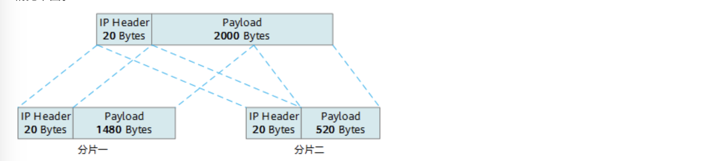
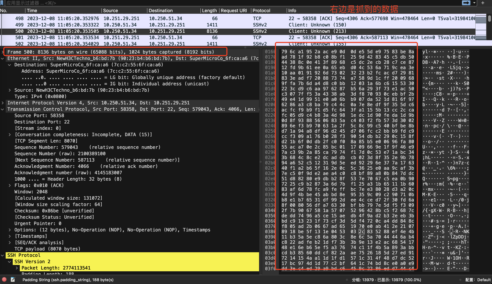
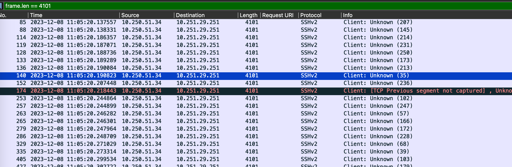
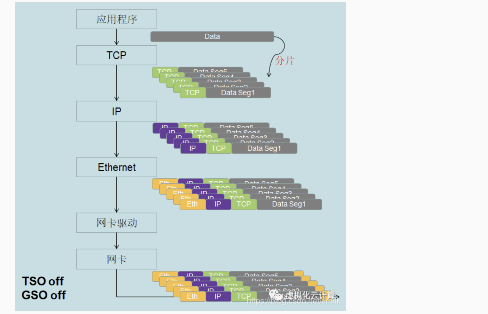
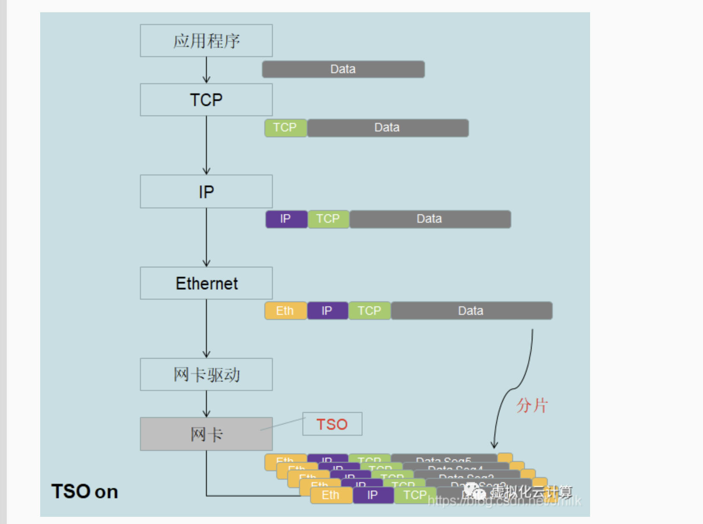
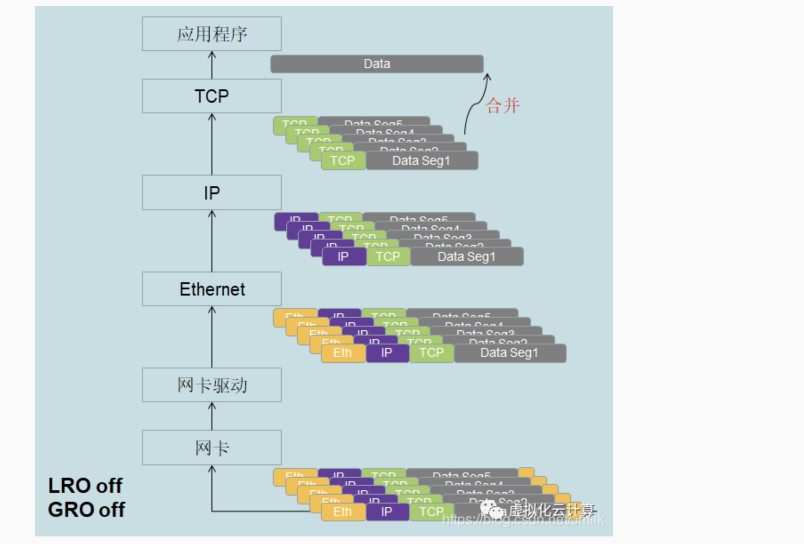
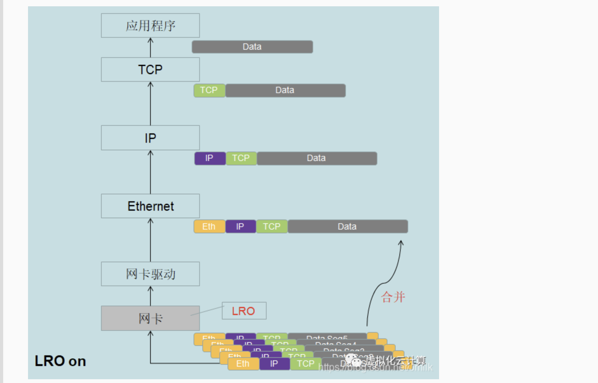
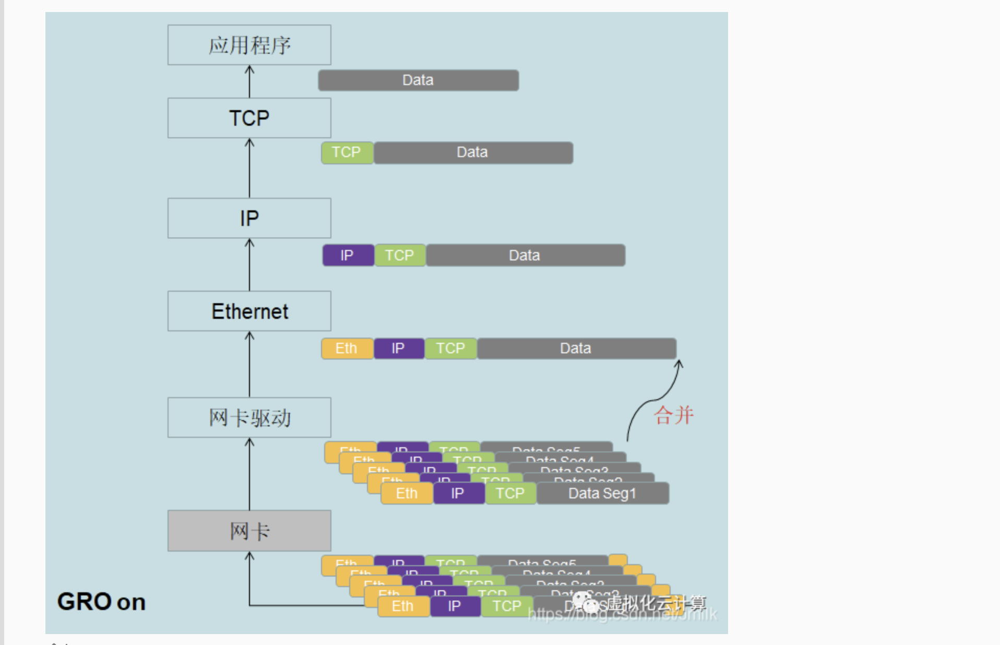

## MTU

**最大传输单元**（Maximum Transmission Unit，缩写MTU）指在数据链路层上能传输的最大的数据包大小（以字节为单位）

如果发送端发送的数据包大小大于了发送端到接收端路上某台设备的MTU，那么会造成报文分段甚至丢弃，加重网络传输的负担。

不同的厂商，不同厂商的不同型号的设备对MTU的定义也可能不一样。

### 为什么需要MTU

在网络传输中，数据包过大，会导致传输时间变长，传输过程中如果传输失败，对应的传输代价也比较大。数据包较小，则设备需要处理更多的报文，这个比较考验设备的线程转发能力，传输的有用信息占数据包的比例较低，传输效率低。

设置MTU可以将数据包大小控制在合理范围内，提高传输效率。

PPPoE网的MTU通常是1492。以太网的MTU通常为1500字节，这个1500是最大的承载IP层及以上层数据的最大长度，故以太网数据帧的最大长度是1518字节（1518是在1500的基础上加上以太网的14字节的帧头和4字节的帧尾CRC校验部分）。



受MTU的影响，数据包可能被分片。分片可以在源主机或者到目的主机路径上的传输路径上任意一台路由器执行，但是重组只能在目的主机执行。

> 注意，有的时候捕获到的数据包不会有数据链路层的信息：
>
> 在捕获本地回环接口（lo0）的数据包时，通常不会显示数据链路层的信息。这是因为本地回环接口是一个虚拟的网络接口，它主要用于本地主机内部的通信，数据包在传输时并不经过物理网络链路，也就是说不存在真正的数据链路层。
>
> 因此，在捕获本地回环接口的数据包时，Wireshark 只会显示上层协议的信息，如网络层（IPv4、IPv6）、传输层（TCP、UDP）和应用层（HTTP、DNS）等。你可以查看捕获到的数据包的上层协议信息，但不会看到数据链路层的信息。

### 数据包太大受MTU限制而产生分片的情况

比如主机发送大小为2000字节的数据包，这个2000是UDP层的数据包长度，包含了UDP头部。假设出接口的MTU是1500，那么2000超过了MTU，则需要分片。

到了IP层，需要加上长度为20的IP头部，那么此时总长度是2000+20=2020，Payload长度是2000。因为**MTU的限制是对IP层的数据包（包括了IP头部）的限制**，则原数据包分为两段，分别是长度20的IP头部加上1480的Payload，还有长度20的IP头部加上剩余的2000-1480=520。两个数据包都有IP头部，IP头部的标志位中的MF用来分辨这是不是最后一个分片，片偏移用来分辨这个分片相对原数据报的位置。通过这几个字段，可以准确的完成数据报的重组操作。



## wireshark显示的数据包长度说明

### 不包括FCS

**wireshark显示的数据帧长度不包括FCS(Frame check sequence)[帧校验序列]**

gopacket抓到的数据包也是不包括FCS的

这两个抓包相关工具都不关注FCS，这是因为FCS是网络适配器校验使用的，抓包工具关注的是在网络上流动的原始数据。

### wireshark会截断数据包

有时候wireshark可能会截断数据包，比如在Wireshark里查看抓的包，有时候会显示`[Packet size limited during capture: xxxxxx truncated]`。这是因为wireshark使用的抓包机制（比如libpcap或者winpcap）是允许设置抓到的包的大小的，通常设置抓包大小是因为抓包者只关注一些协议（比如IP/TCP/UDP协议）的头信息而不关注payload部分。

当设置了snaplen选项，那么只能抓到snaplen长度的数据包，数据包超出snaplen的部分会被截断。如果想要抓完整的数据包，可以将snaplen设置为默认值，通常是65535。

但是wireshark显示的长度仍然是完整的长度，只是显示的数据是部分数据。

下面是一个例子：



这个数据包的大小是8136字节，但是因为限制了snaplen为1024，所以相当于只存储了包的前1024个字节，右边显示了这个包的原始数据。一共是64行，每行是16个字节，一共是64*16=1024个字节。因为大部分时候只关注协议头，不关注具体负载数据，所以设置成2024是足够的，可以看到协议头，同时也可以减少存储空间。

这里的TCP payload显示的是数据包的payload的长度8070字节，这是真实的传输环境中的数据长度，只是payload部分受snaplen的影响被截断了。

## 数据包长度大于MTU的情况

我连接了VPN，这样就可以访问内网了。然后通过scp往内网的一台服务器上拷贝文件，拷贝的同时用wireshark抓V本机PN的网卡的流量，发现拷贝结束后所有的数据包的大小都没有超过mtu，最大也只有1401。我电脑上连接VPN的网卡是utun5。

下面去到内网的被拷贝文件过去的目标服务器查看抓到的包，发现有很多包的大小都超过了mtu。比如长度为4101字节的就有一堆。



## 原因相关概念

在网络上搜寻了下，网卡有很多支持的功能，有些功能是对发送端有效，有些对接收端有效。这些功能和MTU相关的，会影响数据包大小的，主要有以下几个：

### 发送端

#### TSO和USO

TSO全程TCP Segment Offload，有很多网卡都支持TSO。有时候也被叫做LSO（Large Segment Offload）。TSO的作用就是把原本由内核做的拆包工作转移到网卡。支持TSO的网卡可以降低CPU的负载，提高网络带宽。TSO是一种硬件卸载技术，旨在将TCP分流的过程从CPU卸载到网卡。

TSO是针对TCP的，USO是针对UDP的。

TSO提供了一个缓冲区，然后由网卡将缓存的数据包拆分成小于MTU和MSS的小包。

在不支持TSO的网卡上，TCP层向IP层发送数据会考虑MSS，使得TCP向下发送的数据可以包含在一个IP分组中。

网卡支持TSO时，TCP层会慢慢增大MSS，一般都是整数倍增加，添加TCP头传给IP层。网卡接受到IP层的大数据包会将包分成若干个小的IP包。这样网卡就把CPU要做的分组的工作自己承接过来做好了。

**如果TSO开启，那么GSO会自动开启。**

#### GSO

GSO(Generic Segmentation Offload)比TSO更通用。基本思想就是尽可能推迟数据分片直至达到网卡前，到达网卡前会检查网卡是否支持分片功能比如TSO，支持则发往网卡给网卡分片，否则将分片的工作推迟到发到网卡的前一刻执行。

### 接收端

#### LRO

全称large-receive-offload，基本功能就是将接收到的多个TCP数据包聚合成一个更大的数据包，交给网络协议栈处理。作用于网卡。

#### GRO

全称generic-receive-offload。与LRO相似，更通用。在LRO的基础上新增作用于离开网卡加入网络协议栈的时候。是LRO的软实现，合并条件更加灵活。

### 分片示意图

下面是上述的几个功能开启或者关闭时的分片情况，在何处分片等，图源网络。

#### 发送端

TSO关闭，GSO关闭



TSO开启，GSO自动开启



### 接收端

LRO 关闭，GRO 关闭



LRO开启：数据包在网卡被合并



GRO开启



## 原因分析

发送端即我的本机，使用的网卡是utun5，查看utun5的信息：

```shell
ifconfig utun5                                                     
utun5: flags=8051<UP,POINTOPOINT,RUNNING,MULTICAST> mtu 1500
	inet 172.16.48.126 --> 172.16.48.125 netmask 0xffffffff
```

可以看到utun5不支持TSO，这是因为utun5是一个虚拟网卡，不是物理网卡。

> 查看我的物理网卡en0，可以看到物理网卡是支持TSO的：
>
> ```shell
> ifconfig en0                                                       
> en0: flags=8863<UP,BROADCAST,SMART,RUNNING,SIMPLEX,MULTICAST> mtu 1500
> 	options=6463<RXCSUM,TXCSUM,TSO4,TSO6,CHANNEL_IO,PARTIAL_CSUM,ZEROINVERT_CSUM>
> 	ether 38:f9:d3:7d:03:9c
> 	inet 192.168.22.56 netmask 0xffffff00 broadcast 192.168.22.255
> 	nd6 options=201<PERFORMNUD,DAD>
> 	media: autoselect
> 	status: active
> ```

**Wireshark抓的包是从内核到网卡的，**网卡不支持分片，只能消耗CPU让内核做分片。所以抓到的的从内核到网卡的数据包都是被内核分片好的。此时的流程是：

```
               抓包
网卡<-----------------------------内核
不支持TSO                         做拆包的工作
```

目标服务器的工作网卡是ens5f0。查看其是否支持LRO或者GRO。

```shell
[root@localhost ~]# ethtool -k ens5f0|grep large-receive-offload
large-receive-offload: off [fixed]
[root@localhost ~]# ethtool -k ens5f0|grep generic-receive-offload
generic-receive-offload: on
```

可以看到其支持GRO。GRO会在离开网卡达到协议栈时做聚合。此时Wireshark抓的包是从网卡到内核的，抓到的包时通过GRO聚合完成的，所以聚合前的各个小包小于MTU，聚合完成后的包大小会大于MTU。

```
               抓包
网卡----------------------------->内核
支持GRO                          
```

参考文章

https://info.support.huawei.com/info-finder/encyclopedia/zh/MTU.html

https://blog.csdn.net/LearnLHC/article/details/115228649

https://osqa-ask.wireshark.org/questions/50808/packet-size-limited-during-capture-xxxxxx-truncated/

https://www.modb.pro/db/50701

https://luckymrwang.github.io/2022/07/27/SmartNIC-%E2%80%94-TSO%E3%80%81GSO%E3%80%81LRO%E3%80%81GRO-%E6%8A%80%E6%9C%AF/

