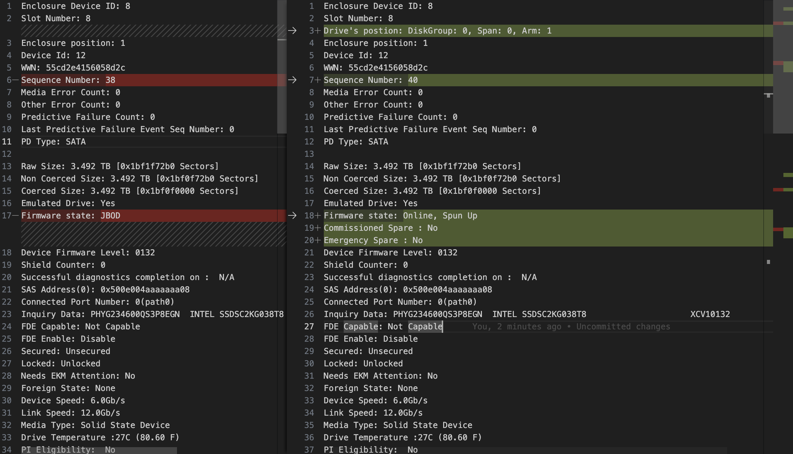
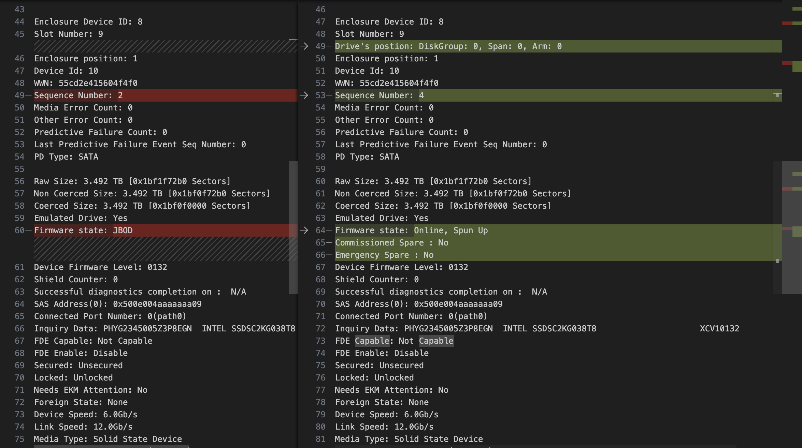
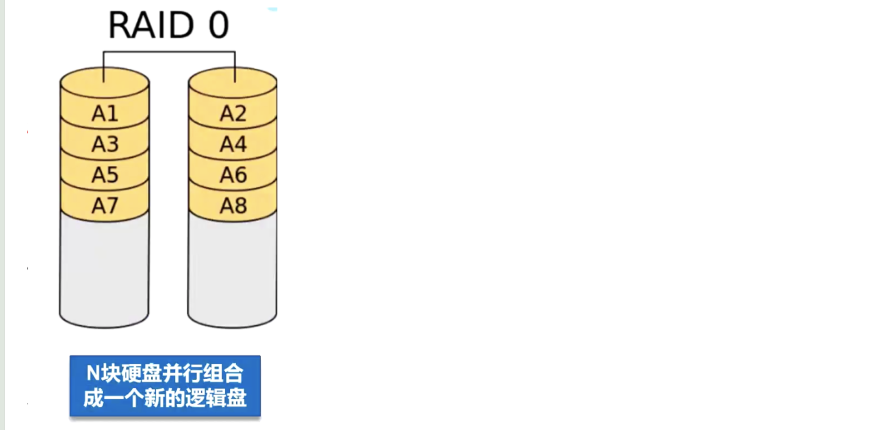
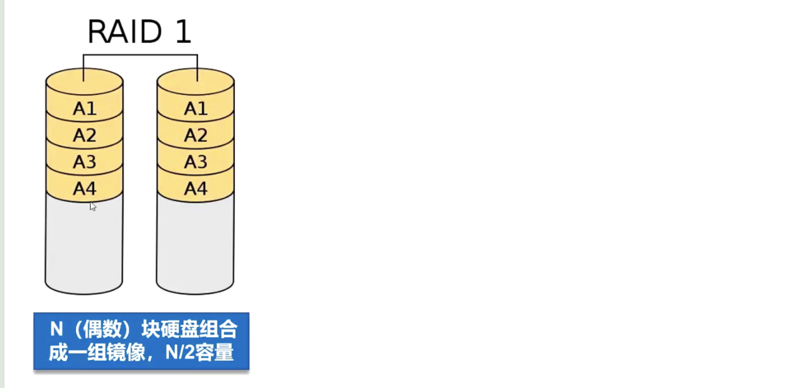
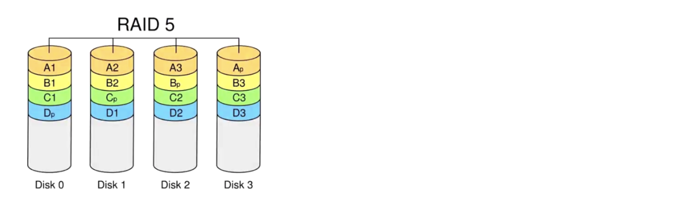
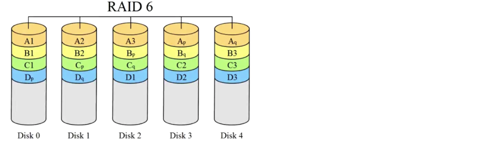
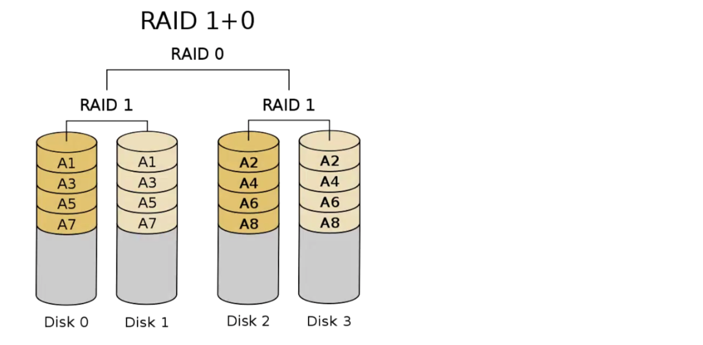

## 简介

RAID全称独立冗余磁盘阵列，主要功能是把多个独立的物理盘按照**不同的方式**组合形成一个硬盘组（逻辑硬盘），从而提供比单个硬盘更高的存储性能和备份技术。

上面所说的“不同的方式”也可以叫不同的RAID级别，也就是根据RAID级别组合，不同的RAID级别的组合方式不一样。常见的RAID级别包括：RAID0、RAID1、RAID5、RAID6、RAID10等。

可以做完RAID把系统OS放到RAID里，所以RAID还是很重要的。

## 命令

关于RAID操作有以下常用命令：

### 清除RAID：

```shell
MegaCli64 -CfgLdDel -L{{LD}} -force -a{{Adapter}}
```

LD表示RAID组序号，即下文硬盘Drive's postion的DiskGroup字段值，Adapter表示当前使用的是哪个RAID适配器，一般一台机器上只有一个适配器，执行`MegaCli64 -PDList -aALL`命令输出的第一行`Adapter #0`可以看到当前机器的RAID适配器是0，这个地方LD传0，Adapter传0。

### 创建RAID

```shell
MegaCli64 -CfgLdAdd –r{{Raid}}{{Slot}} -a{{Adapter}}
```

Raid参数表示RAID类型，如RAID0，或者RAID1，或者RAID2，slot表示使用的磁盘的槽位，Adapter与上文同意。

比如可以执行如下命令：

```shell
MegaCli64 -CfgLdAdd –r1[8:9,8:8] -a0
```

### 设置硬盘状态为good

```shell
MegaCli64 -PDMakeGood -Physdrv {{Slot}} -force -a{{Adapter}}
```

各参数与上文同意。

###设置硬盘状态为JBOD

```shell
MegaCli64 -PDMakeJBOD -Physdrv {{Slot}}  -a{{Adapter}}
```

### 实际例子

下面举个实际运行的例子，查看设置RAID前后硬盘的状态变化。

设置RAID前，查看硬盘状态：

```shell
MegaCli64 -PDList -aALL
```

运行结果为：

```shell
Enclosure Device ID: 8
Slot Number: 8
Enclosure position: 1
Device Id: 12
WWN: 55cd2e4156058d2c
Sequence Number: 38
Media Error Count: 0
Other Error Count: 0
Predictive Failure Count: 0
Last Predictive Failure Event Seq Number: 0
PD Type: SATA

Raw Size: 3.492 TB [0x1bf1f72b0 Sectors]
Non Coerced Size: 3.492 TB [0x1bf0f72b0 Sectors]
Coerced Size: 3.492 TB [0x1bf0f0000 Sectors]
Emulated Drive: Yes
Firmware state: JBOD
Device Firmware Level: 0132
Shield Counter: 0
Successful diagnostics completion on :  N/A
SAS Address(0): 0x500e004aaaaaaa08
Connected Port Number: 0(path0)
Inquiry Data: PHYG234600QS3P8EGN  INTEL SSDSC2KG038T8                     XCV10132
FDE Capable: Not Capable
FDE Enable: Disable
Secured: Unsecured
Locked: Unlocked
Needs EKM Attention: No
Foreign State: None
Device Speed: 6.0Gb/s
Link Speed: 12.0Gb/s
Media Type: Solid State Device
Drive Temperature :27C (80.60 F)
PI Eligibility:  No
Drive is formatted for PI information:  No
PI: No PI
Port-0 :
Port status: Active
Port's Linkspeed: 12.0Gb/s
Drive has flagged a S.M.A.R.T alert : No


Enclosure Device ID: 8
Slot Number: 9
Enclosure position: 1
Device Id: 10
WWN: 55cd2e415604f4f0
Sequence Number: 2
Media Error Count: 0
Other Error Count: 0
Predictive Failure Count: 0
Last Predictive Failure Event Seq Number: 0
PD Type: SATA

Raw Size: 3.492 TB [0x1bf1f72b0 Sectors]
Non Coerced Size: 3.492 TB [0x1bf0f72b0 Sectors]
Coerced Size: 3.492 TB [0x1bf0f0000 Sectors]
Emulated Drive: Yes
Firmware state: JBOD
Device Firmware Level: 0132
Shield Counter: 0
Successful diagnostics completion on :  N/A
SAS Address(0): 0x500e004aaaaaaa09
Connected Port Number: 0(path0)
Inquiry Data: PHYG2345005Z3P8EGN  INTEL SSDSC2KG038T8                     XCV10132
FDE Capable: Not Capable
FDE Enable: Disable
Secured: Unsecured
Locked: Unlocked
Needs EKM Attention: No
Foreign State: None
Device Speed: 6.0Gb/s
Link Speed: 12.0Gb/s
Media Type: Solid State Device
Drive Temperature :26C (78.80 F)
PI Eligibility:  No
Drive is formatted for PI information:  No
PI: No PI
Port-0 :
Port status: Active
Port's Linkspeed: 12.0Gb/s
Drive has flagged a S.M.A.R.T alert : No
```

下面设置这两块盘，使用RAID1，运行

```shell
MegaCli64 -CfgLdAdd –r1[8:9,8:8] -a0
```

再次通过`MegaCli64 -PDList -aALL`查看结果，可以看到新的结果与旧的结果的不同：





这两块盘的Firmware state都由`JBOD`变成了`Online, Spun Up`

Drive's postion字段的值一个是：`Drive's postion: DiskGroup: 0, Span: 0, Arm: 1`，一个是`Drive's postion: DiskGroup: 0, Span: 0, Arm: 0`，DiskGroup表示在哪个RAID分组里

因为如果有多块硬盘的话，可以选择两块AB做RAID0，再选择不同的两块CD做RAID1或者RAID0，AB是属于同一个RAID组的，CD是属于同一个RAID组的，这是两个不同的RAID组。Drive's postion字段里DiskGroup就表示银盘所属RAID组，可以看到这8:8和8:9这两块盘属于同一个RAID组，因为上述CfgLdAdd里就指定了[8:9,8:8]这两块盘要做一个RAID。注意如果要指定RAID组一定要在执行一个CfgLdAdd时把所有的硬盘都写入，每一行CfgLdAdd命令中的硬盘在一个RAID组里，下一行的指定的硬盘就在另一个RAID组了。

比如

```shell
MegaCli64 -CfgLdAdd –r1[8:9,8:8] -a0
```

操作后，8:8和8:9的Drive's postion信息分别为`DiskGroup: 0, Span: 0, Arm: 1`和`DiskGroup: 0, Span: 0, Arm: 0`。再执行：

```shell
MegaCli64 -CfgLdAdd –r1[8:4,8:5] -a0
```

8:4和8:5的Drive's postion信息分别为`Drive's postion: DiskGroup: 1, Span: 0, Arm: 0`和`Drive's postion: DiskGroup: 1, Span: 0, Arm: 1`，8:8 8:9和8:4 8:5的DiskGroup是不一样的，因为它们处于不同的RAID组。

## RAID级别

不同RAID级别对硬盘数量的要求：

创建RAID0阵列，至少需要两块硬盘。

> 相关命令解析：
>
> ```shell
> MegaCli64 -CfgLdAdd –r0[8:8] -a0
> ```
>
> 这条命令尝试创建一个 RAID 0 阵列，指定的物理驱动器是 `[8:8]`。
>
> 在MegaCli64中，`[8:8]`不是指两块硬盘，而是指槽位号为8的硬盘。RAID 0 需要至少两块硬盘，但在这个命令中，只指定了一个硬盘的槽位号，因此它实际上不是有效的 RAID 0 配置。如果只有一块硬盘，这个命令可能会创建一个虚拟的 RAID 0 阵列，但是它不会提供任何冗余性或性能优势，因为 RAID 0 至少需要两块硬盘才能发挥作用。
>
> 要创建一个有效的 RAID 0 阵列，你需要至少两块硬盘，并在命令中指定它们的槽位号。比如：
>
> ```shell
> MegaCli64 -CfgLdAdd -r0[8:8,9:9] -a0
> ```
>
> 这个命令会创建一个 RAID 0 阵列，使用槽位号为8和9的两块硬盘。



RAID1要求硬盘数量为偶数，通过磁盘数据镜像实现数据冗余，在成对的独立磁盘上产生互为备份的数据



RAID5要求硬盘数量大于等于3，数据条带形式分布，以奇偶校验作冗余



RAID6要求硬盘数量大于等于4



RAID10要求硬盘数量大于等于4且为偶数，也叫RAID1+0



## 设置RAID的方法

如果硬盘已经有了RAID的话，需要清除之前的RAID

```shell
MegaCli64 -CfgLdDel -L%s -force -a%s
```


标记硬盘状态为Good，表示磁盘空闲

设置磁盘RAID

此外还可以设置硬盘的状态为**JBOD**，即Just a Bunch Of Disks，当一个磁盘被设置为JBOD状态时，它不会被包含在任何RAID阵列中，而是被视为单独的独立磁盘。在JBOD状态下，每个磁盘都可以单独访问，并且没有数据被分配或复制到其他磁盘上。这意味着如果一个磁盘出现故障，它不会影响其他磁盘上的数据。

## 硬盘空间

硬盘空间分为两类，一种是JBOD阵列，一种是RAID阵列。JBOD阵列里的多个硬盘互相独立。RAID阵列里可能有多个RAID组，一个RAID组里有多块硬盘。

```
 - JBOD [硬盘1， 硬盘2]
 - RAID阵列 - RAID组1：[硬盘1，硬盘2]
            - RAID组2：[硬盘2，硬盘3]
```

## 硬盘状态

硬盘状态即Firmware state字段有以下可能值：

- Online, Spun Up：表示该盘已经被进行了RAID操作，其Drive's postion字段可以查看该盘的所在RAID阵列。

- Unconfigured(good), Spun Up：表示该状态良好，可以对该盘进行RAID操作
- JBOD：盘在JBOD阵列中。

如果当前硬盘状态就是要设置的状态，那么可以不用执行设置状态的命令了，因为是重复设置了，否则可能会报错。
参考

[RAID配置与解释](https://www.cnblogs.com/123456789SI/p/16793811.html)

