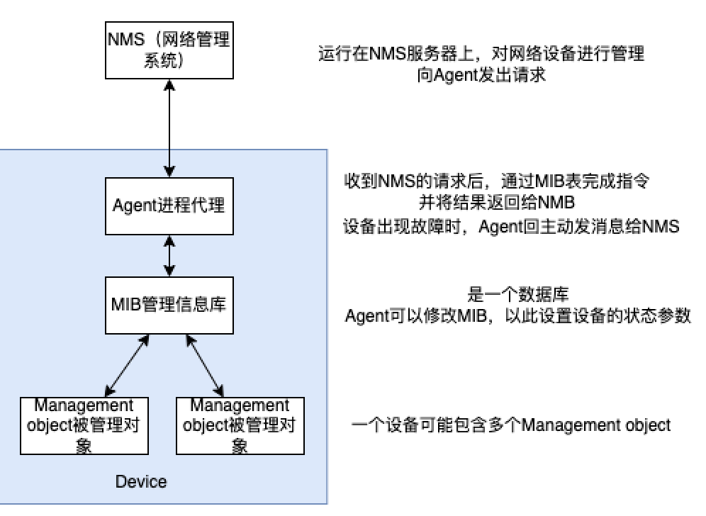
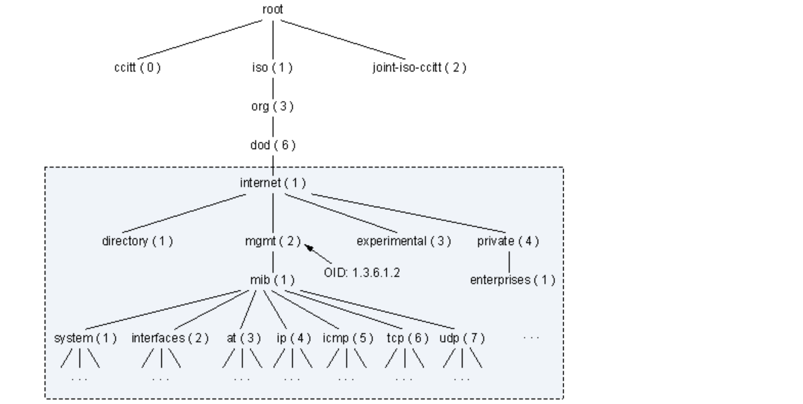
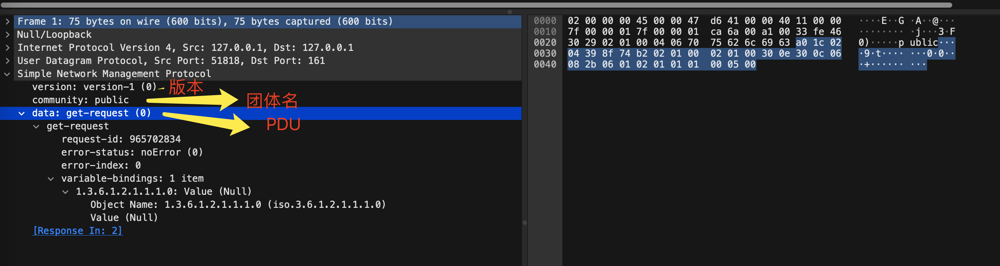
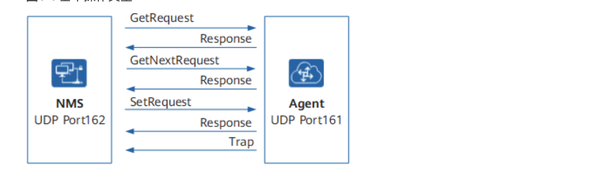
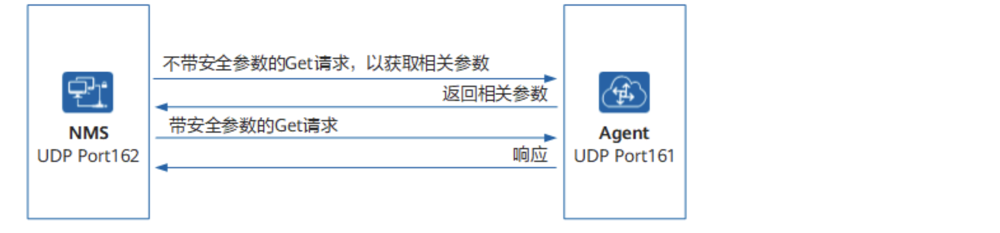
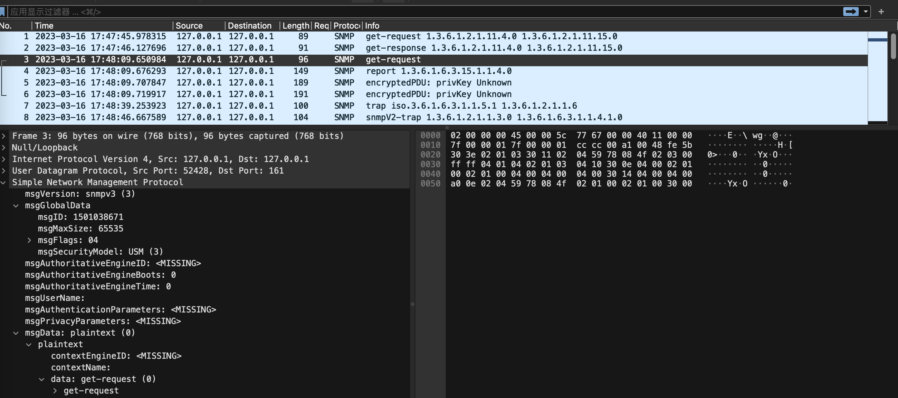
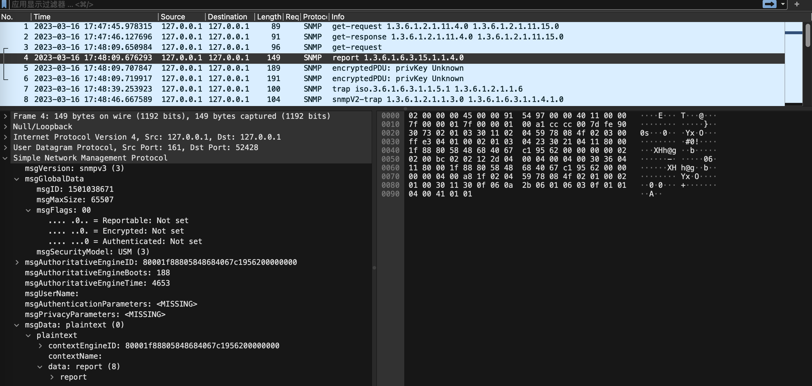
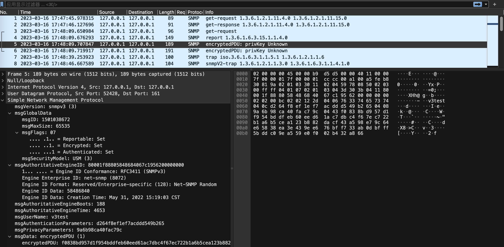
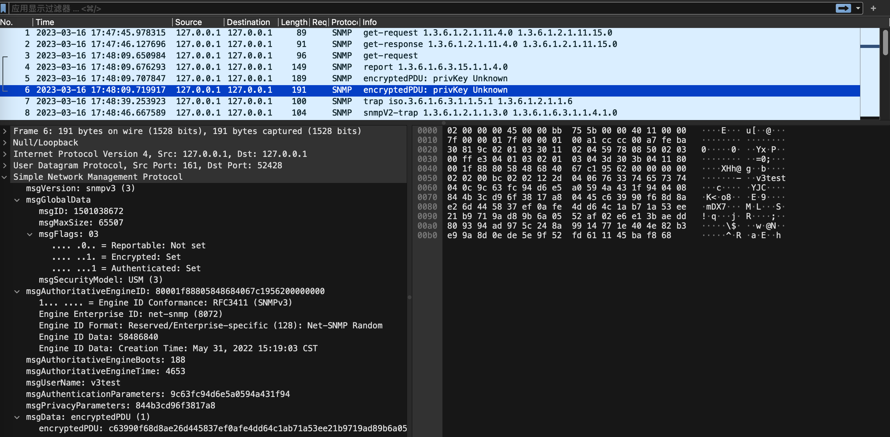
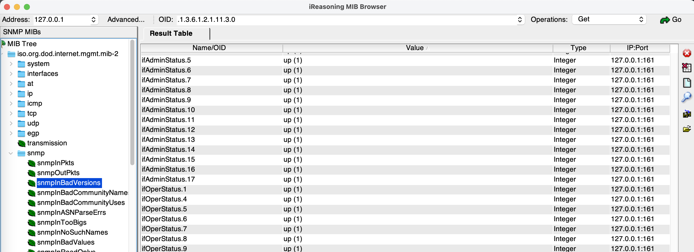

## 协议简介

简单网络管理协议SNMP（Simple Network Management Protocol）是广泛应用于TCP/IP网络的网络管理标准协议。是应用层协议。

目前有SNMPv1，SNMPv2c，SNMPv3三个版本，在SNMP报文中，对应的整数分别为0，1，2.

SNMP系统由以下四个部分组成：




<center>SNMP管理模型</center>

### MIB

MIB定义了被管理对象的很多属性：包括对象的名称，对象的状态，对象的访问权限，对象的数据类型。
MIB是管理信息数据库，采用和DNS相似的树形结构。根在最上面，根没有名字。
如下图所示的是管理信息库的一部分，它又称为**对象命名树**。每个**OID（object identifier，对象标识符）**对应于树中的一个管理对象，如system的OID为1.3.6.1.2.1.1，interfaces的OID为1.3.6.1.2.1.2。



<center>OID数结构</center>

当用户在配置Agent时，可以通过**MIB视图**来限制NMS能够访问的MIB对象。MIB视图实际上是MIB的子集合。

## 抓包详解

###SNMPv1和SNMPv2c

两个版本的报文结构都是


我用wireshark抓到的v1的数据如下，可以和上面的报文结构对应着看看：



团体名：有可读和可写两种情况。

PDU：包含PDU类型、请求标识符、变量绑定列表等信息

v1和v2c都有的基本操作类型如下（中间的是PDU类型）：



> Trap信息是Agent主动向NMS发出的信息，告知管理进程设备端出现的情况。 
>
> Trap不需要NMS回复（与v2c的InformRequest相比）。Trap不属于NMS对被管理设备的基本操作，它是被管理设备的自发行为。当被管理设备达到告警的触发条件时，会通过Agent向NMS发送Trap消息，告知设备侧出现的异常情况，便于网络管理人员及时处理。

SNMPv2c版本新增支持了**GetBulk**和**Inform**操作，如下：


GetBulk操作实现了NMS对被管理设备的信息群查询。**基于GetNext实现，相当于连续执行多次GetNext操作。**在NMS上可以设置被管理设备在一次GetBulk报文交互时，执行GetNext操作的次数。

InformRequest也是被管理设备向NMS主动发送告警。与Trap告警不同的是，被管理设备发送Inform告警后，需要NMS回复InformResponse来进行确认。使用Inform告警会占用较多的系统资源。

### SNMPv3

**主要改进就是安全性方面**

数据认证：防止SNMP消息在传输过程中被篡改，或SNMP消息来自伪造的SNMP实体

数据加密：防止SNMP消息在传输过程中被窃听

报文结构如下：


和前两个版本相比，去掉了团体名，新增了报头数据到Context Name这四个字段。

SNMPv3的PDU和v2c的好像一样，包括GetRequest PDU、GetNextRequest PDU、SetRequest PDU、Response PDU、Trap PDU、GetBulkRequest PDU和InformRequest PDU。



<center>以Get为例的SNMPv3的工作过程</center>

通过抓包，可以看到一次SNMP请求的4个步骤，和上图的一致，实际的传输的数据是被加密的：

> Ps:用gosnmp SDK发送SNMP请求得到的是解密后的结果，因为SDK已经对返回的被加密了的数据进行了解密。









## 客户端工具

### net-snmp

> mac上或者linux机器上可能默认可能无法访问本机的SNMP服务，需要进行如下配置：
>
> 修改` /etc/snmp/snmpd.conf`文件为以下内容：
>
> ```shell
> com2sec mynetwork <NETWORK/CIDR> public
> rocommunity public default .1
> ```
>
> 比如：
>
> ```shell
> com2sec mynetwork 192.168.1.6/24 public
> rocommunity public default .1
> ```
>
> 再重启SNMP服务：
>
> ```
> sudo launchctl unload /System/Library/LaunchDaemons/org.net-snmp.snmpd.plist # 关闭SNMP服务
> sudo launchctl load -w /System/Library/LaunchDaemons/org.net-snmp.snmpd.plist # 重启SNMP服务
> ```

mac安装SNMP客户端

```shell
brew install net-snmp
```

可以使用snmpget命令来获取指定OID的值。例如：

```shell
snmpget -v2c -c public localhost 1.3.6.1.2.1.11.4.0
```

-v2c表示使用SNMP版本2c协议，-c表示指定SNMP社区字符串，这里是获取本机上的OID为1.3.6.1.2.1.11.4.0的信息。

或者请求多个OID

```shell
 snmpget -v1 -c public localhost 1.3.6.1.2.1.11.4.0 1.3.6.1.2.1.11.15.0
```

### MIB Browser

这是一个GUI客户端。界面如下：



我在Mac上下载了MIB Browser，可以通过这个查看本地MIB的信息。在查看的过程中，通过wireshark抓本地网络接口如lo0的包，可以抓到对应的SNMP的包。

### SDK

使用[gosnmp](github.com/gosnmp/gosnmp)，可以发送SNMP数据，获取一些OID信息。实际使用中我用这个比较多，因为参数很明确。

参考官方文档，基本用法如下：

```go
import (
	"fmt"
	"log"

	g "github.com/gosnmp/gosnmp"
)

func v1() {
	g.Default.Target = "127.0.0.1"
	err := g.Default.Connect()
	if err != nil {
		log.Fatalf("Connect() err: %v", err)
	}
	defer g.Default.Conn.Close()
	oids := []string{"1.3.6.1.2.1.11.4.0", "1.3.6.1.2.1.11.15.0"}
	result, err2 := g.Default.Get(oids)
	if err2 != nil {
		log.Fatalf("Get() err: %v", err2)
	}
	for i, variable := range result.Variables {
		fmt.Printf("%d: oid: %s ", i, variable.Name)
		switch variable.Type {
		case g.OctetString:
			fmt.Printf("string: %s\n", string(variable.Value.([]byte)))
		default:
			fmt.Printf("number: %d\n", g.ToBigInt(variable.Value))
		}
	}
}
func v3() {
	// build our own GoSNMP struct, rather than using g.Default
	params := &g.GoSNMP{
		Target:        "127.0.0.1",
		Port:          161,
		Version:       g.Version3,
		SecurityModel: g.UserSecurityModel,
		MsgFlags:      g.AuthPriv,
		Timeout:       time.Duration(10) * time.Second,
		SecurityParameters: &g.UsmSecurityParameters{UserName: "v3test",
			AuthenticationProtocol:   g.SHA,
			AuthenticationPassphrase: "v3testtest",
			PrivacyProtocol:          g.AES,
			PrivacyPassphrase:        "v3testtest",
		},
	}
	err := params.Connect()
	if err != nil {
		log.Fatalf("Connect() err: %v", err)
	}
	defer params.Conn.Close()

	oids := []string{"1.3.6.1.2.1.11.4.0", "1.3.6.1.2.1.11.15.0"}
	result, err2 := params.Get(oids) // Get() accepts up to g.MAX_OIDS
	if err2 != nil {
		log.Fatalf("Get() err: %v", err2)
	}

	for i, variable := range result.Variables {
		fmt.Printf("%d: oid: %s ", i, variable.Name)

		// the Value of each variable returned by Get() implements
		// interface{}. You could do a type switch...
		switch variable.Type {
		case g.OctetString:
			fmt.Printf("string: %s\n", string(variable.Value.([]byte)))
		default:
			// ... or often you're just interested in numeric values.
			// ToBigInt() will return the Value as a BigInt, for plugging
			// into your calculations.
			fmt.Printf("number: %d\n", g.ToBigInt(variable.Value))
		}
	}
}
```

## 使用gopacket对包内容解析

因为网上这类项目真的很少，我只找到了一个很久之前的，然后根据这个项目进行了改编，具体的内容可以看 

[code-in-blog/snmp](https://github.com/nrbackback/code-in-blog/tree/main/snmp)

这个项目可以解析出大部分的SNMP数据，解析出来的所有 Pdu.PduType 包括
GetRequest
GetResponse
Report
SNMPTrapV2
GetBulkRequest

trap v1 无法解析
snmp v3 被解析成了GetRequest

- 参考资料

[华为云的SNMP配置](https://support.huawei.com/enterprise/zh/doc/EDOC1100138435/5ee8dfb)

[Enable ICMP protocol on MacOS](https://www.heelpbook.net/2016/enable-icmp-protocol-on-macos/)

[SNMPv3的基本概念](https://blog.csdn.net/jijian_jinan/article/details/43054879)

[How to enable SNMP on Mac OSX](https://support.auvik.com/hc/en-us/articles/360000536163-How-to-enable-SNMP-on-Mac-OSX)

