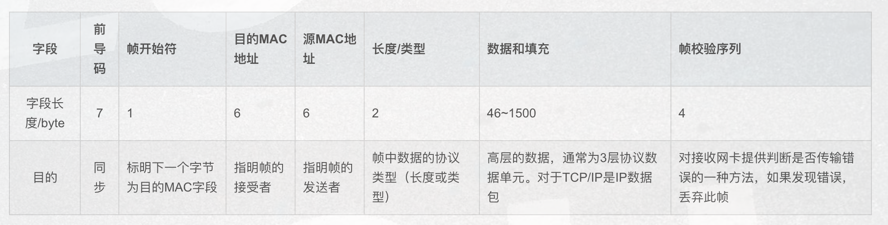
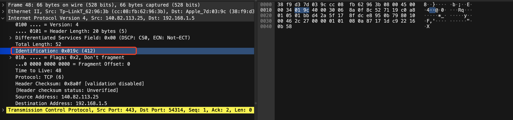
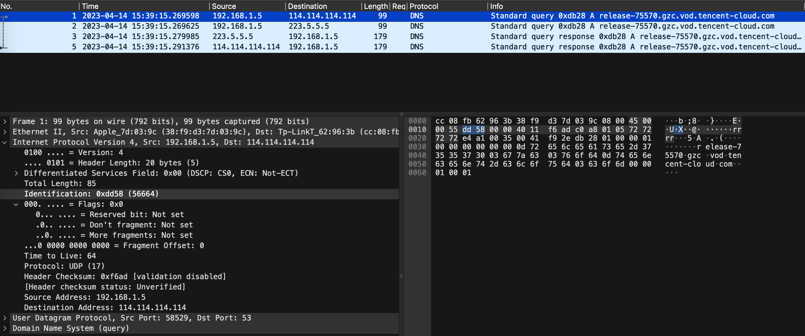
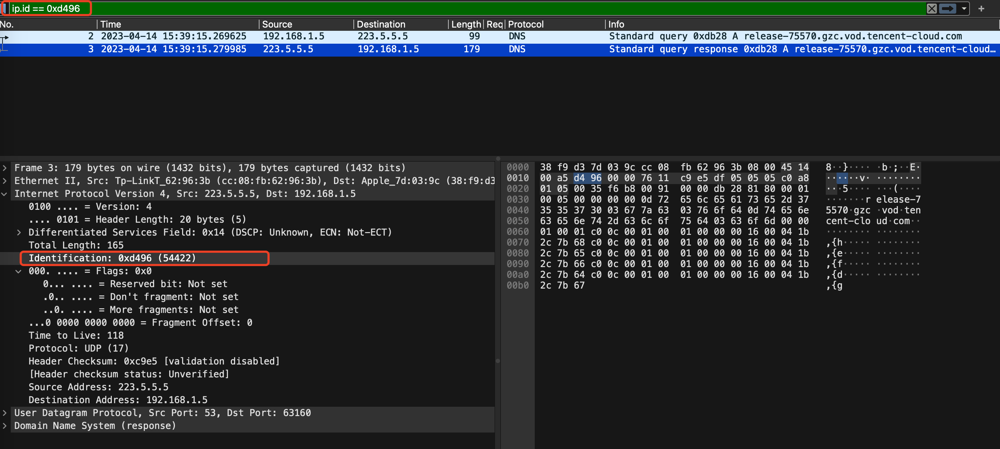
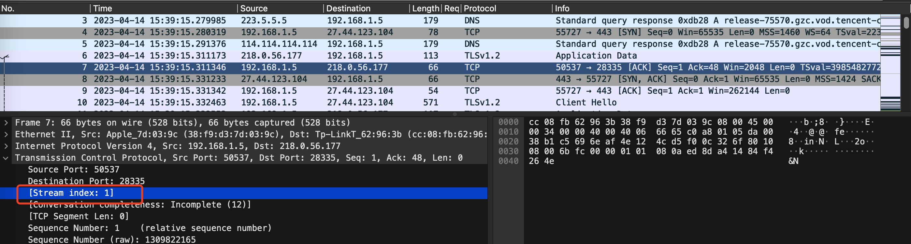
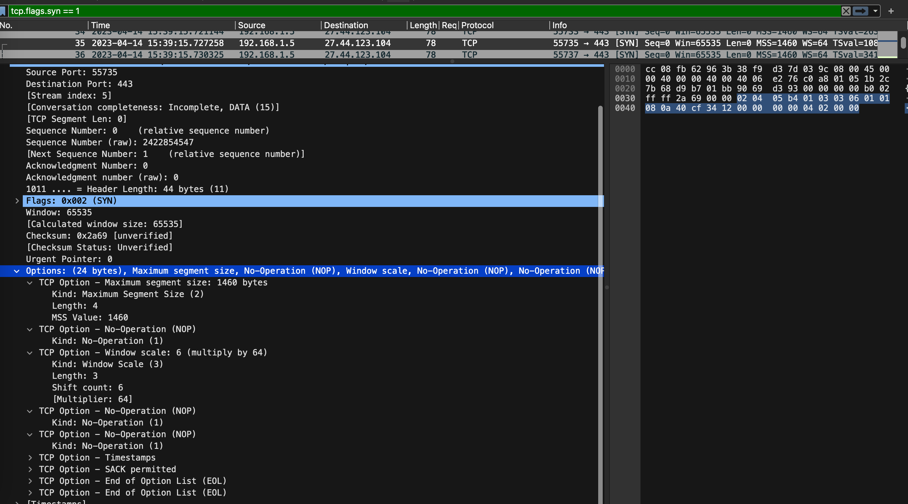
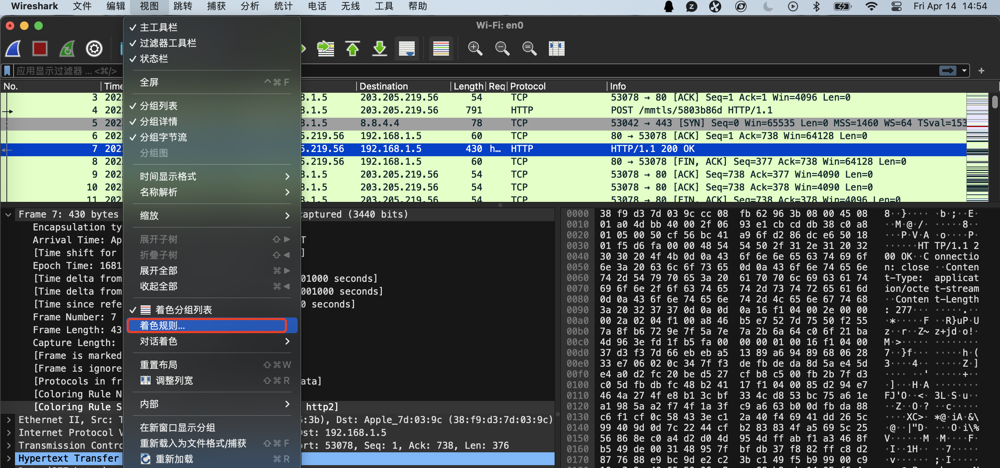
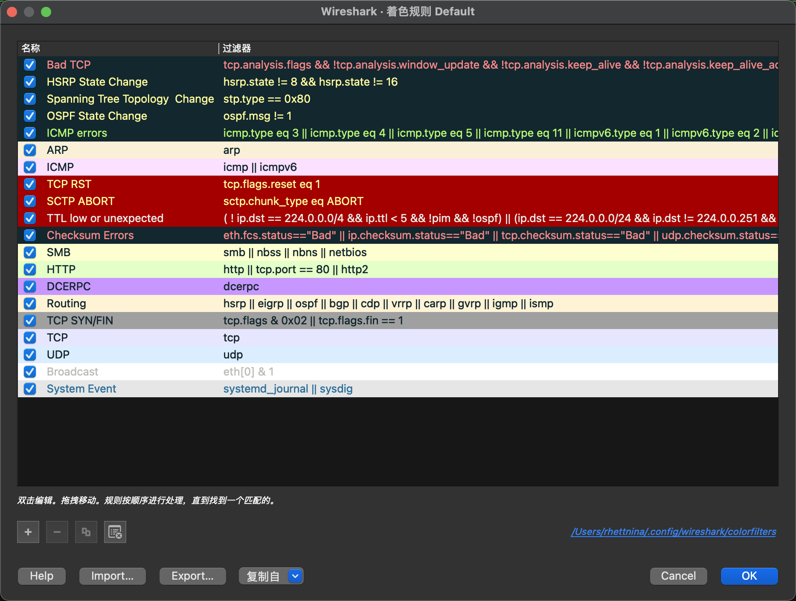

本篇内容是从参考中总结的。

当我们的UDP包中的数据多于MTU(1472)时，发送方的IP层需要分片fragmentation进行传输，而在接收方IP层则需要进行数据报重组，由于UDP是不可靠的传输协议，如果分片丢失导致重组失败，将导致UDP数据包被丢弃

TCP分段是在传输层完成，并在传输层进行重组. IP分片由网络层完成，也在网络层进行重组。所以使用TCP协议进行数据传输，是不会造成IP分片的，因为TCP会自己分段，**TCP分段**的大小是不会产生**IP分片**的。（注意这两个名次）

 而对于没有大小限制的UDP协议（这是传输层的协议），则则需要下一层网络层（IP协议）来分片。

我们常提到的IP分片是由于UDP传输协议造成的，因为UDP传输协议并未限定传输数据报的大小

第一层显示的是FrameXXX，这一级别没有对应某层具体的协议，而是对本条消息的一个概括性总结，描述了一些有用的概括性信息

**Note:**
**a) 数据在 IP 层称为 Datagram ，分片称为 Fragment**
**b) 数据在 TCP 层称为 Stream，分段称为 Segment**
**c) 数据在 UDP层称为 Message**

## 以太网

MAC地址用来表示互联网上每一个站点的标识符，采用十六进制数表示，共六个字节（48位）

**以太网的解析，Wireshark没有显示全部的内容**，只显示了6个字节的目的MAC地址，6个字节的源MAC地址，2个字节的类型域这三项，其实Wireshark只解析了前三个字节，如GemtekTe、Tp-LinkT，后三个字节原封不动的保留在了解析结果里。

以太网头部一共有这么多信息，但是Wireshark只展示了部分有用的

## 网络层

IP头与数据包中数据的长度 (256 – 14），这里的14是以太网的头部长度，总的数据包大小减去以太网头部就是IP层整个包的大小

IP包中有一个 **Identification字段，同一数据流的分片身份序列相同)**，这是用来识别一个数据包或被分片数据包的次序，一个唯一的标识数字。

IP还有一个用于标记是否当前IP包是否被分片了的标记Flag，比如下面的这个是被分片了的，对于Flags，三位的含义依次是

- 0… …. = Reserved bit: Not set —— 无保留位，没有设置
- 1.. …. = Don’t fragment: Set —— IP不分片
- ..0. …. = More fragments: Not set —— 其余分段没有设置

根据Identification字段，找到剩余的一个分片：

## 传输层

TCP的Stream index是根据src.ip src.port dst.ip dst.port生成的一个索引号

**TCP Segment Len: 202 ( Next sequence – Sequence ) number**，表示TCP 携带数据的长度

不同头部大小：实际抓包中 SYN和SYN ACK包的TCP头部是32字节，有的时候是28字节，多了12或8字节的选项和填充字段。而ACK和FIN ACK包的TCP头部都是20字节。

比如下面这个包含SYN的包，多了Options字段

每个TCP Option，Kind值表示TCP的选项，TCP有两种类型的选项：单字节和多字节。每一个选项有同样的结构：Kind + Length + Data，其中Lenght表示Kind、Lenght、Data三者的总长度，单字节的选项只有Kind

关于这些选项，就+有如下规则：

KIND（8bit）+LENGTH（8bit，NOP没有LENGTH部分）+内容（如果有的话）

Kind=0表示选项结束——1字节

Kind=1表示无操作，主要是用来占位从而达到字节对齐的目的——-1字节

Kind=2表示MSS选项——4字节

Kind=3表示窗口大小（窗口扩大因子）——3字节

Kind=4表示SACK-Permitted——-2字节

Kind=5表示一个SACK包—–可变长度

Kind=8表示时间戳—–10字节

TCP断开：TCP连接的建立是通过三次握手完成的，而TCP正常释放连接是通过四次挥手来完成，但是有些情况下，TCP在交互的过程中会出现一些意想不到的情况，导致TCP无法按照正常的四次挥手来释放连接，如果此时不通过其他的方式来释放TCP连接的话，这个TCP连接将会一直存在，占用系统的部分资源。在这种情况下，我们就需要有一种能够释放TCP连接的机制，这种机制就是TCP的reset报文。

## wireshark的着色规则

查看Wireshark着色规则

我的wireshark中看到的是这些

参考

[原文1:Wireshark 数据分析（二）](https://blog.csdn.net/u011414200/article/details/47945661)

[Wireshark 数据分析（三）](https://blog.csdn.net/u011414200/article/details/47948401)