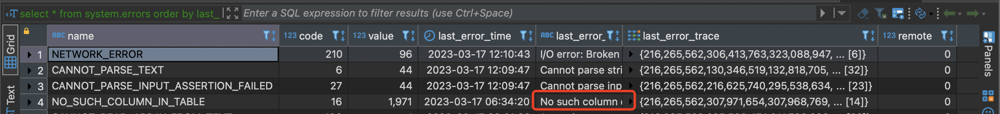
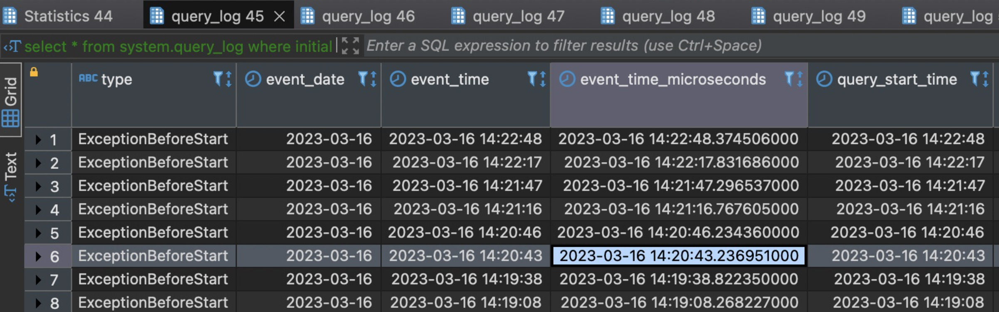
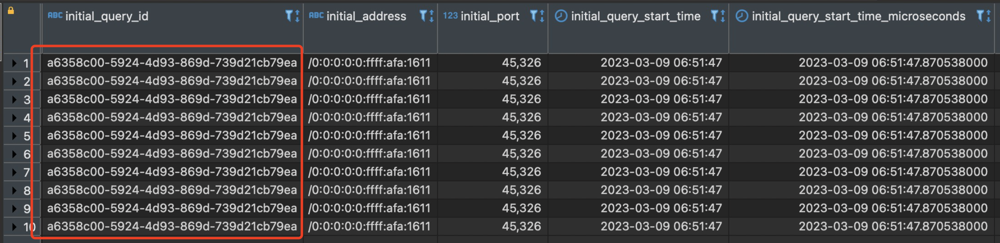
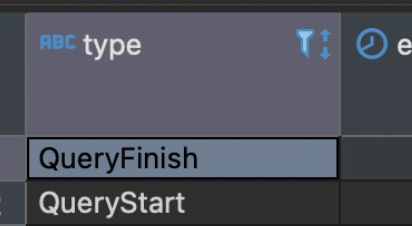

## 背景

我所实验的环境是一个集群，集群中，一共有N台机器，每台机器上有2个表，分别是分布式表和本地表。

分布式表和本地表的建表语句分别为：

```sql
CREATE TABLE table1
(
    `id` UInt64,
    `device` Nested(
        type String,
        info String 
     ),
    `create_time` DateTime
)
ENGINE = Distributed('clusterxx', 'flora', 'table1_replica', rand())
```

```sql
CREATE TABLE table1_replica
(
    `id` UInt64,
    `device` Nested(
        type String,
        info String 
     ),
    `create_time` DateTime
)
ENGINE = ReplicatedMergeTree('/clickhouse/tables/{layer}-{shard}/database1/table1_replica', '{replica}')
PARTITION BY toYYYYMM(create_time)
ORDER BY create_time
TTL create_time + toIntervalDay(10)
SETTINGS index_granularity = 8192
```

## alter

在实际操作中，对于alter操作，可以指定ON CLUSTER，比如新增字段

```sql
alter table table1 ON CLUSTER clusterxx drop column cc
```

或者

```sql
alter table table1_replica ON CLUSTER clusterxx drop column cc
```

那么实际执行的时候，会将任务分发到各个节点（会分发到N个节点，对应了N台机器），这样每台机器上的表（table1或者table1_replica）都新增了字段。不过默认情况下分布式任务不是同步的，实际上只是将任务分发到各个节点，至于各个节点什么时候执行看各自节点的情况，不会等所有节点都执行完毕才返回数据。

## insert操作

insert写入的过程中分为同步写和异步写，通过`insert_sync`来控制，该参数的值是由`insert_distributed_sync`配置的，默认为`false`。

> 一批数据写入分布式表会被拆分成多份小批量的数据写入`Clickhouse`集群，大量的小`part`文件会增加集群后台`merge`线程池的压力，当`merge`的处理能力小于写入能力时，`Clickhouse`会禁止写入，所以写入`Clickhouse`期望是**频率低批次大**。

insert操作也可以直接写到分布式表上，分布式表会将insert任务分派到各个节点，各个节点默认会异步写。如：

```shells
insert into table1 values(1, ['A','A'],['1.1.1.1', '2.2.2.2'], 2021-08-19 14:21:30');  
insert into table1 values(2, ['A','A'],['1.1.1.1', '2.2.2.2'], 2021-08-20 14:21:30');  
```

那么clickhouse会将操作分布到几个节点后返回，然后在几个节点上分别写。

### 问题

下面是一个我碰到的insert操作过程中和分布式任务相关的问题：

操作步骤

1. 往分布式表插入一些数据，是比较多条的数据。类似于`insert into table1 values(1, ['A','A'],['1.1.1.1', '2.2.2.2'], 2021-08-19 14:21:30');  `1000条这样。

2. 删除table1的device字段，先在每个节点上都执行

   ````sql
   alter table table1 drop column device.type;
   alter table table1 drop column device.info;
   ````

   然后在每个节点执行：

    ```sql
    alter table table1 drop_replica column device.type;
    alter table table1 drop_replica column device.info;
    ```

3. 新增device字段，不过是String类型的：

   先在每个节点上都执行

   ```sql
   alter table table1 add column device String;
   ```

   然后在每个节点上执行：

   ```sql
   alter table table1_replica add column device String;
   ```

4. 发现问题：

   查询system.errors表，发现其中两台机器不断报错

   执行`select * from system.errors order by  last_error_time desc limit 10`

   返回结果为：

   

   完整信息为

   ```
   No such column device.type in table database1.table1_replica (xxxxxxxxxx-bf3c-414d-82f5-e184fe0304c6)
   ```

   更为关键的是，每个两三分钟再次查询，这个NO_SUCH_COLUMN_IN_TABLE错误一直在更新，表现为value值增加，last_error_time更新为离当前时间更近的时间，而last_error还是No such column device.type的内容，这说明错误一直在发生。

5. 查询 system.query_log确认 ，发现最近几分钟报错的都是上面的错误，大概每隔30秒会触发一次，看起来是insert失败后clickhouse一直在重试。

   > ps:图片上的时间仅作为参考，因为是事后记录，资料部分丢失，所以时间不会严格按照时间发生的记录，理解意思即可。



发现这些报错的initial_query_id都是相同的，initial_query_id表示这个操作是由哪个分布式任务触发的，且每一条报错的query_id和initial_query_id不一样，这表明这台机器的insert操作是其他机器派发下来的。



6. 确定这个initial_query_id是哪台机器上的，我在每台机器上都执行了

   ```sql
   select count() from system.query_log where query_id = 'xxx' // xx 就是上图标出来的initial_query_id
   ```

   发现只有第一台返回了非0数据，表明这个操作是第一台派发下来的。但是第一台查询`select * from system.query_log where query_id = 'xxx'`的两条数据的结果的Type分别为QueryStart和QueryFinish

   7. 原因确认：这是因为第一步的insert是非同步式分布任务，集群随机派发，把这个任务派发到了第一台节点上，第一台的分布式表table1把任务派发到N台节点的本地表table1_replica执行，因为分布式任务是非同步的，此时第一台立刻返回结果，剩下的几台准备执行被派发到的insert任务。结果此时我在每台挨个执行了删除字段的操作，出了出问题的那台，其他几台都是insert执行完毕了才delete字段，只有出问题的那台delete后执行了insert操作，此时必然会报错。然后clickhouse就不断重试。

   8. 尝试解决：相关的资料clickhouse讲得很少，我估计是有个不断重试insert的线程不断在重试。于是重启了出问题的那台机器，但是发现重启后这个问题依然存在 。那么这个重试程序应该是被持久化到硬盘上的。

   9. 因为定位不断重试insert的线程很麻烦，且考虑不精通clickhouse，手动停止重试任务会影响clickhouse的数据等，于是决定使用最简单的回滚方法，删除新增的string类型的 device字段，然后新增nested类型的device字段，此时重试任务重试成功了，报错 停止了。然后再删除Nested类型的device，把string类型的device加回来 。

      注意：首先先要执行`delete column device on cluster clusterxx drop column device` 操作所有机器的分布式表，然后上面所说的先删除device，添加Nested类型的device等一系列只要在出问题的机器的本地表执行就可以了。最后再在所有机器的分布式表添加string类型 的 device字段。

> ps：上面的问题导致的另一个后果是 表堆积
>
> 下面2种情况会造成分布式表堆积：
>
> 当DistributedSchedulePool的处理能力小于写入能力时，就会造成分布式表堆积，这时用户是查不到堆积的数据的，当堆积到一定的程度，集群是比较难恢复的，需要清除分布式表堆积的数据，用户是会丢失数据的，出现这种问题的原因其中一个原因是用户在StreamSql任务中配置的并发太高间隔太短，写入太猛造成的。
>
> 用户在修改表结构的时候未停写，就可能会出现分布式表中还堆积着修改表结构之前的数据，当分发的时候，由于远端的表结构已经修改，就会分发失败，`Clickhouse`就会无限次重试，导致后续的数据也无法处理，从而堆积。

参考

[Clickhouse 分布式表的写入原理](https://blog.csdn.net/qq_43115606/article/details/125612593)