## dig trace命令

> dig（域信息搜索器）是一个在Linux和Unix系统中常用的网络工具，用于查询DNS域名解析相关信息，比如查询域名对应的IP地址、查询DNS服务器的相关信息、查询DNS记录等等。
>
> 它可以通过指定参数和选项进行各种类型的DNS查询，包括常用的A记录、MX记录、CNAME记录等等，还可以设置查询的DNS服务器，以及查询的超时时间等等。同时，dig也可以用于诊断DNS相关的问题，比如检查DNS服务器是否正常工作、解析是否正确等等。

执行nslookup xxx.com时，确认本地DNS服务器是否已经缓存了查询结果。如果本地DNS服务器已经缓存了查询结果，就不会再向上级DNS服务器发出请求了。

为了避免缓存影响，下面加上+trace参数。

> 使用 `dig +trace` 命令会追踪域名解析过程并输出每个步骤的详细信息。**它不会使用DNS缓存，它会从根域名服务器开始，**递归地查询每个级别的 DNS 服务器，直到找到目标域名的 IP 地址或遇到错误。该命令对于诊断 DNS 解析问题非常有用，可以帮助确定哪个服务器出现了问题或哪个环节出现了延迟。

这是执行 ` dig +trace qwewq.com`抓到的包，首先访问了192.5.5.241

> IP地址 192.5.5.241 是由美国国家科学基金会（NSF）资助的互联网核心枢纽机构 VeriSign 公司拥有的一个地址，**是一个根域名服务器**，主要用于管理和运营域名系统（DNS）服务器，其中包括 .com 和 .net 域名的顶级域名服务器。

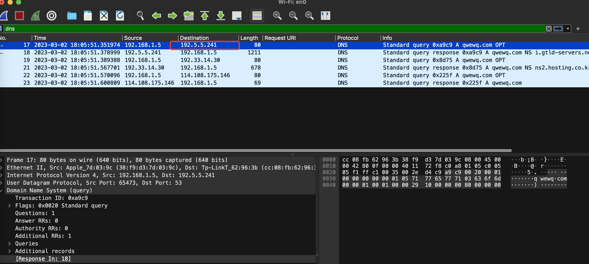

如果不特意指定+trace只是正常访问，抓到的包结果如下，首先访问了8.8.8.8

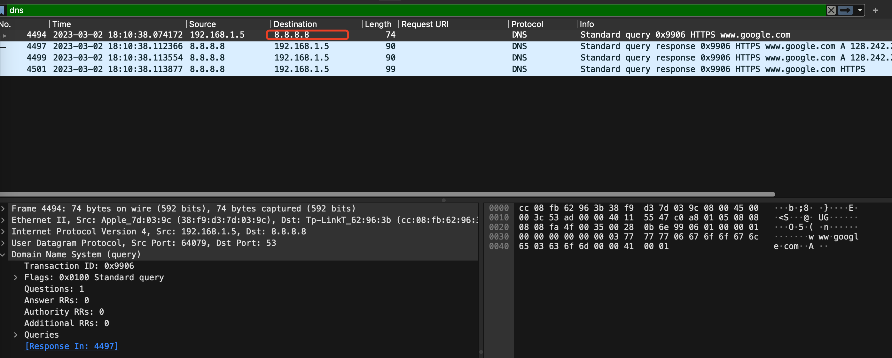

这是因为我在电脑的系统设置中配置的DNS地址是8.8.8.8

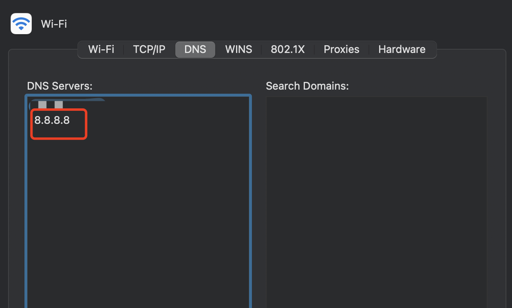

> 8.8.8.8是Google提供的公共DNS服务器的IP地址。**它不是根域名服务器，而是一个提供DNS解析服务的服务器。**

## 重传的情况

下面的4499和4501都是响应重传包，都是在响应包4497这个响应包发送后重传的

> 为什么wireshark中有的DNS响应显示retransmitted response
>
> Wireshark中显示"retransmitted response"通常表示DNS响应是一个重传的包，即发送方发送了一个DNS响应包，但由于某些原因，接收方没有接收到该包，或者收到的包存在错误或丢失，导致发送方需要重新发送该包。Wireshark通过检查包的序列号和确认号来判断响应是否被重传。当一个响应被重传时，它通常会有一个新的时间戳和序列号，而重传标志位也会被设置。

但是wireshark显示的响应时间还是用第一个返回的响应包计算的，而不是后两个响应包计算的

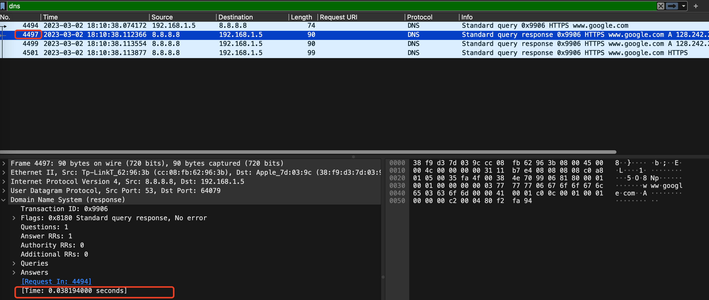

## 抓包详解

我执行了`dig +trace baidu.com`，抓到的包为：

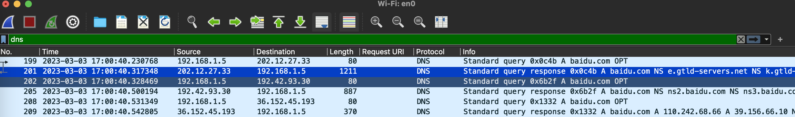

我想知道第一个访问的IP 202.12.27.33 是什么，发现这是一台根域名服务器，目前世界上有13台根域名服务器，这是其中的一台。13台根域名服务器的域名分别是A.ROOT-SERVERS.NET到M.ROOT-SERVERS.NET

可见第一次是随机找了一个根域名服务器访问的。

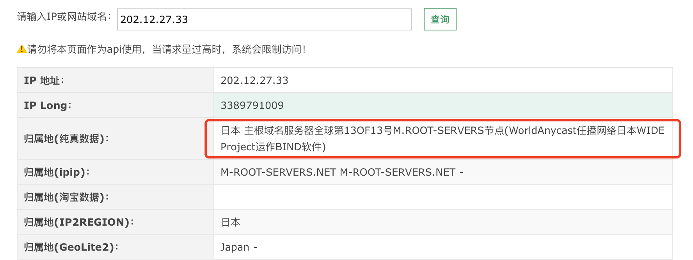

看看这台根域名服务器返回了什么

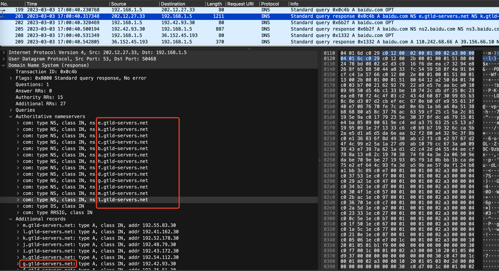

可以看到返回了13个.net结尾的域名，分别是a.gtld-servers.net到m.gtld-servers.net，这负责管理 ".com" 顶级域名的13台根域名服务器（也叫一级域名服务器）之一，这里的type是NS，表示请求a.gtld-servers.net这些域名服务器可以获得baidu.com的相关信息。在Additional records还说明了这些顶级域名服务器的IP地址是什么，注意这里的Type是A，表示这些域名对应的IP分别是什么，如m.gtld-servers.net对应的IP是192.55.83.30.

接着随机选了一台g.gtld-servers.net，如数据包202所示，发出请求后获取的响应如下：

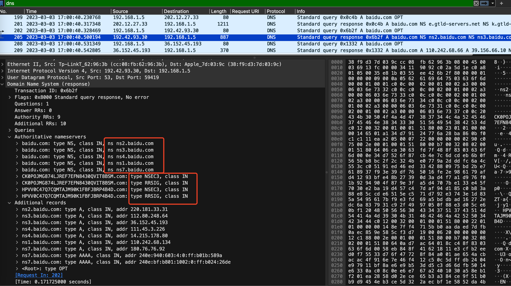

ns2.baidu.com这些是存储baidu.com的二级域名服务器，type为NS表示可以访问ns2.baidu.com来获取baidu.com的IP。

接着选择了一台ns3.baidu.com，其IP为36.152.45.193，如数据包208所示，发出请求后获取的响应如下：

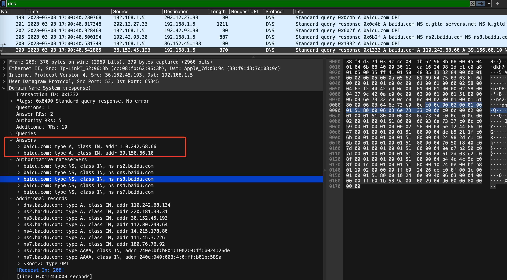

可以看到本次终于获取到了Answers。

我发现这几次DNS请求中都有指定OPT，于是了解了一下这个OPT的含义：DNS查询中的OPT是指“Options”（选项）字段，它允许在DNS查询或响应中添加额外的信息，如DNSSEC（DNS安全扩展）相关的信息，以及用于DNS性能、优化和其他目的的标志。

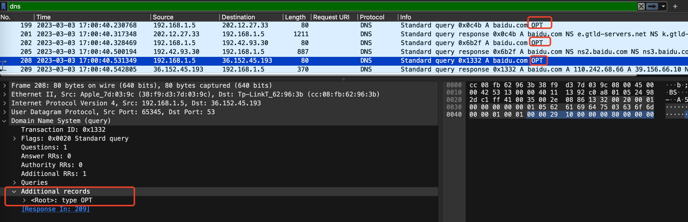

Ps:发现有时在上面的访问根服务器（上面的是 202.12.27.33）的第一步前，会给我本地配置的NDS服务器8.8.8.8发送请求：

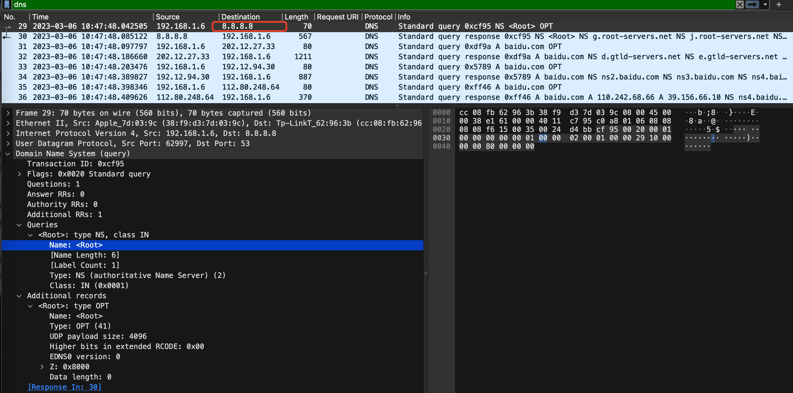

可以看出，这是请求根域名服务器的信息的，返回为：

> 补充：返回的flag为0x80a0，因为截图截不到这个信息，所以在这里单独补充

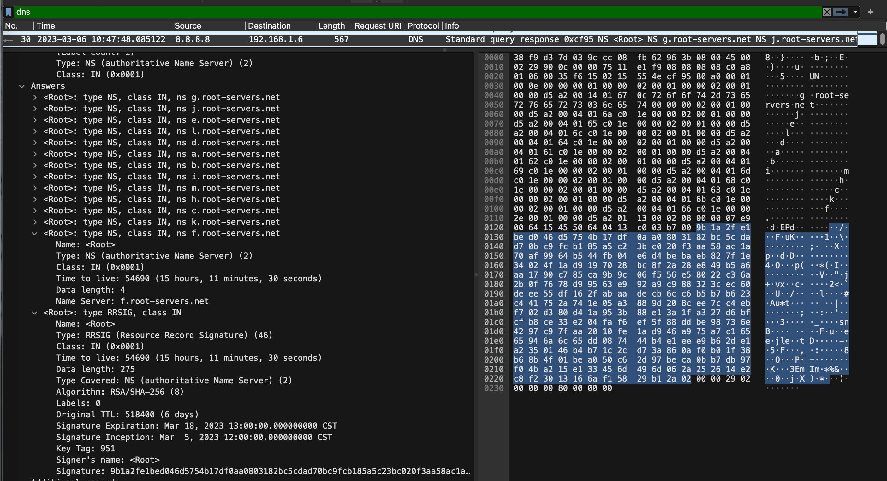

还有Additional Records：

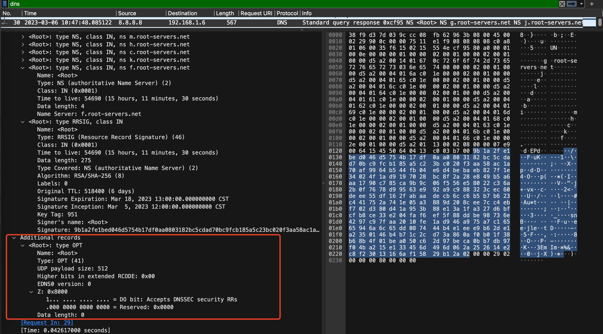

注意这里的Additional Records并没有像我预期的那样给出上面的13个根域名服务器的IP地址，因为其实13个根域名服务器的IP地址通常是固定的，所以没有必要再次返回了。这是DNS协议的规定，也是为了减少网络流量和提高DNS解析效率。这里在13个根域名服务器选择一个，然后DNS客户端本地应该存储了13个根域名服务器对应的IP地址，再找到选择出来的那个根域名服务器对应的IP地址（比如上面的是202.12.27.33），再给这个IP地址发送请求。

## DNS截断例子

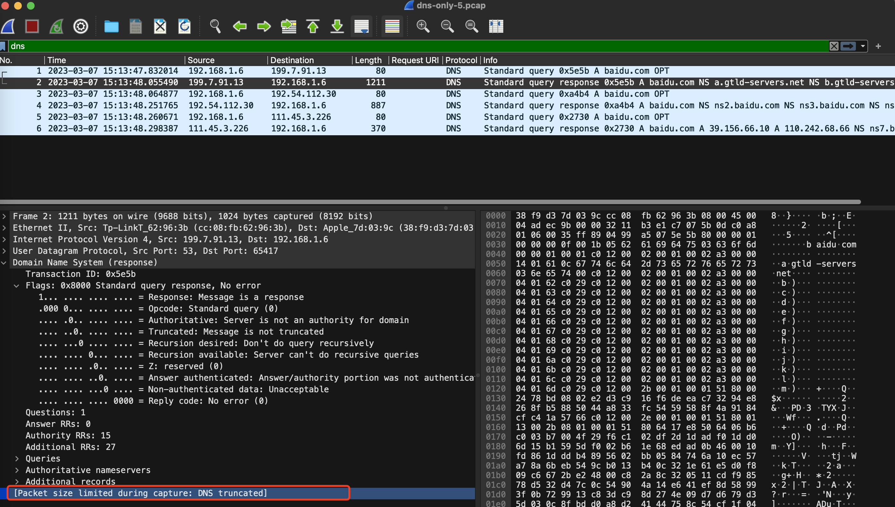

这里抓到了一个DNS截断包，使用gopacket获取layers得到的结果是

```
Ethernet IPv4 UDP DecodeFailure
```

具体pcap文件在images/dns-only-5.pcap

