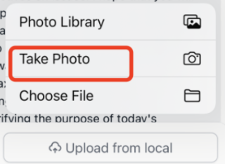
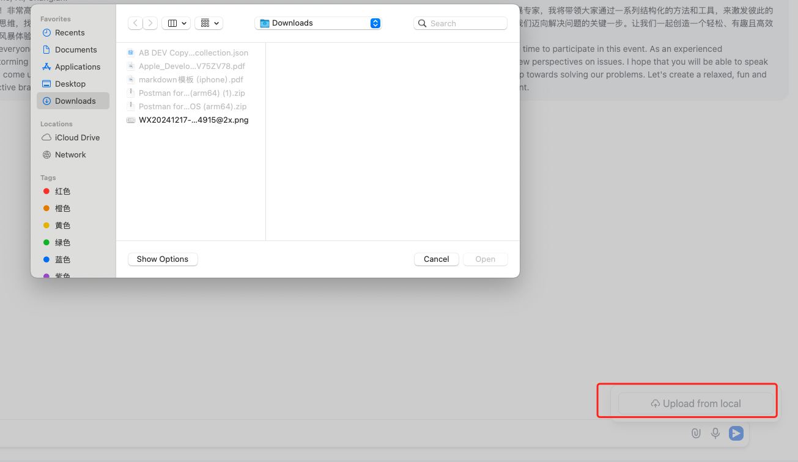

在app里的webview页面需要调用相机，如图点击Take Photo就会调用相机



> 这个web view页面是前端页面，这个“Upload from local”按钮的实现是通过html的input 标签去访问本地的文件的，就是下面的代码
>
> ```html
> <input  className='absolute block inset-0 opacity-0 text-[0] w-full disabled:cursor-not-allowed cursor-pointer'  onClick={e => ((e.target as HTMLInputElement).value = '')}  type='file'  onChange={handleChange}  accept={accept}  disabled={!!(fileConfig.number_limits && files.length >= fileConfig?.number_limits)}/>
> ```
>
> 这个input标签在不同的运行环境（不同环境比如浏览器，app等）有不同的效果，是因为不同的运行环境都自己实现了input标签对应的处理逻辑，比如浏览器里有自己的实现，在app里作为webview运行的时候ios系统有自己的处理逻辑，这个逻辑的最终效果就是图上的效果。
>
> 在PC上的浏览器中，上面html的input 标签去访问本地的文件的代码，运行的效果如下：
>
> 
>
> 和手机上的webview里的运行效果不同，这是因为PC上的浏览器和app对于这个html的input 标签的处理逻辑不同，点击“Upload from local”的效果是浏览器或者app自己的逻辑。

我之前点Take Photo的时候app直接崩溃了。想到肯定是没有配置相关权限，解决方法就是在flutter项目的 ios/Runner/Info.plist 里增加这两行

```shell
<key>NSCameraUsageDescription</key>
<string>This app requires access to the camera to take photos or scan codes.</string>
```

这样再次点击Take Photo的时候就会有提示框，显示是否允许app使用相机。

注意： **ios/Runner/Info.plist 配置的都是和系统权限相关的，什么使用相机权限、faceID权限、使用网络权限等，我的flutter应用的这个文件内容如下：**

```yml
<?xml version="1.0" encoding="UTF-8"?>
<!DOCTYPE plist PUBLIC "-//Apple//DTD PLIST 1.0//EN" "http://www.apple.com/DTDs/PropertyList-1.0.dtd">
<plist version="1.0">
<dict>
	<key>CADisableMinimumFrameDurationOnPhone</key>
	<true/>
	<key>CFBundleDevelopmentRegion</key>
	<string>$(DEVELOPMENT_LANGUAGE)</string>
	<key>CFBundleDisplayName</key>
	<string>Ai Mobile App</string>
	<key>CFBundleExecutable</key>
	<string>$(EXECUTABLE_NAME)</string>
	<key>CFBundleIdentifier</key>
	<string>$(PRODUCT_BUNDLE_IDENTIFIER)</string>
	<key>CFBundleInfoDictionaryVersion</key>
	<string>6.0</string>
	<key>CFBundleName</key>
	<string>ai_mobile_app</string>
	<key>CFBundlePackageType</key>
	<string>APPL</string>
	<key>CFBundleShortVersionString</key>
	<string>$(FLUTTER_BUILD_NAME)</string>
	<key>CFBundleSignature</key>
	<string>????</string>
	<key>CFBundleURLTypes</key>
	<array>
		<dict>
			<key>CFBundleURLSchemes</key>
			<array>
				<string>msauth.com.thermofisher.ai</string>
			</array>
		</dict>
	</array>
	<key>CFBundleVersion</key>
	<string>$(FLUTTER_BUILD_NUMBER)</string>
	<key>LSApplicationQueriesSchemes</key>
	<array>
		<string>msauth</string>
		<string>msauthv2</string>
	</array>
	<key>LSRequiresIPhoneOS</key>
	<true/>
	<key>NSAppTransportSecurity</key>
	<dict>
		<key>NSAllowsArbitraryLoads</key>
		<true/>
	</dict>
	<key>UIApplicationSupportsIndirectInputEvents</key>
	<true/>
	<key>UILaunchStoryboardName</key>
	<string>LaunchScreen</string>
	<key>UIMainStoryboardFile</key>
	<string>Main</string>
	<key>UISupportedInterfaceOrientations</key>
	<array>
		<string>UIInterfaceOrientationPortrait</string>
		<string>UIInterfaceOrientationLandscapeLeft</string>
		<string>UIInterfaceOrientationLandscapeRight</string>
	</array>
	<key>UISupportedInterfaceOrientations~ipad</key>
	<array>
		<string>UIInterfaceOrientationPortrait</string>
		<string>UIInterfaceOrientationPortraitUpsideDown</string>
		<string>UIInterfaceOrientationLandscapeLeft</string>
		<string>UIInterfaceOrientationLandscapeRight</string>
	</array>
	<key>NSMicrophoneUsageDescription</key>
	<string>This app requires access to the microphone for voice input.</string>
	<key>NSFaceIDUsageDescription</key>
	<string>Face ID is used to authenticate the user.</string>
	<key>NSCameraUsageDescription</key>
	<string>This app requires access to the camera to take photos or scan codes.</string>
</dict>
</plist>
```

在 ios/Runner/Info.plist配置后，当在ios里如果要使用到某个权限时，就会跳出弹窗询问，注意这一步是系统自动实现的。