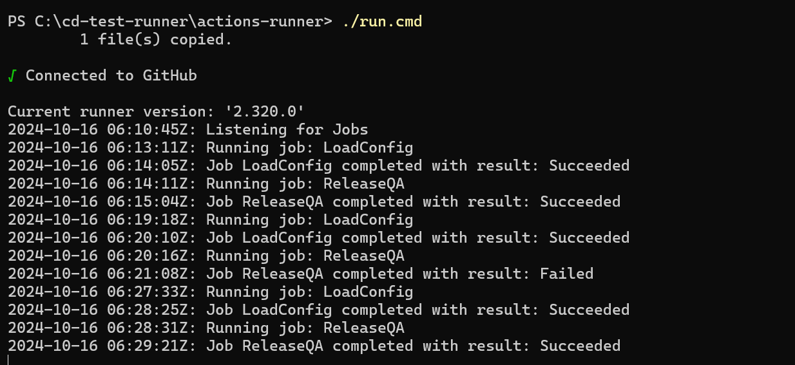
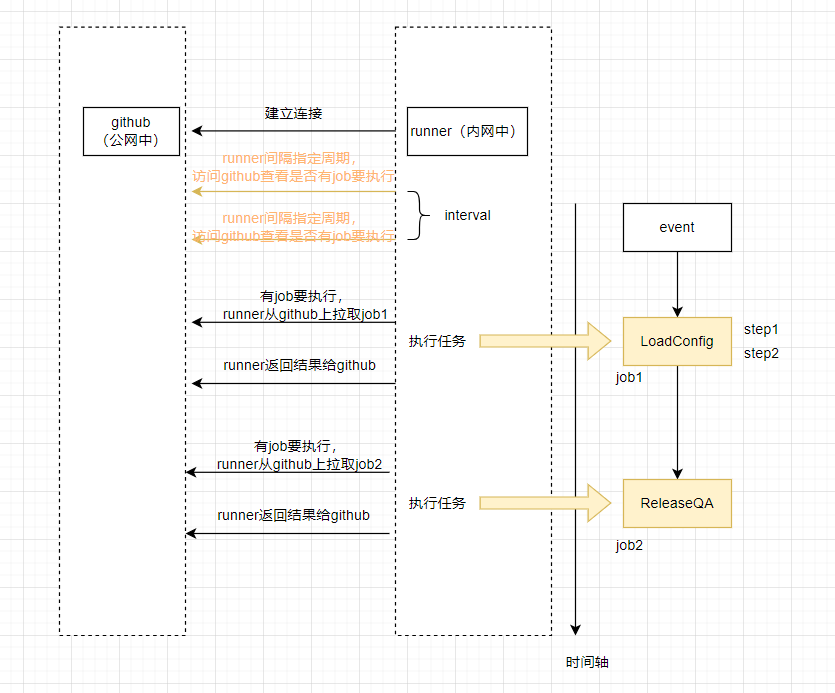
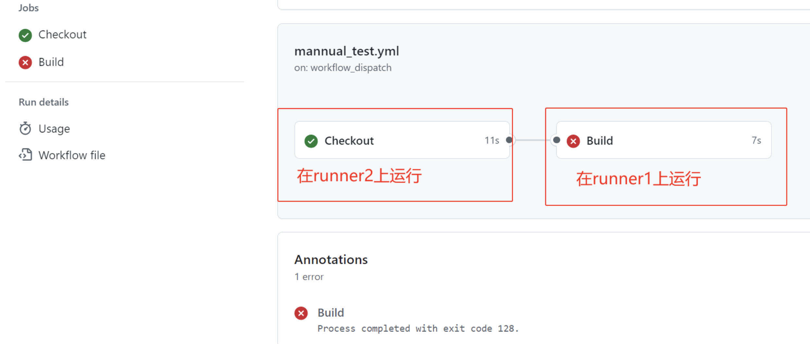
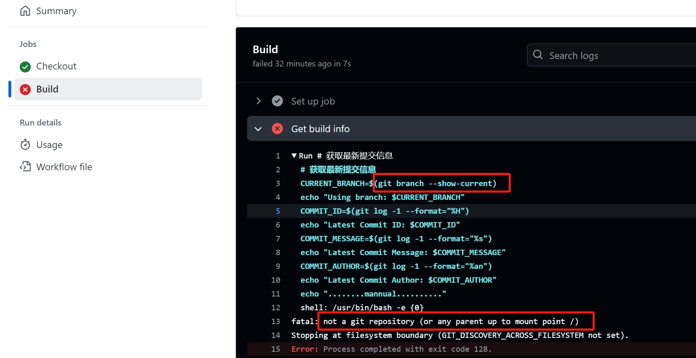
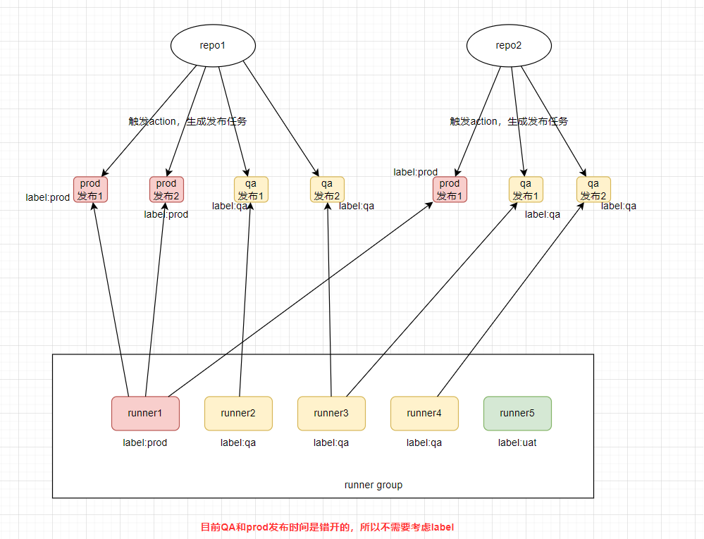

## runner group简介

首先阅读一下github的文档：

https://docs.github.com/en/actions/hosting-your-own-runners/managing-self-hosted-runners/managing-access-to-self-hosted-runners-using-groups

runner group是给organization用的

当创建runner group时，需要选择一个策略，该策略定义了哪些repo可以访问该runner group。

在organization's runner settings里，可以看到列出来的runner group

当新runner创建时，不指定的情况下，会被分配到default group的runner里，所有organization都有一个default runner group。

可以通过API创建runner group，organization也可以在自己的主页的Settings里New runner group。

runner group新建后，也可以在runner group里修改哪些repo可以访问这个group。

自动将self-hosted runner 加到group：`./config.sh --url $org_or_enterprise_url --token $token --runnergroup rg-runnergroup`，也可以将self-hosted runner手动移到group里，还是需要在**organization**的Settings里设置。也可以将runner从group里移出。

> 注意：
>
> runner在内网中，只能runner向github发起网络请求然后github返回，github不可能向runner发起网络请求。
>
> 下面这个图解释了在内网中的runner如何和github服务器通讯传递和运行job，还有runner运行job的步骤。
>
> 本地runner运行的job的终端也会显示job的运行情况：
>
> 
>
> runner group和github调度流程如下：
>
> 
>

## runner group数据共享问题

我连续触发workflow，发现一个问题：有个Action的Job分为两个job，分别为Checkout和Build，查看runner的日志发现Checkout在runner2上运行，但是Build在runner1上运行，但是报错了：

https://github.com/thermofisher/CN-DE-AMandA-Web/actions/runs/11513036704/job/32049037585





是因为runner2在自己的工作目录初始化了项目，是在Checkout里clone下来了代码，但是Build到了runner1上面运行，runner1的工作目录没有代码，所以执行`git branch --show-current`里报错了。

经过搜索后发现，**我配置的runner group的多个runner每个runner都有自己的工作目录，runner之间是不会有共享目录的。**而同一个workflow下的多个job可能会在多个不同的runner下运行，上述问题的产生是因为runner2运行了Checkout Job，把代码clone到runner2的工作目录中了。但是Build job在runner1上运行，runner1的工作目录没有clone下的代码，所以执行git命令报了上面的错。

每个作业（Job）默认是在一个独立的虚拟环境中运行的，这意味着环境配置（例如安装的工具和设置的环境变量）不会在作业之间共享。因此，如果你在一个作业中设置了Gradle环境，那么在下一个作业中无法直接访问这些设置。

这个问题的解决方案，第一个是使用actions/upload-artifact@v3进行job之间的数据同步，前一个job把数据传到github上，后一个job从github上拉取数据，使用actions/upload-artifact@v3会比较耗时，因为有上传数据和下载数据的时间。使用actions/upload-artifact@v3的写法参考如下：

```yml
name: Mannual_QA_Test_Update

on:
  workflow_dispatch:
  
jobs:
  Checkout:
    runs-on: 
      group: group1
      labels: qa
    steps:
      - name: Checkout repository
        uses: actions/checkout@v4
      - name: create date
        run: |
          # 获取当前的日期和时间
          $currentDateTime = Get-Date -Format "yyyy-MM-dd HH:mm:ss.fff"
          Write-Output "Date: $currentDateTime"
          # 定义输出文件的路径
          $outputFilePath = "output.txt"
          # 将当前的日期和时间写入文件
          $currentDateTime | Out-File -FilePath $outputFilePath
      - name: Upload build artifacts
        uses: actions/upload-artifact@v3
        with:
          name: build-output
          path: .
      - name: ls
        run: |
          ls
  Build:
    needs: Checkout
    runs-on: 
      group: group1
      labels: qa
    steps:
      - name: Download build artifacts
        uses: actions/download-artifact@v3
        with:
          name: build-output
          path: .
      - name: ls
        run: |
          ls
      - name: read date
        run: |
          # 获取当前的日期和时间
          Get-Content -Path "output.txt"
      - name: Get build info
        run: |
          # 获取最新提交信息
          $BRANCH = git branch --show-current
          Write-Output "Using branch: $BRANCH"
          $COMMIT_ID = git log -1 --format="%H"
          Write-Output "Latest Commit ID: $COMMIT_ID"
          $COMMIT_MESSAGE = git log -1 --format="%s"
          Write-Output "Latest Commit Message: $COMMIT_MESSAGE"
          $COMMIT_AUTHOR = git log -1 --format="%an"
          Write-Output "Latest Commit Author: $COMMIT_AUTHOR"
```

方案2就是把所有可能会发生上述数据共享问题的步骤都放在一个Job里。

## runner group如何通过label调度不同功能环境任务

runner group通过label获取发布任务的流程，label表示发布的环境



## job和runner的对应关系

在GitHub Actions中，一个工作流（workflow）可以包含多个作业（jobs），这些作业可以并行运行，也可以有依赖关系（通过`needs`关键字来指定）。如果你有多个自托管的Runner，并且这些Runner都可用于同一个仓库的工作流，那么这些作业可以分配到不同的Runner上运行。

如果有作业之间的依赖关系，可以使用`needs`关键字来指定作业的执行顺序。

所以我这里写的这两个Job，执行到gradle wrapper会报错：

```yml
  Setup:
    needs: Checkout
    runs-on: self-hosted
    steps:
      - name: Setup Java
        uses: actions/setup-java@v4
        with:
          distribution: 'oracle' # See 'Supported distributions' for available options
          java-version: ${{env.JAVA_VERSION}}
      - name: Setup Gradle
        uses: gradle/actions/setup-gradle@v3
        with:
          gradle-version: '8.5'
      - name: Version Info
        shell: bash
        run: |
          echo "The current java version is $(java -version 2>&1)"
          echo "The current javac version is $(javac -version 2>&1)"
          echo "The current gradle version is $(gradle -version)"
  Build:
    needs: Setup
    runs-on: self-hosted
    steps:
      - name: gradle wrapper
        run: gradle wrapper # 这里会报错，显示gradle not found。虽然我确认了Setup和Build这两个job是在一个runner上运行的，但是如果有两个runner，它们两个可能被分配到两个runner上去执行。所以一个job的运行环境是独立的，可以理解为一个job运行结束后它的环境就会被清除。所以Setup运行结束后会把它设置的java、gradle都清除掉。所以在Build里执行到gradle wrapper就会报错了。
      - name: ./gradlew :amanda-data-api:bootJar
        run: ./gradlew :amanda-data-api:bootJar
      - name: ./gradlew :amanda-admin-portal:bootJar
        run: ./gradlew :amanda-admin-portal:bootJar
      - name: ls
        run: |
          ls amanda-data-api/build/libs
          ls amanda-admin-portal/build/libs
```

