本人中都是在github action中自动化操作时的一些小tips，没有什么整体大纲，所以以平铺的标题展开。

## if中无法使用env

```shell
env:
  COMMENT_TO_RELEASE: 'run tests'
jobs:
 pr-comment:
   runs-on: self-hosted
   if: github.event.comment.body == '${{env.COMMENT_TO_RELEASE}}'
```

比如这里，执行到最后一行会报错：

```shell
Invalid workflow file: .github/workflows/demo1.yml#L12
The workflow is not valid. .github/workflows/demo1.yml (Line: 12, Col: 8): Unrecognized named-value: 'env'. Located at position 1 within expression: env.COMMENT_TO_RELEASE
```

即时换成其他写法，比如`${{env.COMMENT_TO_RELEASE}}`或者`env.COMMENT_TO_RELEASE`等等。除非我改成`if: github.event.comment.body == 'run tests'`，搜寻了下发现，github好像不太支持：

https://github.com/actions/runner/issues/1661

算了，还是在if里不用env吧。

## 打印action里所有内容

```shell
  print-event:
   runs-on: ubuntu-latest
   steps:
     - name: Checkout repository
       uses: actions/checkout@v2

     - name: Dump GitHub context
       env:
         GITHUB_CONTEXT: ${{ toJson(github) }}
       run: echo "$GITHUB_CONTEXT"

     - name: Dump event payload
       run: |
         echo "Event payload:"
         echo "${{ toJson(github.event) }}"
```

## 复用action

参考：https://stackoverflow.com/questions/71458189/github-action-workflow-call-does-not-use-up-to-date-input-values

```yml
name: Main Workflow

on: [push]

jobs:
  use-reusable-workflow:
    uses: ./.github/workflows/reusable_workflow.yml
    with:
      example_input: 'Hello, World!'
      some_other_value: '2323'
```

```yml
name: Reusable Workflow

on: 
  workflow_call:
    inputs:
      example_input:
        type: string
        required: true
      some_other_value:
        type: string
        required: true

jobs:
  my-job:
    runs-on: ubuntu-latest
    steps:
      - name: Print Inputs
        run: |
          echo "Release Type: ${{ inputs.example_input }}"
          echo "Release Type: ${{ inputs.some_other_value }}"
```

运行结果：

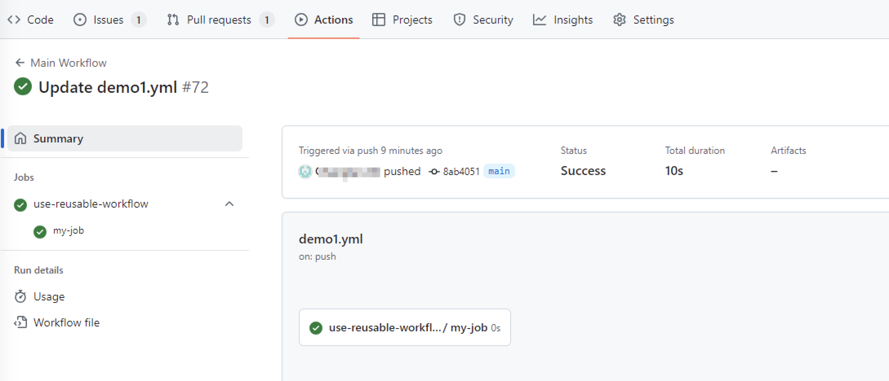

## 配置定时任务

Github毕竟是国外的产品，**这里的定时任务指定的时间和我们中国的时区是有时差的**。北京时间比Github所使用时区快8个小时。比如7月1号23点，github时间是7月1号15点。所以我们可以配置成15点或16点执行（对应北京时间的夜里11点、12点）。

github官方文档：https://docs.github.com/en/actions/writing-workflows/workflow-syntax-for-github-actions#onschedule You can use `on.schedule` to define a time schedule for your workflows. You can schedule a workflow to run at specific UTC times using [POSIX cron syntax](https://pubs.opengroup.org/onlinepubs/9699919799/utilities/crontab.html#tag_20_25_07). 

The shortest interval you can run scheduled workflows is once every 5 minutes.

This example triggers the workflow every day at 5:30 and 17:30 UTC:

```yaml
on:
  schedule:
    # * is a special character in YAML so you have to quote this string
    - cron:  '30 5,17 * * *'
```

cron的写法参考 https://pubs.opengroup.org/onlinepubs/9699919799/utilities/crontab.html#tag_20_25_07，格式为：

> In the POSIX locale, the user or application shall ensure that a crontab entry is a text file consisting of lines of six fields each. The fields shall be separated by <blank> characters. The first five fields shall be integer patterns that specify the following:
>
> 1. Minute [0,59]
> 2. Hour [0,23]
> 3. Day of the month [1,31]
> 4. Month of the year [1,12]
> 5. Day of the week ([0,6] with 0=Sunday)

我写的是这样写不知道为什么到了11:25（东八区时间）的时候没有触发

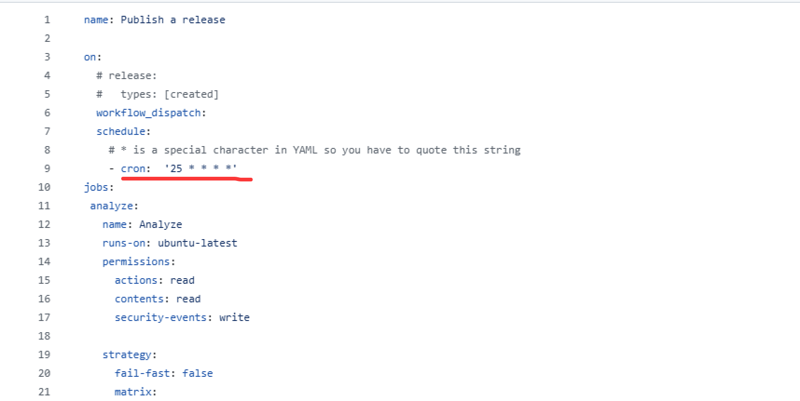

查询说：有时候，GitHub Actions 的定时触发器可能会有几分钟的延迟。如果你的工作流程没有在预期时间立即运行，建议再等待几分钟来观察是否会触发。

测试了一下，会运行的，我是这样写的：

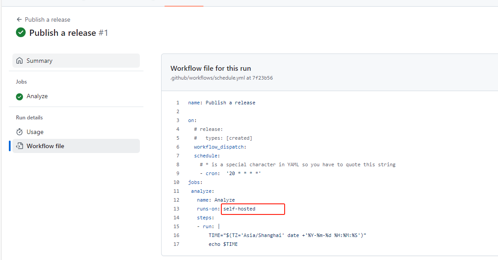

定义的是20分钟的时候触发，但是真正触发延迟了十几分钟，具体可以看下图的日志，延迟了13分钟：

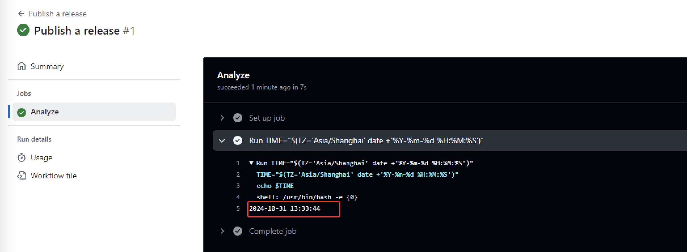

我测了下，有时候甚至延迟半小时任务才运行，不止13分钟了。

## workflow_dispatch 手动发布的时候传递参数

写法参考

```shell
# 手动选择分支，执行自动化发布 QA 测试环境的流程，使用分支为手动选择的分支
name: Manual Dev Release

on:
  workflow_dispatch:
   inputs:
     environment:
       description: 'Deployment environment' # TODO: 修改注释
       required: true
       default: 'dev'
       type: choice
       options:
         - dev  # admin
         - staging    # customer
         - production # both
jobs:
  Echo:
    runs-on: self-hosted
    steps:
     - name: Print environment
       run: echo  ${{ github.event.inputs.environment }}
  EchoOnlyDevOrStaging:
    if: ${{ github.event.inputs.environment == 'dev' || github.event.inputs.environment == 'staging' }}
    runs-on: self-hosted
    steps:
     - name: Print environment
       run: echo  ${{ github.event.inputs.environment }}
```

最终实现效果为：

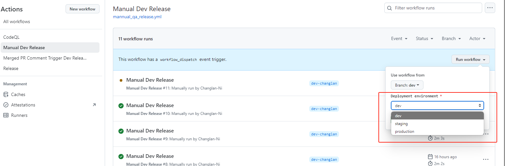


## job&step之间共享变量

```shell
name: "Only test"
on:
 push:
   branches: 
     - main 
 workflow_dispatch: # 手动选择分支触发
#  schedule:
#     - cron: '0 14 * * *' # 这是需要写UTC时间，实际上会在北京时间运行每天晚上10点开始调度运行

jobs:
  setter:
    runs-on: self-hosted
    outputs:
      new-key: ${{ steps.set-value.outputs.new-key }}
    steps:
      - id: set-value # 这个ID一定要指定，下面都是会用到它的
        name: Generate a value
        run: |
          value=$((RANDOM))
          echo "new-key=$value" >> "$GITHUB_OUTPUT"
      - id: read-value
        name: Read a value
        run: |
          echo "the secret number is ${{ steps.set-value.outputs.new-key }}" # 因为是在一个job里，所以用step，要指定step id
  getter:
    runs-on: self-hosted
    needs: setter
    steps:
      - name: Access it
        run: |
          echo "the secret number is ${{ needs.setter.outputs.new-key }}"
  getter222:
    runs-on: self-hosted
    needs: 
    - getter
    - setter # 可以写成两行
    steps:
      - name: Access it
        run: |
          echo "the secret number is ${{ needs.setter.outputs.new-key }}"

  getter333:
    runs-on: self-hosted
    needs: [getter222, setter] # 也可以这样写，注意一定要setter needed
    steps:
      - name: Access it
        run: |
          echo "the secret number is ${{ needs.setter.outputs.new-key }}"
```

运行显示效果：

（图上我的鼠标放在了getter222上，会直接显示它引用了setter）

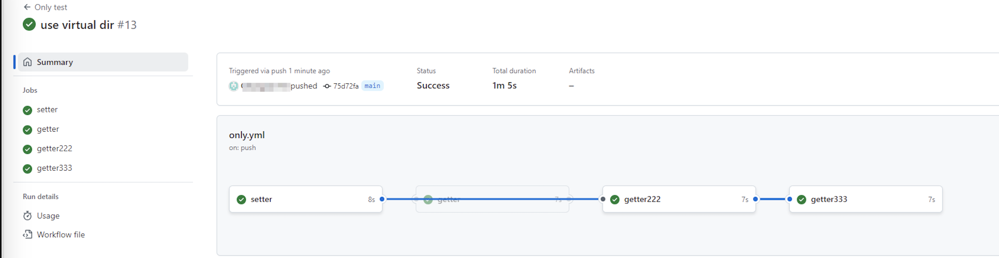

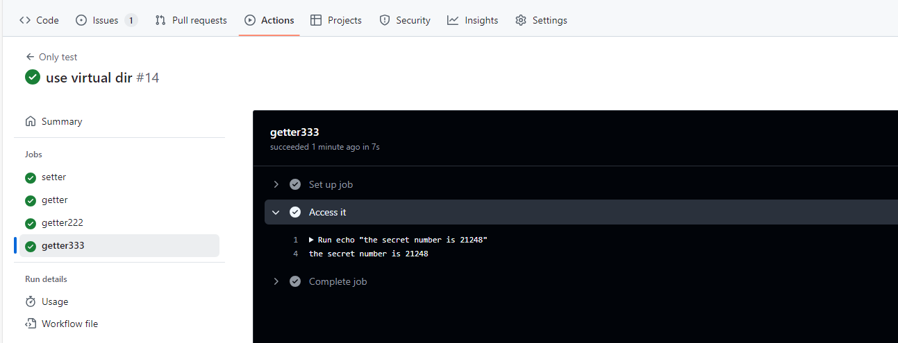

## add-mask的作用

可以让关键信息不在终端显示

没有mask的时候，显示结果为：

```yml
name: "Only test"
on:
 push:
   branches: 
     - main 
 workflow_dispatch: # 手动选择分支触发
#  schedule:
#     - cron: '0 14 * * *' # 这是需要写UTC时间，实际上会在北京时间运行每天晚上10点开始调度运行

jobs:
  setter:
    runs-on: self-hosted
    outputs:
      new-key: ${{ steps.set-value.outputs.new-key }}
    steps:
      - id: set-value # 这个ID一定要指定，下面都是会用到它的
        name: Generate a value
        run: |
          value=$((RANDOM))
          echo "new-key=$value" >> "$GITHUB_OUTPUT"
      # - id: read-value
      #   name: Read a value
      #   run: |
      #     p=${{ steps.set-value.outputs.new-key }}
      #     echo "::add-mask::$p"
      #     echo "the secret number is $p" # 因为是在一个job里，所以用step，要指定step id
  getter:
    runs-on: self-hosted
    needs: setter
    steps:
      - name: Access it
        run: |
          # echo "::add-mask::${{ needs.setter.outputs.new-key }}"
          echo "the secret number is ${{ needs.setter.outputs.new-key }}"
  getter222:
    runs-on: self-hosted
    needs: 
    - getter
    - setter # 可以写成两行
    steps:
      - name: Access it
        run: |
          # echo "::add-mask::${{ needs.setter.outputs.new-key }}"
          echo "the secret number is ${{ needs.setter.outputs.new-key }}"

  getter333:
    runs-on: self-hosted
    needs: [getter222, setter] # 也可以这样写，注意一定要setter needed
    steps:
      - name: Access it
        run: |
          # echo "::add-mask::${{ needs.setter.outputs.new-key }}"
          echo "the secret number is ${{ needs.setter.outputs.new-key }}"
```

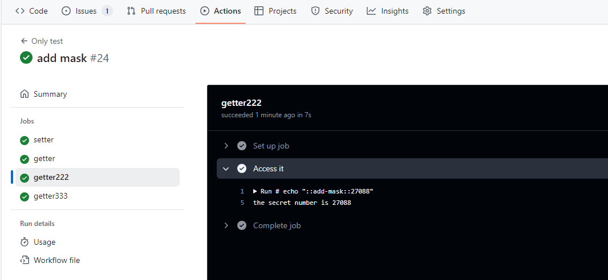

添加mask，

```shell
name: "Only test"
on:
 push:
   branches: 
     - main 
 workflow_dispatch: # 手动选择分支触发
#  schedule:
#     - cron: '0 14 * * *' # 这是需要写UTC时间，实际上会在北京时间运行每天晚上10点开始调度运行

jobs:
  setter:
    runs-on: self-hosted
    outputs:
      new-key: ${{ steps.set-value.outputs.new-key }}
    steps:
      - id: set-value # 这个ID一定要指定，下面都是会用到它的
        name: Generate a value
        run: |
          value=$((RANDOM))
          echo "new-key=$value" >> "$GITHUB_OUTPUT"
      # - id: read-value
      #   name: Read a value
      #   run: |
      #     p=${{ steps.set-value.outputs.new-key }}
      #     echo "::add-mask::$p"
      #     echo "the secret number is $p" # 因为是在一个job里，所以用step，要指定step id
  getter:
    runs-on: self-hosted
    needs: setter
    steps:
      - name: Access it
        run: |
          echo "::add-mask::${{ needs.setter.outputs.new-key }}"
          echo "the secret number is ${{ needs.setter.outputs.new-key }}"
  getter222:
    runs-on: self-hosted
    needs: 
    - getter
    - setter # 可以写成两行
    steps:
      - name: Access it
        run: |
          echo "::add-mask::${{ needs.setter.outputs.new-key }}"
          echo "the secret number is ${{ needs.setter.outputs.new-key }}"

  getter333:
    runs-on: self-hosted
    needs: [getter222, setter] # 也可以这样写，注意一定要setter needed
    steps:
      - name: Access it
        run: |
          echo "::add-mask::${{ needs.setter.outputs.new-key }}"
          echo "the secret number is ${{ needs.setter.outputs.new-key }}"
```

## 使用cache action

参考 https://dwye.dev/post/github-action-npm-cache/

对于前端项目，可以使用action存储node_modules，在package.json没有变化的时候，直接用存储好的node_modules然后build。当package.json变化了，再执行install然后build。github action的配置文件如下：

大部分都在4分钟内，写法参考如下

```yml
jobs:
  Build:
    runs-on: self-hosted
    steps:
      - name: Checkout repository
        uses: actions/checkout@v4
      - name: Cache Node Modules
        uses: actions/cache@v4
        with:
          path: node_modules
          # cache key 包含了所有我們希望固定的資訊：OS，node 版本，以及 package-lock.json 的檔案內容，使用 hashFiles 將檔案內容轉換成字串
          key: node-modules-${{ runner.os }}-${{ matrix.node-version }}-${{ hashFiles('package-lock.json') }}
      - name: Set up node
        uses: actions/setup-node@v4
        with:
          node-version: ${{ inputs.node_version }}
          check-latest: false # 确保使用预安装的版本
      - name: Install Packages
        run: test -d node_modules && echo "node_modules exists" || npm install --legacy-peer-deps
      - name: Build
        shell: bash
        run: |
          echo "The current node version is $(node -v)"
          npm run build:${{ inputs.env }}
```

但是实际运行的时候发现每次加载上一次运行时的缓存内容都要2分钟左右：

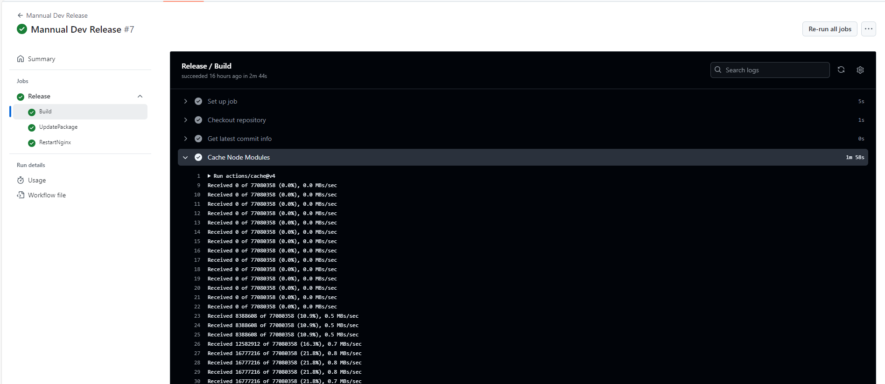

## 不让set-up node插件缓存

基于上一条，然后我想着不要使用cache存node_modules，直接install，修改后如下：

```shell
jobs:
  Build:
    runs-on: self-hosted
    steps:
      - name: Checkout repository
        uses: actions/checkout@v4
      - name: Set up node
        uses: actions/setup-node@v4
        with:
          node-version: ${{ inputs.node_version }}
          # cache: 'npm'
      - name: Build
        shell: bash
        run: |
          echo "The current node version is $(node -v)"
          # [ -d "node_modules" ] && rm -rf "node_modules"
          ls -a
          npm install --legacy-peer-deps
          npm run build:${{ inputs.env }}
```

这次只要两分钟

主要修改就是如下：

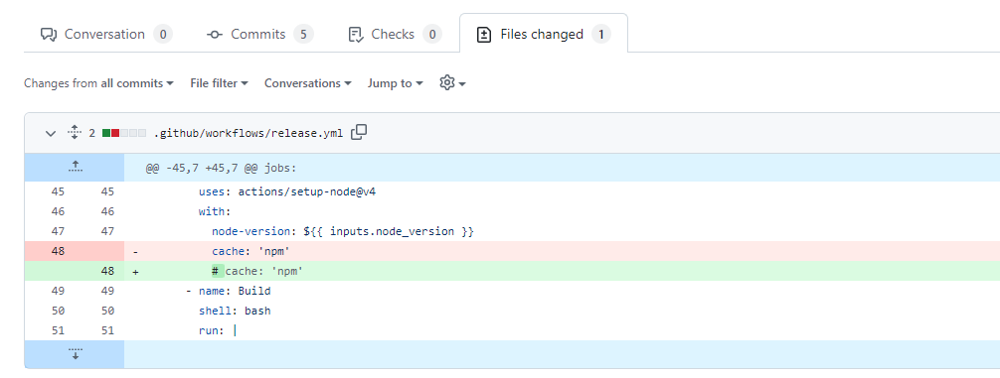

修改完了主要的变更就是：

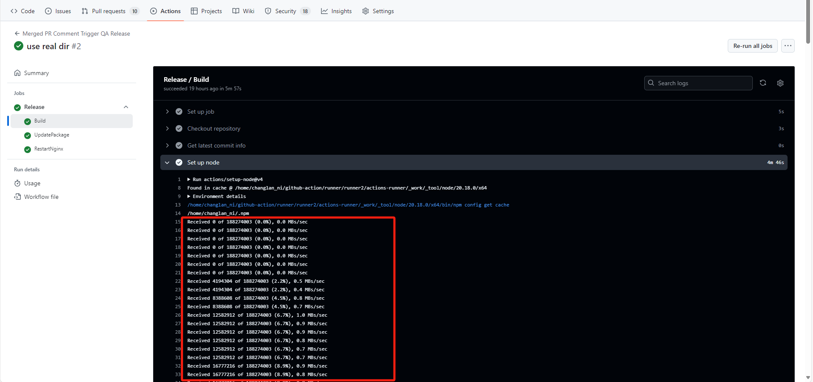

之前的效果是图上，修改完了红色的这个部分没有了。

之前红色的这个部分特别耗时。

所以# cache: 'npm'这个注释掉可以让set-up node这个插件不再每次加载npm的缓存，加载npm缓存真的很费事，居然要5分钟左右，直接npm install不缓存node_modules居然更快

总结：**加载缓存真的很耗时，虽然这个缓存文件就在runner服务器上，加载缓存有点类似解压文件，但是比解压文件慢多了。所有有时候不使用缓存直接下载是比使用缓存更快的。**

## 用户评论触发workflow

有什么方法可以实现用户触发某个规则（比如在PR下评论）后才启动workflow？

在GitHub Actions中，可以通过使用GitHub的Webhooks和特定的事件触发器来实现这一目标。具体来说，可以利用`issue_comment`事件来检测PR下的评论，然后根据评论内容决定是否启动特定的workflow。

以下是一个示例工作流程，展示了如何在PR下的评论触发特定的workflow：

1. 创建一个GitHub Actions workflow文件（例如：`.github/workflows/pr-comment-trigger.yml`）。

```yaml
name: PR Comment Trigger

on:
 issue_comment:
   types: [created]

jobs:
 check-comment:
   runs-on: ubuntu-latest
   steps:
     - name: Check if comment contains trigger phrase
       if: github.event.comment.body == 'run workflow'
       run: |
         echo "Trigger phrase detected, starting workflow..."
         # 在这里可以添加希望执行的命令或调用另一个工作流程
     - name: Comment does not contain trigger phrase
       if: github.event.comment.body != 'run workflow'
       run: echo "No trigger phrase detected, skipping workflow."
```

在这个示例中，workflow会在任何issue或pull request的评论创建时触发。`check-comment` job会检查评论内容是否包含特定的触发短语（如`run workflow`）。如果评论包含该短语，则会执行指定的命令或进一步的工作流程。

1. 将这个workflow文件添加到你的GitHub仓库中，并推送到你的远程仓库。
2. 在一个PR下添加评论，内容为`run workflow`，以触发该workflow。

通过这种方式，你可以根据特定的评论内容来控制workflow的启动。你也可以根据需要修改触发短语和执行的命令，以满足你的特定

那么在已经close的PR下评论会触发吗

在GitHub中，即使一个Pull Request（PR）已经关闭，评论事件仍然可以触发GitHub Actions工作流程。`issue_comment`事件会在任何新的评论被添加到issue或PR时触发，不论该issue或PR是否处于打开（open）状态。

这意味着可以在一个已经关闭的PR下添加评论，并且如果该评论符合触发条件，相关的workflow仍然会被启动。

以下是一个示例工作流程，展示了如何在PR下的评论触发特定的workflow，即便PR已经关闭：

```yaml
name: PR Comment Trigger

on:
 issue_comment:
   types: [created]

jobs:
 check-comment:
   runs-on: ubuntu-latest
   steps:
     - name: Check if comment contains trigger phrase
       if: github.event.comment.body == 'run workflow'
       run: |
         echo "Trigger phrase detected, starting workflow..."
         # 在这里可以添加希望执行的命令或调用另一个工作流程
     - name: Comment does not contain trigger phrase
       if: github.event.comment.body != 'run workflow'
       run: echo "No trigger phrase detected, skipping workflow."
```

这个workflow会在任何新的评论被添加到issue或PR时触发，不论该issue或PR是否处于关闭状态。如果评论内容包含特定的触发短语（如`run workflow`），则会执行指定的命令或进一步的工作流程。

总结来说，即使PR已经关闭，在其下的评论仍然可以触发相应的GitHub Actions工作流程。

