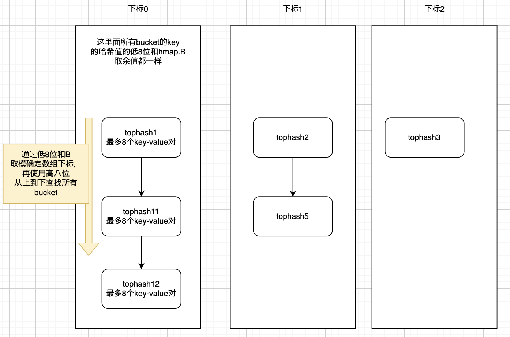

## slice

这是slice的底层数据结构定义，比较重要的字段包括：指向底层数组的指针、slice的长度即len字段，slice所指向的底层数组的长度即cap字段，表示slice的容量。

```go
type slice struct {
	array unsafe.Pointer
	len int
	cap int
}
```

### 创建

#### make

使用make函数，比如：

```go
s:=make([]int, 1)
```

该slice的len为1，cap为1。

可以在make数组的基础上新增一个参数，例如：

```go
s:=make([]int, 1, 10)
```

该slice的len为1，cap为10。

注意slice取下标只能以len为基础，不能以cap为基础，比如下面的代码就会报越界的错误：

```
	slice := make([]int, 0, 1)
	slice[0] = 1 // panic: runtime error: index out of range [0] with length 0
	fmt.Println(slice) // 
```

虽然len为0，但是可以append：

```
	slice := make([]int, 0, 1)
	slice = append(slice, 1)
	fmt.Println(len(slice), cap(slice)) // 1 1
```

#### 根据数组创建

从数组拷贝：

```go
	array := [5]int{10, 20, 30, 40, 50} // array是一个数组
	slice := make([]int, 3) // 创建一个slice
	copy(slice, array[1:4]) // 将数组的部分元素复制到切片
```

或者从数组创建切片，共用数组的底层空间：

```go
	array := [5]int{10, 20, 30, 40, 50} // array是一个数组

	slice1 := array[1:4] // 包含索引1到3的元素
	fmt.Println(slice1)  // 输出 [20, 30, 40]
	slice1[0] = 99
	fmt.Println(slice1) // 输出 [99 30 40]
	fmt.Println(array)  // 输出 [10 99 30 40 50]
```

### 扩容

向slice追加元素时，如果slice的容量不够，那么会触发slice的扩容操作（会分配一块更大的内存）：

原Slice容量小于1024， 新Slice容量将扩大为原来的2倍；
原Slice容量大于等于1024， 新Slice容量将扩大为原来的1.25倍；

### copy

copy拷贝的数量是两个slice长度的较小值。所以copy不会扩容，sppend才会扩容。比如如下的示例代码：

```go
func main() {
	// nums := []int{2, 3, 1, 1, 4}
	// fmt.Println(minSubArrayLen(7, []int{2, 3, 1, 2, 4, 3})) // 输出: 3
	slice := make([]int, 2, 3)
	slice[0] = 10
	slice = append(slice, 1) // 此时slice为 [10, 0, 1]
	slice = append(slice, 2) // 此时slice为 [10, 0, 1, 1]
	new := make([]int, 1, 3)
	copy(new, slice)
	fmt.Println(new, len(new)) // [0] 1
}
```

### append

append是向slice的len之后继续追加，比如

```go
slice := make([]int, 2, 3) // 此时slice是[0, 0]
slice = append(slice, 1)  // 此时slice是[0, 0, 1]
slice[0] = 10 // 此时slice是[10, 0, 1]
```

### 函数传递

当函数的参数是一个切片类型的值时，如果在函数内部修改切片的值，会影响到原始切片的值。因为实际上是传递了切片的引用，而不是切片的副本，并且切片本质上还是一个对底层数组的引用。

## channel

channel的底层数据结构定义为：

```go
type hchan struct {
	qcount uint
	dataqsiz uint
	buf unsafe.Pointer // 环形队列指针
	elemsize uint16 // 环形队列大小
	closed uint32
	elemtype *_type // 指向 dataqsiz 元素数组
	sendx uint // 标记了环形队列读指针的位置
	recvx uint // 标记了环形队写读指针的位置
	recvq waitq  // 等待读取channel的可能是多个的goroutine组成的队列
	sendq waitq // 等待写channel的可能是多个的goroutine组成的队列
 
	lock mutex
}
```

主要就是一个环形队列指针，队列读写位置，队列读写goroutine的读取队列和接收队列。

一般实现环形队列会用数组或者链表，链表也可能不会将头尾直接链接起来，不然就真的变成一个圈了，而是会在链表的尾部节点做特殊处理。不管用数组还是链表实现，都会维护两个指针，即指向有效数据的头尾指针**。golang的channel底层的环形链表用的是数组实现的。**

### 写channel

写操作比较关键的就是接收队列了，还有缓冲区。

接收队列为空，缓冲区有位置，将数据写入缓冲区。

接收队列为空，缓冲区没有位置，将当前写数据的goroutine加入recvq，表示这个goroutine被阻塞了，要等待被唤醒。

接收队列不空，则表示接收队列的goroutine被阻塞了，为什么被阻塞，因为没有接收到数据，表明当前缓冲区为空或者根本没有缓冲区，则此时将接收队列的一个goroutine唤醒，把要写入的数据传递给这个goroutine。

### 读channel

读操作比较关键的就是写队列了，还有缓冲区。

写队列为空，直接从缓冲区读取数据。

写队列不为空，缓冲区为空，表示没有压根没有缓冲区，此时唤醒写队列的某个goroutine接收其要写的数据。

写队列不为空，缓冲区不为空，表示缓冲区满了，从缓冲区读取最早写入的数据，然后唤醒写队列的某个goroutine，让这个goroutine把数据写到缓冲区，当然写的这个数据必然是最新的，在队列的最后面（缓冲区的队列不会环形队列）。

### 关闭channel

对于recvq的所有goroutine，这些goroutine都是被阻塞的，让这些goroutine直接返回，也不会让它们把数据写到缓冲区。


## map

总结起来，golang的map数据类型底层使用的是哈希表来实现的，当哈希冲突时，使用链地址法来解决冲突。

> 哈希操作简介：对于一个key，使用哈希函数f计算f(key)，得到一个值。**如果多个key被哈希到同一个bucket里，那么就产生哈希冲突了。**可以用链地址法解决。
>
> 解决哈希冲突除了链地址法，还有再次哈希法，创建一个公共缓冲区等方法。
>
> golang官方使用了什么哈希函数，具体的函数逻辑没有公开。且golang对于不同类型的key使用了不同的哈希函数。

底层结构为：

```go
type hmap struct {
	count int // 当前保存的元素个数
	B uint8 // 指示bucket数组的大小
	buckets unsafe.Pointer // bucket数组指针， 数组大小为2^B
  hash0     uint32 // 哈希种子，让哈希函数计算的结果有了随机性
	...
}
```

bucket底层数据结构为：

```go
type bmap struct {
	tophash [8]uint8 //存储哈希值的高8位
	data byte[1] // 占位符，类似一个指针，其具体的存储数据可能是变化的。这里存储了 /key value数据:key/key/key/.../value/value/value...，最多可存8个key-value对
	overflow *bmap //溢出bucket的地址，就是当该bucket存储的key-value对超出8个以外的key-value对会放在这里存储
  // 这是一个新的bmap类型，父bmap指向了子bmap，实现了链表的功能
}
```

### 查找操作

- 对于一个key，通过哈希函数计算出哈希值
- 将哈希值的低8位和hmap.B取模，得到一个整数，得到buckets unsafe.Pointer所指向数组的下标
- 直接buckets unsafe.Pointer所指向数组的下标
- 将哈希值的低8位和bmap的tophash比较，如果相等，则去data byte[1]所指向的key-value键值对查找输入key对应的value
- 如果上述比较操作不相等，则去bmap.overflow的bmap数据结构继续将该哈希值的高8位和其进行比较，如果最后bmap.overflow为空，则表示没有找到

### 写入操作

- 对于一个key，通过哈希函数计算出哈希值
- 将哈希值的低8位和hmap.B取模，得到一个整数，得到buckets unsafe.Pointer所指向数组的下标
- 直接buckets unsafe.Pointer所指向数组的下标
- 如果数组该下标的元素为空，则新建。如果不为空，则找到key对应的value将value更新

### 结构图

map底层的结构可参考如下图：



