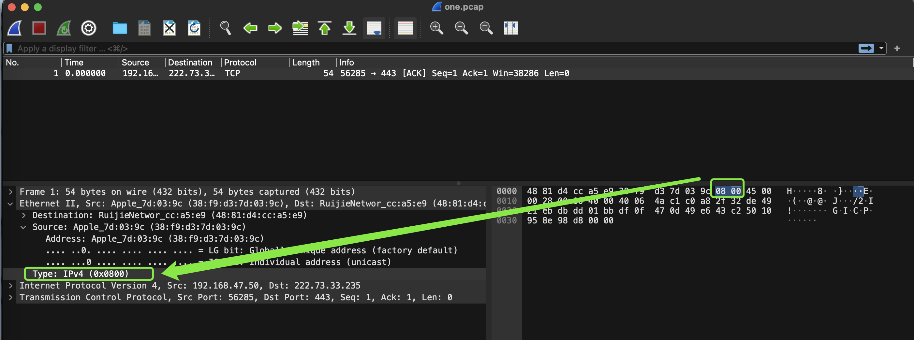
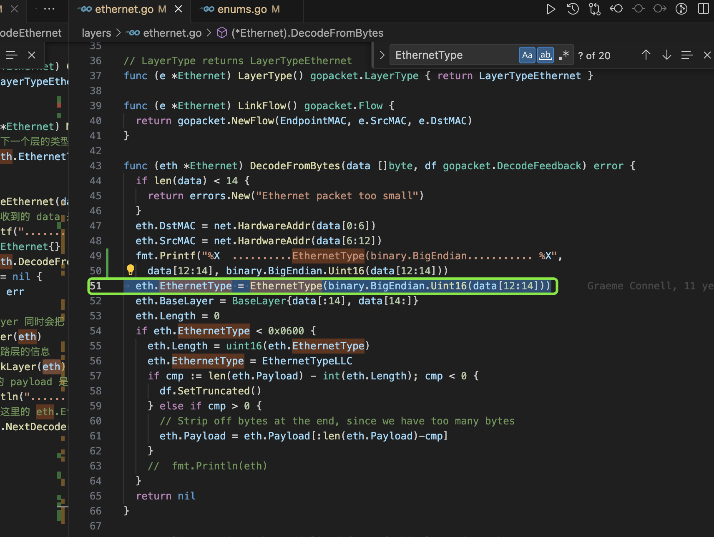
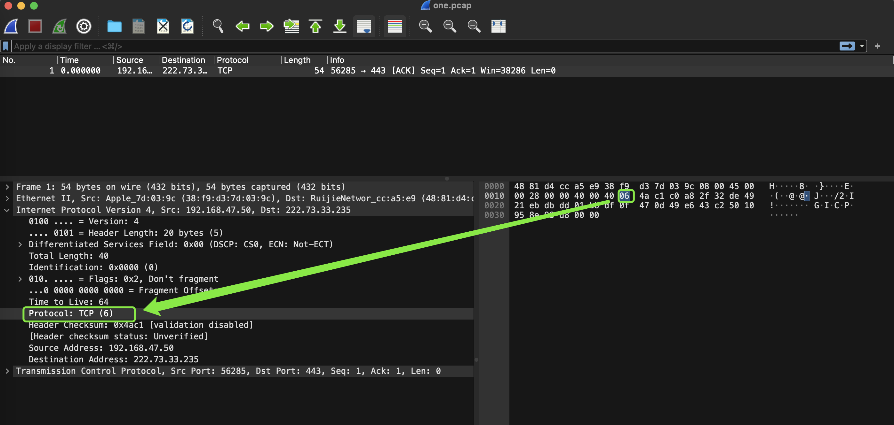
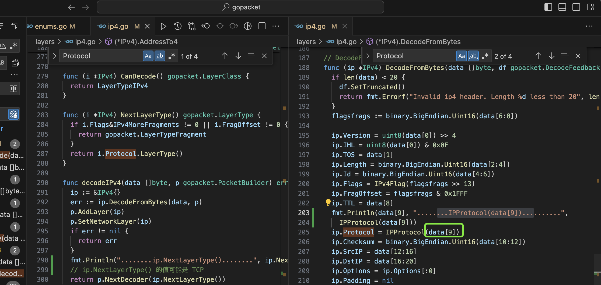
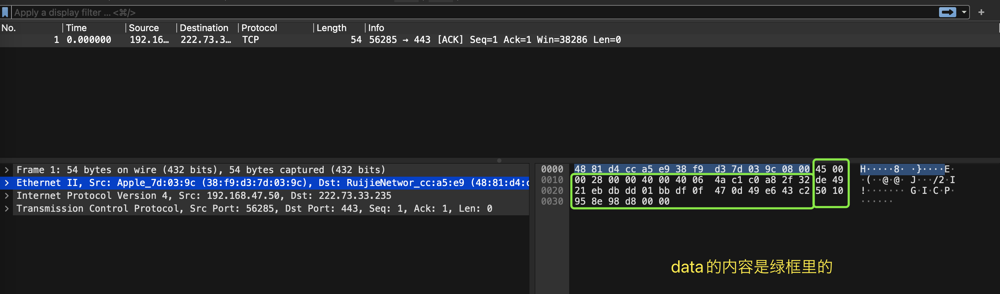
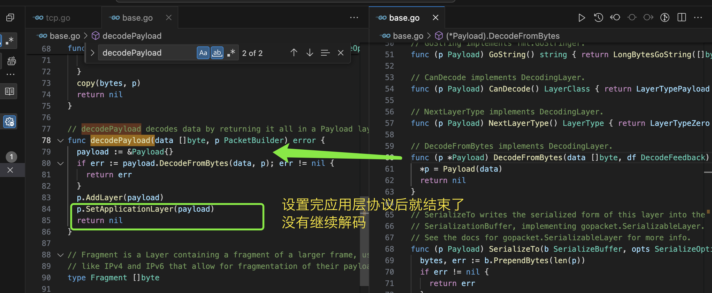
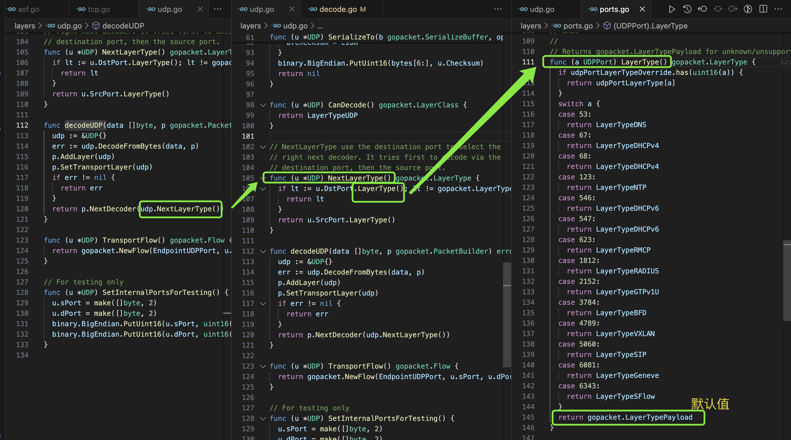

gopacket是用Golang开发的、Google出品的一个`PF_RING`和`AF_PACKET`和基于C语言的libpcap的网络数据包抓取和分析包。

> 不同的选项会使用不同的底层，比如大部分时候是基于libpcap的，有时候是基于PF_RING的，有时候是基于AF_PACKET的。具体是基于什么的主要取决于代码是怎么写的。
>
> PF_RING和AF_PACKET都是网络套接字，

> libpcap是C语言写的一个库，但是libpcap并不像前两者一样是套接字（socket）API的一部分。在linux系统或者IRIX系统，libpcap是基于套接字API实现的，比如Linux系统上是基于PF_PACKET套接字实现的。在`*BSD`, OS X, AIX, 和Solaris 11和之后的系统，是基于 BPF套接字实现的。在Solaris的早期版本和HP-UX系统，是基于STREAMS+DLPI。但是在`UN*Xes`系统中，因为系统没有提供用于包捕获的套接字，所以libpcap是通过其他机制实现的。
>
> 在windows上 Winpcap做的事情和libpcap一样。
>
> 原始socket是操作系统提供的API，可以由调用者自定义包的header，比如包的TCP header和IP header等等，然后发送包。

通常最经常使用的是gopacket基于libpcap的抓包功能。下面也基于此介绍。因为是基于libpcap，故gopacket使用到了C代码，编译时需要开启CGO。libpcap是一个网络数据包捕获框架，应用极其广泛，tcpdump、wireshark都是基于libpcap的。

因为在使用gopacket的过程中对其在libpcap的基础上做了哪些额外的功能和功能的实现比较好奇，故阅读了gopacket的源代码。其实也没有把源代码完全读完，只读了我自己比较感兴趣的部分，日后有时间可能会把其他部分都读完，读完了继续补充到本文。

我阅读的部分主要是数据包抓取部分，数据包解码部分。还有一些这两部分之外的包，不过阅读得比较浅显没怎么看懂。下面介绍我读取的部分的内容。

## 数据包抓取

调用gopacket的代码一般类似如下的示例代码：

```go
func main() {
  device := "en0"
	handle, err := pcap.OpenLive(device, snaplen, promiscuous, -1*time.Second)
	if err != nil {
		return
	}
	defer handle.Close()
	packetSource := gopacket.NewPacketSource(handle, handle.LinkType())
	for packet := range packetSource.Packets() {
    // do something
  }
}
```

可以看到每个数据包是通过packetSource.Packets()函数获取的，查看该函数及该函数调用的其他函数的实现：

```go
func (p *PacketSource) Packets() chan Packet {
	if p.c == nil {
    // channel 的大小在gopacket代码里被写死了，是固定的1000
		p.c = make(chan Packet, 1000)
		go p.packetsToChannel()
	}
	return p.c
}

func (p *PacketSource) packetsToChannel() {
	defer close(p.c)
	for {
		packet, err := p.NextPacket()
		if err == nil {
			p.c <- packet
			continue
		}

		// Immediately retry for temporary network errors
		if nerr, ok := err.(net.Error); ok && nerr.Temporary() {
			continue
		}

		// Immediately retry for EAGAIN
		if err == syscall.EAGAIN {
			continue
		}

		// Immediately break for known unrecoverable errors
		if err == io.EOF || err == io.ErrUnexpectedEOF ||
			err == io.ErrNoProgress || err == io.ErrClosedPipe || err == io.ErrShortBuffer ||
			err == syscall.EBADF ||
			strings.Contains(err.Error(), "use of closed file") {
			break
		}

		// Sleep briefly and try again
		time.Sleep(time.Millisecond * time.Duration(5))
	}
}

func (p *PacketSource) NextPacket() (Packet, error) {
	// ReadPacketData 返回从 pcap 句柄读取的下一个数据包，
	// 以及与该数据包关联的错误代码。 如果数据包读取成功，则返回错误为零。
	data, ci, err := p.source.ReadPacketData()
	if err != nil {
		return nil, err
	}
	// p.DecodeOptions 是在这个地方使用的
  // NewPacket 里进行的主要是数据包的解码操作，除了在Decode选项的Lazy值为true时不会做解码操作
	packet := NewPacket(data, p.decoder, p.DecodeOptions)
	m := packet.Metadata()
	m.CaptureInfo = ci
	// 如果捕获的长度小于实际传输的长度，那么表示被截断了，是不是gopacket的 snapshot_len 参数会对是否被截断有影响
	m.Truncated = m.Truncated || ci.CaptureLength < ci.Length
	return packet, nil
}
```

这里比较重要的部分就是p.source.ReadPacketData()的实现，跳转过去后发现其定义是一个interface

```go
type PacketDataSource interface {
	// ReadPacketData returns the next packet available from this data source.
	// It returns:
	//  data:  The bytes of an individual packet.
	//  ci:  Metadata about the capture
	//  err:  An error encountered while reading packet data.  If err != nil,
	//    then data/ci will be ignored.
	ReadPacketData() (data []byte, ci CaptureInfo, err error)
}
```

那么对于最开始的示例代码，代码执行时是如何实现这个interface的呢？那么需要定位到p.source的具体的值是什么。首先往上一行，查看`packetSource := gopacket.NewPacketSource(handle, handle.LinkType())`的NewPacketSource函数的实现：

```go
func NewPacketSource(source PacketDataSource, decoder Decoder) *PacketSource {
	return &PacketSource{
		source:  source,
		decoder: decoder,
	}
}
```

这个函数很简单，无法定位到p.source的值具体是什么。

再查看上一行代码`handle, err := pcap.OpenLive(device, snaplen, promiscuous, -1*time.Second)`的实现：

```go
func OpenLive(device string, snaplen int32, promisc bool, timeout time.Duration) (handle *Handle, _ error) {
	var pro int
	if promisc {
		pro = 1
	}

	p, err := pcapOpenLive(device, int(snaplen), pro, timeoutMillis(timeout))
	if err != nil {
		return nil, err
	}
	p.timeout = timeout
	p.device = device

	ifc, err := net.InterfaceByName(device)
	if err != nil {
		// The device wasn't found in the OS, but could be "any"
		// Set index to 0
		p.deviceIndex = 0
	} else {
		p.deviceIndex = ifc.Index
	}

	p.nanoSecsFactor = 1000 // 直接翻译为纳秒因子

	// Only set the PCAP handle into non-blocking mode if we have a timeout
	// greater than zero. If the user wants to block forever, we'll let libpcap
	// handle that.
	// 仅当超时大于零时，才将 PCAP 句柄设置为非阻塞模式。 如果用户想要永远阻塞，我们会让 libpcap 来处理。
	if p.timeout > 0 {
		if err := p.setNonBlocking(); err != nil {
			p.pcapClose()
			return nil, err
		}
	}

	return p, nil
}

func pcapOpenLive(device string, snaplen int, pro int, timeout int) (*Handle, error) {
	buf := (*C.char)(C.calloc(errorBufferSize, 1)) // C.calloc 分配内存
	defer C.free(unsafe.Pointer(buf))              // C.free 释放内存

	dev := C.CString(device)
	// 释放变量 dev 的内存
	defer C.free(unsafe.Pointer(dev))

	cptr := C.pcap_open_live(dev, C.int(snaplen), C.int(pro), C.int(timeout), buf)
	// cptr 是一个指针
	// 将这个指针存储在 cptr 变量中意味着你可以通过 cptr 来访问被打开的实时捕获会话的相关信息和函数。
	// 这种方式允许你在 Go 代码中使用 C 代码中定义的结构和函数，这在需要与 C 语言库进行交互的情况下非常有用。
	// 在后续读取数据包时，通常不会涉及到复制操作，因为 cptr 是指向 pcap_t 结构的指针，而不是结构本身。
	if cptr == nil {
		return nil, errors.New(C.GoString(buf))
	}
	return &Handle{cptr: cptr}, nil
}
```

可以看出，在打开网卡的时候就已经调用了很多的C的代码。最终返回的是Handle struct类型的值。所以示例代码中的，上面需要定位的实现了PacketDataSource interface必然是Handle struct，查看其实现：

```go
// 如果包已经被成功读取了，那么错误为空
func (p *Handle) ReadPacketData() (data []byte, ci gopacket.CaptureInfo, err error) {
	p.mu.Lock()
	err = p.getNextBufPtrLocked(&ci)
	if err == nil {
		data = make([]byte, ci.CaptureLength)
		// 使用 unsafe.Pointer 将 p.bufptr 的指针转换为 unsafe.Pointer 类型的指针，
		// 然后再将其转换为指向一个长度为 2^30 (即 1GB) 字节的数组的指针 (*[1 << 30]byte)。
		// 接着，使用切片操作 [:]，将整个数组转换为切片

		// 这一行代码的作用是将 p.bufptr 指向的内存数据复制到 data 切片中，以便后续对数据进行处理和分析。
		// 最终，data 切片中将包含 p.bufptr 指向的内容
		// 原来是直接读取内存的指针，复制的数据包的内容
		copy(data, (*(*[1 << 30]byte)(unsafe.Pointer(p.bufptr)))[:])
	}
	p.mu.Unlock()
	if err == NextErrorTimeoutExpired {
		// runtime.Gosched() 的作用是手动触发 Go 调度器的一次调度
		// 调用 runtime.Gosched() 时，它会主动让出 CPU，让其他就绪状态的 goroutine 有机会执行。
		// 当读取数据包时发生了超时，即等待数据包超时时，当前的 goroutine 会调用 runtime.Gosched() 主动让出 CPU。

		// 数据包超时是指在一定时间内没有从网络接口中成功读取到数据包
		// 在一定时间内没有成功读取到数据包即视为超时。例如，设置超时时间为 1 秒，表示如果在 1 秒内没有读取到数据包，就认为发生了超时。
		runtime.Gosched()
	}
	return
}


func (p *Handle) getNextBufPtrLocked(ci *gopacket.CaptureInfo) error {
	if !p.isOpen() {
		return io.EOF
	}

	// set after we have call waitForPacket for the first time
	var waited bool

	// stop 为 0 表示没有停止，使用原子读取
	// 只要 stop 为 0 的时候就循环执行
	for atomic.LoadUint64(&p.stop) == 0 {
		// try to read a packet if one is immediately available
		// pcapNextPacketEx 尝试从底层的 libpcap 读取数据包
		result := p.pcapNextPacketEx()

		switch result {
		case NextErrorOk:
			// 获取数据包的时间戳中的秒数部分，并将其赋值给 sec 变量。
			sec := p.pkthdr.getSec()
			// p.pkthdr.getUsec() 方法获取数据包的时间戳中的微秒数部分
			// convert micros to nanos
			// 将毫秒转换为纳秒
			nanos := int64(p.pkthdr.getUsec()) * p.nanoSecsFactor

			// 使用 time.Unix 方法将秒数部分和纳秒数部分组合成一个时间戳
			ci.Timestamp = time.Unix(sec, nanos)
			// p.pkthdr.getCaplen() 方法获取数据包的捕获长度（即实际捕获到的数据包长度）
			ci.CaptureLength = p.pkthdr.getCaplen()
			// 调用 p.pkthdr.getLen() 方法获取数据包的长度（即数据包的原始长度）

			// 捕获长度和原始长度的区别在于捕获长度是实际被网络接口捕获到的数据包的长度，
			// 可能会小于或等于数据包的原始长度，而原始长度是数据包在网络上传输时的完整长度。
			ci.Length = p.pkthdr.getLen()
			ci.InterfaceIndex = p.deviceIndex

			return nil
		case NextErrorNoMorePackets:
			// 没有更多的数据包可读了
			// no more packets, return EOF rather than libpcap-specific error
			return io.EOF
		case NextErrorTimeoutExpired:
			// we've already waited for a packet and we're supposed to time out
			//
			// we should never actually hit this if we were passed BlockForever
			// since we should block on C.pcap_next_ex until there's a packet
			// to read.
			if waited && p.timeout > 0 {
				return result
			}

			// wait for packet before trying again
			p.waitForPacket()
			waited = true
		default:
			return result
		}
	}

	// stop must be set
	return io.EOF
}


// 其他补充：golang 一般会在栈上分配内存，因为栈上内存的分配和回收更快
func (p *Handle) pcapNextPacketEx() NextError {
	// This horrible magic allows us to pass a ptr-to-ptr to pcap_next_ex
	// without causing that ptr-to-ptr to itself be allocated on the heap.
	// Since Handle itself survives through the duration of the pcap_next_ex
	// call, this should be perfectly safe for GC stuff, etc.
	// 强制类型转换
	// pcap_next_ex 是 libpcap 的从网络接口中读取下一个数据包的函数
	// 由于 pcap_next_ex 函数的参数需要传递指向指针的指针，
	// 为了避免在堆上分配内存，这段代码使用了一种技巧来传递指针的地址而不会分配额外的内存。
	return NextError(C.pcap_next_ex_escaping(
		// p.cptr 是 Handle 结构中的一个指向 pcap_t 结构的指针
		p.cptr,
		// 使用unsafe.Pointer 先转换为 unsafe.Pointer 类型，
		// 然后使用 uintptr 将这些指针转换为整数。
		// C.uintptr_t 将整数转换为 C 语言中的 uintptr_t 类型。

		// 通常情况下，pcap_next_ex 函数会修改传入参数所指向的内存，
		// 以填充数据包的信息。因此，p.pkthdr 和 p.bufptr 可能会被修改为新的值，
		// 以包含从网络接口中读取到的数据包的信息。
		C.uintptr_t(uintptr(unsafe.Pointer(&p.pkthdr))),
		C.uintptr_t(uintptr(unsafe.Pointer(&p.bufptr)))))
}
```

一路照下来，最核心的就是pcapNextPacketEx函数，这个函数的功能就是读取下一个数据包，但是本质上还是调用C的函数。

**所以gopacket的数据包抓取是通过对C的代码的调用实现的，且实现过程中使用了指针没有涉及到内存分配，已经是比较优秀的处理方法了。**

## 数据包解码

如果把“数据包抓取”部分读完，就会知道数据包解码部分是在下面源代码里的NewPacket函数中做的（除了Lazy为true时）：

```go
func (p *PacketSource) NextPacket() (Packet, error) {
	// ReadPacketData 返回从 pcap 句柄读取的下一个数据包，
	// 以及与该数据包关联的错误代码。 如果数据包读取成功，则返回错误为零。
	data, ci, err := p.source.ReadPacketData()
	if err != nil {
		return nil, err
	}
	// p.DecodeOptions 是在这个地方使用的
  // NewPacket 里进行的主要是数据包的解码操作，除了在Decode选项的Lazy值为true时不会做解码操作
	packet := NewPacket(data, p.decoder, p.DecodeOptions)
	m := packet.Metadata()
	m.CaptureInfo = ci
	// 如果捕获的长度小于实际传输的长度，那么表示被截断了，是不是gopacket的 snapshot_len 参数会对是否被截断有影响
	m.Truncated = m.Truncated || ci.CaptureLength < ci.Length
	return packet, nil
}
```

下面介绍NewPacket的实现，和gopacket解码的实现。

```go
func NewPacket(data []byte, firstLayerDecoder Decoder, options DecodeOptions) Packet {
	// NoCopy 表示是否直接操作数据包的原始数据，操作原始数据可能会影响原始包
	if !options.NoCopy {
		dataCopy := make([]byte, len(data))
		copy(dataCopy, data)
		data = dataCopy
	}
	if options.Lazy {
		p := &lazyPacket{
			packet: packet{data: data, decodeOptions: options},
			next:   firstLayerDecoder,
		}
		p.layers = p.initialLayers[:0]
		// Crazy craziness:
		// If the following return statemet is REMOVED, and Lazy is FALSE, then
		// eager packet processing becomes 17% FASTER.  No, there is no logical
		// explanation for this.  However, it's such a hacky micro-optimization that
		// we really can't rely on it.  It appears to have to do with the size the
		// compiler guesses for this function's stack space, since one symptom is
		// that with the return statement in place, we more than double calls to
		// runtime.morestack/runtime.lessstack.  We'll hope the compiler gets better
		// over time and we get this optimization for free.  Until then, we'll have
		// to live with slower packet processing.
		// 设置为 lazy 则直接返回
		return p
	}
	p := &eagerPacket{
		packet: packet{data: data, decodeOptions: options},
	}
	// layers 置为空
	p.layers = p.initialLayers[:0]
	p.initialDecode(firstLayerDecoder)
	return p
}
```

返回值Packet时一个interface，eagerPacket struct和lazyPacket struct都实现了该interface。这里只介绍Lazy为false的情况，Lazy为true时gopacket的处理比较巧妙，下文会在“解码数据包时的一些选项的作用”详细介绍Lazy为true的情况。

Lazy为false时，会执行到p.initialDecode(firstLayerDecoder)，这也是最关键的调用：

```go
func (p *eagerPacket) initialDecode(dec Decoder) {
	defer p.recoverDecodeError()
	// p 即 eagerPacket 实现了 gopacket.PacketBuilder interface
	err := dec.Decode(p.data, p)
	if err != nil {
		p.addFinalDecodeError(err, nil)
	}
}
```

Decode跳转过去是一个interface：

```go
type Decoder interface {
	// Decode decodes the bytes of a packet, sending decoded values and other
	// information to PacketBuilder, and returning an error if unsuccessful.  See
	// the PacketBuilder documentation for more details.
	Decode([]byte, PacketBuilder) error
}
```

实现了该interface的是gopacket中所有定义的协议，下面以数据链路层PPP协议的实现为例：

```go
// Decoder calls PPPTypeMetadata.DecodeWith's decoder.
func (a PPPType) Decode(data []byte, p gopacket.PacketBuilder) error {
	return PPPTypeMetadata[a].DecodeWith.Decode(data, p)
}
```

PPPTypeMetadata的定义为[65536]EnumMetadata，调用`Decode(data, p)`最终执行的是PPP协议实现的如下函数：

```go
func decodePPP(data []byte, p gopacket.PacketBuilder) error {
	ppp := &PPP{}
	offset := 0
	if data[0] == 0xff && data[1] == 0x03 {
		offset = 2
		ppp.HasPPTPHeader = true
	}
	if data[offset]&0x1 == 0 {
		if data[offset+1]&0x1 == 0 {
			return errors.New("PPP has invalid type")
		}
		ppp.PPPType = PPPType(binary.BigEndian.Uint16(data[offset : offset+2]))
		ppp.Contents = data[offset : offset+2]
		ppp.Payload = data[offset+2:]
	} else {
		ppp.PPPType = PPPType(data[offset])
		ppp.Contents = data[offset : offset+1]
		ppp.Payload = data[offset+1:]
	}
	p.AddLayer(ppp)
	p.SetLinkLayer(ppp)
	return p.NextDecoder(ppp.PPPType)
}
```

这个函数在ppp.go文件里。

decodePPP就是按照PPP协议的规定，第几个字节存储的是什么东西这样，读取所有存储PPP协议的字段，解析出PPP协议的各个字段的值。这里需要注意下PPPType的值，PPPType这里存储的是PPP协议上一层协议的类型。然后调用了p.NextDecoder(ppp.PPPType)，NextDecoder的实现如下：

```go
func (p *eagerPacket) NextDecoder(next Decoder) error {
	if next == nil {
		return errNilDecoder
	}
	d := p.last.LayerPayload()
	if len(d) == 0 {
		return nil
	}
	// Since we're eager, immediately call the next decoder.
	return next.Decode(d, p)
}
```

可以看到，这里用了LayerPayload()的值来解码，解码所用的协议正是ppp.PPPType也就是PPP上一层的协议。LayerPayload()的值不包括PPP的头部，是PPP的Payload，也就是PPP协议的上一层的所有内容，上一层的协议的头部信息和Payload。

上一层协议会和PPP协议类似，调用Decode函数，继续解码。

### 解码数据包时的一些选项的作用

DecodeOptions在gopacket的源代码中定义如下：

````go
// DecodeOptions tells gopacket how to decode a packet.
type DecodeOptions struct {
	// Lazy decoding decodes the minimum number of layers needed to return data
	// for a packet at each function call.  Be careful using this with concurrent
	// packet processors, as each call to packet.* could mutate the packet, and
	// two concurrent function calls could interact poorly.
	Lazy bool
	// NoCopy decoding doesn't copy its input buffer into storage that's owned by
	// the packet.  If you can guarantee that the bytes underlying the slice
	// passed into NewPacket aren't going to be modified, this can be faster.  If
	// there's any chance that those bytes WILL be changed, this will invalidate
	// your packets.
	NoCopy bool
	// SkipDecodeRecovery skips over panic recovery during packet decoding.
	// Normally, when packets decode, if a panic occurs, that panic is captured
	// by a recover(), and a DecodeFailure layer is added to the packet detailing
	// the issue.  If this flag is set, panics are instead allowed to continue up
	// the stack.
	SkipDecodeRecovery bool
	// DecodeStreamsAsDatagrams enables routing of application-level layers in the TCP
	// decoder. If true, we should try to decode layers after TCP in single packets.
	// This is disabled by default because the reassembly package drives the decoding
	// of TCP payload data after reassembly.
	DecodeStreamsAsDatagrams bool
}
````

里面一共有4个选项。下面介绍其中比较重要的3个。

#### Nocopy选项

在设置 `NoCopy` 选项为 `true` 时，`gopacket` 将尽量避免在解析数据包时进行内存拷贝操作。启用 `NoCopy` 选项后，`gopacket` 将尝试使用零拷贝技术，直接在原始数据包的内存中进行操作，避免不必要的内存拷贝操作，从而提高解析性能。在处理大量数据包时，启用 `NoCopy` 选项可以显著减少内存开销和CPU消耗，尤其是对于大型数据包或高速网络流量的处理

Nocopy选项在使用时一般是类似这样使用的，就是在DecodeOptions里指定Nocopy的值：

```go
	handle, err := pcap.OpenOffline(file)
	if err != nil {
		fmt.Println(".....err......", err)
	}
	defer handle.Close()
	packetSource := gopacket.NewPacketSource(handle, handle.LinkType())
	packetSource.DecodeOptions.NoCopy = false
	for packet := range packetSource.Packets() {
	   // do something
	}
```

那么Nocopy到底有什么作用呢？

Nocopy在gopacket源代码的使用处如下：

```go
func NewPacket(data []byte, firstLayerDecoder Decoder, options DecodeOptions) Packet {
	// NoCopy 表示是否直接操作数据包的原始数据，操作原始数据可能会影响原始包
	if !options.NoCopy {
		dataCopy := make([]byte, len(data))
		copy(dataCopy, data)
		data = dataCopy
	}
```

因为之后对data的更改会影响到调用NewPacket处的data的数据，即最原始的data。想要原始的data不被修改可以设置Nocopy为false。因为调用处传递的data是一个切片。

下面测试下函数内修改[]byte数组对原始值的影响：

```go
func main() {
	var s []byte
	s = []byte{1, 2, 3}
	testChange(s)
	fmt.Println("......after testChange.....", s)
}

func testChange(s []byte) {
	s[0] = 9
	s = append(s, 4)
	fmt.Println("......finish testChange.....", s)
}
// 运行结果为：
// ......finish testChange..... [9 2 3 4]
// ......after testChange..... [9 2 3]
```

> 在 Go 语言中，切片是一个引用类型，**传递给函数时是按值传递的，但仍然是传递的引用的拷贝。这意味着在函数中修改切片的元素会影响到原始切片，但如果在函数内部重新分配了切片**，则不会影响到原始切片。
>
> 修改了切片的第一个元素为 9，这会影响到原始切片。但是，在函数内部使用 `append` 函数追加一个元素时，实际上创建了一个新的切片，并将新切片的引用赋值给了 `s`，但这不会影响到原始切片。

#### DecodeStreamsAsDatagrams选项

DecodeStreamsAsDatagrams直接翻译为：将流解码为数据报

用于指示解码器将所有的流（streams）都作为数据报（datagrams）处理。

通常情况下，流是指基于连接的协议（如 TCP）中的数据流，而数据报是指基于无连接的协议（如 UDP）中的独立数据包。

当设置 `DecodeStreamsAsDatagrams` 选项时，解码器会将所有的流都当作数据报处理，即将所有的数据包视为独立的数据报，而不考虑它们的连接关系。这在一些特定场景下可能会有用，例如处理不基于连接的协议数据时，或者需要对每个数据包进行独立处理时。

#### SkipDecodeRecovery选项

当设置为 `true` 时，`SkipDecodeRecovery` 将告诉 `gopacket` 在解析数据包时不进行恢复处理。通常情况下，如果 `gopacket` 在解析数据包时遇到错误或异常情况，它会尝试进行恢复处理，以尽可能多地解析出有效的数据。这种恢复处理可能包括尝试从错误中恢复，忽略部分损坏的数据，并尝试继续解析。

但是，在某些情况下，可能希望完全避免 `gopacket` 的恢复处理，而是直接在解析过程中忽略任何错误或异常情况，并接受可能的数据丢失或不完整。这时，可以将 `SkipDecodeRecovery` 设置为 `true`，告诉 `gopacket` 在解析数据包时不进行任何恢复处理，直接返回解析错误。

总的来说，设置 `SkipDecodeRecovery` 为 `true` 可以提高解析性能，但同时也可能导致更多的解析错误或数据丢失。因此，在使用时需要根据具体情况进行权衡和选择。

#### Lazy选项

Lazy选项设置为true来实现数据包的延迟解析。不设置为true即默认情况下，gopacket会在接收到数据包后立刻解析然后接收下一个数据包。如果设置为true，则会接收到数据包后不解析然后立刻接收下一个数据包，数据包的解析操作会在需要访问这些字段和数据时才进行解析。这样可以减少解析过程中的内存和CPU消耗，并提高性能。

举例来说，可能只对数据包的部分字段感兴趣，比如源地址、目的地址和协议类型等。启用 `Lazy` 选项后，`gopacket` 将只解析这些字段，而对于其他字段，只有在获取他们值的时候才会触发解析数据包的操作，且只解析尽可能少的数据，即不做多余的操作。

Lazy选项使用时可参考如下的方式使用：

```go
	handle, err := pcap.OpenOffline(file)
	if err != nil {
		fmt.Println(".....err......", err)
	}
	defer handle.Close()
	packetSource := gopacket.NewPacketSource(handle, handle.LinkType())
	packetSource.DecodeOptions.NoCopy = false
	for packet := range packetSource.Packets() {
	   // do something
	}
```

gopacket源代码涉及到Lazy选项的代码如下：

```go
func NewPacket(data []byte, firstLayerDecoder Decoder, options DecodeOptions) Packet {
	if !options.NoCopy {
		dataCopy := make([]byte, len(data))
		copy(dataCopy, data)
		data = dataCopy
	}
	if options.Lazy {
		p := &lazyPacket{
			packet: packet{data: data, decodeOptions: options},
			next:   firstLayerDecoder,
		}
		p.layers = p.initialLayers[:0]
    return p
	}
	p := &eagerPacket{
		packet: packet{data: data, decodeOptions: options},
	}
	p.layers = p.initialLayers[:0]
	p.initialDecode(firstLayerDecoder)
	return p
}
```

> PS：我这里贴出来的源代码在gopacket的基础上可能删掉了一部分注释，因为gopacket有的地方源代码的注释写得特别长，我直接把原来的注释贴在这里会让篇幅显得太长了。

根据上面的代码可以看出，如果Lazy为true，那么就不会执行p.initialDecode(firstLayerDecoder)，initialDecode的作用就是尽可能的对包进行解码，把每一层的内容都分析出来。

所以如果Lazy为false，那么会在NewPacket中执行p.initialDecode，也就是每捕获到一个包之后会立即对包解码，把所有层的协议内容都分析出来，然后才会去捕获下一个包。**Lazy设置为true时，则捕获到包之后不会对包进行解码就立即去捕获下一个包。**因为多了一个对包进行解码的操作，所以Lazy为false时捕获包的速率必然不如Lazy设置为true的时候快。

 那么Lazy顾名思义就是延迟对包进行解码，那么gopacket是如何实现延迟解码的呢？gopacket的延迟解码是延迟到了什么程度呢？gopacket的包解码的延迟操作还有可优化的空间吗？下面解释下这些问题。

NewPacket定义了返回的类型必须是Packet interface。由NewPacket函数可以看出，如果Lazy为true时，返回的是lazyPacket类型的struct。Lazy为false时，返回的是eagerPacket类型的struct。lazyPacket struct和eagerPacket struct都实现了Packet interface。lazyPacket顾名思义，就是延迟包对包进行延迟解码操作。eagerPacket顾名思义，就是急切包即需要对包第一时间立即做出解码操作。

lazyPacket struct的定义如下：

```go
// lazyPacket does lazy decoding on its packet data.  On construction it does
// no initial decoding.  For each function call, it decodes only as many layers
// as are necessary to compute the return value for that function.
// lazyPacket implements Packet and PacketBuilder.
type lazyPacket struct {
	packet
	next Decoder
}

// packet 实现了 gopacket.PacketBuilder interface
// packet contains all the information we need to fulfill the Packet interface,
// and its two "subclasses" (yes, no such thing in Go, bear with me),
// eagerPacket and lazyPacket, provide eager and lazy decoding logic around the
// various functions needed to access this information.
type packet struct {
	// data contains the entire packet data for a packet
	data []byte
	// initialLayers is space for an initial set of layers already created inside
	// the packet.
	// 存储已经创建好了的各层数据
	initialLayers [6]Layer
	// layers contains each layer we've already decoded
	layers []Layer
	// last is the last layer added to the packet
	last Layer
	// metadata is the PacketMetadata for this packet
	metadata PacketMetadata

	decodeOptions DecodeOptions

	// Pointers to the various important layers
	link        LinkLayer
	network     NetworkLayer
	transport   TransportLayer
	application ApplicationLayer
	failure     ErrorLayer
}
```

由lazyPacket的注释可以看出，lazyPacket对于每个函数调用，它仅解码计算该函数的返回值所需的层数。也就是当尝试访问数据包的某一层内容时，lazyPacket只会解码到需要的那一层，而不会再继续解码上一层的数据。总结下来就是只在需要的时候只返回需要的内容，不会返回需要更多额外操作的内容，这就是所谓的Lazy的含义。

下面以调用时常用的Layer(t LayerType)函数为例，lazyPacket的此函数为：

```go
func (p *lazyPacket) Layer(t LayerType) Layer {
	for _, l := range p.layers {
		// 数据包之前已经被解码了的情况下，遍历已经解码了的各层
    // 一旦发现需要的数据层，立刻返回
		if l.LayerType() == t {
			return l
		}
	}
	numLayers := len(p.layers)
	// p.next 为空的时候，表示所有能解码的都解码完毕了
	for p.next != nil {
		// 只解码一层，不会包整个包都解码完分析完
		p.decodeNextLayer()
		for _, l := range p.layers[numLayers:] {
			if l.LayerType() == t {
				return l
			}
		}
		numLayers = len(p.layers)
	}
	return nil
}
```

这里Layer函数一旦发现传入的t参数需要的层，会立刻停止解码。

p.layers 为 []Layer 类型，存储的是已经解码出来的各层数据，如果后续继续解码上层，会把解码出来的层的信息继续追加到p.layers 里。p.next表示了接下来要解码的是什么协议。

那么p.next是如何获取到的呢？首先是p.decodeNextLayer()的调用。

```go
func (p *lazyPacket) decodeNextLayer() {
	if p.next == nil {
		return
	}
	d := p.data
	if p.last != nil {
		d = p.last.LayerPayload()
	}
	next := p.next
	p.next = nil
	// We've just set p.next to nil, so if we see we have no data, this should be
	// the final call we get to decodeNextLayer if we return here.
	if len(d) == 0 {
		return
	}
	defer p.recoverDecodeError()
	err := next.Decode(d, p)
	if err != nil {
		p.addFinalDecodeError(err, nil)
	}
}
```

这个函数里的重点就是Decode函数，Decode跳转过去的定义处为：

```go
type PacketBuilder interface {
	DecodeFeedback
	// AddLayer should be called by a decoder immediately upon successful
	// decoding of a layer.
	AddLayer(l Layer)
	// The following functions set the various specific layers in the final
	// packet.  Note that if many layers call SetX, the first call is kept and all
	// other calls are ignored.
	SetLinkLayer(LinkLayer)
	SetNetworkLayer(NetworkLayer)
	SetTransportLayer(TransportLayer)
	SetApplicationLayer(ApplicationLayer)
	SetErrorLayer(ErrorLayer)
	// NextDecoder should be called by a decoder when they're done decoding a
	// packet layer but not done with decoding the entire packet.  The next
	// decoder will be called to decode the last AddLayer's LayerPayload.
	// Because of this, NextDecoder must only be called once all other
	// PacketBuilder calls have been made.  Set*Layer and AddLayer calls after
	// NextDecoder calls will behave incorrectly.
	NextDecoder(next Decoder) error
	// DumpPacketData is used solely for decoding.  If you come across an error
	// you need to diagnose while processing a packet, call this and your packet's
	// data will be dumped to stderr so you can create a test.  This should never
	// be called from a production decoder.
	DumpPacketData()
	// DecodeOptions returns the decode options
	DecodeOptions() *DecodeOptions
}

type Decoder interface {
	// Decode decodes the bytes of a packet, sending decoded values and other
	// information to PacketBuilder, and returning an error if unsuccessful.  See
	// the PacketBuilder documentation for more details.
	Decode([]byte, PacketBuilder) error
}
```

gopacket里定义的所有协议，包括以太网协议，IPv4协议，IPv6协议，TCP协议都实现了Decoder interface。

下面以数据链路层的以太网协议的实现为例：

```go
// Decoder calls EthernetTypeMetadata.DecodeWith's decoder.
func (a EthernetType) Decode(data []byte, p gopacket.PacketBuilder) error {
	return EthernetTypeMetadata[a].DecodeWith.Decode(data, p)
}
```

EthernetTypeMetadata的定义为 [65536]EnumMetadata，存储了数据链路层所有可能的协议。

最终调用的Decode(data, p)其实是每个协议定义的入参为([]byte, PacketBuilder)，返回值为 error 的函数。以Ethernet协议为例，其实现是：

```go
func decodeEthernet(data []byte, p gopacket.PacketBuilder) error {
	// 此时接收到的 data 是完整的数据包的内容
	eth := &Ethernet{}
	err := eth.DecodeFromBytes(data, p)
	if err != nil {
		return err
	}
	// AddLayer 同时会把 eth设置为 last
	p.AddLayer(eth)
	// 设置链路层的信息
	p.SetLinkLayer(eth)
	// eth 的 payload 是除了以太网头部的其他内容，包括 IP层头，TCP层头及以上层的内容
	// 这里的 eth.EthernetType 可能是 IPv4
	// NextDecoder 对于 lazyPacket 来说，只是将 eth.EthernetType 赋只给 p.next
	// 对于 eagerPacket 来说，则会进行解码操作
	return p.NextDecoder(eth.EthernetType)
}
```

这里的重点是DecodeFromBytes函数，DecodeFromBytes的实现为：

```go
func (eth *Ethernet) DecodeFromBytes(data []byte, df gopacket.DecodeFeedback) error {
	if len(data) < 14 {
		return errors.New("Ethernet packet too small")
	}
	eth.DstMAC = net.HardwareAddr(data[0:6])
	eth.SrcMAC = net.HardwareAddr(data[6:12])
	eth.EthernetType = EthernetType(binary.BigEndian.Uint16(data[12:14]))
	eth.BaseLayer = BaseLayer{data[:14], data[14:]}
	eth.Length = 0
	if eth.EthernetType < 0x0600 {
		eth.Length = uint16(eth.EthernetType)
		eth.EthernetType = EthernetTypeLLC
		if cmp := len(eth.Payload) - int(eth.Length); cmp < 0 {
			df.SetTruncated()
		} else if cmp > 0 {
			// Strip off bytes at the end, since we have too many bytes
			eth.Payload = eth.Payload[:len(eth.Payload)-cmp]
		}
	}
	return nil
}
```

DecodeFromBytes其实就是读取固定的几个字节，这几个字节的内容是按照了Ethernet协议的标准存储的。故解析固定的字节可以得到Ethernet协议的一些字段，比如源Mac地址，目的Mac地址等等。这里最需要注意的就是EthernetType(binary.BigEndian.Uint16(data[12:14]))，第12到第14个字节存储的信息是Ethernet协议上一层的协议的表示，可能是IPv4协议，或者是IPv6协议，故eth.EthernetType的值为上一层的协议的标识。

最后执行的p.NextDecoder(eth.EthernetType)的实现如下：

```go
func (p *lazyPacket) NextDecoder(next Decoder) error {
	if next == nil {
		return errNilDecoder
	}
	p.next = next
	return nil
}
```

代码很简单，就是把上一层协议赋值给p.next。这里赋值的作用于上面的`func (p *lazyPacket) Layer(t LayerType) Layer `函数里`for p.next != nil {`部分，`for p.next != nil `会使用p.next继续解码，如果p.next为IPv4协议或者IPv6协议，会使用p.next为IPv4协议或者IPv6协议会类似EthernetType，对应实现的，用IPv4协议或者IPv6协议实现的Decode函数进行解码，得到IPv4协议或者IPv6协议的内容。

### 差不多每一层有字段记录上一层的协议

对包进行解码时如何知晓当前层的上一层是什么协议呢？其实每一层有字段记录上一层的协议。

比如数据链路层有的协议会记录上一层即网络层使用的协议是什么，比如这里就用两个字节记录了上一层的协议是IPv4协议。



gopacket的以太网的解码操作也有对应的代码：



第51行读取了对应的字节的内容，转换成了对应的协议，这里获取到的值就是IPv4，赋值给了EthernetType字段。

除了数据链路层，网络层的IP协议也会记录上一层传输层用的是什么协议



在gopacket代码中也有对应的，



这里的DecodeFromBytes传入的data不是完整的数据包的内容了，而是除掉了数据链路层的头部，用的是以下部分：



### 解码什么时候停止

以gopacket定义的Payload协议为例：



以UDP为例，在找不到对应类型的情况下都会使用Payload作为协议类型：



## 其他包和文件阅读

这部分写得比较随意，因为有不少因为源代码实在太难了，读不懂，就记录了我自己看懂的部分。可能比较随意。没什么有总结性和可参考性的内容，阅读时可以跳过。

### examples/arpscan/arpscan.go

序列化就是自定义数据各层，然后将各层数据放到*pcap.Handle类型的handle里，使用  handle.WritePacketData(buf.Bytes()) 来写入handle里

序列化的调用参考这个函数：

```go
func writeARP(handle *pcap.Handle, iface *net.Interface, addr *net.IPNet) error {
	// Set up all the layers' fields we can.
	eth := layers.Ethernet{
		SrcMAC:       iface.HardwareAddr,
		DstMAC:       net.HardwareAddr{0xff, 0xff, 0xff, 0xff, 0xff, 0xff},
		EthernetType: layers.EthernetTypeARP,
	}
	arp := layers.ARP{
		AddrType:          layers.LinkTypeEthernet,
		Protocol:          layers.EthernetTypeIPv4,
		HwAddressSize:     6,
		ProtAddressSize:   4,
		Operation:         layers.ARPRequest,
		SourceHwAddress:   []byte(iface.HardwareAddr),
		SourceProtAddress: []byte(addr.IP),
		DstHwAddress:      []byte{0, 0, 0, 0, 0, 0},
	}
	// Set up buffer and options for serialization.
	buf := gopacket.NewSerializeBuffer()
	opts := gopacket.SerializeOptions{
		FixLengths:       true,
		ComputeChecksums: true,
	}
	// Send one packet for every address.
	for _, ip := range ips(addr) {
		arp.DstProtAddress = []byte(ip)
		gopacket.SerializeLayers(buf, opts, &eth, &arp)
		if err := handle.WritePacketData(buf.Bytes()); err != nil {
			return err
		}
	}
	return nil
}
```

一些gopacket里定义的东西如下：

```go
// 设置缓冲区和序列化选项
func NewSerializeBuffer() SerializeBuffer {
	return &serializeBuffer{}
}
```

```go
// 序列化选项
type SerializeOptions struct {
	// FixLengths 确定在序列化期间，层是否应修复取决于有效负载的任何长度字段的值。
	FixLengths bool
	// ComputeChecksums 确定在序列化期间各层是否应根据其有效负载重新计算校验和
	ComputeChecksums bool
}
```

### examples/bidirectional/arpscan.go 

bidirectional直接翻译为双向

这块好像是关于tcpassembly的，是只针对TCP的重组

streamPool := tcpassembly.NewStreamPool(streamFactory)

tcpassembly.NewStreamPool需要传递的值是一个interface：

```go
// 程序集使用 StreamFactory 为每个新的 TCP 会话创建一个新的流
type StreamFactory interface {
	// 对于给定的TCP key，New函数应该返回一个新的流
	New(netFlow, tcpFlow gopacket.Flow) Stream
}

// assembly逻辑的执行顺序为：
// 1.通过StreamFactory.New创建流
// 2. 调用Reassembled 0次或多次，按顺序传入重组后的TCP数据
// 3. 调用 Re assemblyComplete 一次，之后该流将被程序集解除引用。
type Stream interface {
	// Reassembled被调用零次或多次。 assembly 保证在所有调用期间传入的所有 Reassemble 对象的集合按照它们在 TCP 流中出现的顺序呈现。
	Reassembled([]Reassembly)
	// 当程序集确定此流不再有数据时，将调用 ReassembleComplete，因为看到了 FIN 或 RST 数据包，或者因为流已超时，没有任何新数据包数据（由于调用 FlushOlderThan）。
	ReassemblyComplete()
}
```

### afpacket包

TPacket struct，gpt说：TPacket 包提供了对 Linux TPACKETv3 捕获模式的支持。TPACKETv3 是一种高性能的数据包捕获模式，常用于高速网络流量分析和数据包处理。

相关代码备份：

```go
func NewTPacket(opts ...interface{}) (h *TPacket, err error) 
func (h *TPacket) ReadPacketData() (data []byte, ci gopacket.CaptureInfo, err error)
```

### bsdbpf包

关于BPF的Options的设置

```go
func NewBPFSniffer(iface string, options *Options) (*BPFSniffer, error) 
func (b *BPFSniffer) ReadPacketData() ([]byte, gopacket.CaptureInfo, error) 
```

### bytediff包

这是关于输出格式的设置

### defrag/lcmdefrag

defrag直接翻译为碎片整理

### dumpcommand

这是一个示例程序

### ip4defrag

defrag直接翻译为碎片整理

### layers

定义了各层的协议，好像都实现了以下的方法：

```go
func (arp *ARP) LayerType() gopacket.LayerType { return LayerTypeARP }
func (arp *ARP) DecodeFromBytes(data []byte, df gopacket.DecodeFeedback) error
func (arp *ARP) NextLayerType() gopacket.LayerType 
```

### macs

定义mac地址的一些常量

### pcap

关于通过调用C语言来抓网卡的数据包

### pcapgo

NgReader 结构体用于从 Netgraph 接口读取数据包。Netgraph 是 FreeBSD 和一些其他 BSD 系统中的一种通用内核级网络处理框架，它允许用户通过定义节点和连接来构建网络拓扑，并在节点之间传递数据。

NgWriter struct

```go
// NgInterface holds all the information of a pcapng interface.
type NgInterface struct
```

pcapng 是一种新的数据包捕获文件格式，它是 pcap 格式的一个扩展，提供了更多的功能和灵活性。pcapng 文件格式支持更多的元数据、多个数据包流、更好的时间戳精度等功能，使得它在网络流量分析和数据包捕获方面更加强大和灵活。

read.go 文件：Reader 包装了一个底层 io.Reader 以读取 PCAP 格式的数据包数据。

```go
func (r *Reader) ReadPacketData() (data []byte, ci gopacket.CaptureInfo, err error)
func (r *Reader) ZeroCopyReadPacketData() (data []byte, ci gopacket.CaptureInfo, err error) 
```

snoop.go:直接翻译为窥探，

```go
type SnoopReader struct
func NewSnoopReader(r io.Reader) (*SnoopReader, error) 
func (r *SnoopReader) ReadPacketData() (data []byte, ci gopacket.CaptureInfo, err error) 
func (r *SnoopReader) ZeroCopyReadPacketData() (data []byte, ci gopacket.CaptureInfo, err error)
```

write.go：

```go
type Writer struct
func NewWriter(w io.Writer) *Writer 
func (w *Writer) WriteFileHeader(snaplen uint32, linktype layers.LinkType) error
func (w *Writer) WritePacket(ci gopacket.CaptureInfo, data []byte) error 
```

```go
//  f, _ := os.Create("/tmp/file.pcap")
//  w := pcapgo.NewWriter(f)
//  w.WriteFileHeader(65536, layers.LinkTypeEthernet)  // new file, must do this.
//  w.WritePacket(gopacket.CaptureInfo{...}, data1)
//  f.Close()
```

### pfring

Ring struct

Ring 结构体代表了一个环形缓冲区，用于存储数据包。环形缓冲区是一种循环队列的数据结构，它具有固定大小的缓冲区，可以循环存储和读取数据，当缓冲区的末尾被写满时，新的数据会从缓冲区的开头重新开始写入。

### reassembly

memory.go：StreamPool struct StreamPool 结构体代表了一个用于管理流的池。流在网络数据包分析中是一个重要的概念，它代表了两个端点之间的通信会话，可以根据一系列的数据包来重构出完整的通信流程。

tcpassembly.go：直接翻译为TCP集会

tcpcheck.go：通过一些选项对TCP包进行检验？？？？？？好像也没啥用？？？

### routing

```go
// Router根据内核的路由表实现简单的IPv4/IPv6路由。 这个路由库的功能很少，在某些情况下实际上可能会错误地路由，但它应该在大多数情况下都可以工作。
type Router interface {
	Route(dst net.IP) (iface *net.Interface, gateway, preferredSrc net.IP, err error)
	RouteWithSrc(input net.HardwareAddr, src, dst net.IP) (iface *net.Interface, gateway, preferredSrc net.IP, err error)
}
```

这个包里有一个strcut实现了这个interface，可以通过`func New() (Router, error)`调用返回这个struct实现的interface

### tcpassembly

> gopacket里**Reassembly**和**Assembly**的介绍：
>
> Reassembly 主要用于处理分段传输或 IP 分片重组，将多个数据包片段组装成完整的数据包；
>
> 而 Assembly 则主要用于处理单个数据包的分解，将单个数据包分解成多个数据包片段。

## 参考文章

[Is libpcap implemented by socket API?](https://stackoverflow.com/questions/34085818/is-libpcap-implemented-by-socket-api)

