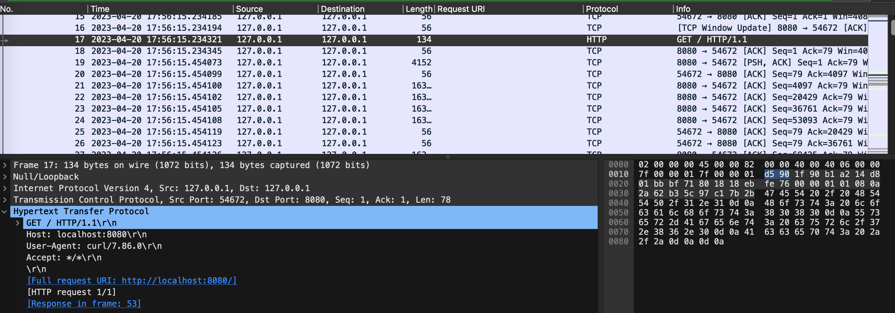
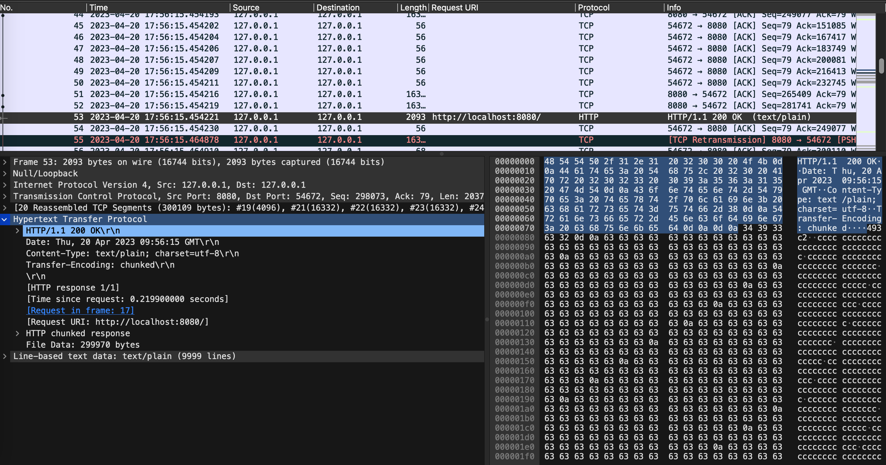
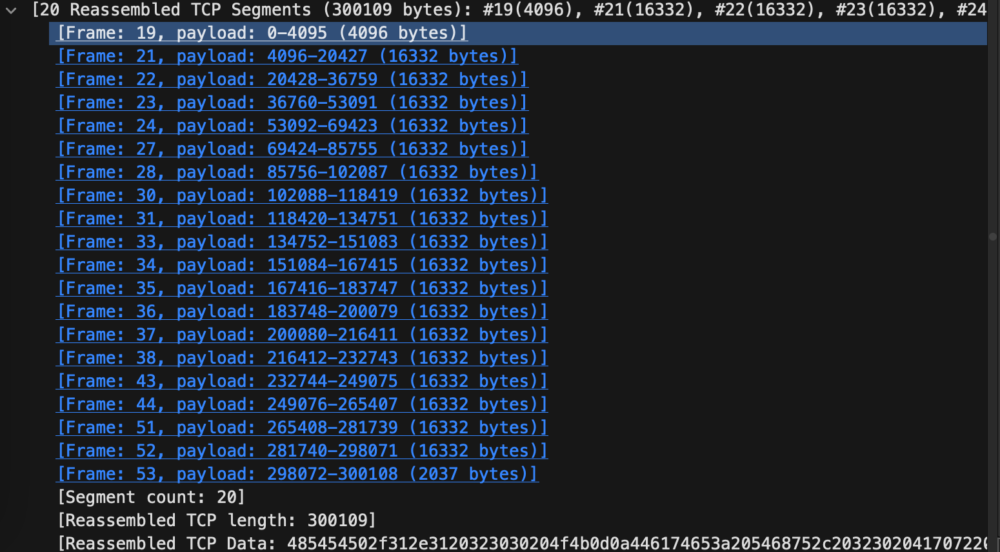
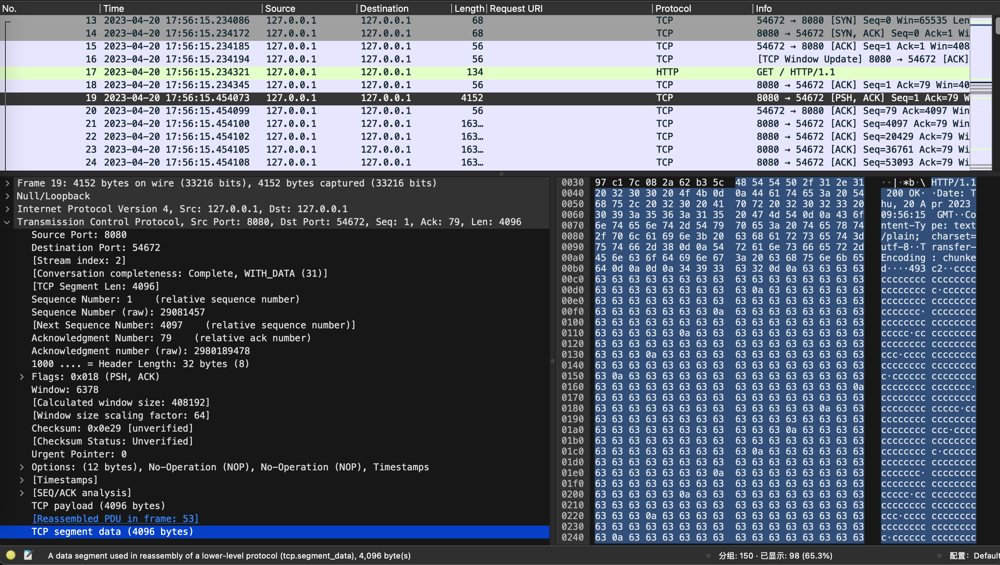
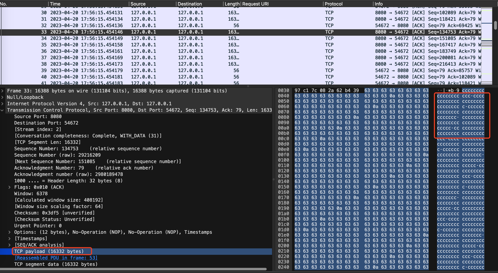

## 背景

当http请求或者响应太大时，请求或者返回的数据会被分成多个网络数据包，**想知道具体的报文内容则需要进行TCP重组。另一个问题是关于http响应时间的计算**，因为请求或者响应可能是又多个网络数据包组成的，每个数据包的时间戳也不相同，所以计算响应时间应该根据哪个数据包的时间戳也是一个需要思考的问题。我查阅了相关资料，总结出应该http响应时间应该用响应的最后一个数据包的时间戳减去请求的最后一个数据包的时间戳（Wireshark也是这样计算的）。下面是一个简单的例子，这个例子的http响应数据较大，被分成了多个数据包：

请求是一个简单的HTTP GET请求：



由请求的最后一行[Response in frame:53]，查看No.53的数据包



可以看到Wireshark上显示了完整的http报文，http响应中包含了非常多的字符c。也显示了[20 Reassembled TCP Segments(300109 bytes)..]，说明wireshark进行了TCP重组，使用了20个TCP分片重组得到了完整的http响应报文。

点开[20 Reassembled TCP Segments(300109 bytes)..]，可以看到使用的所有的TCP分片



查看第一个TCP分片即Frame 19



其TCP Payload是http响应报文的格式，但是因为http body太长，这个分片无法负载完整http body，所以剩下的http body被分到其他的TCP分片中。

再随机点入一个TCP分片比如Frame33：



可以看到其TCP payload都是ccc，**TCP重组就是选出了所有的需要重组的TCP分片，然后将这些TCP分片的TCP Payload组合得到完整的数据。**

## 测试HTTP请求TCP重组的注意事项

### 客户端的随机端口

客户端发送http请求时，客户端使用的端口是系统随机分配的，当我写了一个脚本，在这个脚本发送了2次http请求时，这2次http请求的端口使用的也是不同的，虽然在同一个脚本。

### tcp包中如何知道应用层协议是什么

在TCP包中，我们无法直接知道应用层协议是什么，因为TCP只是一种传输层协议，它不关心上层的协议是什么。但是，在TCP包的数据部分，我们可以根据端口号来猜测上层协议的类型。因为在TCP连接建立时，客户端和服务器端会约定使用特定的端口号来传输数据，而这些端口号通常会对应着一种特定的应用层协议。比如，HTTP通常使用80端口，HTTPS通常使用443端口，SMTP通常使用25端口等等。因此，我们可以根据TCP包的目的端口号来猜测上层协议的类型。但是需要注意的是，这种方法并不完全准确，因为端口号并不是一成不变的，而且也有可能使用非标准的端口号。

## gopacket对分片的支持

关于TCP 重组，可以先看官方给出的一个比较通俗易懂的[例子](https://github.com/google/gopacket/blob/master/examples/httpassembly/main.go)

 ```go
 package main
 
 import (
 	"bufio"
 	"flag"
 	"io"
 	"log"
 	"net/http"
 	"time"
 
 	"github.com/google/gopacket"
 	"github.com/google/gopacket/examples/util"
 	"github.com/google/gopacket/layers"
 	"github.com/google/gopacket/pcap"
 	"github.com/google/gopacket/tcpassembly"
 	"github.com/google/gopacket/tcpassembly/tcpreader"
 )
 
 var iface = flag.String("i", "eth0", "Interface to get packets from")
 var fname = flag.String("r", "", "Filename to read from, overrides -i")
 var snaplen = flag.Int("s", 1600, "SnapLen for pcap packet capture")
 var filter = flag.String("f", "tcp and dst port 80", "BPF filter for pcap")
 var logAllPackets = flag.Bool("v", false, "Logs every packet in great detail")
 
 // Build a simple HTTP request parser using tcpassembly.StreamFactory and tcpassembly.Stream interfaces
 
 // httpStreamFactory implements tcpassembly.StreamFactory
 type httpStreamFactory struct{}
 
 // httpStream will handle the actual decoding of http requests.
 type httpStream struct {
 	net, transport gopacket.Flow
 	r              tcpreader.ReaderStream
 }
 
 func (h *httpStreamFactory) New(net, transport gopacket.Flow) tcpassembly.Stream {
 	hstream := &httpStream{
 		net:       net,
 		transport: transport,
 		r:         tcpreader.NewReaderStream(),
 	}
 	go hstream.run() // Important... we must guarantee that data from the reader stream is read.
 
 	// ReaderStream implements tcpassembly.Stream, so we can return a pointer to it.
 	return &hstream.r
 }
 
 func (h *httpStream) run() {
 	buf := bufio.NewReader(&h.r)
 	for {
 		req, err := http.ReadRequest(buf)
 		if err == io.EOF {
 			// We must read until we see an EOF... very important!
 			return
 		} else if err != nil {
 			log.Println("Error reading stream", h.net, h.transport, ":", err)
 		} else {
 			bodyBytes := tcpreader.DiscardBytesToEOF(req.Body)
 			req.Body.Close()
 			log.Println("Received request from stream", h.net, h.transport, ":", req, "with", bodyBytes, "bytes in request body")
 		}
 	}
 }
 
 func main() {
 	defer util.Run()()
 	var handle *pcap.Handle
 	var err error
 
 	// Set up pcap packet capture
 	if *fname != "" {
 		log.Printf("Reading from pcap dump %q", *fname)
 		handle, err = pcap.OpenOffline(*fname)
 	} else {
 		log.Printf("Starting capture on interface %q", *iface)
 		handle, err = pcap.OpenLive(*iface, int32(*snaplen), true, pcap.BlockForever)
 	}
 	if err != nil {
 		log.Fatal(err)
 	}
 
 	if err := handle.SetBPFFilter(*filter); err != nil {
 		log.Fatal(err)
 	}
 
 	// Set up assembly
 	streamFactory := &httpStreamFactory{}
 	streamPool := tcpassembly.NewStreamPool(streamFactory)
 	assembler := tcpassembly.NewAssembler(streamPool)
 
 	log.Println("reading in packets")
 	// Read in packets, pass to assembler.
 	packetSource := gopacket.NewPacketSource(handle, handle.LinkType())
 	packets := packetSource.Packets()
 	ticker := time.Tick(time.Minute)
 	for {
 		select {
 		case packet := <-packets:
 			// A nil packet indicates the end of a pcap file.
 			if packet == nil {
 				return
 			}
 			if *logAllPackets {
 				log.Println(packet)
 			}
 			if packet.NetworkLayer() == nil || packet.TransportLayer() == nil || packet.TransportLayer().LayerType() != layers.LayerTypeTCP {
 				log.Println("Unusable packet")
 				continue
 			}
 			tcp := packet.TransportLayer().(*layers.TCP)
 			assembler.AssembleWithTimestamp(packet.NetworkLayer().NetworkFlow(), tcp, packet.Metadata().Timestamp)
 
 		case <-ticker:
 			// Every minute, flush connections that haven't seen activity in the past 2 minutes.
 			assembler.FlushOlderThan(time.Now().Add(time.Minute * -2))
 		}
 	}
 }
 ```

## 代码解释

### FlushOlderThan

源码里，其实这个函数就是调用了FlushWithOptions，下面介绍FlushWithOptions的功能

```go
// FlushOlderThan calls FlushWithOptions with the CloseAll option set to true.
func (a *Assembler) FlushOlderThan(t time.Time) (flushed, closed int) {
	return a.FlushWithOptions(FlushOptions{CloseAll: true, T: t})
}
```

FlushWithOptions的定义如下

```go
func (a *Assembler) FlushWithOptions(opt FlushOptions) (flushed, closed int) 
```

FlushWithOptions函数的返回值的含义为刷新的连接数，以及其中因刷新而关闭的连接数。

FlushWithOptions遍历所有streams，找到比给定时间更老的stream，然后把该stream的数据进行选择再将选择后的数据推送到 Stream 的 Reassembled 函数。也就是告诉这些比给定时间更老的stream停止接受新的数据包
每一个Stream都包含了多个按照时间顺序接收到的字节集合，比如某个Stream处理了序号10，这个Stream的多个字节集合可能为[15-20),[20-25),[30,50)这三个字节集合，每一个字节集合都有一个对应的时间戳。

FlushWithOptions被调用后会查看该Stream的所有字节集合，如果[15-20)比输出的给定时间更老，FlushWithOptions将把[15-20)和所有连续的字节集合推送到 Stream 的 Reassembled 函数，在这个例子里会推送[15-20)和[20-25)因为这两个字节集合是连续的。只有当[30-50)的时间戳比给定时间更老的时候才会推送[30-50)到Stream 的 Reassembled 函数，否则会等到下一个FlushOlderThan调用看看缺失的[25-30)数据是否到来。
这里给出的例子其实发送方是发送了完整的字节[15-50)，只是在传输中被分组了，分到了多个字节集合。而这几个字节集合到达接收方的先后顺序是不一定的，在这个例子里，[25-30)这个集合就是最后到达的，这也是为什么一定要推送连续的字节集合到Reassembled函数的原因。

如果FlushWithOptions推送了所有字节（或者没有字节集合小于给定时间）并且连接自传入时间以来未收到任何字节，则连接将关闭。

###Reassembly

```go
type Reassembly struct {
  // Bytes为TCP payload，可能需要base64 encode查看具体内容
	Bytes []byte
  // 如果在这次重组和上一次重组之间跳过了字节，则 Skip 设置为非零。 如果这是连接中的第一个数据包并且我们没有看到开始，我们不知道我们跳过了多少字节，所以我们将它设置为 -1。 否则，它被设置为跳过的字节数。
  // 用于场景应该是分片达到的时间的不一致情况，如果后面的分片比前面的分片先到达了，那么Skip应该就是非0
	Skip int
	Start bool
	End bool
  // 数据包的时间戳
	Seen time.Time
}
```

被分片的情况下，第一个分片的Start为true，最后一个分片的End为true，其他情况都是false。
