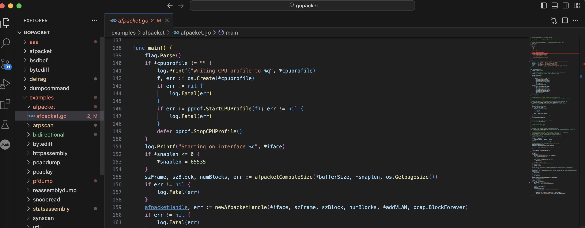
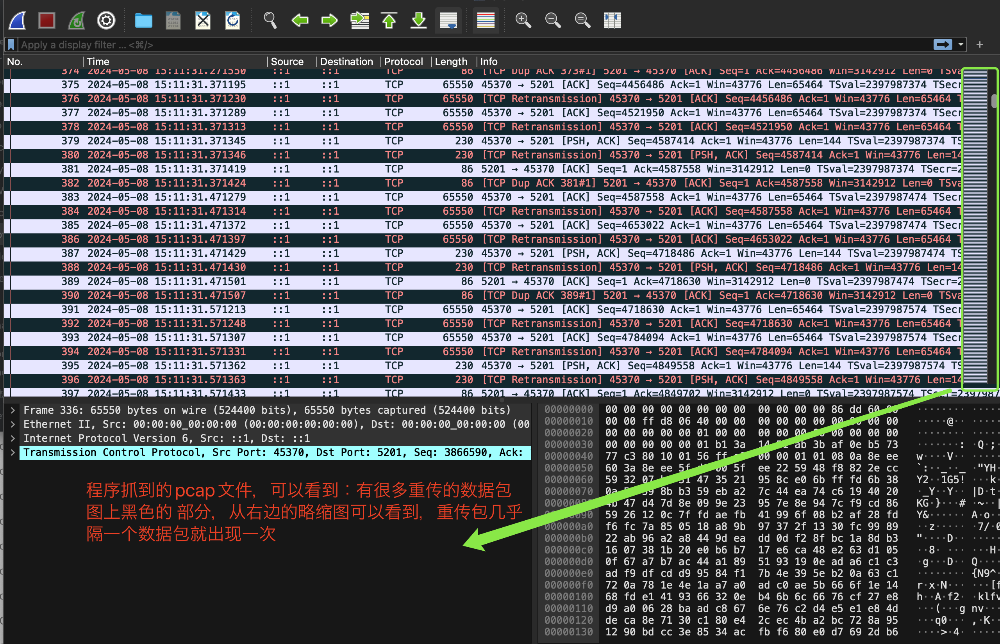
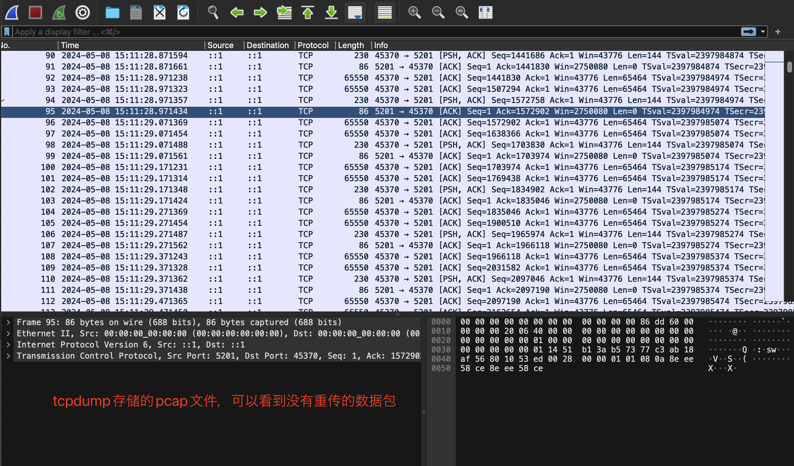

之前写了篇叫《gopacket源代码阅读》，主要介绍了gopacket的最基本部分的源代码的原理。写完后继续看了下gopacket的其他包的源代码。发现其他包阅读起来没有基本部分的源代码那么轻松也看不太懂了。

因为examples包下面列出了使用一些包的方法，给出的都是示例的main文件。大概看了一下这些例子，发现了其中一个比较有用的包叫afpacket。

之前提到gopacket是Google出品的一个`PF_RING`和`AF_PACKET`和基于C语言的libpcap的网络数据包抓取和分析包。之前介绍的是基于libpcap的部分，本文介绍当gopacket基于AF_PACKET的情况。而afpacket包正是基于AF_PACKET套接字的实现。

**afpacket 使用 Linux 内核的 `AF_PACKET` 套接字进行数据包捕获。**此时无需使用gopacket的其他功能。使用时只需要导入afpacket包即可。

> Linux 的 AF_PACKET（全称是 "Advanced Packet Socket"）套接字是一种用于在用户空间进行网络数据包捕获和注入的机制。**它允许用户程序直接访问网络设备的数据流，而无需经过内核的协议栈处理。**

使用 `gopacket` 库进行数据包捕获时，你可以选择不同的捕获源，包括 `afpacket`、`pcap`、`pcapng` 等。底层的抓包工具可能是libpcap或者AF_PACKET或者PF_RING。

afpacket也提供了一种数据包读取的方法，**但是只可以在linux上使用和运行**。和之前使用的如下的数据包读取方法不同：

```go
handle, err := pcap.OpenLive(iface.Name, 65536, true, pcap.BlockForever)
...
src := gopacket.NewPacketSource(handle, layers.LayerTypeEthernet)
in := src.Packets()
	for {
		var packet gopacket.Packet
		select {
		case <-stop:
			return
		case packet = <-in:
      // do something
	}
```

afpacket的使用方法可以参考这个文件：



我模仿这个文件，写了统计网卡总流量大小的一个程序：

```go
package main

import (
	"fmt"
	"log"
	"os"
	"os/signal"
	"sync/atomic"
	"syscall"
	"time"

	"github.com/google/gopacket"
	"github.com/google/gopacket/afpacket"
	"github.com/google/gopacket/pcap"
	"github.com/google/gopacket/pcapgo"
)

func main() {
	device := "lo"
	bufferSize := 88
	snaplen := 65535
	addVLAN := true
	szFrame, szBlock, numBlocks, err := afpacketComputeSize(bufferSize, snaplen, os.Getpagesize())
	if err != nil {
		log.Fatal(err)
	}
	afpacketHandle, err := newAfpacketHandle(device, szFrame, szBlock, numBlocks, addVLAN, pcap.BlockForever)
	if err != nil {
		log.Fatal(err)
	}
	source := gopacket.ZeroCopyPacketDataSource(afpacketHandle)
	defer afpacketHandle.Close()
	f, _ := os.Create("test.pcap")
	defer f.Close()
	w := pcapgo.NewWriter(f)
	handle, _ := pcap.OpenLive(device, int32(snaplen), true, -1*time.Second)
	w.WriteFileHeader(uint32(snaplen), handle.LinkType())
	defer handle.Close()
	go func() {
		for {
			data, meta, err := source.ZeroCopyReadPacketData()
			if err != nil {
				log.Fatal(err)
			}
			w.WritePacket(meta, data)
			Add(uint64(meta.CaptureLength))
		}
	}()
	c := make(chan os.Signal, 1)
	signal.Notify(c, os.Interrupt, syscall.SIGTERM)
	<-c
	fmt.Println(".......Read().............", Read())
}

type AtomicCounter struct {
	number uint64
}

var Counter *AtomicCounter

func init() {
	Counter = &AtomicCounter{0}
}

func Add(num uint64) {
	atomic.AddUint64(&Counter.number, num)
}

func Read() uint64 {
	return atomic.LoadUint64(&Counter.number)
}

func afpacketComputeSize(targetSizeMb int, snaplen int, pageSize int) (
	frameSize int, blockSize int, numBlocks int, err error) {

	if snaplen < pageSize {
		frameSize = pageSize / (pageSize / snaplen)
	} else {
		frameSize = (snaplen/pageSize + 1) * pageSize
	}

	// 128 is the default from the gopacket library so just use that
	blockSize = frameSize * 128
	numBlocks = (targetSizeMb * 1024 * 1024) / blockSize

	if numBlocks == 0 {
		return 0, 0, 0, fmt.Errorf("Interface buffersize is too small")
	}

	return frameSize, blockSize, numBlocks, nil
}

type afpacketHandle struct {
	TPacket *afpacket.TPacket
}

func newAfpacketHandle(device string, snaplen int, block_size int, num_blocks int,
	useVLAN bool, timeout time.Duration) (*afpacketHandle, error) {

	h := &afpacketHandle{}
	var err error

	if device == "any" {
		h.TPacket, err = afpacket.NewTPacket(
			afpacket.OptFrameSize(snaplen),
			afpacket.OptBlockSize(block_size),
			afpacket.OptNumBlocks(num_blocks),
			afpacket.OptAddVLANHeader(useVLAN),
			afpacket.OptPollTimeout(timeout),
			afpacket.SocketRaw,
			afpacket.TPacketVersion3)
	} else {
		h.TPacket, err = afpacket.NewTPacket(
			afpacket.OptInterface(device),
			afpacket.OptFrameSize(snaplen),
			afpacket.OptBlockSize(block_size),
			afpacket.OptNumBlocks(num_blocks),
			afpacket.OptAddVLANHeader(useVLAN),
			afpacket.OptPollTimeout(timeout),
			afpacket.SocketRaw,
			afpacket.TPacketVersion3)
	}
	return h, err
}

func (h *afpacketHandle) ZeroCopyReadPacketData() (data []byte, ci gopacket.CaptureInfo, err error) {
	return h.TPacket.ZeroCopyReadPacketData()
}

func (h *afpacketHandle) Close() {
	h.TPacket.Close()
}
```

我这个程序是统计了所有的数据包的总流量。测试时是使用iperf3打流测试的，但是不知道为何，程序统计出来的流量几乎是iperf3显示的2倍，正确的结果应该是程序统计出来的和iperf3的差不多。

然后将程序抓到的数据包存到pcap文件，查看该pcap文件，同时通过tcpdump将对应网卡抓到的数据包存储到pcap文件，对比这两个pcap文件。发现程序抓到的文件多捕获到了重传的数据包：





至于为什么程序里的AF_PACKET会抓到重传的数据包，我没有找到原因。

-----------------------

NewTPacket的源代码为：

```go
func NewTPacket(opts ...interface{}) (h *TPacket, err error) {
	h = &TPacket{}
	if h.opts, err = parseOptions(opts...); err != nil {
		return nil, err
	}
	fd, err := unix.Socket(unix.AF_PACKET, int(h.opts.socktype), int(htons(unix.ETH_P_ALL)))
	if err != nil {
		return nil, err
	}
	h.fd = fd
	if err = h.bindToInterface(h.opts.iface); err != nil {
		goto errlbl
	}
	if err = h.setRequestedTPacketVersion(); err != nil {
		goto errlbl
	}
	if err = h.setUpRing(); err != nil {
		goto errlbl
	}
	// Clear stat counter from socket
	if err = h.InitSocketStats(); err != nil {
		goto errlbl
	}
	runtime.SetFinalizer(h, (*TPacket).Close)
	return h, nil
errlbl:
	h.Close()
	return nil, err
}
```

这里源代码的重点就是：

```shell
unix.Socket(unix.AF_PACKET, int(h.opts.socktype), int(htons(unix.ETH_P_ALL)))
```

这一行

AF_PACKET实现了数据链路层的raw socket，ETH_P_ALL可以匹配所有类型的以太网帧，也就是这里可以捕获到所有的以太网帧。

AF_PACKET raw soket的能力如下：

- 能接收发往本地mac的数据帧
- 能接收从本机发送出去的数据帧(**第3个参数需要设置为ETH_P_ALL**才行)
- 接收非发往本地mac的数据帧(网卡需要设置为promisc混杂模式)

第二个参数可以传递SOCK_RAW或者SOCK_DGRAM

- SOCK_RAW ： 用户接收的数据包将包含链路层的协议头(即Ethernet 帧头)， 发送数据时， 用户需要填充链路层的协议头(即Ethernet 帧头)
- SOCK_DGRAM ： 用户接收/发送的数据包都不包含链路层的协议头(即Ethernet 帧头)， 发送数据时， 用户指定的物理层地址只是作为参考， kernel将自动填充合适的物理层地址

以一个udp数据包为例

```
14byte            20byte      8byte        100byte  4byte
+-----------------+-----------+------------+--------+-----+
| Ethernet Header | ip header | udp header |  data  | fcs |
+-----------------+-----------+------------+--------+-----+
```

- SOCK_RAW 可以接收到 Ethernet header + ip header + udp header + data 即 (14 + 20 + 8 + 100 byte)
- SOCK_DGRAM 可以接收到 ip header + udp header + data 即 (20 + 8 + 100 byte)

第二个参数默认情况下传递的值是 SOCK_RAW。

AF_PACKET 协议族的socket需要指定protocol， 也就是第三个参数，例如

```c
socket(PF_PACKET, SOCK_RAW, htons(ETH_P_IP))
socket(PF_PACKET, SOCK_RAW, htons(ETH_P_ARP))
socket(PF_PACKET, SOCK_RAW, htons(ETH_P_EAPOL))
socket(PF_PACKET, SOCK_RAW, htons(ETH_P_ALL))
```

任何网络协议的代码， 都可以通过 dev_add_pack() 来注册一个 struct packet_type， 来声明其感兴趣的以太网帧，感兴趣的网络设备接口， 以及对应的处理函数。比如ETH_P_IP、ETH_P_ARP、ETH_P_EAPOL、ETH_P_ALL都有对应的处理函数。

> - ip协议栈注册了一个名为“ip_packet_type” 的结构体，关注类型为 ETH_P_IP的以太网帧, 处理处理函数为 ip_rcv()
> - arp协议注册了一个名为“arp_packet_type” 的结构体，关注类型为 ETH_P_ARP的以太网帧, 处理函数为arp_rcv()
>
> 在 Linux 内核中，ETH_P_ALL 是一个特殊的以太网类型，用于捕获所有传入的以太网帧，而不管它们的协议类型是什么。当注册了一个 ETH_P_ALL 类型的以太网帧时，操作系统的网络协议栈会接收所有传入的以太网帧，并将它们传递给注册的处理函数进行处理。注册 ETH_P_ALL 类型的以太网帧的处理函数可以是一个称为 "eth_rcv()" 或类似名称的函数。这个函数负责接收所有传入的以太网帧，并将它们传递给适当的协议处理程序，或者进一步处理它们

 **tcpdump就使用了 AF_PACKET raw socket**

我的理解：拿AF_PACKET举例，每个数据包都有自己的类型，比如有的数据包类型是ETH_P_IP，可能表示其有IP层，有的数据包类型是ETH_P_ARP，可能表明其有以太网层的数据。应该每个数据包不止有一个类型，应该差不多每个数据包都包含了ETH_P_ALL类型。所以当某个结构体关注了ETH_P_ALL类型的以太网帧时，会有对应的处理函数，处理函数一般是读取以太网帧。

参考文章：

https://medium.com/@pavel.odintsov/capturing-packets-in-linux-at-a-speed-of-millions-of-packets-per-second-without-using-third-party-ef782fe8959d

https://gist.github.com/pavel-odintsov/c2154f7799325aed46ae

https://worktile.com/kb/ask/430068.html

https://lishiwen4.github.io/network/raw-socket

 https://lishiwen4.github.io/page10/

https://lishiwen4.github.io/network/netfilter

https://lishiwen4.github.io/network/socket-interface-and-network-protocol

https://www.opensourceforu.com/2015/03/a-guide-to-using-raw-sockets/ 