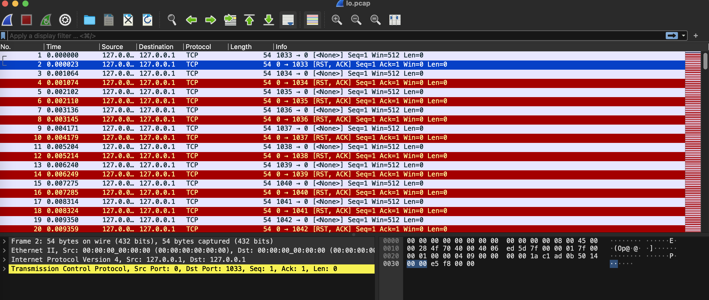
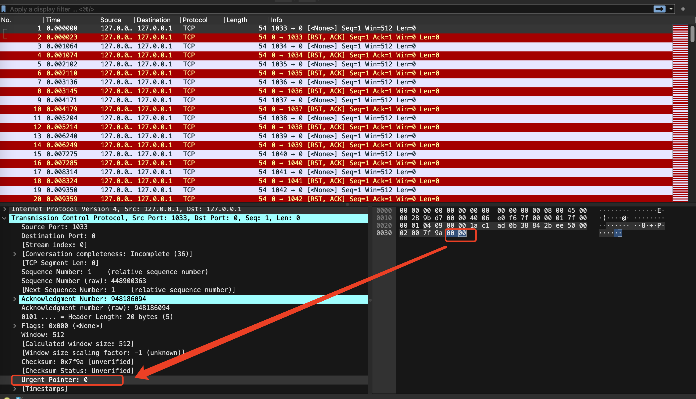
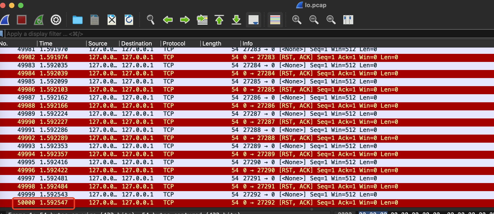
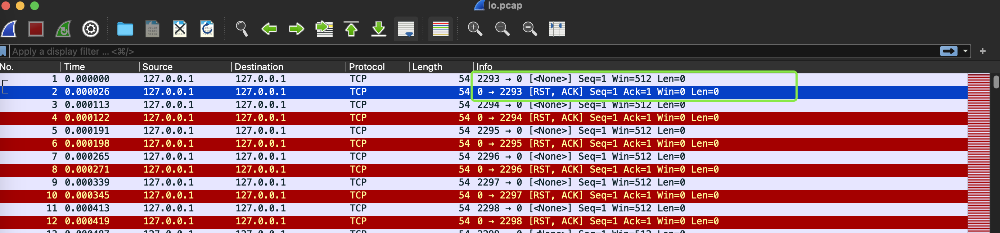

## 简介

hping3是用于生成和解析TCP/IP协议数据包汇编/分析的命令行开源工具，可以用于模拟数据包发送，我使用这个工具的主要目的就是想要模拟指定数量的数据包发送的效果。

## 安装

centos安装：

```shell
yum install hping3
```

安装完毕后输入`hping3 -v`验证是否成功

## 使用

下面指定发送多少个数据包，且指定所有的数据包必须在给定的时间内发送完毕

`-c`指定一共要发送多少个数据包

`-i`指定发送的数据包的前后两个数据包的时间间隔，单位是秒，如果值前面加上'u'前缀，表示单位为微秒（microseconds）。

```shell
sudo hping3 -c 100 -i 10 localhost
```

这条命令的效果就是发送100个数据包，前后两个数据包的时间间隔是10秒，那么一共需要 100*10=1000秒才能发送完毕。

这条命令对应的`tcpdump -i lo`抓到的部分内容为：

```shell
15:14:11.415231 IP localhost.cadabra-lm > localhost.0: Flags [none], win 512, length 0
15:14:11.415257 IP localhost.0 > localhost.cadabra-lm: Flags [R.], seq 0, ack 641111849, win 0, length 0
15:14:21.415339 IP localhost.pay-per-view > localhost.0: Flags [none], win 512, length 0
15:14:21.415366 IP localhost.0 > localhost.pay-per-view: Flags [R.], seq 0, ack 1902166683, win 0, length 0
15:14:31.415447 IP localhost.winddlb > localhost.0: Flags [none], win 512, length 0
15:14:31.415471 IP localhost.0 > localhost.winddlb: Flags [R.], seq 0, ack 1291643278, win 0, length 0
15:14:41.415547 IP localhost.corelvideo > localhost.0: Flags [none], win 512, length 0
15:14:41.415572 IP localhost.0 > localhost.corelvideo: Flags [R.], seq 0, ack 1150896678, win 0, length 0
```

在`-i`参数加上`u`前缀则表示单位为微秒不是默认的秒，比如这里u1000表示前后两个数据包的时间间隔是1000微秒。PS：1秒等于 1,000,000 微秒。

```shell
sudo hping3 -c 100 -i u1000 localhost
```

## 传输数据包内容

如果想知晓传输的数据包的具体内容，可以使用tcpdump命令把数据包保存到pcap文件中，参考`tcpdump -i lo -w lo.pcap`，然后使用wireshark查看保存的pcap文件。

可以看到传输的都是一些TCP包，且没有TCP payload



数据包的最后两个字节对应的是Urgent Pointer标识，没有TCP payload。



## 大流量的测试

我想测试下在1秒内发送20000个数据包hping3能否实现，用`sudo hping3 -c 25000 -i u44 localhost`执行，同时用tcpdump到pcap文件中。hping3 执行完毕后，隔了一会停止了tcpdump，发现tcpdump抓到了50000个包。

```shell
tcpdump -i lo -w lo.pcap
tcpdump: listening on lo, link-type EN10MB (Ethernet), capture size 262144 bytes
^C50000 packets captured
100000 packets received by filter
0 packets dropped by kernel
```

再查看pcap文件，25000*44微秒差不多是1秒，但是pcap第一条和最后一条的时间差距超过了1秒：




pcap文件里有50000条，是因为传输了25000条包含了来回的包，指定的25000个包只是单向的，50000条还包含了对应的返回。这个从Info里可以看出来



总结：hping3 虽然发送了指定数量的包，但是没有在指定时间内完成。hping3 可能无法以如此高的速率连续发送数据包。实际的发送速率可能会受到网络和目标主机的限制。

在抓包的时候可以看出来，每次使用的端口是变化的。好像是递增的。

再次验证：使用`sudo hping3 -c 25000 -i u80 localhost`命令抓包，对应的pcap文件为：


可以看到发送第一个包和第二个包的时间间隔是154微秒，而不是指定的80微秒。这是因为hping3可能无法实现这么高的速率，应该不是机器问题，因为我之前测试的时候用 iperf3打流的速率是可以实现每秒20000个数据包的发送的。

