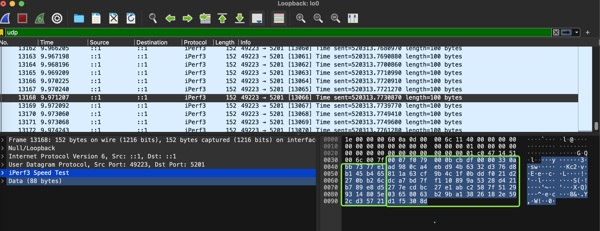

## 简介

iperf3是一个网络性能测试工具，可以用来模拟大流量的传输。可以用来TCP和UDP带宽的性能，可以用来测试最大UDP带宽。

iperf3对于每次测试，都会报告带宽，损耗和其他数据。

## 使用场景

### 测试发送端和接收端的最大带宽

有时候需要知晓发送端和接收端的最大带宽，使用iperf3可以测量出两端之间的最大带宽，因为iperf3会输出使用传输的速率，可以指定iperf3传输一个比较高的无法达到的速率，再查看iperf3显示的实际传输速率。

### 模拟大流量

有时候需要测试程序在大流量的场景下能否正确运行与处理 ，首先在程序所在机器运行iperf3接收服务，在其他机器想iperf3所在机器传输流量，传输流量时可以自定义传输速率，然后查看传输速率。

## 安装

macOS下安装

```shell
brew install iperf3
```

## 使用

启动服务端：

```shell
iperf3 -s
```

启动客户端：

```
iperf3 -c localhost -b 500M -t 3
```

> `-c` 参数用于指定客户端要连接的服务器的地址，这里使用的是localhost，如果不是向本机打流则需要换成iperf3服务所在机器的IP
>
> `-b 500M` 表示设置客户端发送的带宽限制为500Mbps
>
> -t 表示打流的持续时间为3秒
>
> 这个命令的意思是把最大速率500Mbps的流量传输到服务端，打流的最大速率为500Mbps。数据传输持续3秒，3秒后自动停止传输。

因为这里的客户端和服务端都在同一台机器上，所以走的网卡是lo0。

运行结果查看：

```shell
iperf3 -s                                              
-----------------------------------------------------------
Server listening on 5201 (test #1)
-----------------------------------------------------------
Accepted connection from ::1, port 64123
[  5] local ::1 port 5201 connected to ::1 port 64124
[ ID] Interval           Transfer     Bitrate
[  5]   0.00-1.00   sec  59.8 MBytes   500 Mbits/sec
[  5]   1.00-2.00   sec  59.8 MBytes   500 Mbits/sec
[  5]   2.00-3.00   sec  59.2 MBytes   499 Mbits/sec
[  5]   3.00-3.00   sec   128 KBytes  1.19 Gbits/sec
- - - - - - - - - - - - - - - - - - - - - - - - -
[ ID] Interval           Transfer     Bitrate
[  5]   0.00-3.00   sec   179 MBytes   500 Mbits/sec                  receiver
-----------------------------------------------------------
Server listening on 5201 (test #2)
-----------------------------------------------------------
```

```shell
iperf3 -c localhost -b 500M -t 3          
Connecting to host localhost, port 5201
[  7] local ::1 port 64124 connected to ::1 port 5201
[ ID] Interval           Transfer     Bitrate
[  7]   0.00-1.00   sec  59.6 MBytes   500 Mbits/sec
[  7]   1.00-2.00   sec  59.6 MBytes   500 Mbits/sec
[  7]   2.00-3.00   sec  59.6 MBytes   500 Mbits/sec
- - - - - - - - - - - - - - - - - - - - - - - - -
[ ID] Interval           Transfer     Bitrate
[  7]   0.00-3.00   sec   179 MBytes   500 Mbits/sec                  sender
[  7]   0.00-3.00   sec   179 MBytes   500 Mbits/sec                  receiver

iperf Done.
```

可以看到打流持续了3秒，客户端的Bitrate列输出了3行：

```shell
[ ID] Interval           Transfer     Bitrate
[  7]   0.00-1.00   sec  59.6 MBytes   500 Mbits/sec
[  7]   1.00-2.00   sec  59.6 MBytes   500 Mbits/sec
[  7]   2.00-3.00   sec  59.6 MBytes   500 Mbits/sec
```

下面是对数据结果的一些解析：

Bitrate（比特率）是500 Mbits/sec 即500Mbps，这表示当前网络是千兆网络。

> iperf3默认发送的是TCP包，如果想发送UDP包，可以在客户端命令添加`-u`参数，则会发送UDP包。同一个网络，发送TCP和UDP的最大带宽可能是不同的。

除了上述功能外，还有一个重要功能，就是**对于发送UDP的包，可以指定发送的数据包的payload的大小**，可以通过`-l`参数实现，`-l`的值的单位为字节。比如如下命令：

```shell
iperf3 -c localhost -l 100 -u
```

其含义是指定发送的数据包的payload大小是100，运行iperf3的同时抓包，抓到的内容是：



可以看到传输的payload是100个字节，如绿色方框内所示。实际传输的整个数据包的大小是大于100个字节的，是100个字节加上各层的Header的长度，这里的总的数据包大小是152个字节。

## 不同速率的网络接口

iperf3运行的传输速率受到网络接口速率的影响，网络接口有不同的等级，比如10G的网络接口和1G的网络接口，那么二者有什么区别呢？

**传输速率**：10G 网络接口的传输速率为 10 千兆比特每秒（Gbps），而 1G 网络接口的传输速率为 1 千兆比特每秒（Gbps）。因此，10G 网络接口的传输速率比 1G 网络接口快 10 倍。

**带宽**：10G 网络接口具有更大的带宽，能够传输更多的数据。这使得它更适合于大型数据中心、高性能计算和要求高带宽的应用场景。

**成本**：由于硬件和技术上的差异，10G 网络接口通常比 1G 网络接口更昂贵。这包括网卡、交换机和光纤等设备的成本。

**距离**：10G 网络接口通常可以支持更远的传输距离，例如，使用单模光纤可以达到数十公里的传输距离，而 1G 网络接口则通常在数百米范围内。

**功耗**：10G 网络接口通常消耗更多的功耗，因为它需要更多的处理能力来处理更高的传输速率和带宽。这可能会增加服务器和网络设备的能耗。

总的来说，10G 网络接口适用于需要更高带宽和更快传输速率的场景，而 1G 网络接口则更适用于一般的办公环境和普通数据中心应用。

