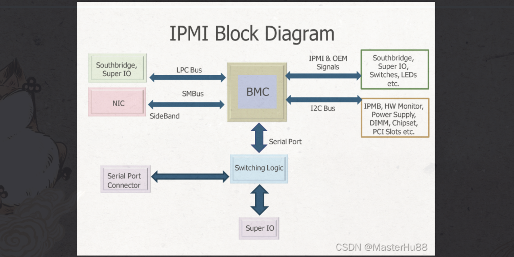

## 简介

IPMI（Intelligent Platform Management Interface）是一种由Intel开发的远程管理技术，通常用于管理和监视计算机系统。可以通过IPMI监控服务器的物理特征，如温度，电压等。只要机器接通电源即可，即使没有启动操作系统，就可以进行监控。目前最新版本是IPMI2.0。

IPMI可以让管理员通过网络连接访问计算机系统，以便在操作系统不可用或发生故障的情况下进行管理和维护。比如服务器宕机的时候，无法通过SSH连接的话可以通过IPMI来重启。

在计算机领域，带外管理（Out-of-band management）是指使用独立管理通道进行设备维护。它允许系统管理员远程监控和管理服务器、路由器、网络交换机和其他网络设备。带外管理通过部署与数据通道物理隔离的管理通道来解决这个限制。带外网管是指通过专门的网管通道实现对网络的管理，**将网管数据与业务数据分开**，为网管数据建立独立通道。

常见的设备管理方式有SNMP、RMON、Web、TELNET，这些管理方式属于带内管理。

相对的，带内管理是指使用常规数据通道（例如以太网、互联网）来管理设备。带内管理的明显限制是这种管理容易受到被管理设备受攻击或损害的影响。带内管理使得网络中的网管数据和业务数据在相同的链路中传输，当管理数据（包括SNMP，Netflow，Radius，计费等）较多时，将会影响到整个网络的性能；管理数据的流量较少，对整个网络的性能影响不明显，可采用带内管理。带内网管，网管系统必须通过网络来管理设备。如果无法通过网络访问被管理对象，带内网管系统就失效了，这时候带外网管系统就排上用场了。

尽管 IPMI 和 HTTP 没有直接的关系，但是**有些服务器供应商提供了基于 HTTP 协议的 IPMI 远程管理界面**，这意味着管理员可以使用 Web 浏览器来访问服务器的 IPMI 远程管理功能。在这种情况下，HTTP 协议被用于提供 IPMI 远程管理功能的 Web 接口，以便管理员可以通过 Web 界面来管理服务器硬件。

wireshark中可以抓到IPMI的数据

## 确认是否支持IPMI

大部分厂商的服务器如戴尔，NEC的都支持IPMI2.0，**第一步就是应该先查看产品手册或者在BIOS查看服务器是否支持IPMI。**

大多数现代的Linux操作系统都支持IPMI技术。mac不支持IPMI协议。

Linux机器执行：

```shell
dmidecode -t 38
```

如果命令返回IPMI版本和其他相关信息，则说明系统具有IPMI硬件，即支持IPMI技术。

> 这里我的Linux机器（Red Hat版本）上执行了这个命令返回了如下结果。
>
> 

下面的操作基于我的机器

安装ipmitool和OpenIPMI工具包，这两个都是支持IPMI管理的必备工具包

```shell
sudo yum install ipmitool OpenIPMI
```

加载IPMI驱动程序：使用以下命令加载IPMI驱动程序：

```
sudo modprobe ipmi_devintf
```

启动IPMI服务：使用以下命令启动IPMI服务：

```
sudo systemctl start ipmi.service
```

设置IPMI用户：使用以下命令设置IPMI用户：

```
sudo ipmitool user set name 1 admin
```

执行这个报错了。。。。。。。。。。。

```
Could not open device at /dev/ipmi0 or /dev/ipmi/0 or /dev/ipmidev/0: No such file or directory
```

之前启动IPMI服务时，需要内核加载命令，命令报错了

```
sudo modprobe ipmi_si
```

```
modprobe: ERROR: could not insert 'ipmi_si': No such device
```

> 如果出现 "no such device" 错误消息，则表示系统中没有找到名为 ipmi_si 的内核模块。这可能是因为系统中没有安装这个模块，或者是因为这个模块并不适用于当前系统的内核版本。
>
> 如果您希望使用 ipmi_si 模块，可以尝试检查当前系统是否安装了这个模块，或者尝试在系统中安装这个模块。您还可以尝试检查内核版本，看看这个模块是否与当前内核版本兼容。
>
> [参考](https://juejin.cn/s/modprobe%20ipmi_si%20no%20such%20device)

ipmi_si 仅适用于真实硬件，不可以在虚拟机上。 你可以使用类似 virt-manager 的东西来查看 VM 控制台

> 如何判断机器是物理机还是虚拟机
>
> ```
> systemd-detect-virt
> ```
>
> 如果输出none表示为物理机，否则为虚拟机
>
> 我的机器上执行的结果是，因为我的机器是虚拟机
>
> ```shell
> systemd-detect-virt
> kvm
> ```

## IPMI管理工具

这里使用的IPMI管理工具为ipmitool，在mac上的安装方法为：

```shell
brew install ipmitool
```

确定IPMI的地址：查看BIOS设置或IPMI配置实用程序

服务器需要本身支持IPMI，还需要额外安装ipmi驱动和工具，

命令：

```shell
ipmitool -H (BMC管理的IP地址) -U (BMC的登录用户名) -P (BMC的登录用户密码)  COMMAND

command有以下项：
* raw：发送一个原始的IPMI请求，并且打印回复信息。
* Lan：配置网络（lan）信道(channel)
* chassis ：查看底盘的状态和设置电源
* event：向BMC发送一个已经定义的事件（event），可用于测试配置的SNMP是否成功
* mc：查看MC（Management Contollor）状态和各种允许的项
* sdr：打印传感器仓库中的所有监控项和从传感器读取到的值。
* Sensor：打印详细的传感器信息。
* Fru：打印内建的Field Replaceable Unit (FRU)信息
* Sel：打印 System Event Log (SEL)
* Pef：设置 Platform Event Filtering (PEF)，事件过滤平台用于在监控系统发现有event时候，用PEF中的策略进行事件过滤，然后看是否需要报警。
* Sol/isol：用于配置通过串口的Lan进行监控
* User：设置BMC中用户的信息 。
* Channel：设置Management Controller信道。

也可以加上 -I 指定使用哪个interface
通常，如果你想通过网络连接到IPMI，可以使用“lan”接口（例如：-I lan）。如果你使用串口连接到IPMI，可以使用“serial-over-lan”接口（例如：-I lanplus）。
```

在`ipmitool`中，`lan`和`lanplus`是指通过IPMI LAN接口与远程服务器进行通信时使用的两种不同的协议

1. `lan`协议是IPMI v1.5的标准协议，`lanplus`协议是IPMI v2.0的标准协议。
2. `lan`协议只支持IPv4地址，而`lanplus`协议同时支持IPv4和IPv6地址。
3. `lan`协议需要配置RMCP或RMCP+的网络参数，而`lanplus`协议可以自动发现目标设备。
4. `lanplus`协议支持更高级别的加密和认证机制，例如Kerberos和TLS。
5. `lanplus`协议支持更多的IPMI命令，包括Firmware Firewall和Serial Over LAN（SOL）。

总的来说，如果目标设备支持IPMI v2.0及以上版本，建议使用`lanplus`协议，否则使用`lan`协议。

大多数现代服务器都支持IPMI 2.0规范，并支持使用IPMI LAN接口进行远程管理。对于不同的服务器厂商和型号，支持的IPMI LAN接口版本可能会有所不同。但是，**一般来说，现代服务器都至少支持IPMI LAN和LANplus两种接口之一，**以提供远程管理功能。是服务器厂商会在其硬件上实现IPMI功能，提供相应的接口和工具。

关于加密：

IPMI 2.0定义了 Cipher Suite，用于协商加密方式，用来支持通过 SSL/TLS 进行加密通信。

IPMI 1.5 中未定义 Cipher Suite，但仍可以使用 SSL/TLS 进行加密通信。SSL/TLS 协议还可以对通信双方进行身份认证，防止中间人攻击等安全问题。

**如果启用了IPMI的加密功能，使用ipmitool需要注意以下几点：**

1. **IPMI LAN 密码必须提供，可以使用 `-E` 参数指定。**
2. 要使用支持 IPMI 加密的 LANPLUS 接口。可以使用 `-I lanplus` 参数指定。
3. 如果启用了双向认证，还需要提供本地私钥和远程服务器证书。可以使用 `-E` 和 `-K` 参数指定。

**如果没有启用IPMI的加密功能**，则可以使用IPMI的标准LAN接口，使用`-I lan`参数指定即可，无**需提供密码和证书等加密相关信息。**

---------

dev是设备(device)的英文缩写。/dev这个目录对所有的用户都十分重要。因为在这个目录中包含了所有Linux系统中使用的外部设备。但是这里并不是放的外部设备的驱动程序，这一点和**[windows](http://www.ltesting.net/html/75/category-catid-375.html)**,dos操作系统不一样。它实际上是一个访问这些外部设备的端口。

**关于IPMI的端口**

默认情况下，IPMI协议使用以下端口：

- IPMI over LAN: 端口号是623（UDP/TCP）
- Serial-over-LAN: 端口号是6666（TCP）

请注意，一些厂商可能使用不同的端口号，因此在连接到IPMI主机之前，请务必检查文档或联系厂商获取准确的端口号信息。

----------------

ESXi是什么

ESXi是VMware公司开发的一种虚拟化操作系统，它是VMware vSphere虚拟化平台的核心组件之一。它的主要功能是允许在一台物理服务器上同时运行多个虚拟机，从而实现资源的共享和优化，提高服务器资源的利用率。ESXi是一种精简版的操作系统，其核心组件包括VMkernel、管理代理和设备驱动程序等，专门为虚拟化而设计。

ESX是什么意思

ESX是VMware公司推出的一种虚拟化操作系统，是VMware vSphere虚拟化平台的早期版本。它和ESXi一样，是一种精简版的操作系统，专门为虚拟化而设计，可以在标准x86服务器上安装，实现资源的共享和优化，提高服务器资源的利用率。

[参考](https://blog.csdn.net/qq_34160841/article/details/121728364)

IPMI核心是一个使用专用芯片/控制器(一般称为服务器处理器或基板管理控制器(Baseboard Management Controller，**BMC**))，该控制器不依赖于服务器的处理器、BIOS或操作系统来工作，**而是有常电供电并独立运行的，具有一个单独的子系统，在该系统中有ipmi的守护进程来处理主机或者远程管理的命令。**一般BMC通常是一个贴片或者外挂在服务器主板上的独立的板卡，目前，部分服务器主板也提供对IPMI支持的。只要有BMC与IPMI固件其便可开始工作。



而在命令传输的安全性方面，用户也无需担心，IPMI增强的认证(基于安全哈希算法1和基于密钥哈希消息认证)和加密(高级加密标准和Arcfour)功能有助于实现安全的远程操作。

ipmi协议只有三个版本：ipmi1.0、ipmi1.5、ipmi2.0。

**IPMI只是一个通信协议，它的实现依赖于单独的硬件平台，即基板管理控制器（BMC）。**

ipmi有一个web管理页面，web页面的用户名和密码和使用impitool访问的用户名和密码是一样的吗？

IPMI的Web管理页面和使用IPMITool访问的用户名和密码不一定相同，因为它们是两个不同的认证方式。通常来说，IPMI的Web管理页面会使用服务器厂商提供的默认用户名和密码进行认证，而使用IPMITool访问则需要在命令行中指定用户名和密码。不过具体的情况可能会因厂商而异，需要查看服务器厂商的文档或者手册来确定。


参考

https://blog.csdn.net/pytanght/article/details/19756253

https://www.jianshu.com/p/f0366f577e95

https://www.cnblogs.com/machangwei-8/p/10350824.html

https://blog.csdn.net/adsjlnmj66029/article/details/101567983

 https://github.com/bougou/go-ipmi

https://www.servethehome.com/download-supermicro-ipmiview-latest-version/

https://www.cnblogs.com/bakari/archive/2012/08/05/2623780.html


