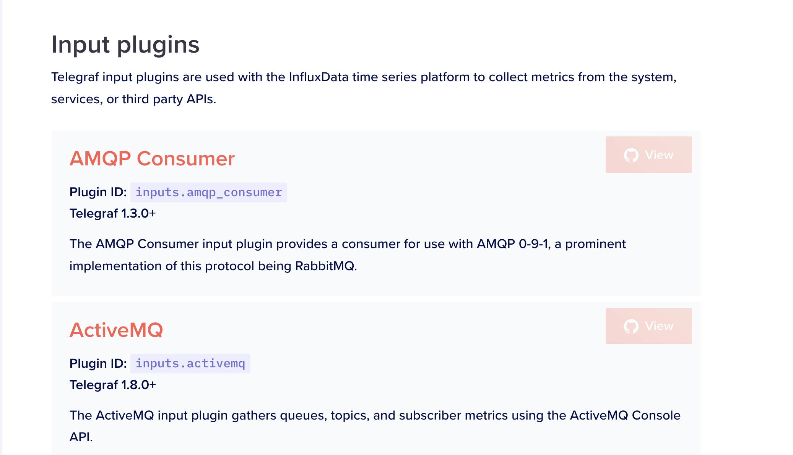

## 背景

因为最近需要开发一个新的exporter，这个exporter就是在每台服务器上运行，exporter读取机器的一些信息然后将信息传输到远程，比如调用某个HTTP POST接口将信息传送给远程的服务器，或者存储到远程的数据库。

目前决定不从零开发exporter，而是在telegraf的基础上二次开发。因为telegraf支持的input插件不包括kafka，所以需要自行开发kafka input插件。

之前公司用的kafka exporter是https://github.com/danielqsj/kafka_exporter，现在公司会用这个exporter读取kafka指标然后暴露metrics API给Prometheus。

现在可以考虑先阅读下https://github.com/danielqsj/kafka_exporter的源码，因为源码包括两个部分：分别是读取kafka的指标，暴露metrics接口给Prometheus以用于Prometheus调用metrics读取到kafka的指标。显然阅读的时候只需要关注读取kafka的指标这一部分即可，因为笔者对kafka的架构不熟悉不知道要读取哪些指标和这些指标应该如何获取。

在了解了https://github.com/danielqsj/kafka_exporter如何读取kafka指标后，可以参考其读取的方法，将读取方法“复制”到telegraf的kafka input插件中。

## 基本概念

### kafka

kafka 是由 Apache 软件基金会开发的一个高吞吐量的分布式**消息队列系统**。它主要用于处理大规模的实时数据流，例如日志、事件、指标等。Kafka 设计用来解决传统消息中间件面临的问题，如低吞吐量、高延迟和可靠性不足等。

### zookeeper

这里主要关注kafka与zookeeper的关系，因为https://github.com/danielqsj/kafka_exporter涉及到了zookeeper。

kafka会用到zookeeper，有以下几个原因：

（1）Kafka集群通过Zookeeper来管理kafka的配置，选举leader；

（2）在Consumer Group发生变化时进行rebalance

（3）所有的topic与broker的对应关系都由zk维护

2.kafka的哪些组件需要注册到zookeeper

（1）Broker注册到zk

（2）Topic注册到zk

（3）Consumer注册到zk

producer（生产者）不注册到zookeeper是因为生产者的状态是瞬间状态，发送完消息就可以宕机了。
 3.kafka和zookeeper的理解

**kafka使用zookeeper来实现动态的集群扩展，不需要更改客户端（producer和consumer）的配置。**broker会在zookeeper注册并保持相关的元数据（topic，partition信息等）更新。

但是发送给Topic本身的数据是不会发到Zk上的。

### telegraf

Telegraf 是一个开源的、插件驱动的服务器代理程序，用于收集、处理和传输指标数据。它是 InfluxData 公司开发的一个组件，主要用于监控和数据收集。Telegraf 的设计目标是轻量级、高效和易于扩展，它可以用于从各种数据源采集指标数据，然后将这些数据传输到不同的目标存储或可视化工具中。

源代码地址为：https://github.com/influxdata/telegraf。

Telegraf最大的特点是支持插件式的二次开发，Telegraf有输入插件、输出插件、处理（processors）插件等多种插件。

Telegraf还可以**设置采集数据的周期**，以固定的时间间隔定期从数据源获取指标数据。

telegraf默认情况下已经实现了对很多对象的指标采集，比如Clickhouse，CPU，Docker等，具体可看：https://docs.influxdata.com/telegraf/v1.14/plugins/plugin-list/ 的Input plugins部分：



## kafka exporter源码阅读

因为这个项目使用到了go vendor这种比较老的管理第三方依赖库的机制，所以笔者先删掉了vendor模块该用go mod模块管理系统作为第三方依赖库的管理工具。

这个项目主要使用的三方库有：

https://github.com/prometheus/client_golang：这是普罗米修斯的官方Go客户端。

https://github.com/IBM/sarama：这个是Apache Kafka的官方Go客户端。

https://github.com/krallistic/kazoo-go：Kazoo 是一个与 Zookeeper 中的 Kafka 元数据交互的库。 它提供集群代理、主题元数据和消费者组的发现。

这个项目的目录结构比较简单，主要逻辑就是在`kafka_exporter.go`文件里。下面依次介绍一些比较关键的代码段：

```go
	exporter, err := NewExporter(opts, topicFilter, topicExclude, groupFilter, groupExclude)
	if err != nil {
		klog.Fatalln(err)
	}
	defer exporter.client.Close()
	// 注册prometheus收集器，需要实现下面的接口
	// Describe(chan<- *Desc)
	// Collect(chan<- Metric)
	prometheus.MustRegister(exporter)
```

prometheus.MustRegister接收的是一个interface，定义如下：

```go
type Collector interface {
	Describe(chan<- *Desc)
	Collect(chan<- Metric)
}
```

首先查看NewExporter返回的Exporter struct是如何实现Collect方法的。

```go
func (e *Exporter) Collect(ch chan<- prometheus.Metric) {
	if e.allowConcurrent {
		e.collect(ch)
		return
	}
	// allowConcurrent 默认为 false
	// Locking to avoid race add
	e.sgMutex.Lock()
	// 把输入的参数 ch 追加到了 sgChans，后面应该会对 sgChans 更改吧
	e.sgChans = append(e.sgChans, ch)
	// Safe to compare length since we own the Lock
	fmt.Println(".....len(e.sgChans).......", len(e.sgChans))
	//  len(e.sgChans) 如果请求在同时进行的话就不是 1，如果只有 1 个请求的话就是 1
	if len(e.sgChans) == 1 {
		e.sgWaitCh = make(chan struct{})
		go e.collectChans(e.sgWaitCh)
	} else {
		klog.V(TRACE).Info("concurrent calls detected, waiting for first to finish")
	}
	// Put in another variable to ensure not overwriting it in another Collect once we wait
	waiter := e.sgWaitCh
	e.sgMutex.Unlock()
	// Released lock, we have insurance that our chan will be part of the collectChan slice
	<-waiter
	// collectChan finished
}
```

关注collect方法。

```go
func (e *Exporter) collect(ch chan<- prometheus.Metric) {
	// 这部分应该比较关注 ch <-  的操作，也就是往返回数据写入了什么数据
	// 好像每请求一次 metrics 接口就会调用一次这个 collect 函数
	fmt.Println("......... collect(ch chan<- prometheus.Metric) {...")
	var wg = sync.WaitGroup{}
	ch <- prometheus.MustNewConstMetric(
		// client 就是  sarama.NewClient 获取的，sarama 是一个 Apacha Kafka的Go client，通过它可以获取 kafka 的一些信息
		clusterBrokers, prometheus.GaugeValue, float64(len(e.client.Brokers())),
	)
	for _, b := range e.client.Brokers() {
		ch <- prometheus.MustNewConstMetric(
			clusterBrokerInfo, prometheus.GaugeValue, 1, strconv.Itoa(int(b.ID())), b.Addr(),
		)
	}
	...
  // client是kafka的client，调用client即kafka客户端库，获取kafka的topic之后对于每个topic，获取其详情组成指标，传入ch
  topics, err := e.client.Topics()
	if err != nil {
		klog.Errorf("Cannot get topics: %v", err)
		return
	}
  ...
	getTopicMetrics := func(topic string) {
		defer wg.Done()

		if !e.topicFilter.MatchString(topic) || e.topicExclude.MatchString(topic) {
			return
		}

		// topic 的分区
		partitions, err := e.client.Partitions(topic)
		if err != nil {
			klog.Errorf("Cannot get partitions of topic %s: %v", topic, err)
			return
		}
		ch <- prometheus.MustNewConstMetric(
			// topic 分区指标
			topicPartitions, prometheus.GaugeValue, float64(len(partitions)), topic,
		)
  ...
```

collect的逻辑就是不断往ch里写不同类型的普罗米修斯指标，在allowConcurrent的情况下，这个ch实际上就是`func (e *Exporter) Collect(ch chan<- prometheus.Metric) `的参数ch。

> 总的逻辑还是挺简单的，代码的主要实现逻辑就是通过Kafka的Go客户端连接到Kafka集群后，获取到kafka信息，再将信息通过类似`prometheus.MustNewConstMetric`这样的新建普罗米修斯指标的信息来将信息补充到指标中。kafka信息包括有多少个Topic，Broker，分区等等。

## 开发telegraf kafka的input插件

要实现telegraf的input插件，需要实现Gather接口，可以参考[官方文档](https://github.com/influxdata/telegraf/blob/master/docs/INPUTS.md)：

在custom-telegraf/plugins/inputs新建目录，如simple；

在simple目录中新建simple.go文件：

```go
//go:generate ../../../tools/readme_config_includer/generator
package a_simple

import (
	_ "embed"
	"time"

	"github.com/influxdata/telegraf"
	"github.com/influxdata/telegraf/plugins/inputs"
)

//go:embed sample.conf
var sampleConfig string

type Simple struct {
	Ok  bool            `toml:"ok"`
	Log telegraf.Logger `toml:"-"`
}

func (*Simple) SampleConfig() string {
	return sampleConfig
}


// Init is for setup, and validating config.
func (s *Simple) Init() error {
	return nil
}

func (s *Simple) Gather(acc telegraf.Accumulator) error {
	if s.Ok {
		acc.AddCounter("state", map[string]interface{}{"value0": 12}, map[string]string{})
		acc.AddCounter("state", map[string]interface{}{"value": 2}, map[string]string{}, time.Now())
		acc.AddCounter("state", map[string]interface{}{"value1": 2, "value2": 2}, map[string]string{}, time.Now())
		acc.AddCounter("state", map[string]interface{}{"value3": 3, "value4": 2}, map[string]string{"filed": "value"}, time.Now())
	} else {
		acc.AddFields("state", map[string]interface{}{"value": "not great"}, nil)
	}
	return nil
}

func init() {
	inputs.Add("simple", func() telegraf.Input { return &Simple{} })
}
```

`toml:"ok"`后缀表示需要名为ok的配置字段名。

在simple目录中新建对应的配置文件sample.conf：

```conf
[[inputs.simple]]
  ok = true
```

在simple目录中新建README.md，这个文件可以为空。

新建custom-telegraf/plugins/inputs/all/simple.go文件：

```go
//go:build !custom || inputs || inputs.simple

package all

import _ "github.com/influxdata/telegraf/plugins/inputs/a_simple" // register plugin
```

至此修改完毕，下面在运行时使用的配置文件config.conf新增如下内容：

```conf
[[inputs.simple]]
  ok = true
```

执行：

```
cd cmd/telegraf
go run . --config ../../config.conf --test --input-filter simple
```

运行结果为：

```shell
go run . --config ../../z_tele.conf --test --input-filter simple
2023-08-16T10:09:41Z I! Loading config: ../../config.conf
2023-08-16T10:09:41Z I! Starting Telegraf unknown
2023-08-16T10:09:41Z I! Available plugins: 242 inputs, 9 aggregators, 28 processors, 23 parsers, 59 outputs, 4 secret-stores
2023-08-16T10:09:41Z I! Loaded inputs: simple (2x)
2023-08-16T10:09:41Z I! Loaded aggregators:
2023-08-16T10:09:41Z I! Loaded processors:
2023-08-16T10:09:41Z I! Loaded secretstores:
2023-08-16T10:09:41Z W! Outputs are not used in testing mode!
2023-08-16T10:09:41Z I! Tags enabled: host=Rhetts-MacBook-Pro.local
> state,host=Rhetts-MacBook-Pro.local value0=12i 1692180582000000000
> state,host=Rhetts-MacBook-Pro.local value0=12i 1692180582000000000
> state,host=Rhetts-MacBook-Pro.local value=2i 1692180582000000000
> state,host=Rhetts-MacBook-Pro.local value=2i 1692180582000000000
> state,host=Rhetts-MacBook-Pro.local value1=2i,value2=2i 1692180582000000000
> state,host=Rhetts-MacBook-Pro.local value1=2i,value2=2i 1692180582000000000
> state,filed=value,host=Rhetts-MacBook-Pro.local value3=3i,value4=2i 1692180582000000000
> state,filed=value,host=Rhetts-MacBook-Pro.local value3=3i,value4=2i 1692180582000000000
```

这样打印出来了新增的一些指标。

主要就是参考`func (e *Exporter) collect(ch chan<- prometheus.Metric)`函数的实现，使用的实现指标的方法为 `acc.AddCounter(matches[1], tm.Fields(), tags, tm.Time())`。

