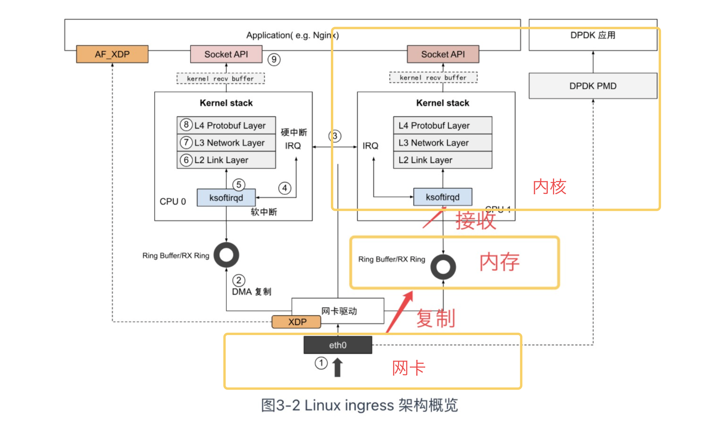

参考文章 https://www.thebyte.com.cn/



Netfilter 实际上就是一个过滤器框架，Netfilter 在网络包收发以及路由的“管道”中，一共切了 5 个口（hook），分别是 PREROUTING、FORWARD、POSTROUTING、INPUT 以及 OUTPUT，其它内核模块(例如 iptables、IPVS 等)可以向这些 hook 点注册处理函数。每当有数据包留到网络层，就会自动触发内核模块注册在这里的回调函数，这样程序代码就能够通过回调函数来干预 Linux 的网络通信，进而实现对数据包过滤、修改、SNAT/DNAT 等各类功能。

> - **PREROUTING:** 接收到的包进入协议栈后立即触发此链，在进行任何路由判断（将包发往哪里）之前。
> - **INPUT:** 接收到的包经过路由判断，如果目的是本机，将触发此链。
> - **FORWARD** 接收到的包经过路由判断，如果目的是其他机器，将触发此链。
> - **OUTPUT:** 本机产生的准备发送的包，在进入协议栈后立即触发此链。
> - **POSTROUTING:** 本机产生的准备发送的包或者转发的包，在经过路由判断之后，将触发此链。

Linux 网络协议栈的处理是一套相对固定和封闭的流程，整套处理过程中，除了网络设备层能看到一点点程序以设备的形式介入处理的空间外，其他过程似乎就没有什么可提供程序插手的空间了。然而事实并非如此，

从 Linux 内核 2.4 版本起，内核就开放了一套通用的，可提供代码干预数据在协议栈流转的过滤框架 -- Netfilter

iptables通常是系统自带的防火墙，

支持RSS的网卡数据并行能力的优化：

如果在多核 CPU 的服务器上，网卡内部会有多个 Ring Buffer，网卡负责将传进来的数据分配给不同的 Ring Buffer，同时触发的中断也可以分配到多个 CPU 上处理，这样存在多个 Ring Buffer 的情况下 Ring Buffer 缓存的数据也同时被多个 CPU 处理，就能提高数据的并行处理能力。

要实现“网卡负责将传进来的数据分配给不同的 Ring Buffer”，网卡必须支持 Receive Side Scaling(RSS) 或者叫做 multiqueue 的功能。

查看网卡是否支持RSS：

```shell
ethtool -k  eth0|grep receive-hashing
receive-hashing: off [fixed]
```

这是我的输出结果。 `off` 表示接收哈希功能被禁用，而 `[fixed]` 表示该参数是固定的，无法通过修改网卡的配置来改变。

如果支持，可以参考[链接](https://www.thebyte.com.cn/network/RSS.html#_2-2-%E9%98%9F%E5%88%97%E5%A4%A7%E5%B0%8F%E8%B0%83%E6%95%B4)进行RSS的多队列调整和队列大小调整。


由于 TCP 双全工的特性，安全关闭一个连接需要四次挥手，如图 3-17 所示。但复杂的网络环境中存在很多异常情况，异常断开连接会导致产生“孤儿连”，**这种连接既不能发送数据，也无法接收数据，累计过多，会消耗大量系统资源，资源不足时产生 Address already in use: connect 类似的错误。**

也可以调整一些和TCP握手挥手相关的配置，参考[文章](https://www.thebyte.com.cn/network/netstack-performance.html)


高并发下网络协议栈的冗长流程是最主要的性能负担，也就是说**内核才是高并发的瓶颈所在。**


应用程序比如浏览器、电子邮件、文件传输服务器等产生的数据，会通过传输层协议进行传输，而应用程序是不会和传输层直接建立联系的，而是有一个能够连接应用层和传输层之间的套件，这个套件就是 `Socket`。

`netstat`命令用于显示所有的IP。从netstat命令可以看出，一个套接字就是五元组（协议、本地地址、外部地址、状态、PID）。有的时候也被叫做四元组，四元组不包括协议。


How does the AF_PACKET socket work in Linux?：https://stackoverflow.com/questions/62866943/how-does-the-af-packet-socket-work-in-linux

https://stackoverflow.com/questions/829455/iptables-and-libpcap：

Yes, libpcap sees all the packets.. They are being captured before being processed by the netfilter.


https://superuser.com/questions/925286/does-tcpdump-bypass-iptables：

tcpdump的运行路径：

```shell
Wire -> NIC -> tcpdump -> netfilter/iptables

iptables -> tcpdump -> NIC -> Wire
```

也许我应该添加一些细节。 tcpdump 基于 libpcap，一个创建数据包套接字的库。 当网络堆栈中收到常规数据包时，内核首先检查是否存在对新到达的数据包感兴趣的数据包套接字，如果有，则将数据包转发到该数据包套接字。 如果选择 ETH_P_ALL 选项，则所有协议都通过数据包套接字。

libpcap 实现了一个这样的数据包套接字，并激活了该选项，保留一份副本供自己使用，并将数据包复制回网络堆栈，由内核以通常的方式处理，包括首先将其传递给内核 netfilter -space 与 iptables 相对应。 同样的事情，以相反的顺序（即，第一个网络过滤器，然后最后一个通过数据包套接字的通道），在出去。

这容易被黑客攻击吗？ 但是当然。 当然，有一些概念验证的 Rootkit 使用 libpcap 在防火墙攻击它们之前拦截发往 Rootkit 的通信。 但即便如此，与一个简单的 Google 查询甚至可以从 libpcap 中挖掘出隐藏流量的工作代码这一事实相比，这还是相形见绌的。 尽管如此，大多数专业人士认为在调试网络数据包过滤器时优点远远超过缺点。


AF_PACKET 是面向链路层的套接字


同一个计算机中不同的程序会和同一个TCP/IP协议的端口交互，为了区别不同的应用程序进程和连接，许多计算机操作系统为应用程序与TCP/IP协议交互提供了称为套接字(Socket)的接口。

linux以文件的形式实现套接口，与套接口相应的文件属于sockfs特殊文件系统，创建一个套接口就是在sockfs中创建一个特殊文件，并建立起为实现套接口功能的相关数据结构。换句话说，对每一个新创建的套接字，linux内核都将在sockfs特殊文件系统中创建一个新的inode。

套接字有本地套接字和网络套接字两种。本地套接字的名字是Linux文件系统中的文件名，一般放在/tmp或/usr/tmp目录中；网络套接字的名字是与客户连接的特定网络有关的服务标识符（端口号或访问点）。这

常用的TCP/IP协议的3种套接字类型如下所示：

流套接字（SOCK_STREAM）：流套接字用于提供面向连接、可靠的数据传输服务。流套接字之所以能够实现可靠的数据服务，原因在于其使用了传输控制协议，即TCP（The Transmission Control Protocol）协议。

数据报套接字（SOCK_DGRAM）：数据报套接字提供了一种无连接的服务。该服务并不能保证数据传输的可靠性，数据有可能在传输过程中丢失或出现数据重复，且无法保证顺序地接收到数据。数据报套接字使用UDP（User Datagram Protocol）协议进行数据的传输。

原始套接字（SOCK_RAW）：允许对较低层次的协议直接访问，比如IP、 ICMP协议

用户使用socket系统调用编写应用程序时，通过一个数字来表示一个socket，所有的操作都在该数字上进行，这个数字称为**套接字描述符**。

基本接口函数：

创建套接字的函数socket( )，可以指定不同的参数创建不同的socket描述符。

```c
int socket( int domain,   /*  创建的套接字的协议族, AF_XXX */
            int type,     /*  创建的套接字的类型, SOCK_XXX  */
            int protocol);/* 创建的套接字的协议，与type有关  */
```

domain表示协议族，常用的协议族有，AF_INET、AF_INET6、AF_LOCAL（或称AF_UNIX，Unix域socket）、AF_ROUTE等等。协议族决定了socket的地址类型，在通信中必须采用对应的地址，如AF_INET决定了要用ipv4地址（32位的）与端口号（16位的）的组合、AF_UNIX决定了要用一个绝对路径名作为地址。

type，指定socket类型。常用的socket类型有，SOCK_STREAM、SOCK_DGRAM、SOCK_RAW、SOCK_PACKET、SOCK_SEQPACKET等等。

protocol，故名思意，就是指定协议。常用的协议有，IPPROTO_TCP、IPPTOTO_UDP、IPPROTO_SCTP、IPPROTO_TIPC等，它们分别对应TCP传输协议、UDP传输协议、STCP传输协议、TIPC传输协议。

通过socket调用创建的套接字必须经过命名（绑定地址）后才能使用。

如果作为一个服务器，在调用socket()、bind()之后就会调用listen()来监听这个socket。
如果客户端这时调用connect()发出连接请求，服务器端就会接收到这个请求。

参考

https://blog.csdn.net/gatieme/article/details/46241975

https://lishiwen4.github.io/network/raw-socket
