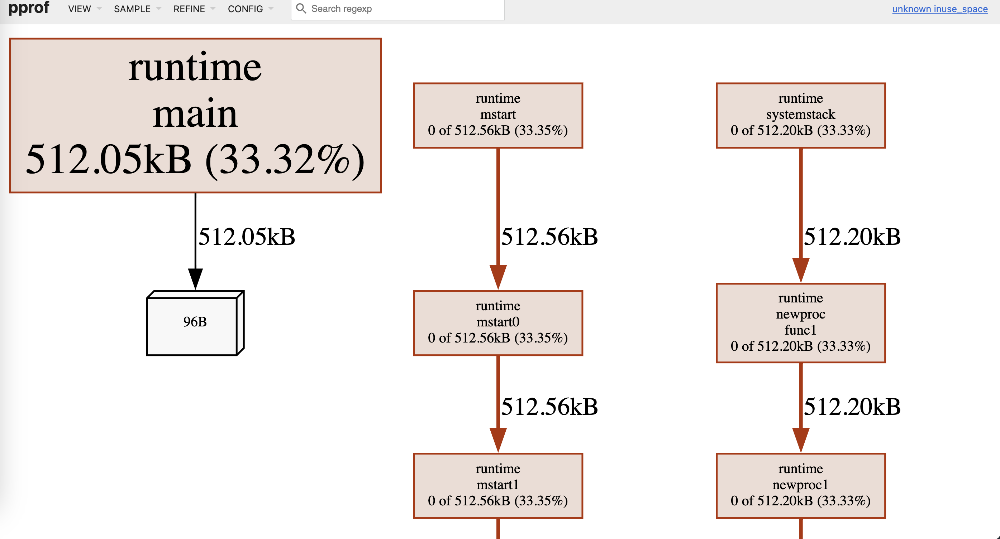
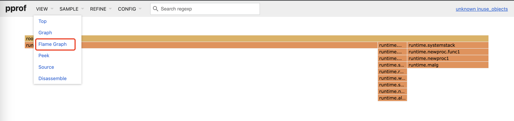

## 作用

pprof可以用来分析程序的性能，pprof可以指定不同的监控指标，所有指标如下：

- profile：查看CPU占用率的，这是最常使用的一种类型。用于找出哪些函数或代码片段消耗了大量的 CPU 时间。
- heap：也常使用。用于分析程序的内存使用情况；
- allocs：总体的内存使用情况，包括正在使用的内存和已经回收了的内存。
- goroutine：查看goroutine数量，运行情况等。
- mutex：锁竞争情况
- block：协程阻塞情况

如果在程序里启动pprof http端口，比如端口为8080，那么通过 http://localhost:8080/debug/pprof/ 可以查看内存占用率，最后一个参数代表监控指标，把最后的pprof换成alloc就可以查看总体的内存使用情况。

## 使用

### 基本使用

#### 启动

引用pprof包

单独启动一个pprof的HTTP服务，如果之前没有启动http服务，可以启动一个pprof的单独goroutine，如下：

```go
go func() {
	http.ListenAndServe("localhost:6060", nil)
}()
```

比如下面之前没有启动http服务，下面的代码没有启动单独的goroutine而是只启动了一个可以pprof的服务：

```go
package main

import (
	"net/http"
	_ "net/http/pprof"
)

func main() {
	http.ListenAndServe("localhost:8080", nil) // Start the HTTP server on port 8080
}
```

如果之前已经启动了http服务，那么在http服务的/debug/pprof路由可以查看pprof的结果，如下：

```go
package main

import (
	"fmt"
	"net/http"
	_ "net/http/pprof"
)

func main() {
	http.HandleFunc("/", func(w http.ResponseWriter, r *http.Request) {
		fmt.Fprint(w, "Hello, World!") // Send "Hello, World!" as the response
	})
	http.ListenAndServe("localhost:8080", nil) // Start the HTTP server on port 8080
}
```

#### 查看

程序启动后，查看 http://localhost:8080/debug/pprof，可以看到


查看 http://localhost:8080/debug/pprof/goroutine?debug=1，可以看到程序中有多少个goroutine

> 比如查看http://localhost:8080/debug/pprof/goroutine?debug=1显示的结果如下：
>
> ```shell
> goroutine profile: total 16
> 1 @ 0x4007e9c 0x456c52c 0x456f2f0 0x456f259 0x4569e92 0x4569cde 0x44f1c2b 0x44f1e4a 0x4072f41
> #	0x456c52b	github.com/google/gopacket/pcap._Cfunc_pcap_next_ex_escaping+0x4b	_cgo_gotypes.go:568
> #	0x456f2ef	github.com/google/gopacket/pcap.(*Handle).pcapNextPacketEx.func1+0x6f	/Users/ahah/.gvm/pkgsets/go1.19/global/pkg/mod/github.com/google/gopacket@v1.1.19/pcap/pcap_unix.go:398
> #	0x456f258	github.com/google/gopacket/pcap.(*Handle).pcapNextPacketEx+0x18		/Users/ahah/.gvm/pkgsets/go1.19/global/pkg/mod/github.com/google/gopacket@v1.1.19/pcap/pcap_unix.go:398
> #	0x4569e91	github.com/google/gopacket/pcap.(*Handle).getNextBufPtrLocked+0x71	/Users/ahah/.gvm/pkgsets/go1.19/global/pkg/mod/github.com/google/gopacket@v1.1.19/pcap/pcap.go:312
> #	0x4569cdd	github.com/google/gopacket/pcap.(*Handle).ReadPacketData+0x7d		/Users/ahah/.gvm/pkgsets/go1.19/global/pkg/mod/github.com/google/gopacket@v1.1.19/pcap/pcap.go:252
> #	0x44f1c2a	github.com/google/gopacket.(*PacketSource).NextPacket+0x6a		/Users/ahah/.gvm/pkgsets/go1.19/global/pkg/mod/github.com/google/gopacket@v1.1.19/packet.go:801
> #	0x44f1e49	github.com/google/gopacket.(*PacketSource).packetsToChannel+0x69	/Users/ahah/.gvm/pkgsets/go1.19/global/pkg/mod/github.com/google/gopacket@v1.1.19/packet.go:818
> 
> 1 @ 0x4034e96 0x406c2c5 0x486a9b5 0x486a7cd 0x486774b 0x49da2e5 0x49dae7e 0x43ab62f 0x43ad349 0x43aef0c 0x43aa107 0x4072f41
> #	0x406c2c4	runtime/pprof.runtime_goroutineProfileWithLabels+0x24	/Users/ahah/.gvm/gos/go1.19/src/runtime/mprof.go:846
> #	0x486a9b4	runtime/pprof.writeRuntimeProfile+0xb4			/Users/ahah/.gvm/gos/go1.19/src/runtime/pprof/pprof.go:723
> #	0x486a7cc	runtime/pprof.writeGoroutine+0x4c			/Users/ahah/.gvm/gos/go1.19/src/runtime/pprof/pprof.go:683
> #	0x486774a	runtime/pprof.(*Profile).WriteTo+0x14a			/Users/ahah/.gvm/gos/go1.19/src/runtime/pprof/pprof.go:330
> #	0x49da2e4	net/http/pprof.handler.ServeHTTP+0x4a4			/Users/ahah/.gvm/gos/go1.19/src/net/http/pprof/pprof.go:253
> #	0x49dae7d	net/http/pprof.Index+0x13d				/Users/ahah/.gvm/gos/go1.19/src/net/http/pprof/pprof.go:371
> #	0x43ab62e	net/http.HandlerFunc.ServeHTTP+0x2e			/Users/ahah/.gvm/gos/go1.19/src/net/http/server.go:2109
> #	0x43ad348	net/http.(*ServeMux).ServeHTTP+0x148			/Users/ahah/.gvm/gos/go1.19/src/net/http/server.go:2487
> #	0x43aef0b	net/http.serverHandler.ServeHTTP+0x30b			/Users/ahah/.gvm/gos/go1.19/src/net/http/server.go:2947
> #	0x43aa106	net/http.(*conn).serve+0x606				/Users/ahah/.gvm/gos/go1.19/src/net/http/server.go:1991
> 
> 1 @ 0x4039fde 0x406ee88 0x49dc999 0x4072f41
> #	0x406ee87	os/signal.signal_recv+0x27	/Users/ahah/.gvm/gos/go1.19/src/runtime/sigqueue.go:149
> #	0x49dc998	os/signal.loop+0x18		/Users/ahah/.gvm/gos/go1.19/src/os/signal/signal_unix.go:23
> 
> 1 @ 0x4040176 0x400ae9b 0x400a998 0x49b9dc6 0x49dd32e 0x4072f41
> #	0x49b9dc5	sincerecloud.com/flora-gopacket-service/input.(*InputBox).Beat+0x65	/Users/ahah/MyLocalFile/aWork/code/flora-gopacket-service/input/input_box.go:26
> #	0x49dd32d	main.Inputs.start.func1+0x6d						/Users/ahah/MyLocalFile/aWork/code/flora-gopacket-service/inputs.go:47
> 
> 1 @ 0x4040176 0x400ae9b 0x400a998 0x49dd874 0x403fdb2 0x4072f41
> #	0x49dd873	main.main+0x333		/Users/ahah/MyLocalFile/aWork/code/flora-gopacket-service/main.go:80
> #	0x403fdb1	runtime.main+0x211	/Users/ahah/.gvm/gos/go1.19/src/runtime/proc.go:250
> 
> 1 @ 0x4040176 0x400ae9b 0x400a998 0x49ddd94 0x4072f41
> #	0x49ddd93	main.listenSignal+0xb3	/Users/ahah/MyLocalFile/aWork/code/flora-gopacket-service/main.go:89
> 
> 1 @ 0x4040176 0x400ae9b 0x400a9d8 0x44e7825 0x4072f41
> #	0x44e7824	gopkg.in/natefinch/lumberjack%2ev2.(*Logger).millRun+0x44	/Users/ahah/.gvm/pkgsets/go1.19/global/pkg/mod/gopkg.in/natefinch/lumberjack.v2@v2.0.0/lumberjack.go:379
> 
> 1 @ 0x4040176 0x400ae9b 0x400a9d8 0x49dda25 0x4072f41
> #	0x49dda24	main.main.func2+0x64	/Users/ahah/MyLocalFile/aWork/code/flora-gopacket-service/main.go:61
> 
> 1 @ 0x4040176 0x4038e17 0x406c6c9 0x40e67b2 0x40ebbb4 0x40ebba1 0x415f895 0x41790e8 0x417817d 0x43af545 0x43af09d 0x49dd4c5 0x49dd499 0x4072f41
> #	0x406c6c8	internal/poll.runtime_pollWait+0x88		/Users/ahah/.gvm/gos/go1.19/src/runtime/netpoll.go:305
> #	0x40e67b1	internal/poll.(*pollDesc).wait+0x31		/Users/ahah/.gvm/gos/go1.19/src/internal/poll/fd_poll_runtime.go:84
> #	0x40ebbb3	internal/poll.(*pollDesc).waitRead+0x233	/Users/ahah/.gvm/gos/go1.19/src/internal/poll/fd_poll_runtime.go:89
> #	0x40ebba0	internal/poll.(*FD).Accept+0x220		/Users/ahah/.gvm/gos/go1.19/src/internal/poll/fd_unix.go:614
> #	0x415f894	net.(*netFD).accept+0x34			/Users/ahah/.gvm/gos/go1.19/src/net/fd_unix.go:172
> #	0x41790e7	net.(*TCPListener).accept+0x27			/Users/ahah/.gvm/gos/go1.19/src/net/tcpsock_posix.go:142
> #	0x417817c	net.(*TCPListener).Accept+0x3c			/Users/ahah/.gvm/gos/go1.19/src/net/tcpsock.go:288
> #	0x43af544	net/http.(*Server).Serve+0x384			/Users/ahah/.gvm/gos/go1.19/src/net/http/server.go:3070
> #	0x43af09c	net/http.(*Server).ListenAndServe+0x7c		/Users/ahah/.gvm/gos/go1.19/src/net/http/server.go:2999
> #	0x49dd4c4	net/http.ListenAndServe+0x44			/Users/ahah/.gvm/gos/go1.19/src/net/http/server.go:3255
> #	0x49dd498	main.main.func1+0x18				/Users/ahah/MyLocalFile/aWork/code/flora-gopacket-service/main.go:32
> 
> 1 @ 0x4040176 0x405039c 0x4494b65 0x4072f41
> #	0x4494b64	github.com/spf13/viper.(*Viper).WatchConfig.func1.1+0x104	/Users/ahah/.gvm/pkgsets/go1.19/global/pkg/mod/github.com/spf13/viper@v1.15.0/viper.go:461
> 
> 1 @ 0x4040176 0x405039c 0x49b8cf8 0x4072f41
> #	0x49b8cf7	sincerecloud.com/flora-gopacket-service/input.(*packetCapturer).captureByDevice+0x437	/Users/ahah/MyLocalFile/aWork/code/flora-gopacket-service/input/capturer.go:125
> 
> 1 @ 0x4040176 0x405161e 0x40515f5 0x406e725 0x408d9f2 0x4494a05 0x4072f41
> #	0x406e724	sync.runtime_Semacquire+0x24				/Users/ahah/.gvm/gos/go1.19/src/runtime/sema.go:62
> #	0x408d9f1	sync.(*WaitGroup).Wait+0x51				/Users/ahah/.gvm/gos/go1.19/src/sync/waitgroup.go:139
> #	0x4494a04	github.com/spf13/viper.(*Viper).WatchConfig.func1+0x304	/Users/ahah/.gvm/pkgsets/go1.19/global/pkg/mod/github.com/spf13/viper@v1.15.0/viper.go:498
> 
> 1 @ 0x4040176 0x405161e 0x40515f5 0x406e725 0x408d9f2 0x49dd214 0x4072f41
> #	0x406e724	sync.runtime_Semacquire+0x24	/Users/ahah/.gvm/gos/go1.19/src/runtime/sema.go:62
> #	0x408d9f1	sync.(*WaitGroup).Wait+0x51	/Users/ahah/.gvm/gos/go1.19/src/sync/waitgroup.go:139
> #	0x49dd213	main.Inputs.start+0x133		/Users/ahah/MyLocalFile/aWork/code/flora-gopacket-service/inputs.go:50
> 
> 1 @ 0x406f799 0x4118952 0x41187dc 0x411c1a5 0x411ae4d 0x4072f41
> #	0x406f798	syscall.syscall6+0x98					/Users/ahah/.gvm/gos/go1.19/src/runtime/sys_darwin.go:44
> #	0x4118951	golang.org/x/sys/unix.kevent+0x51			/Users/ahah/.gvm/pkgsets/go1.19/global/pkg/mod/golang.org/x/sys@v0.3.0/unix/zsyscall_darwin_amd64.go:276
> #	0x41187db	golang.org/x/sys/unix.Kevent+0x3b			/Users/ahah/.gvm/pkgsets/go1.19/global/pkg/mod/golang.org/x/sys@v0.3.0/unix/syscall_bsd.go:399
> #	0x411c1a4	github.com/fsnotify/fsnotify.(*Watcher).read+0x44	/Users/ahah/.gvm/pkgsets/go1.19/global/pkg/mod/github.com/fsnotify/fsnotify@v1.6.0/backend_kqueue.go:702
> #	0x411ae4c	github.com/fsnotify/fsnotify.(*Watcher).readEvents+0xcc	/Users/ahah/.gvm/pkgsets/go1.19/global/pkg/mod/github.com/fsnotify/fsnotify@v1.6.0/backend_kqueue.go:487
> 
> 1 @ 0x4072f41
> 
> 1 @ 0x49bb1a5 0x49b9eb4 0x4072f41
> #	0x49bb1a4	sincerecloud.com/flora-gopacket-service/input.(*packetInput).ReadOneEvent+0x84	/Users/ahah/MyLocalFile/aWork/code/flora-gopacket-service/input/packet_input.go:99
> #	0x49b9eb3	sincerecloud.com/flora-gopacket-service/input.(*InputBox).beat+0x53		/Users/ahah/MyLocalFile/aWork/code/flora-gopacket-service/input/input_box.go:35
> ```
>
> 那么表示该程序共有16个goroutine，每个goroutine都是以`1 @ `开头的。

### CPU profiling（CPU分析）

`pprof` 的 CPU profiling 结果包括以下信息：

1. 函数耗时：可以看到每个函数在 CPU 上的运行耗时，包括累计 CPU 时间和 CPU 时间百分比。
2. 函数调用关系：可以查看函数之间的调用关系，了解函数之间的调用深度和调用频率。
3. 内联函数：可以看到哪些函数在编译时被内联展开，以及内联展开后的耗时。
4. 热点函数：可以查看耗时最高的函数，帮助你找到可能的性能瓶颈。
5. 执行栈信息：可以查看每个函数在被调用时的执行栈信息，帮助你定位耗时较高的代码路径。
6. 源代码位置：可以查看每个函数在源代码中的位置，帮助你定位到具体的代码行。

CPU profiling 结果可能会受到多种因素的影响，例如采样频率、运行环境等，因此在分析 profiling 结果时要结合实际情况进行综合判断。

pprof会分析pprof.StartCPUProfile()到pprof.StopCPUProfile()之间的所有代码，所以可以在StartCPUProfile执行defer StopCPUProfile，可以分析出StartCPUProfile后执行的所有代码。

StartCPUProfile接收一个io.Writer类型的参数，pprof会将分析的结果写到这个参数里。

**比如生产环境出问题了，经常会在用pprof诊断的时候把pprof的分析结果存储到文件里，然后再对文件进行分析。**

#### 启动

```go
package main

import (
	"fmt"
	"math/rand"
	"os"
	"runtime/pprof"
	"time"
)

func busyLoop() {
	for i := 0; i < 10000000; i++ {
		rand.Intn(100)
	}
}

func slowFunction() {
	time.Sleep(time.Second)
}

func main() {
	// 创建一个文件用于保存 profiling 数据
	f, err := os.Create("profile.prof")
	if err != nil {
		fmt.Println("无法创建文件:", err)
		return
	}
	defer f.Close()

	// 开始 CPU profiling
	err = pprof.StartCPUProfile(f)
	if err != nil {
		fmt.Println("无法开始 CPU profiling:", err)
		return
	}
	defer pprof.StopCPUProfile()

	// 模拟一个耗时的函数
	slowFunction()

	// 模拟一个消耗 CPU 的循环
	busyLoop()

	// 生成一些 profiling 数据
	for i := 0; i < 10; i++ {
		busyLoop()
	}

	fmt.Println("pprof 结果保存在 profile.prof 文件中。")
}
```

#### 查看与分析

程序执行完毕后，会生成一个profile.prof文件，可以分析这个文件来知晓刚刚执行的情况。

执行 `go tool pprof profile.prof`，会出现一个命令交互界面：

```shell
go tool pprof profile.prof
Type: cpu
Time: Apr 13, 2023 at 11:08am (CST)
Duration: 3.43s, Total samples = 2.01s (58.68%)
Entering interactive mode (type "help" for commands, "o" for options)
(pprof) 
```

可以输出一些命令，如输入top查看耗时最高的10个函数

```shell
go tool pprof profile.prof
Type: cpu
Time: Apr 13, 2023 at 11:08am (CST)
Duration: 3.43s, Total samples = 2.01s (58.68%)
Entering interactive mode (type "help" for commands, "o" for options)
(pprof) top
Showing nodes accounting for 2010ms, 100% of 2010ms total
Showing top 10 nodes out of 12
      flat  flat%   sum%        cum   cum%
     760ms 37.81% 37.81%     1340ms 66.67%  math/rand.(*lockedSource).Int63
     450ms 22.39% 60.20%     1790ms 89.05%  math/rand.(*Rand).Int31n
     450ms 22.39% 82.59%      450ms 22.39%  sync.(*Mutex).Unlock (inline)
     190ms  9.45% 92.04%     1980ms 98.51%  math/rand.(*Rand).Intn
      90ms  4.48% 96.52%       90ms  4.48%  math/rand.(*rngSource).Uint64 (inline)
      40ms  1.99% 98.51%      130ms  6.47%  math/rand.(*rngSource).Int63 (inline)
      30ms  1.49%   100%     2010ms   100%  main.busyLoop (inline)
         0     0%   100%     2010ms   100%  main.main
         0     0%   100%     1340ms 66.67%  math/rand.(*Rand).Int31 (inline)
         0     0%   100%     1340ms 66.67%  math/rand.(*Rand).Int63 (inline)
```

默认显示耗时最高的10个函数，也可以执行top1 top3这样的topN获取耗时最高的N个函数。

执行`list xx`查看函数某个函数的各个模块调用耗时：

```shell
(pprof) list main.busyLoop
Total: 2.22s
ROUTINE ======================== main.busyLoop in /Users/rhettnina/Downloads/test-git/a.go
      50ms      2.22s (flat, cum)   100% of Total
         .          .     11:func busyLoop() {
      50ms       50ms     12:   for i := 0; i < 10000000; i++ {
         .      2.17s     13:           rand.Intn(100)
         .          .     14:   }
         .          .     15:}
         .          .     16:
         .          .     17:func slowFunction() {
         .          .     18:   time.Sleep(time.Second)
```

PS：有的时候执行top显示为空，是因为因为启用 CPU profiling 之后，运行时每隔 10ms 会中断一次，记录每个 goroutine 当前执行的堆栈，以此来分析耗时。如果程序在10ms内执行完毕了，可能就不会记录到任何信息，所以top命令显示为空。

### Memory profiling（内存分析）

`pprof` 的 Memory profiling 结果包括以下信息：

1. 内存分配：可以查看每个函数或代码片段在内存中分配的对象数量、大小、内存分配的累计字节数等信息，帮助你了解每个函数的内存分配情况。
2. 内存使用：可以查看每个函数或代码片段在内存中使用的对象数量、大小、内存使用的累计字节数等信息，帮助你了解每个函数的内存使用情况。
3. 内存释放：可以查看每个函数或代码片段在内存中释放的对象数量、大小、内存释放的累计字节数等信息，帮助你了解每个函数的内存释放情况。
4. 内存分配堆栈：可以查看每个函数在内存分配时的堆栈信息，帮助你定位到内存分配较高的代码路径。
5. 内存使用堆栈：可以查看每个函数在内存使用时的堆栈信息，帮助你定位到内存使用较高的代码路径。

#### 启动

下面是两个比较常用的函数。

`pprof.Lookup("heap")`这是一个 pprof 提供的用于获取**堆内存分析数据的函数**。通过这个函数，我们可以获得用于 heap（堆）的 Memory profiling 数据。

`WriteTo(f, 0)`：这是将堆内存分析数据写入到文件（f）中的操作。`f` 是一个已经创建好的文件对象，`0` 是指导写入的标志位，其中 0 表示默认标志位，用于输出完整的内存分析数据。

```go
package main

import (
	"fmt"
	"os"
	"runtime/pprof"
)

func main() {
	// 创建一个文件用于存储 pprof 输出
	f, err := os.Create("mem.prof")
	if err != nil {
		fmt.Println("Failed to create profile file:", err)
		return
	}
	defer f.Close()

	// 开始 Memory profiling
	// WriteHeapProfile是Lookup("heap").WriteTo(w, 0)的缩写
	if err := pprof.WriteHeapProfile(f); err != nil {
		fmt.Println("Failed to start memory profiling:", err)
		return
	}
	// 模拟一个占用内存的操作
	var s []byte
	for i := 0; i < 1000000; i++ {
		s = append(s, byte(i))
	}
	// 结束 Memory profiling
	pprof.StopCPUProfile()
	fmt.Println("Memory profiling completed. Output saved to mem.prof")
}
```

#### 查看与分析

与上面的CPU profiling进行的运行时间分析不同，这里分析的是内存占用大小，所以数据统计维度是内存的占用大小。比如执行top会列出占用内存最多的函数，list 函数名会列出这个函数的各个部分占用了多少内存。

```shell
o tool pprof mem.prof  
Type: inuse_space
Time: Apr 13, 2023 at 2:36pm (CST)
Entering interactive mode (type "help" for commands, "o" for options)
(pprof) top
Showing nodes accounting for 1536.81kB, 100% of 1536.81kB total
Showing top 10 nodes out of 14
      flat  flat%   sum%        cum   cum%
  512.56kB 33.35% 33.35%   512.56kB 33.35%  runtime.allocm
  512.20kB 33.33% 66.68%   512.20kB 33.33%  runtime.malg
  512.05kB 33.32%   100%   512.05kB 33.32%  runtime.main
         0     0%   100%   512.56kB 33.35%  runtime.mstart
         0     0%   100%   512.56kB 33.35%  runtime.mstart0
         0     0%   100%   512.56kB 33.35%  runtime.mstart1
         0     0%   100%   512.56kB 33.35%  runtime.newm
         0     0%   100%   512.20kB 33.33%  runtime.newproc.func1
         0     0%   100%   512.20kB 33.33%  runtime.newproc1
         0     0%   100%   512.56kB 33.35%  runtime.resetspinning
(pprof) list runtime.allocm
Total: 1.50MB
ROUTINE ======================== runtime.allocm in /usr/local/Cellar/go@1.17/1.17.12/libexec/src/runtime/proc.go
  512.56kB   512.56kB (flat, cum) 33.35% of Total
         .          .   1870:           }
         .          .   1871:           sched.freem = newList
         .          .   1872:           unlock(&sched.lock)
         .          .   1873:   }
         .          .   1874:
  512.56kB   512.56kB   1875:   mp := new(m)
         .          .   1876:   mp.mstartfn = fn
         .          .   1877:   mcommoninit(mp, id)
         .          .   1878:
         .          .   1879:   // In case of cgo or Solaris or illumos or Darwin, pthread_create will make us a stack.
         .          .   1880:   // Windows and Plan 9 will layout sched stack on OS stack.
(pprof) list runtime.main
Total: 1.50MB
ROUTINE ======================== runtime.main in /usr/local/Cellar/go@1.17/1.17.12/libexec/src/runtime/proc.go
  512.05kB   512.05kB (flat, cum) 33.32% of Total
         .          .    211:           }
         .          .    212:   }()
         .          .    213:
         .          .    214:   gcenable()
         .          .    215:
  512.05kB   512.05kB    216:   main_init_done = make(chan bool)
         .          .    217:   if iscgo {
         .          .    218:           if _cgo_thread_start == nil {
         .          .    219:                   throw("_cgo_thread_start missing")
         .          .    220:           }
         .          .    221:           if GOOS != "windows" {
```

## 火焰图

### 简介

火焰图可以清楚看到上述的CPU profiling和Memory profiling二者的效果


### 使用

对于上述生成的分析文件，执行

```
go tool pprof -http :8080 cpu.profile
```

执行`brew install graphviz`，在 http://localhost:8080/ui/ 查看



可点击最上面的菜单View查看其他维度的分析。查看火焰图。



## 其他

关于CPU profiling和Memory profiling的三方包推荐 https://github.com/pkg/profile
