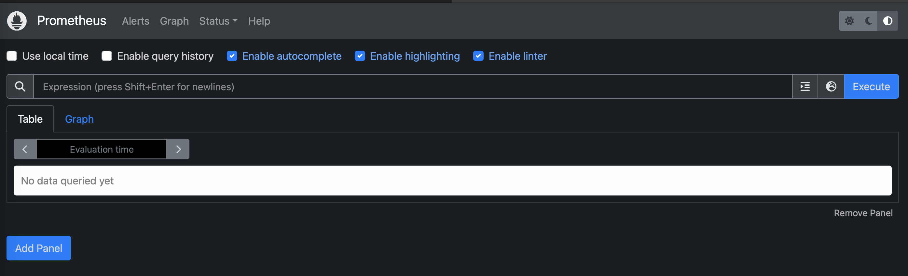
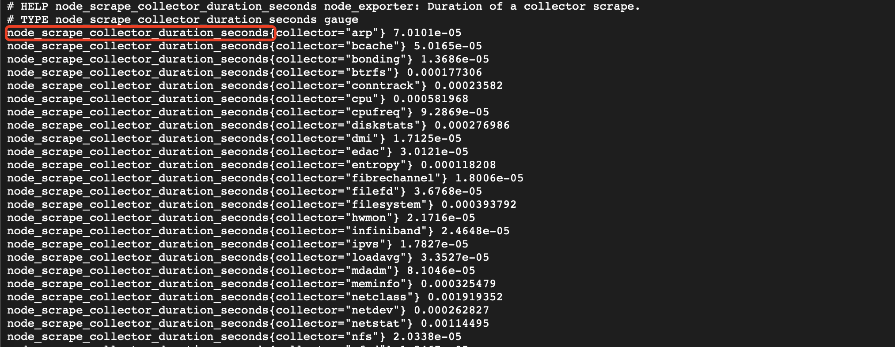
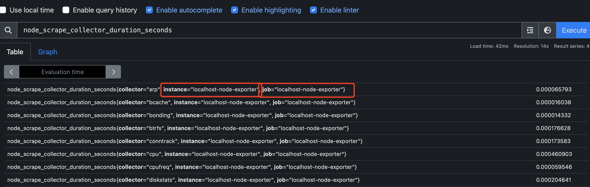

## 启动

```
prometheus --config.file=prometheus.yml
```

可以在 http://localhost:9090/metrics 查看prometheus的指标

http://localhost:9090 查看prometheus的状态

## 在浏览器中查询指标

在<http://localhost:9090/metrics>中操作

### 选择Table

选择Table，输入查询条件，可以查看<http://localhost:9090/metrics>返回的数据（当然也可以查看这个接口之外的数据，这部分没介绍暂时？？？？？？），查询条件可以为：

```
promhttp_metric_handler_requests_total
promhttp_metric_handler_requests_total{code="200"}
count(promhttp_metric_handler_requests_total)
```

关于查询条件的编写，可以参考[querying/basics](https://prometheus.io/docs/prometheus/latest/querying/basics/)

### 选择Grafana

```
rate(promhttp_metric_handler_requests_total{code="200"}[1m])
```

可以看到每秒返回状态码 200 的 HTTP 请求率（过去一分钟内每秒返回状态码 200 的 HTTP 请求率（以秒为单位））

## 原理相关


### prometheus如何获取数据

通过Pull的方式或者Push

Pull：通过exporter暴露的接口，prometheus定期调用该接口**Pull**数据

Push：可以将数据**Push**到Push Gateway，prometheus再通过**Pull**的方式从Push Gateway获取数据。可以把Push Gateway理解为一种特殊的exporter。

### prometheus的工作流程

1. Prometheus server 定期从静态配置的主机或服务发现的 targets 拉取数据（zookeeper，consul，DNS SRV Lookup等方式）

2. 当新拉取的数据大于配置内存缓存区的时候，Prometheus会将数据持久化到磁盘，也可以远程持久化到云端。

3. Prometheus通过PromQL、API、Console和其他可视化组件如Grafana、Promdash展示数据。

4. Prometheus 可以配置rules，然后定时查询数据，当条件触发的时候，会将告警推送到配置的Alertmanager。

5. Alertmanager收到告警的时候，会根据配置，聚合，去重，降噪，最后发出警告。

### 数据

#### 数据格式

prometheus采集的数据需要为如下的格式，即键值对

key{metadata}value （metadata也可以称为labels）

比如`node_disk_reads_completed_total{device="disk0", key2="2"} 3.0556147e+07`

> 可以看出，普罗米修斯的指标包括以下几个部分组成：
>
> **名称（Name）：** 指标的名称是一个字符串，用于唯一标识该指标。
>
> **标签（Labels）：** 标签是用于对指标进行分类和标记的键值对。
>
> **值（Value）：** 指标的值是一个浮点数，表示监控数据的具体数值。
>
> **指标类型（Type）：** 指标类型表示指标的性质
>
> **帮助文本（Help）：** 帮助文本是对指标的描述信息，用于帮助用户理解该指标的含义和用途。帮助文本通常提供了更详细的描述和解释。例如：`cpu_usage{instance="web_server_1", cpu="cpu0"}` 对应的帮助文本可以是 "CPU使用率（0到1之间）"。

#### 指标类型

**Counter(计数器)**

**Gauges**：处理随时间变化而变化的一些指标，比如内存变化。

**Histogram(直方图**) 可以看[官方](https://prometheus.io/docs/tutorials/understanding_metric_types/)给的例子，推荐使用

**Summary(摘要)**

**Gauges**：记录某个时刻对应的数值，类似：

```shell
myapp_data{time="2023-06-07 11:35:57"} 0.6046602879796196
myapp_data{time="2023-06-07 11:36:57"} 0.9405090880450124
```

可以根据时间time绘图，横坐标为时间，纵坐标为时间对应的指标值

#### PromQL

这是prometheus自己内置的SQL查询语言

PromQL会处理两种向量：

即时向量：当前时间某个指标的数据向量。

时间范围向量：某个时间段内，某个指标的数据向量。

#### 数据可视化

一般用grafana

## exporter

### 作用

exporter是用于采集数据的组件，被安装在采集目标上。

exporter采集数据后，传递数据给prometheus。主要传递方式是exporter会暴露一个HTTP接口，prometheus通过**Pull**的方式周期性的拉取数据。

server需要知道各种exporter的api地址且api返回的数据需要是规范化的。只要遵循规范， 可以根据需求开发出各种 exporter (比如专门采集redis数据的exporter需要在被调用的时候采集redis各项数据作为返回值， 同样采集mysql、linux、docker的exporter也是一样的工作原理， 还有其他的各种汇报数据的exporter，例如汇报机器数据的node_exporter，汇报MondogDB信息的 MongoDB_exporter 等等)。

prometheus的yml配置文件可以指定多个scrape_configs的targets

### 举例

#### Node Exporter

启动Node Exporter`node_exporter`，node_exporter在9100

`prometheus_node.yml`内容如下：

```
global:
  scrape_interval: 15s

scrape_configs:
- job_name: node
  static_configs:
  - targets: ['localhost:9100']
```

启动prometheus  `prometheus --config.file=./prometheus_node.yml`

可以在localhost:9090/graph查询到node_exporter的一些指标，比如node_exporter_build_info。node_exporter的指标可以通过<http://localhost:9100/metrics>查看

#### mysql exporter

通过`mysqld_exporter --config.my-cnf="mysql_exporter.cnf"`启动，启动后的部分日志为：

```
ts=2022-05-26T06:58:58.408Z caller=mysqld_exporter.go:303 level=info msg="Listening on address" address=:9104
```

可以看到端口号。

修改prometheus配置文件，在static_configs添加`['localhost:9104']`

```diff
    static_configs:
+      - targets: ['localhost:9104']
```

重启prometheus

#### redis exporter

启动`redis_exporter redis/localhost:6379 & -web.listenaddress localhost:9121`

修改prometheus配置文件，在static_configs添加`['localhost:9121']`

```diff
    static_configs:
+      - targets: ['localhost:9121']
```

重启prometheus

## grafana

普罗米修斯默认的页面没有很直观，安装grafana可以看起来更直观。

启动`brew services start grafana`

打开 http://localhost:3000 即可访问grafana

可以在<http://localhost:3000/d/UDdpyzz7z/prometheus-2-0-stats?orgId=1&refresh=1m看到prometheus>的整个监控信息

如果发现grafana一些面板需要插件才可以显示，使用`grafana-cli plugins install <plugin>`安装插件然后重启grafana查看面板。

----------

## linux部署

下面的操作基于我的虚拟机，一切都是实际操作

首先根据[参考](https://jingsam.github.io/2018/10/16/host-in-docker.html)查看ifconfig，找到docker0的信息：

```shell
docker0: flags=4163<UP,BROADCAST,RUNNING,MULTICAST>  mtu 1500
        inet 172.17.0.1  netmask 255.255.0.0  broadcast 172.17.255.255
        inet6 fe80::42:8aff:fe25:4455  prefixlen 64  scopeid 0x20<link>
        ether 02:42:8a:25:44:55  txqueuelen 0  (Ethernet)
        RX packets 78747  bytes 103664790 (98.8 MiB)
        RX errors 0  dropped 0  overruns 0  frame 0
        TX packets 103397  bytes 72780700 (69.4 MiB)
        TX errors 0  dropped 0 overruns 0  carrier 0  collisions 0
```

记住其IP地址172.17.0.1，下面会用。

> 因为在Linux下安装Docker的时候，会在宿主机安装一个虚拟网卡`docker0`，我们可以使用宿主机在`docker0`上的IP地址来代替`localhost`。
>
> **但是，在Windows和macOS平台下并没有`docker0`虚拟网卡，这时候可以使用`host.docker.internal`这个特殊的DNS名称来解析宿主机IP。**

### **Prometheus部署**

prometheus.yml文件示例：

```yaml
global:
  scrape_interval:     60s
  evaluation_interval: 60s

scrape_configs:
  - job_name: prometheus
    static_configs:
        #本地服务器加端口
      - targets: ['localhost:9090']
        labels:
          instance: prometheus
```

启动

```shell
docker run  -d \
  -p 9090:9090 \
  -v $PWD/prometheus.yml:/etc/prometheus/prometheus.yml  \
  --name prometheus \
  prom/prometheus
```

访问 http://localhost:9090 即可看到页面。



### **grafana部署**

新建一个存储grafana数据的目录

```shell
mkdir grafana
```

运行

```shell
docker run -d \
  -p 3000:3000 \
  --name=grafana \
  -v $PWD/grafana:/var/lib/grafana \
  --name grafana \
  grafana/grafana
```

运行的时候发现服务没有成功启动，根据容器ID查看日志：

```shell
docker inspect --format '{{.LogPath}}'  00000docker_id0000
```

根据输出结果，查看容器日志：

```
{"log":"GF_PATHS_DATA='/var/lib/grafana' is not writable.\n","stream":"stdout","time":"2023-03-28T07:55:02.969473242Z"}
{"log":"You may have issues with file permissions, more information here: http://docs.grafana.org/installation/docker/#migrate-to-v51-or-later\n","stream":"stdout","time":"2023-03-28T07:55:02.969536557Z"}
{"log":"mkdir: can't create directory '/var/lib/grafana/plugins': Permission denied\n","stream":"stderr","time":"2023-03-28T07:55:02.969907168Z"}
```

根据[文档](https://www.edureka.co/community/83970/cannot-create-directory-grafana-plugins-permission-denied#:~:text=You%20are%20getting%20this%20error,changes%20and%20rerun%20your%20command.)，发现报错是因为Grafana 需要具有 472 用户 ID 的用户。 但是还没有为用户/组 472 设置权限。执行

```
sudo chown -R 472:472 grafana/
```

再次重新启动docker，可以成功启动了。访问 http://localhost:3000 ，默认的用户名和密码都是admin。

登录后设置数据源，HTTP部分的URL写http://172.17.0.1:9090，设置完毕后点击页面最下面的save&test测试是否可以顺利连接。

### **添加Prometheus exporter**

这里选择node-exporter，这个exporter可以导出系统指标。

```shell
docker run -d -p 9100:9100 \
  -v "$PWD/node-exporter/proc:/host/proc:ro" \
  -v "$PWD/node-exporter/sys:/host/sys:ro" \
  -v "$PWD/node-exporter/:/rootfs:ro" \
  --name node-exporter \
  prom/node-exporter
```

查看验证是否有数据

修改配置文件prometheus.yml

```diff
global:
  scrape_interval:     60s
  evaluation_interval: 60s

scrape_configs:
  - job_name: prometheus
    static_configs:
        #本地服务器加端口
      - targets: ['localhost:9090']
        labels:
          instance: prometheus

+  - job_name: localhost-node-exporter
+    static_configs:
+      - targets: ['172.17.0.1:9100']
+        labels:
+          instance: localhost-node-exporter
+。   scrape_interval: 30s # 采样频率，普罗米修斯从exporter采集指标的时间间隔
```

通过`docker restart prometheus`重启prometheus。

查看 http://127.0.0.1:9090/targets 确认exporter的数据是否上传成功

> 这里的配置instance: localhost-node-exporter作用的效果是普罗米修斯会给node-exporter的所有指标加上一个label
>
> 比如直接查看http://127.0.0.1:9100/metrics 可以看到这样一个指标
>
> 
>
> 如果在http://127.0.0.1:9090/graph 查询这个指标，就会发现这个指标多了一个叫instance的label
>
> 
>
> 这个label的key和value对应配置文件`instance: localhost-node-exporter`指定的label
>
> 此外普罗米修斯还加了一个job的label，这个label的值就是配置文件`job_name: localhost-node-exporter`对应的值localhost-node-exporter

