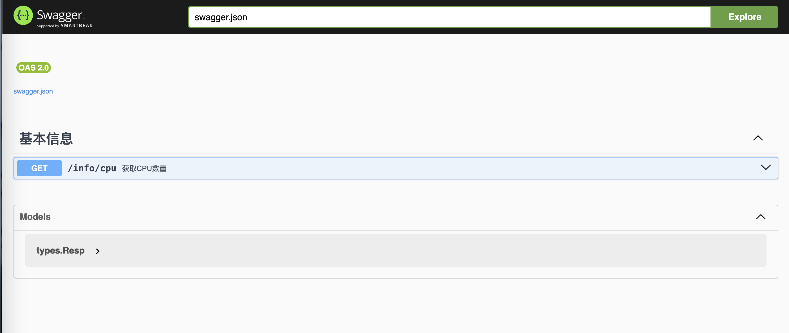

开发使用的框架是github.com/emicklei/go-restful，下面介绍关于如何在这个框架中定义swagger文档并开启swagger路由。

## 下载UI

下载https://github.com/swagger-api/swagger-ui，将里面的dist目录复制到开发的项目中，我这里把dist目录重命名为swagger。将dist目录下的含有`window.onload = function () `部分的url替换成swag命令生成的swagger.json的路径，比如这里准备把生成的swagger.json也放到swagger目录下，那么url的值就是swagger.json。

```js
window.onload = function () {
	//<editor-fold desc="Changeable Configuration Block">

	// the following lines will be replaced by docker/configurator, when it runs in a docker-container
	window.ui = SwaggerUIBundle({
		url: "swagger.json",
		dom_id: '#swagger-ui',
		deepLinking: true,
		presets: [
			SwaggerUIBundle.presets.apis,
			SwaggerUIStandalonePreset
		],
		plugins: [
			SwaggerUIBundle.plugins.DownloadUrl
		],
		layout: "StandaloneLayout"
	});

	//</editor-fold>
};
```

## 定义API

定义API，比如：

```go
// @Summary		获取CPU数量
// @Description	获取CPU数量
// @Tags			基本信息
// @Produce		json
// @Success		200	{object}	types.Resp
// @Router			/info/cpu [get]
```

执行

````shell
swag init -g main.go -o swagger
````

可以看到生成的文件在swagger目录下。

## 添加访问swagger文档的路由

参考如下代码：

```go
package swagger

import (
	"github.com/emicklei/go-restful"
	restfulswagger "github.com/emicklei/go-restful-swagger12"
)

func Register(container *restful.Container) {
	config := restfulswagger.Config{
		WebServices:     container.RegisteredWebServices(),
		ApiPath:         "docs",
		SwaggerPath:     "/apidoc/",
		SwaggerFilePath: "swagger",
		ApiVersion:      "1.0.0",
	}
	restfulswagger.InstallSwaggerService(config)
	restfulswagger.RegisterSwaggerService(config, container)
}
```

访问apidoc路径即可查看

