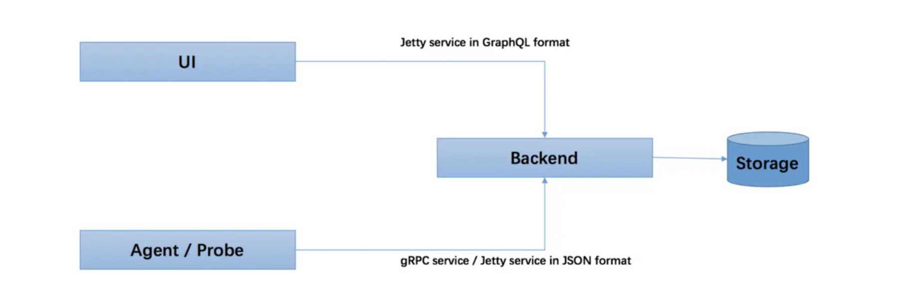
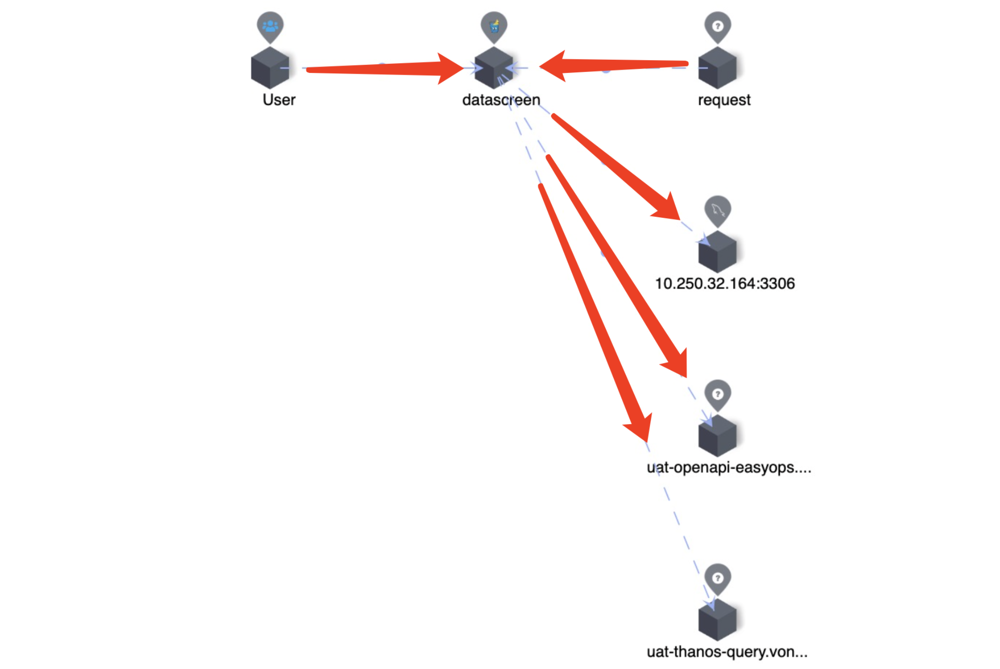
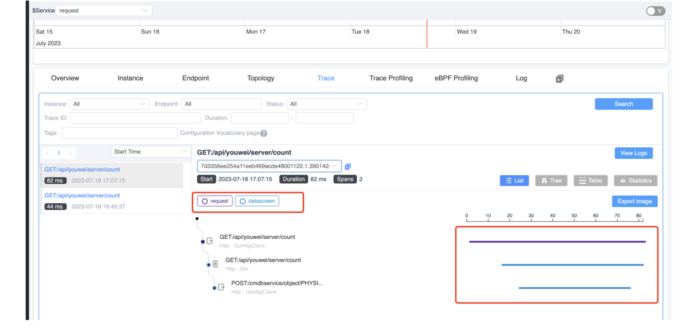
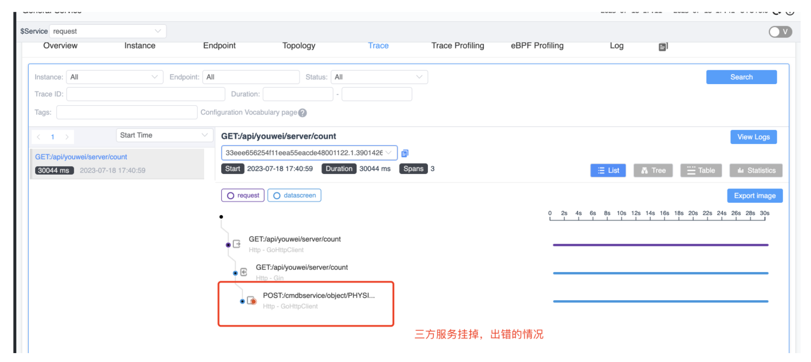

## 简介

Skywalking是分布式系统的应用程序性能监视工具，即APM(application performance monitor)工具

## 架构图



skywalking总体可以分为四部分：

1. Skywalking Agent：使用Javaagent做字节码植入，无侵入式的收集，并通过HTTP或者gRPC方式发送数据到Skywalking Collector。

2. Skywalking Collector ：链路数据收集器，对agent传过来的数据进行整合分析处理并落入相关的数据存储中。
3. Storage：Skywalking的存储，时间更迭，sw已经开发迭代到了6.x版本，在6.x版本中支持以ElasticSearch、Mysql、TiDB、H2、作为存储介质进行数据存储。
4. UI ：Web可视化平台，用来展示落地的数据。

skywalking通过agent方式，做到高性能、低损耗、无侵入性。

默认情况下skywalking使用H2来存储数据。

## 部署

### SkyWalking 

因为根据官方的启动方法，需要使用JDK11。满足条件后，从https://skywalking.apache.org/downloads/下载SkyWalking APM后执行：

```shell
cd apache-skywalking-apm-bin
# 启动 OAP 后端
bin/oapService.sh
# 启动 UI
bin/webappService.sh
```

查看 http://localhost:8080/general 

### 通过Go Agent上报数据

上一步的SkyWalking 部署完毕后，还没有数据，因为没有Agent向Skywalking上报数据。下面部署Agent往Skywalking写数据。

参考 https://skywalking.apache.org/zh/2023-06-01-quick-start-with-skywalking-go-agent/

设置一个被监控的程序，我在本地调试的是`~/Downloads/apache-skywalking-apm-bin/aa_golang_program`目录下的文件，编译之后是test文件。

编译：

```shell
go build -toolexec="~/Downloads/apache-skywalking-go-0.1.0-bin/bin/skywalking-go-agent-0.1.0-darwin-amd64" -a -o test .
```

运行：

```shell
export SW_AGENT_NAME=demo                                                           
./test
```

请求 http://localhost:8000/hello，然后在 http://localhost:8080/dashboard/GENERAL/Service/ZGVtbw==.1/General-Service 可以查看请求记录。

### 实现Dubbo Go监控

参考[文档](https://skywalking.apache.org/zh/2023-06-05-quick-start-using-skywalking-go-monitoring-dubbo-go/)，安装dubbogo-cli，执行以下命令：

笔者运行后报错：

```shell
../../../.gvm/pkgsets/go1.19/global/pkg/mod/github.com/shirou/gopsutil@v3.20.11+incompatible/cpu/cpu_darwin_cgo.go:13:5: warning: 'TARGET_OS_MAC' is not defined, evaluates to 0 [-Wundef-prefix=TARGET_OS_]
# github.com/dubbogo/dubbogo-cli
ld: warning: -no_pie is deprecated when targeting new OS versions
ld: warning: non-standard -pagezero_size is deprecated when targeting macOS 13.0 or later
```

根据[issue](https://github.com/shirou/gopsutil/issues/976)提示，需要禁用CGO：

```shell
go env -w CGO_ENABLED="0"  
go install github.com/dubbogo/dubbogo-cli@latest  
```

安装完dubbogo-cli后，需要使用 SkyWalking GO 编译 Dubbo Go 程序，注意使用的go版本是1.20，好像是笔者执行时的最新版本。使用的dubbo.apache.org/dubbo-go/v3也是当时的最新版本v3.0.5。我在执行go build的时候报错了：

```shell
go: finding module for package dubbo.apache.org/dubbo-go/v3/common/logger
helloworld/go-client/cmd imports
        dubbo.apache.org/dubbo-go/v3/common/logger: module dubbo.apache.org/dubbo-go/v3@latest found (v3.0.5), but does not contain package dubbo.apache.org/dubbo-go/v3/common/logger
```

发现是因为项目里使用了dubbo.apache.org/dubbo-go/v3/common/logger进行日志打印，但是最新版本的dubbo-go又没有这个logger包，于是把项目里引用这个包的地方都注释掉了，打印日志的地方换成了fm.Print进行打印。然后重新执行go build成功了。

## 示例分析

Skywalking我暂时用到的就是应用程序监视的功能，就是查看服务之间的调用情况。也就是所谓的全链路追踪。下面介绍的内容也是和全链路追踪相关的。



可以在Skywalking的UI界面上查看服务之间的调用情况。我构建的后端服务是datascreeen，datascreen对外提供API供客户端调用。datascreeen内部在实现API的过程中会对dat-openapi-easyops和uat-thanos-query这样的三方服务发送HTTP请求，可以看到Skywalking将这两个也视为Service显示在页面上。

图上的request就是一个前端服务，向后端服务datascreen发送请求。



发送请求后，可以在Trace里看到请求内容。对于单个请求，可以看到请求的哪些部分和耗时，包括请求三方服务API的耗时（这部分被视为database）。

因为是全链路追踪，所以可以看到如果出错了，是哪个部分，比如下面这个图，是在三方服务挂了的情况时，request服务发送请求报错，可以在这个报错请求的详细内容里看到哪里出错了。



