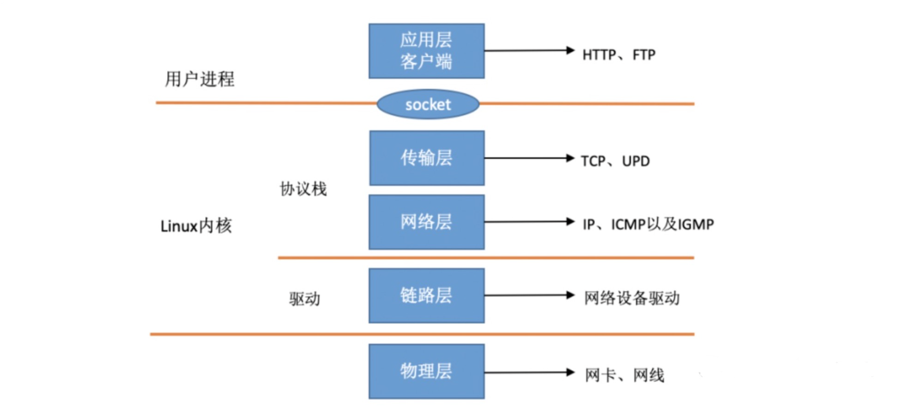
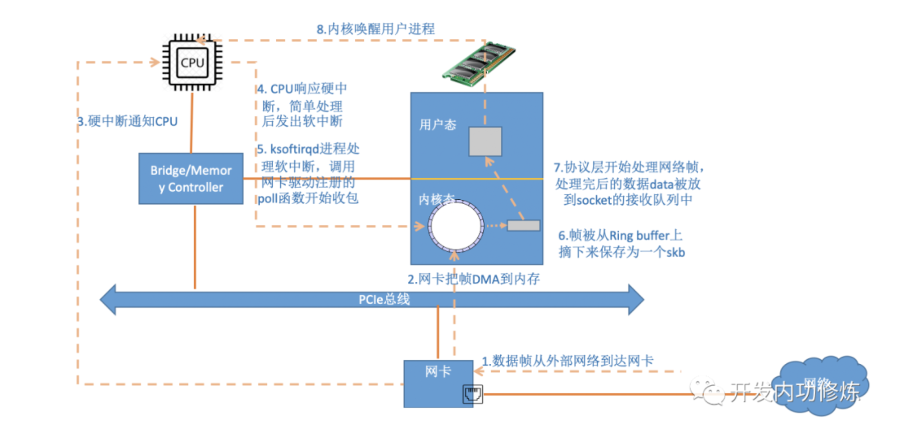
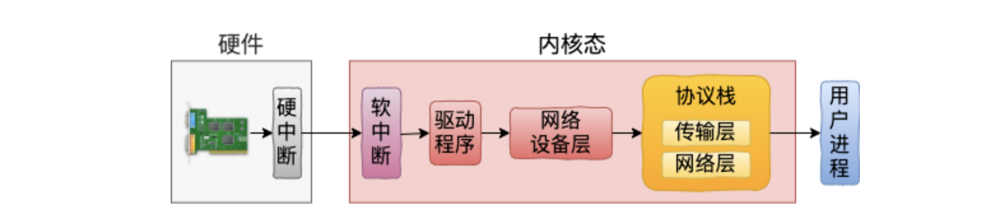
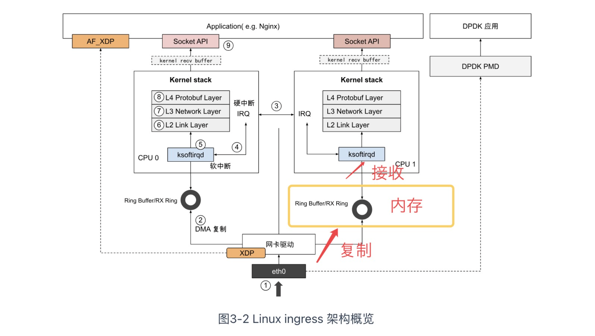
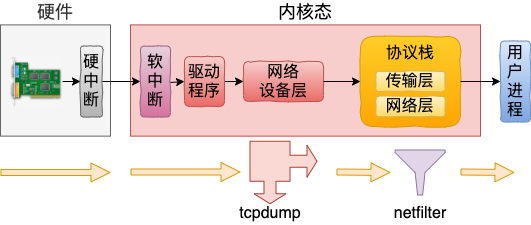
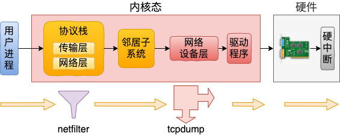

在网络的发送和接收过程中，绝大部分工作都是在内核态完成的。那么用户使用的tcpdump是如何抓到内核态的包的呢？

 tcpdump 是基于 libpcap 实现的，golang中用于分析网络数据包的gopacket库也是基于libpcap 写的。libpcap是一个网络数据包捕获框架，是用C语言写的。

在开始研究tcpdump之前，需要知道网络包是如何从网卡到达用户进程的。即数据包的接收流程。

## Linux网络数据包接收流程

> 具体可以看[原文](https://cloud.tencent.com/developer/article/1966873)，本文只对原文做了小总结，原文涉及到了源代码分析，比较详细但是难懂。

Linux视角的网络协议栈可以参考下图：

该图总结起来就是：链路层协议靠网卡驱动来实现，内核协议栈实现了网络层和传输层。负责这两层的内核会提供socket接口来供更上层也就是用户进程来访问。

内核收包的路径示意图：

注意3和4的两次中断，分别是硬中断和软中断

这个图总结起来就是：当网卡上收到数据以后，Linux中第一个工作的模块是网络驱动。网络驱动会以DMA的方式把网卡上收到的帧写到内存里。再向CPU发起一个中断，以通知CPU有数据到达。第二，当CPU收到中断请求后，会去调用网络驱动注册的中断处理函数。网卡的中断处理函数并不做过多工作，发出软中断请求，然后尽快释放CPU。**ksoftirqd检测到有软中断请求到达，调用poll开始轮询收包**，收到后交由各级协议栈处理。对于UDP包来说，会被放到用户socket的接收队列中。

用另一张更简洁的图总结，如下：

这个过程可以用下面这个图概括：

这个图描述了数据包进入系统后的流程。

--------------

ethtool命令之所以能查看网卡收发包统计、能修改网卡自适应模式、能调整RX 队列的数量和大小，是因为ethtool命令最终调用到了网卡驱动的相应方法，而不是ethtool本身有这个超能力

在数据包分析中，DMA 功能通常与网络接口卡（NIC）结合使用，用于将网络数据包直接传输到内存中，而无需 CPU 参与每个数据包的传输过程。

**本文总结下来大概就是：**

首先在开始收包之前，Linux要做许多的准备工作：

- 创建ksoftirqd线程，为它设置好它自己的线程函数，后面指望着它来处理软中断呢
- 协议栈注册，linux要实现许多协议，比如arp，icmp，ip，udp，tcp，每一个协议都会将自己的处理函数注册一下，方便包来了迅速找到对应的处理函数
- 网卡驱动初始化，每个驱动都有一个初始化函数，内核会让驱动也初始化一下。在这个初始化过程中，把自己的DMA准备好，把NAPI的poll函数地址告诉内核
- 启动网卡，分配RX，TX队列，注册中断对应的处理函数

以上是内核准备收包之前的重要工作，当上面都ready之后，就可以打开硬中断，等待数据包的到来了。

当数据到来了以后，第一个迎接它的是网卡（我去，这不是废话么）：

- 网卡将数据帧DMA到内存的RingBuffer中，然后向CPU发起中断通知
- CPU响应中断请求，调用网卡启动时注册的中断处理函数
- 中断处理函数几乎没干啥，就发起了软中断请求
- 内核线程ksoftirqd线程发现有软中断请求到来，先关闭硬中断
- ksoftirqd线程开始调用驱动的poll函数收包
- poll函数将收到的包送到协议栈注册的ip_rcv函数中
- ip_rcv函数再讲包送到udp_rcv函数中（对于tcp包就送到tcp_rcv）

Linux收一个包的开销包括：首先第一块是用户进程调用系统调用陷入内核态的开销。第二块是CPU响应包的硬中断的CPU开销。第三块是ksoftirqd内核线程的软中断上下文花费的。

## tcpdump是如何抓到数据包的

> 可以看[原文](https://www.eet-china.com/mp/a78228.html)，原文涉及到了很多源代码解析，很详细，但是有点难懂。

网络包的接收和发送，大部分都是在内核中完成的。

用户态的 tcpdump 挂载协议到内 ptype_all 上

**tcpdump是如何工作的：**

**用户态 tcpdump 命令是通过 socket 系统调用，在内核源码中用到的 ptype_all 中挂载了函数钩子上去。**无论是在网络包接收过程中，还是在发送过程中，都会在网络设备层遍历 ptype_all 中的协议，并执行其中的回调。tcpdump 命令就是基于这个底层原理来工作的。

**netfilter 过滤的包 tcpdump是否可以抓的到？**

关于这个问题，得分接收和发送过程分别来看。在网络包接收的过程中，由于 tcpdump 近水楼台先得月，所以完全可以捕获到命中 netfilter 过滤规则的包。

但是在发送的过程中，恰恰相反。网络包先经过协议层，这时候被 netfilter 过滤掉的话，底层工作的 tcpdump 还没等看见就啥也没了。

数据包进入OS及出去的顺序：

`网卡nic` -> `tcpdump` -> `iptables(netfilter)` -> `app` -> `iptables(netfilter)` -> `tcpdump` -> `网卡nic`

