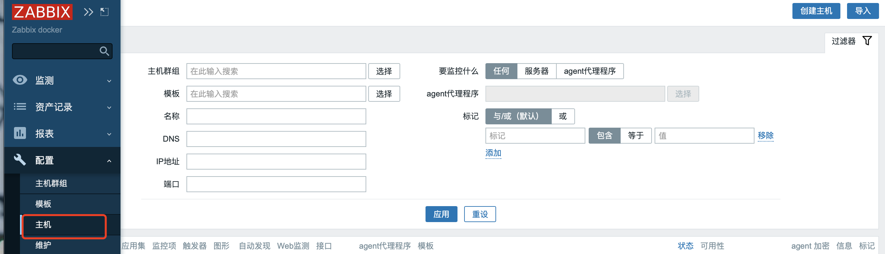
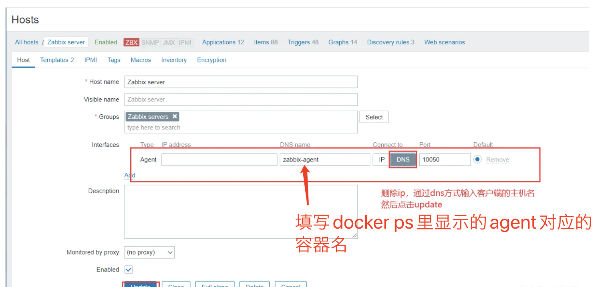
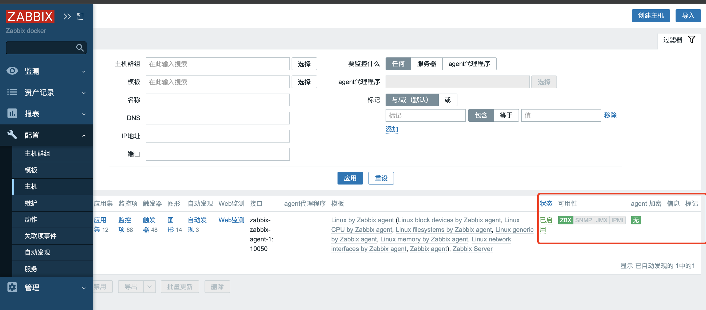
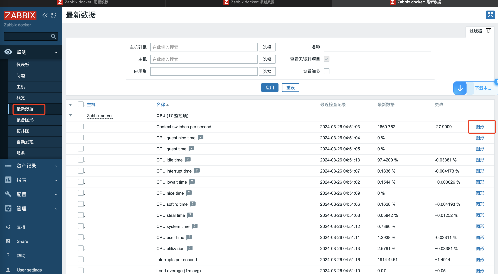
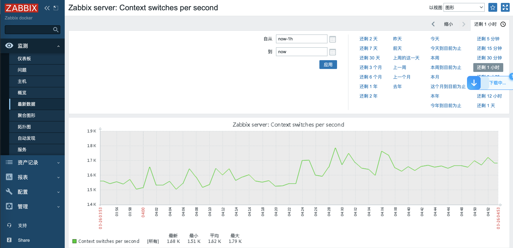

zabbix是一款开源的网络监控和管理系统，旨在监控各种网络服务，服务器，网络设备等等。

zabbix除了监控之外，还可以配置报警。

还提供了可视化图表。

还提供了丰富的插件和扩展接口，通过定制化插件来扩展功能和特性，满足不同的需求。

> 本文介绍了zabbix非常基础的使用，因为是在工作过程中记录的，工作中只涉及到了这些比较基础的部分，所以一些其他用法或者比较高级的用法没有涉及。

## 部署

在物理机上，创建应用必须的目录和文件：

编辑docker-compose.yml文件为：

```yml
version: '3'

services:
  zabbix-web-nginx-mysql:
    image: zabbix/zabbix-web-nginx-mysql:centos-5.2-latest
    restart: always
    environment:
      - DB_SERVER_HOST=zabbix-mysql
      - MYSQL_DATABASE=zabbix
      - MYSQL_USER=zabbix
      - MYSQL_PASSWORD=zabbix
      - MYSQL_ROOT_PASSWORD=123qwe
      - ZBX_SERVER_HOST=zabbix-server-mysql
    ports:
      - 8080:8080
    volumes:
      - /etc/localtime:/etc/localtime
      - $PWD/fonts/DejaVuSans.ttf:/usr/share/zabbix/assets/fonts/DejaVuSans.ttf
    networks:
      - zbx_net
    depends_on:
      - zabbix-server-mysql
      - zabbix-mysql
  zabbix-mysql:
    image: mysql:8.0.23
    restart: always
    ports:
      - 3306:3306
    environment:
      - MYSQL_DATABASE=zabbix
      - MYSQL_USER=zabbix
      - MYSQL_PASSWORD=zabbix
      - MYSQL_ROOT_PASSWORD=123qwe
    command:
      - mysqld
      - --default-authentication-plugin=mysql_native_password
      - --character-set-server=utf8
      - --collation-server=utf8_bin
    volumes:
      - /etc/localtime:/etc/localtime
      - $PWD/db:/var/lib/mysql
    networks:
      - zbx_net
  zabbix-java-gateway:
    image: zabbix/zabbix-java-gateway:centos-5.2-latest
    restart: always
    volumes:
      - /etc/localtime:/etc/localtime
    networks:
      - zbx_net
  zabbix-server-mysql:
    image: zabbix/zabbix-server-mysql:centos-5.2-latest
    restart: always
    volumes:
      - zabbix-server-vol:/etc/zabbix
      - $PWD/alertscripts:/usr/lib/zabbix/alertscripts
      - /etc/localtime:/etc/localtime
    ports:
      - 10051:10051
    environment:
      - DB_SERVER_HOST=zabbix-mysql
      - MYSQL_DATABASE=zabbix
      - MYSQL_USER=zabbix
      - MYSQL_PASSWORD=zabbix
      - MYSQL_ROOT_PASSWORD=123qwe
      - ZBX_JAVAGATEWAY=zabbix-java-gateway
      - ZBX_JAVAGATEWAY_ENABLE=true
      - ZBX_JAVAGATEWAYPORT=10052
    depends_on:
      - zabbix-mysql
    networks:
      - zbx_net
  zabbix-agent:
    image: zabbix/zabbix-agent:centos-5.2-latest
    restart: always
    ports:
      - 10050:10050
    environment:
      - ZBX_HOSTNAME=Zabbix server
      - ZBX_SERVER_HOST=zabbix-server-mysql
      - ZBX_SERVER_PORT=10051
    networks:
      - zbx_net

networks:
  zbx_net:
    driver: bridge

volumes:
  zabbix-server-vol:
```

创建启动所必须的目录和文件：

```shell
mkdir alertscripts db fonts
cd fonts
wget https://dl.cactifans.com/zabbix_docker/msty.ttf
mv msty.ttf DejaVuSans.ttf
```

切换回上一级别，启动服务：

```shell
cd ..
docker compose up -d
```

访问 localhost:8080 即可查看zabbix登陆地址，默认用户名和密码为Admin zabbix

启动后更改主机里的配置，改为监控agent，因为agent是和物理机交互，采集的是docker compose所运行的物理机上的指标，所以改为agent就能获取物理机的指标了。





点击update后刷新可以看到该主机状态为已启用，绿色的ZBX表示主机可用，监控指标检查已成功。



## 常用概念介绍

主机：要通过 IP/DNS 监控的联网设备。**对于主机的定义非常灵活。它可以是一台物理服务器，一个网络交换机，一个虚拟机或者某些应用程序。**

监控项：想要接收的主机的特定数据，一个度量/指标数据。监控项是Zabbix中采集数据的基础。没有监控项，就没有数据——因为一个主机中只有监控项定义了单一的指标或者需要获得的数据。所有的监控项都是依赖主机的，所以一定要先配置主机再配置该主机的监控项。

## 查看监控项

在第一个“部署”部分，已经实现了对主机的监控。这里添加对上述主机的监控项，下面查看对该主机的默认的监控项和这些监控项采集的值。

点击最新数据里，选择一条监控项，可以看到该条监控项目的最近检查记录和最新数据



点击最右侧的图像，查看该监控项的可视化图形。



> PS：我部署zabbix主要就是为了查找zabbix有没有类似的监控网卡总流量的指标，比如显示某段时间内某个网卡经过了多少数据的流量。但是搜索后发现没有这种指标，不能坐流量计费这种功能。

参考文章

[通过docker-compose一键部署zabbix监控平台](https://juejin.cn/post/7085020149761179661)

[zh版使用手册](https://www.zabbix.com/documentation/current/zh/manual)

