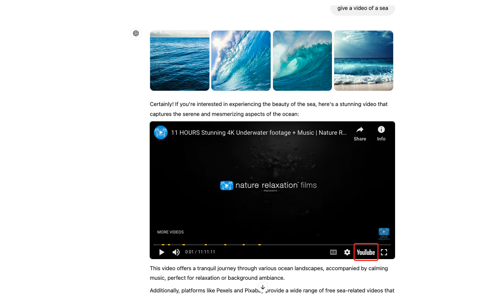
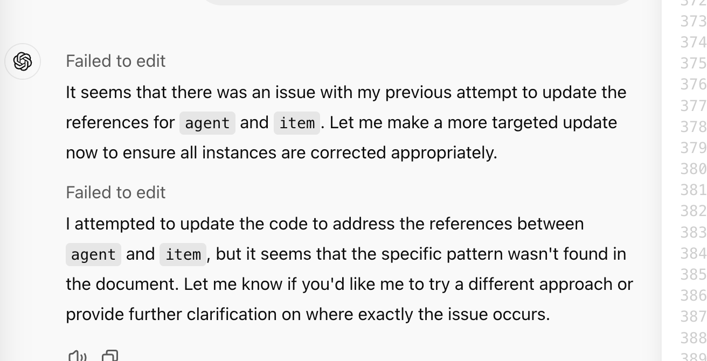
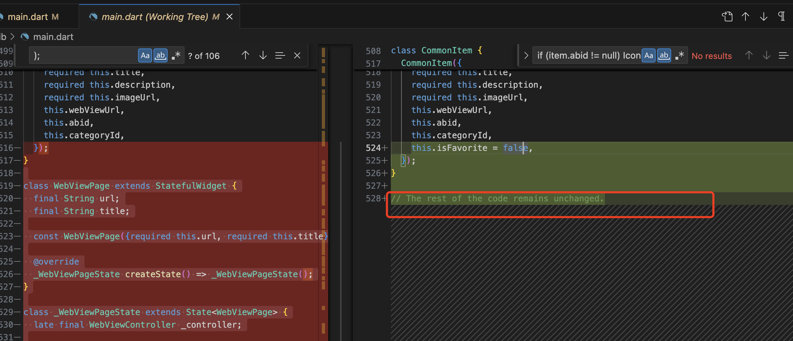

我使用的是chatgpt的官方AI，地址为：https://chatgpt.com/ 

## 模型对比

> 官方文档： https://help.openai.com/en/articles/7102672-how-can-i-access-gpt-4-gpt-4-turbo-gpt-4o-and-gpt-4o-mini

GPT-3.5：支持声音的输入输出，16K上下文长度，免费

GPT-4：支持图片和声音的输入输出，128K上下文长度，收费。答案准确度比3.5更高。

GPT-4o（omni 全能型）：比GPT-4提升了速度，最新版本，支持输入和输出图片，支持输出和输入声音，可以输出视频（但是视频是从网络查找的而不是自己生成的，如下图的视频是从youtube上找的）。适合需要高精度和大量数据处理的任务。使用效果如下：

GPT-4o mini：最轻量的模型，支持图片和声音的输入输出，有GPT-4o的基本功能，不像GPT-4o一样可以处理大量数据任务，适合聊天机器人会话。价格也比GPT-4o低。

**对于长代码，推荐使用canvas，在询问AI时指定"use canvas"即可。**

> HTML5 的 canvas 标签元素让开发者 可以使用 JavaScript 在网页上动态的绘制和处理图形
>
> chagpt的canvas更有利于查看代码，Canvas在一个单独的窗口中打开。
>
> AI会逐行修改代码。

## AI项目开发步骤

先搭一个框架，显示最基础的页面，此时数据都是静态的。确保程序编译通过可以运行。

增加其他页面，实现页面之间的跳转。

将数据变成动态的，即从API获取（此时固定token）。此时代码还在一个文件里，且代码超过1000行老，让AI拆分到多个文件（可自定义哪些包，对于有些频繁执行的代码，考虑将其放到utils包里），需要注意各个文件之间如何互相引用。问AI的时候可以说当前XXX文件的代码如下。

> 项目开发中的注意事项：
>
> 使用AI编程中，重点在于如何拆分项目任务，训练AI让AI给出更准确的回复，而不是自己写代码解决问题。不用太关注代码的细节，关注代码是否执行成功。
>
> 开发过程中记录完成了哪些，哪些TODO。
>
> 多写注释，注释每个文件对应的业务
>
> 在AI写代码中，在对比AI代码的改动中，有空可以关注修改的部分，这样即使对框架和编程语言不了解，但是在对比的过程中也会渐渐知道当前项目开发的一些基础知识（比如一些小的更改可能自己就知道怎么做了，某个配置文件是干什么的）。
>
> 对于项目，只关注改动部分，其他未变更的部分可暂时不用关注。

## 注意事项

- 尽量使用英文询问，即使询问有语法错误，即使自己觉得问题都没有描述清楚，都可以先问AI
- 可以贴图询问，贴多张图，用红框将重点部分标出来，询问"in the red box, I did not get the expected result, I hope XXX, but now the current result is YYY, change the code and show me the full code"
- 对比input code和output code的更改：比如在VSCode中，git stage暂存区存放确认过的代码，工作区存放和对比正在开发的内容，对比的工作放在工作区做。建议将代码格式化排版，这样方便查看，然后再进行对比。
- AI有的时候会给出错误的答案，或者听不懂，此时需要先去搜索引擎查询

- AI可能会编辑代码失败，此时最好的办法就是重开一个会话

- 输入的代码很长时，AI给的回复可能会折叠回复

- canvas对代码的长度有限制，canvas最长显示1160行代码

- 建议单个文件的代码超过1000行的话，就拆分到多个文件中

- 注意AI回复非代码部分，看是否其指定了修改的文件名和文件里的位置。

- 当AI在一个会话中持续出错时，最好的方式就是新开一个会话，AI会记住之前的内容的

- AI编辑代码时，可能会删除或者修改输入的代码，如果可以自行确认关键更改部分，自行更改即可。如果不确定更改部分，可以把问题再次输入并且指定“don't delete any code just modify"。如果再次失败，把问题再次输入并且指定“don't give the full code just tell me which part I should modify, for those parts, tell me the previous content and the content after modifying"。如果再次失败，尝试拆分代码到多个文件。

- canvas 代码编辑注意：当当前页面有右边代码框时，框里有代码A时，再给AI一段代码B让AI修改，AI可能会直接基于右边代码框里的代码A修改，而不是基于我给出的新的代码B，此时的解决办法就是重开一个会话。
