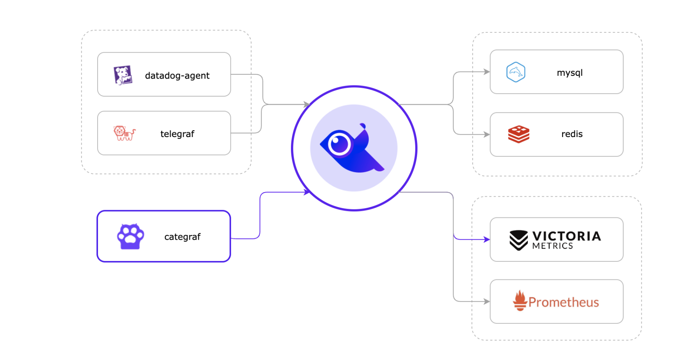

## 简介

夜莺是一个服务端组件，类似 Grafana。agent采集数据上报给夜莺，夜莺将数据转存到后端数据源。夜莺的角色只是一个 Pushgateway 的角色。数据存储到数据源后，夜莺再读取数据源，对数据源的数据进行类似Grafana的可视化分析。

具体可以看[官网](https://flashcat.cloud/docs/content/flashcat-monitor/nightingale-v6/introduction/)，最好看最新的V6版本。

## 架构图



从架构图上可以看出，**agent 采集了数据推给夜莺**（agent 包括图上的Telegraf、Categraf、还有Grafana-agent、Datadog-agent、Prometheus 生态的各类 Exporter 等等），夜莺适配了这些 agent 的数据传输协议，所以可以接收这些 agent 上报的监控数据，**然后夜莺将采集的数据转存到后端对接的数据源**。对于后端对接的数据源，夜莺可以接入不同的数据源，比如 Prometheus、VictoriaMetrics、Thanos 等等，**只要数据进到这些库里了，夜莺就可以对数据源的数据进行分析、告警、可视化，以及后续的事件处理、告警自愈**。

## 部署

下面的部署方式是笔者自己测试成功的两种。

### docker compose

```shell
git clone https://gitlink.org.cn/ccfos/nightingale.git
cd nightingale/docker/experience_pg_vm
rm -rf initsql # 执行该命令，启动的时候 DB 就不会重新初始化了
docker compose up -d
docker compose ps
```

访问http://localhost:17000即可查看，用户名为root，密码为root.2020

### 二进制

参考[Prometheus 部署方案](https://flashcat.cloud/docs/content/flashcat-monitor/nightingale-v6/install/prometheus/)部署好了Prometheus，然后参考[安装部署详解](https://flashcat.cloud/docs/content/flashcat-monitor/nightingale-v6/install/intro/)的安装前置依赖部分及之后，依次安装mysql和redis，然后安装夜莺，安装完毕后登陆http://localhost:17000添加之前部署的Prometheus数据源，配置完毕后去夜莺的查询面板，就可以在夜莺的UI页面成功的读取到Prometheus的数据了。

夜莺除了将数据写入了Prometheus之外，也可以写入其他数据库，比如VictoriaMetrics。VictoriaMetrics（也称为VM）是一个开源的高性能时间序列数据库和监控系统。它被设计用于处理大规模的时间序列数据，并提供快速、可靠的查询和存储功能。