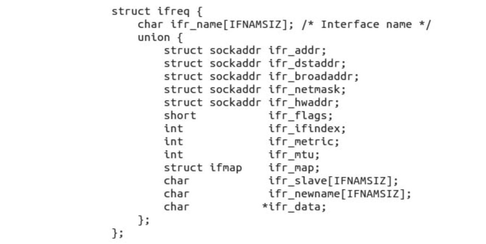

本文翻译自：https://www.opensourceforu.com/2015/03/a-guide-to-using-raw-sockets/

raw socket即原始套接字，可以用来发送和接收数据包，可以通过常见的TCP/IP协议，将数据包发送给指定的用户应用。

当你对linux内核一无所知，但是依然对网络数据包感兴趣时，可以通过raw socket来了解自己想要的内容。

raw socket是用来接收数据包的，这意味着链路层接收到的数据包会被直接传递给raw socket。**因为绕过了链路层上的网络层和传输层**，所以raw socket会绕过TCP/IP处理程序将数据包直接发送给特定的应用程序。如下图：


## raw socket和其他的socket的对比

其他的socket包括了stream socket、data gram socket等等，这些其他的socket接收到来自传输层的数据，这些数据不包含header只包含了payload。因为没有header，所以找不到源IP地址和MAC地址。如果运行在同一台机器或者不同机器的两个程序正在交流，那么这两个程序只是交换数据。

下图展示了raw socket和其他socket的对比：


## 网络数据包和数据包嗅探器（sniffer）

当一个应用发送数据到网络中时，这个数据会经过不层的处理，这些层按照时间顺序从先到后分别是网络层、传输层、数据链路层。每层都会添加Header。最终处理得到的结果可能为 ：

下图是一个网络数据包的结构：


默认情况下，机器会接收与本机具有相同目的地址的数据包，这种模式称为非混杂模式。 但如果我们想接收所有数据包，我们必须切换到混杂模式。 我们可以借助 ioctl 进入混杂模式。

如果想知道数据包的结构，可以使用数据包嗅探器（sniffer），比如wireshark或者tcpdump。

## 带有raw socket的数据包嗅探器

这里主要介绍如何开发一个数据包嗅探器。要开发数据包嗅探器，**首先必须打开原始套接字（raw socket）**。 仅允许有效用户 ID 为 0 或具有 CAP_NET_RAW 功能的进程打开原始套接字。 所以，在程序执行过程中，你必须是root用户。

### 打开 raw socket

要打开套接字，需要了解套接字系列、套接字类型和协议这三个字段。

对于raw socket，套接字系列字段为 AF_PACKET，套接字类型为 SOCK_RAW。

接收所有数据包时，宏为 ETH_P_ALL；接收 IP 数据包时，宏为 ETH_P_IP（协议字段）。？？？？？？？

```c
int sock_r;
sock_r=socket(AF_PACKET,SOCK_RAW,htons(ETH_P_ALL));
if(sock_r<0)
{
printf(“error in socket\n”);
return -1;
}
```

### 网络数据包的接收

成功打开原始套接字后，就可以接收网络数据包了，为此需要使用recvfrom api或者使用recv api。

```c
unsigned char *buffer = (unsigned char *) malloc(65536); //to receive data
memset(buffer,0,65536);
struct sockaddr saddr;
int saddr_len = sizeof (saddr);
 
//Receive a network packet and copy in to buffer
buflen=recvfrom(sock_r,buffer,65536,0,&saddr,(socklen_t *)&saddr_len);
if(buflen<0)
{
printf(“error in reading recvfrom function\n”);
return -1;
}
```

在saddr中，底层协议提供数据包的源地址。

### 提取各层数据

#### 提取以太网（Ethernet）Header

以太网的标头包含了源地址和目的地址（源地址和目的地址都是物理地址，占用了6个字节）和协议。以太网的Header在源代码的if_ether.h文件被定义成如下数据结构：


h_proto表示下一层是什么协议。比如如果h_proto的值是ETH_P_IP，那么表示下一个Header是IP协议的Header。下面类似的，介绍如何提取IP Header。

#### 提取IP层的 Header

IP 层提供各种信息，如源和目标 IP 地址、传输层协议等。IP Header的信息在*ip.h*被定义了，如下：


类似的，提取传输层的协议的Header

#### 提取传输层的Header

TCP和UDP协议结构分别在tcp.h和udp.h中定义。 这些结构提供源和目标的端口号。

> TLS 协议在 OSI 模型中被认为是一个位于传输层和应用层之间的安全层协议。

#### 提取应用层的Payload

在传输层Header之后的数据就是有效负载。

### 使用raw socket发送数据包

要发送数据包，需要知道源MAC地址和目的MAC地址，以及源IP地址和目的IP地址。发送时如何知晓发送人的IP地址和MAC地址呢？下面是方法：

输入`ifconfig`来获得某个指定网络接口的IP地址和MAC地址。或者输入ioctl命令获取IP地址和MAC地址（这个方法更快速更推荐）。

#### 打开raw socket

要打开raw socket，需要知道socekt API的三个参数，分别为：

Family参数，可以传递AF_PACKET

Type参数，可以传递SOCK_RAW

协议protocol参数，可以传递IPPROTO_RAW

协议protocol参数为什么要传递IPPROTO_RAW呢？因为想传递一个IP包。IPPROTO_RAW宏定义在in.h文件中：

```c
sock_raw=socket(AF_PACKET,SOCK_RAW,IPPROTO_RAW);
if(sock_raw == -1)
printf(“error in socket”);
```

#### 什么是ifreq struct？

Linux 支持一些标准 ioctl 来配置网络设备。





#### 获取发送数据包的网络接口的下标

您的机器上可能有多种接口，如环回、有线接口和无线接口。 因此，您必须决定我们可以通过哪个接口发送数据包。 确定接口后，您必须获取该接口的索引。 为此，首先通过设置 ifreq 结构的 ifr_name 字段来给出接口的名称，然后使用 ioctl。 然后使用 sockios.h 中定义的 SIOCGIFINDEX 宏，您将在 ifreq 结构中收到索引号：

```c
struct ifreq ifreq_i;
memset(&ifreq_i,0,sizeof(ifreq_i));
strncpy(ifreq_i.ifr_name,”wlan0”,IFNAMSIZ-1); //giving name of Interface
 
if((ioctl(sock_raw,SIOCGIFINDEX,&ifreq_i))<0)
printf(“error in index ioctl reading”);//getting Index Name
 
printf(“index=%d\n”,ifreq_i.ifr_ifindex);
```

#### 获取网络接口的MAC地址

```c
struct ifreq ifreq_c;
memset(&ifreq_c,0,sizeof(ifreq_c));
strncpy(ifreq_c.ifr_name,”wlan0”,IFNAMSIZ-1);//giving name of Interface
 
if((ioctl(sock_raw,SIOCGIFHWADDR,&ifreq_c))<0) //getting MAC Address
printf(“error in SIOCGIFHWADDR ioctl reading”);
```

#### 获取网络接口的IP地址

```go
struct ifreq ifreq_ip;
memset(&ifreq_ip,0,sizeof(ifreq_ip));
strncpy(ifreq_ip.ifr_name,”wlan0”,IFNAMSIZ-1);//giving name of Interface
if(ioctl(sock_raw,SIOCGIFADDR,&ifreq_ip)<0) //getting IP Address
{
printf(“error in SIOCGIFADDR \n”);
}
```

#### 构建以太网报头

获得索引以及接口的 MAC 和 IP 地址后，就可以构建以太网标头了。 首先，创建一个缓冲区，在其中放置所有信息，如以太网标头、IP 标头、UDP 标头和数据。 该缓冲区将是您的数据包。

```c
sendbuff=(unsigned char*)malloc(64); // increase in case of more data
memset(sendbuff,0,64);
```

要构造以太网标头，请填写 ethhdr 结构的所有字段：

```c
struct ethhdr *eth = (struct ethhdr *)(sendbuff);
 
eth->h_source[0] = (unsigned char)(ifreq_c.ifr_hwaddr.sa_data[0]);
eth->h_source[1] = (unsigned char)(ifreq_c.ifr_hwaddr.sa_data[1]);
eth->h_source[2] = (unsigned char)(ifreq_c.ifr_hwaddr.sa_data[2]);
eth->h_source[3] = (unsigned char)(ifreq_c.ifr_hwaddr.sa_data[3]);
eth->h_source[4] = (unsigned char)(ifreq_c.ifr_hwaddr.sa_data[4]);
eth->h_source[5] = (unsigned char)(ifreq_c.ifr_hwaddr.sa_data[5]);
 
/* filling destination mac. DESTMAC0 to DESTMAC5 are macro having octets of mac address. */
eth->h_dest[0] = DESTMAC0;
eth->h_dest[1] = DESTMAC1;
eth->h_dest[2] = DESTMAC2;
eth->h_dest[3] = DESTMAC3;
eth->h_dest[4] = DESTMAC4;
eth->h_dest[5] = DESTMAC5;
 
eth->h_proto = htons(ETH_P_IP); //means next header will be IP header
 
/* end of ethernet header */
total_len+=sizeof(struct ethhdr);
```

#### 构建IP Header

要构造 IP 标头，请将 sendbuff 增加以太网标头的大小并填充 iphdr 结构的每个字段。 IP报头之后的数据称为IP报头的有效负载，同样，以太网报头之后的数据称为以太网报头的有效负载。 在IP报头中，有一个称为总长度的字段，它包含IP报头加上有效负载的大小。 要了解 IP 标头有效负载的大小，您必须知道 UDP 标头和 UDP 有效负载的大小。 因此，iphdr 结构的某些字段将在填充 UDP 标头字段后获取值。

> 代码这里就不贴出来了，因为代码我没怎么看，主要看的就是大概的步骤。

#### 构建UDP Header

构建 UDP 标头与构建 IP 标头非常相似。 为 udphdr 结构的字段赋值。 为此，将 sendbuff 指针增加以太网和 IP 标头的大小。

#### 添加数据或者UDP Payload

```c
sendbuff[total_len++] = 0xAA;
sendbuff[total_len++] = 0xBB;
sendbuff[total_len++] = 0xCC;
sendbuff[total_len++] = 0xDD;
sendbuff[total_len++] = 0xEE;
```

#### 填充 IP 和 UDP 标头的剩余字段

现在我们有了total_len指针，借助它，我们可以填充IP和UDP标头的剩余字段

#### IP Header 校验和

IP 标头检查中还剩下一个字段，用于校验和。 校验和用于头部的错误检查。

当数据包到达路由器时，路由器会计算校验和，如果计算出的校验和与标头的校验和字段不匹配，则路由器将丢弃该数据包； 如果匹配，则路由器会将到达 live 字段的时间减 1，然后转发。

计算校验和时，将IP头的所有16位字相加，如果有进位，则再次相加得到16位字。 之后，找到 1 的补码，这就是我们的校验和。 要检查我们的校验和是否正确，请使用上述算法。

#### 发送数据

现在我们有了数据包，但在发送之前，让我们用目标 MAC 地址填充 sockaddr_ll 结构：

```c
struct sockaddr_ll sadr_ll;
sadr_ll.sll_ifindex = ifreq_i.ifr_ifindex; // index of interface
sadr_ll.sll_halen = ETH_ALEN; // length of destination mac address
sadr_ll.sll_addr[0] = DESTMAC0;
sadr_ll.sll_addr[1] = DESTMAC1;
sadr_ll.sll_addr[2] = DESTMAC2;
sadr_ll.sll_addr[3] = DESTMAC3;
sadr_ll.sll_addr[4] = DESTMAC4;
sadr_ll.sll_addr[5] = DESTMAC5;
```

现在是时候发送它了，为此我们使用 sendto api：

```c
send_len = sendto(sock_raw,sendbuff,64,0,(const struct sockaddr*)&sadr_ll,sizeof(struct sockaddr_ll));
if(send_len<0)
{
printf(“error in sending....sendlen=%d....errno=%d\n”,send_len,errno);
return -1;
 
}
```

