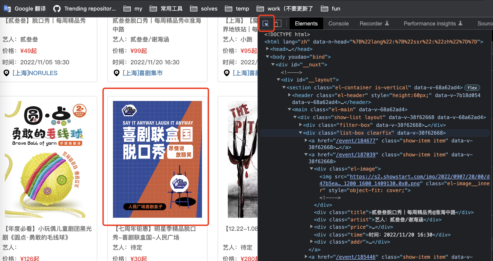
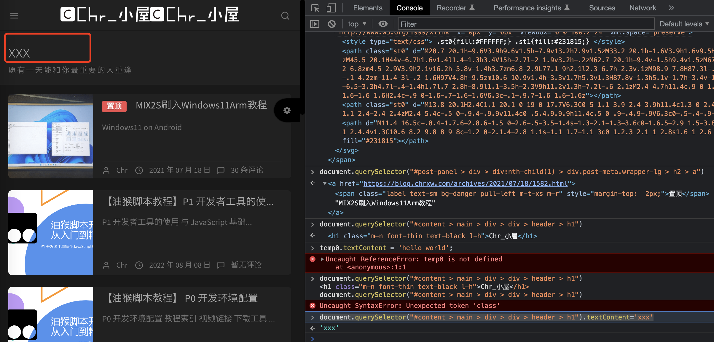
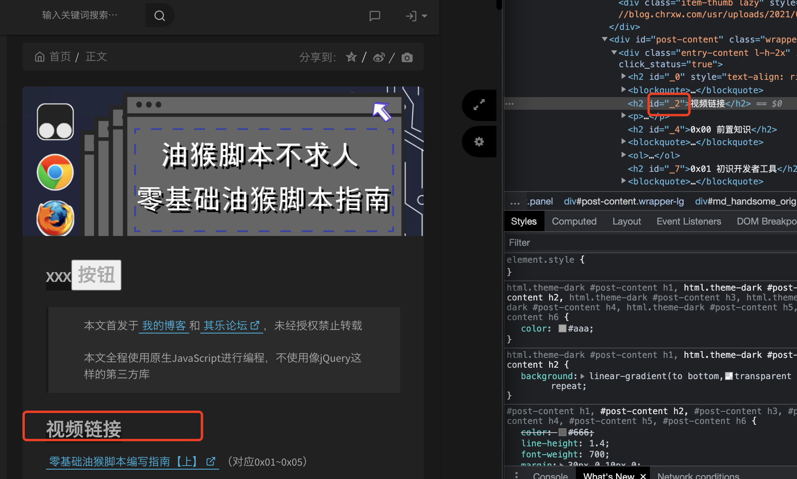
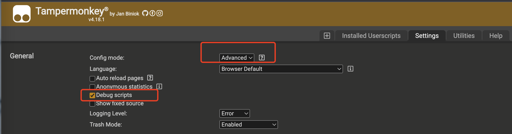

## 简介

油猴实际上是一个加载器，它把用户脚本安插在最开始获取到的HTML文件中，这样浏览器加载网页的时候，也会加载特定的用户脚本，这样我们就能够通过编写用户脚本来修改网页了

JS可以访问的只有Cookie和LocalStorge，本地存储可以通过window.LocalStorage访问

## 简单的添加按钮操作

HTML5是现行的HTML标准，DOM即文档对象模型，是一用对象表示HTML标签的方法，通过DOM，我们可以简单的修改文档对象的属性，来轻松修改HTML标签的内容

[](https://imgse.com/i/pSAuAoQ)

选择这个小箭头，在左侧点击元素的时候，右边就可以显示元素的html和css

https://blog.chrxw.com/archives/2021/02/08/1449.html/comment-page-1 看到了 按回车执行，然后可以看到，网页的标题已经被修改了。可以通过 document.querySelector("#content > main > div > div > header > h1").textContent='xxx' 修改，如下

[](https://imgse.com/i/pSAQdO0)

**下面这是一个追加按钮的操作：**

document 也是DOM元素，它代表整个网页，其他DOM元素都是它的子集。

```
let btn = document.createElement('button');
btn.textContent = '按钮';
btn.addEventListener('click',() => {
    alert('hello world');
}); // 为btn对象添加了事件监听器，addEventListener的第一个参数是事件监听器的名称，第二个参数是接收到指定事件后调用的函数，
document.querySelector("#_0").appendChild(btn); // 把B元素插入到A元素的子元素的末尾，也就是把btn对象插到"#_0"中，
```

html修改前后的内容参考如下：

```
//修改前
<h1 class="m-n font-thin text-black l-h">Chr_小屋</h1>
//修改后
<h1 class="m-n font-thin text-black l-h">Chr_小屋
    <button>按钮</button> //这是我们新创建的DOM元素
</h1>
```

## 获取DOM元素

总结下来就是使用getElementById或者querySelector。querySelector可以填ID或者class名字。

### 使用ID获取

一些元素有id属性，可以使用`getElementById`来获取，比如这个id为_2：
[](https://imgse.com/i/pSVPBnJ)

可以`document.getElementById('_2').textContent='aaa'`这样修改其值。

根据_id选择也可以这样写

```
//两种写法等效，推荐第一种
document.getElementById('_2');
document.querySelector('#_2');
```

### 使用css选择器

比如获取标题

```
document.querySelector('.entry-title.m-n.font-thin.text-black.l-h'); // 因为标题的class是entry-title m-n font-thin text-black l-h，中间需要用.分开
```

### 根据元素类型选择

因为评论框的类型为`textarea`，而且整个网页只有一个`textarea`，因此选择器可以直接写成`textarea`，代码如下

```
document.querySelector('textarea');
```

### 根据相对关系选择

有的时候，想要操作的元素可能没有独一无二的属性，那么就可以根据相对关系进行选择，这里A和B都是选择器：

`A>B`表示在`A`的一级子元素中查找`B`

`A B`表示在`A`的内部查找`B`（查找范围不仅包括子元素，还包括孙元素等）

`A+B`表示与`A`相邻的`B`元素（平级关系，非父子关系）

`A.B`，不表示相对关系，它表示类型是`A`，`class`名是`B`的元素，这个要注意。

```
//以下语句都是等效的
document.querySelector('main>div>div>header>h1');//一级子元素
document.querySelector('main header>h1');//所有子元素
document.querySelector('main h1');//这样也可以
document.querySelector('header>h1');//多个方法定位header对象
document.querySelector('#small_widgets>h1');
document.querySelector('.bg-light.lter.wrapper-md>h1');
document.querySelector('header.bg-light>h1');
```

### 根据属性名称匹配

`[xxx]`选择带有`xxx`属性的元素

`[xxx=sss]`选择`xxx`属性等于`sss`的元素

`[xxx~=sss]`选择`xxx`属性包含`sss`的元素（`sss`必须是整个单词）

`[xxx|=sss]`选择`xxx`属性以`sss`开头的元素（`sss`必须是整个单词）

`[xxx^=sss]`选择`xxx`属性以`sss`开头的元素（`sss`可以是单词的一部分）

`[xxx$=sss]`选择`xxx`属性以`sss`结尾的元素（`sss`可以是单词的一部分）

`[xxx*=sss]`选择`xxx`属性包含`sss`的元素（`sss`可以是单词的一部分）

## 修改DOM元素

### 修改文本内容

textContent返回值为当前DOM元素内的显示字符（没有被 < > 包起来的所有字符），不仅包括自身，还包括所有子元素

innerText和textContent两个方法会直接替换掉元素内部的内容，如果元素内部有其他子元素的话，子元素会消失。

### 修改样式style

下面是一些获取css样式的方法：

`DOM.style`，获取DOM元素的内联CSS样式

`DOM.style.[css名称]`，获取DOM元素的特定CSS属性，例如`textAlign`

`DOM.style.cssText`，获取DOM元素的内联CSS样式，纯文本格式

下面是设置样式的方法

`DOM.style.[css名称] = 'xxx'`，修改DOM元素的特定CSS属性为`xxx`

`DOM.style.cssText = 'aaa: xxx;'`，直接修改DOM元素的内联CSS文本，可以一次设置多个CSS

**如果想隐藏某些元素的话，可以把它的CSS的`display`属性设置成`none`，就会被隐藏起来了**

删除对象DOM.remove()

`DOM.addEventListener( [事件名称] , [回调函数])`添加事件监听器

`DOM.removeEventListener( [事件名称] , [回调函数])`移除事件监听器

**模拟鼠标点击：DOM.click()**

## 第一个脚本

`'use strict';`是伪代码，它告诉解释器，开启`严格模式`

`document.querySelector('.item-thumb')`代码标识获取class名为item-thumb的元素

打开这个设置可以方便调试脚本

[](https://imgse.com/i/pSVV3BF)

脚本里的一部分如下：

```
// 需要在元信息里提前申明，才可以使用
// @grant        GM_setValue // 申请获取了油猴的GM_setValue函数，可以在函数里调用到GM_setValue函数，是油猴自带的储存空间的设置函数，GM_setValue( 键名 , 键值)，保存某个值
// @grant        GM_getValue // 油猴自带的储存空间的获取函数，GM_getValue( 键名 )，如果键名不存在，返回null
// @grant        GM_xmlhttpRequest
```

了`GM_xmlhttpRequest`，这个东西是一个网络请求器，`GM_xmlhttpRequest`类似于`xmlHttpRequest`，两者用法几乎一样，只是`GM_xmlhttpRequest`不存在[跨域](https://developer.mozilla.org/zh-CN/docs/Web/HTTP/Access_control_CORS)的问题

## 参考

所有参考

https://blog.chrxw.com/archives/2021/02/08/1449.html/comment-page-1