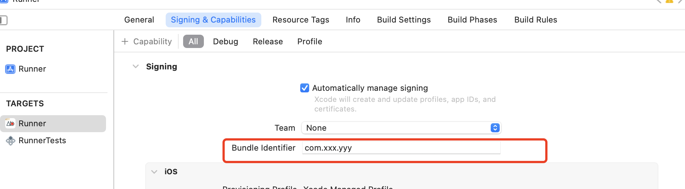

苹果手机的应用系统为iOS，iOS中有很多个app，那么app在系统内是如何区分的呢？app有在系统内的唯一标识吗？唯一标识的作用比如：当用户下载appA之后再次在app store搜索appA，此时用户会看到该app已安装的提示而不是安装的提示。iOS通过appA是否在系统内注册了唯一标识来判断，appA是否已经安装。

上述的唯一标识的专门名称为bundle ID，这是苹果生态中的唯一ID。bundle ID可让 iOS 和 macOS 识别应用。bundle ID 必须在 Apple 注册，并且应用是唯一的。bundle ID 是特定于应用类型的（iOS 或 macOS）。

Xcode是苹果生态内应用的开发工具，Xcode里可以配置bundle ID，如下：

配置完毕后打包，打出来的包就内置了之前配置了的bundle ID。