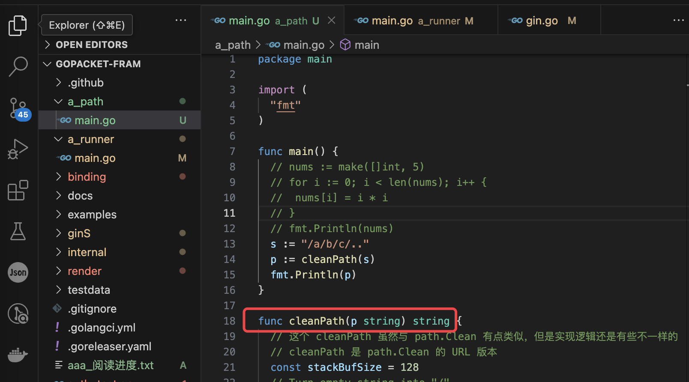
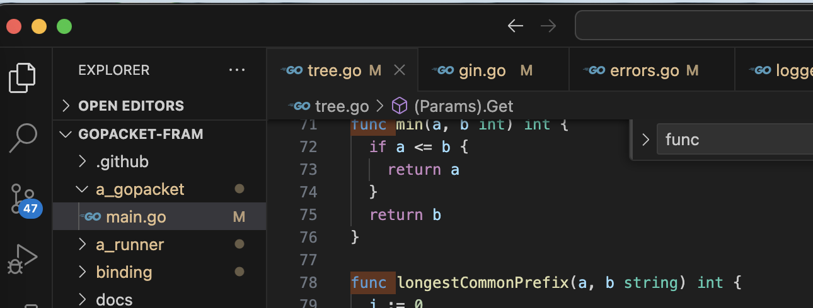
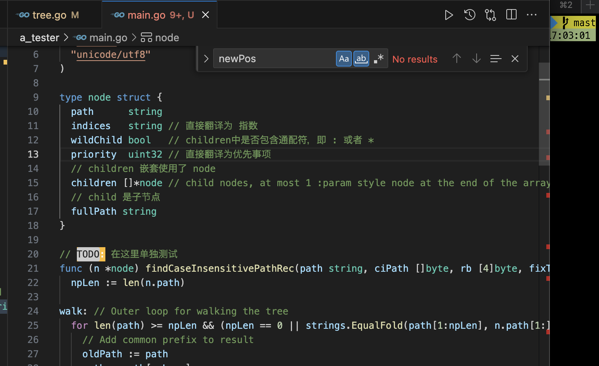

我把代码复制到了 ~/我的本地文件/代码/fromweb 目录下了。目前clone了gin项目和go-gin-example项目，此外还有example项目，这个是gin官方提供的示例项目。

##go-gin-example阅读

读取配置和数据库初始化的过程，可以放在func init() 里，参考：

```go
func init() {
	setting.Setup() // 读取配置文件的所有部分，并对申明好了的全局配置变量赋值
	models.Setup() // 初始化mysql db，并自定义了Create Update Delete时的回调函数
	logging.Setup() // 初始化日志，是基于标准库里面的日志包初始化的
	gredis.Setup() // 初始化redis，包括设置连接redis时会调用的Dial函数
	util.Setup() // 设置pkg包里jwtSecret的值
}
```

init已经看完了，下面就是看 routers.InitRouter() 的具体内容

准备看   r.POST("/auth", api.GetAuth) 及之后的内容了。

项目里使用到了https://github.com/beego/beego框架，用了其validation包做数据验证，其他的包没有使用。

> beego框架可以用于开发包括传统的 Web 网站、API 服务、后台管理系统

validation包的使用方法可以参考：

```go
type auth struct {
	Username string `valid:"Required; MaxSize(50)"` // 这个地方要遵循 validation 的语法
	Password string `valid:"Required; MaxSize(50)"`
}
a := auth{Username: username, Password: password}
ok, _ := valid.Valid(&a)
```

用到了https://github.com/unknwon/com包，这个是针对 Go 编程语言常用函数的开源项目。


router目录存放了rest api的路由定义和rest api的rest部分，而且router的目录结构和路由的结构也是一样的

```shell
.
├── api
│   ├── auth.go
│   ├── upload.go
│   └── v1
│       ├── article.go
│       └── tag.go
└── router.go
```


已经读完了，笔记都记录在了项目里，没有记录在这个文档里面

## gin源代码阅读

我电脑上gin的储存位置为` ~/MyLocalFile/代码/fromweb/gopacket-fram`，改名是为了上班时看便于伪装，这个项目里记录了我阅读时的笔记记录。


gin是一个知名的HTTP web框架。

对于gin的调用处一般都是这样写的：

```go
func main() {
	gin.SetMode(setting.ServerSetting.RunMode)

	routersInit := routers.InitRouter() // 注意
	readTimeout := setting.ServerSetting.ReadTimeout
	writeTimeout := setting.ServerSetting.WriteTimeout
	endPoint := fmt.Sprintf(":%d", setting.ServerSetting.HttpPort)
	maxHeaderBytes := 1 << 20
	server := &http.Server{
		Addr:           endPoint,
		Handler:        routersInit,
		ReadTimeout:    readTimeout,
		WriteTimeout:   writeTimeout,
		MaxHeaderBytes: maxHeaderBytes,
	}

	log.Printf("[info] start http server listening %s", endPoint)
	server.ListenAndServe()
}
```

```go
func InitRouter() *gin.Engine {
	r := gin.New()
	apiv1 := r.Group("/api/v1")
	apiv1.Use(jwt.JWT())
	{
		//获取标签列表
		apiv1.GET("/tags", v1.GetTags)
    // ....
		//生成文章海报
		apiv1.POST("/articles/poster/generate", v1.GenerateArticlePoster)
	}
	return r
}
```

gin项目没有main.go文件，其实：

```go
func New() *Engine {
}
```

可以理解为通常的入口文件。

返回的Engine实现了http的ServeHTTP方法

```go
type Handler interface {
	ServeHTTP(ResponseWriter, *Request)
}
```

> gin官方提供了一个example项目，https://github.com/gin-gonic/examples，里面列举了一些gin的用法

go:build 是一个编译指令（build constraint），用于在不同的Go版本或操作系统之间条件编译代码。`!go1.20`表示如果Go版本小于1.20，那么以下代码块将会被编译，否则将被忽略。`go1.20` 表示如果Go版本等于1.20或更高，那么以下代码块将会被编译，否则将被忽略。

golang有个类型是any，是原生的，其作用和interface相同，其实是interface的别名

1.16更新

看关于cleanPath的实现




## 进度记录

1.18准备看这个tree.go文件



还是在看tree相关的

> gin的路由功能使用了“前缀树“的数据结构
>
> [参考](https://cloud.tencent.com/developer/article/2255850)
>
> 前缀树的插入操作是添加一个新的字符串到 Trie 树中并尝试最小化[数据存储](https://cloud.tencent.com/product/cdcs?from_column=20065&from=20065)（即对某些节点进行合并）。
>
> 因为基数树的本质依然属于字典树，因此在查找使用上和字典树并无不同。从根节点开始遍历字符串，对于每个字符，检查当前节点的子节点是否包含该字符，如果包含，则继续遍历下一个字符，否则说明该字符串不存在于 Radix 树中。
>
> Radix 树的查找操作相对于 Trie 树的查找操作有一个优点，**因为基数树通过压缩，使得在前缀有一定规律的串在树中的深度更低，因此查找效率也较高。**
>
> 因为 Engine 就实现了 ServeHTTP，这里会将 Engine 本身传给 ListenAndServe 方法，当监听的端口有新的连接时，ListenAndServe 会负责 accept 建立连接，并且在连接上有数据时，会调用 handler 的 ServeHTTP 方法进行处理。

阅读源代码可以参考[网上的文章](https://wmf.im/p/gin-%E6%A1%86%E6%9E%B6%E6%BA%90%E7%A0%81%E9%98%85%E8%AF%BB%E7%AC%94%E8%AE%B0/)，围绕gin的这几个特点来阅读：

- Middleware support
- Crash-free
- JSON validation
- Routes grouping
- Error management
- Rendering built-in/Extendable


1.31 在看

## runtime.Caller

a_tester下的func stack(skip int) []byte 

关于runtime.Caller函数：

用于获取调用栈的信息，包括调用者的文件名、行号和函数名。函数定义为：

```shell
func Caller(skip int) (pc uintptr, file string, line int, ok bool)
```

- `pc` 表示调用者函数的程序计数器（program counter），用于标识调用者函数的指令地址。
- `file` 表示调用者函数所在的文件名。
- `line` 表示调用者函数所在的行号。
- `ok` 表示是否成功获取了调用者的信息，如果成功为 true，否则为 false。当传递的i值太大了，没有对应的调用者信息，返回的ok就是false。

传递0表示调用Caller函数的位置的信息，传递1表示调用Caller函数的位置所在函数 的调用者的信息，比如：

```go
func main() {
	stackTest(0)
}

func stackTest(i int) {
	pc, file, line, ok := runtime.Caller(i)
	fmt.Println("..........", pc, file, line, ok)
}
```

传递0打印出来的结果是：

```shell
.......... 17359146 /Users/rhettnina/MyLocalFile/代码/fromweb/gopacket-fram/a_tester/main.go 15 true
```

也就是调用runtime.Caller这一行的代码信息，包括所在文件，行号等等

传递1打印出来的结果是：

```shell
.......... 17359069 /Users/rhettnina/MyLocalFile/代码/fromweb/gopacket-fram/a_tester/main.go 11 true
```

因为调用runtime.Caller的函数是stackTest，也就是runtime.Caller的一级调用者是stackTest，传递0返回的是1级调用者的调用详情。传递1表示的是一级调用者的调用者 也就是二级调用者的调用信息，二级调用者main函数是在main.go的第11行调用的。


## router匹配

主要就是看`tree.go`这个文件

24.2.22 正在研究ginrouter的匹配方法

 gin的路径匹配部分使用的是基数树（Radix Trie）数据结构，这是一种多叉树，是一种更节省空间的Trie（前缀树）。也就是努力将多个节点合并为一个。基数树中作为唯一子结点的每个结点都与其父结点合并，每个内部结点的子结点数最多为基数树的基数 r，r 为正整数且等于2^n(n>=1)。[参考文章](https://cloud.tencent.com/developer/article/2255850)

要解决的问题：

gin.PrintNode打印出来的indices字段是什么意思，这个字段的euqsa、/、euq、pu、ts这些值是什么意思

wildChild字段是干什么的

### indices作用

indices是所有子child的path的第一个字母连起来的字符串，比如：

```shell
...............printNode....  HEAD
    path:  /
    indices:  euq
    wildChild:  false
    nType:  root
    priority:  3
    fullPath:  /
    handlers:  []
    has  3 child........
       path:  export
       indices:  /
       wildChild:  false
       nType:  static
       priority:  1
       fullPath:  /
       handlers:  []
       has  1 child........
             path:
             indices:
             wildChild:  true
             nType:  catchAll
             priority:  1
             fullPath:  /export/*filepath
             handlers:  []
             has  1 child........
                         path:  /*filepath
                         indices:
                         wildChild:  false
                         nType:  catchAll
                         priority:  1
                         fullPath:  /export/*filepath
                         handlers:  [0x155c600 0x155d400 0x1560340]
       path:  upload/images
       indices:  /
       wildChild:  false
       nType:  static
       priority:  1
       fullPath:  /upload/images/*filepath
       handlers:  []
       has  1 child........
             path:
             indices:
             wildChild:  true
             nType:  catchAll
             priority:  1
             fullPath:  /upload/images/*filepath
             handlers:  []
             has  1 child........
                         path:  /*filepath
                         indices:
                         wildChild:  false
                         nType:  catchAll
                         priority:  1
                         fullPath:  /upload/images/*filepath
                         handlers:  [0x155c600 0x155d400 0x1560340]
       path:  qrcode
       indices:  /
       wildChild:  false
       nType:  static
       priority:  1
       fullPath:  /qrcode/*filepath
       handlers:  []
       has  1 child........
             path:
             indices:
             wildChild:  true
             nType:  catchAll
             priority:  1
             fullPath:  /qrcode/*filepath
             handlers:  []
             has  1 child........
                         path:  /*filepath
                         indices:
                         wildChild:  false
                         nType:  catchAll
                         priority:  1
                         fullPath:  /qrcode/*filepath
                         handlers:  [0x155c600 0x155d400 0x1560340]
```

这里第一个indices的值是euq，然后它有三个child，三个child的path分别为export、upload/images、qrcode，其实euq就是这三个path的首字母拼起来的。

作用：目前看起来是寻找路径对应的handler时会根据indices的每个字符进行匹配，验证该路径的hander是否存在于当前节点。但是这个字段好像是和wildChild一起使用的？？？

### wildChild

wildChild似乎是表示children中是否包含通配符，即 : 或者 *

```shell
...............printNode....  GET
    path:  /
    indices:  euqsa
    wildChild:  false
    nType:  root
    priority:  5
    fullPath:  /
    handlers:  []
    has  5 child........
       path:  export
       indices:  /
       wildChild:  false # 只有一个child，这个child的path为空，没有通配符，wildChild为false
       nType:  static
       priority:  1
       fullPath:  /
       handlers:  []
       has  1 child........
             path:
             indices:
             wildChild:  true# 只有一个child，这个child的path为/*filepath，有通配符，wildChild为true
             nType:  catchAll
             priority:  1
             fullPath:  /export/*filepath
             handlers:  []
             has  1 child........
                         path:  /*filepath
                         indices:
                         wildChild:  false# 没有child，为false
                         nType:  catchAll
                         priority:  1
                         fullPath:  /export/*filepath
                         handlers:  [0x155c600 0x155d400 0x1560340]
```

### priority？

好像不是child的数量


### handler

handler中记录了所有的中间件和处理函数，

```go
func InitRouter() *gin.Engine {
	r := gin.New()
	r.Use(gin.Logger())
	r.Use(gin.Recovery())
	// r 的 Handers 长度是 2，就是对应了两个中间件

	// 这里其实是调用 r.RouterGroup.StaticFS 等路由
	r.StaticFS("/export", http.Dir("xxxx"))
```

export对应的handler是最后一个，里面有三个元素，分别对应了gin.Logger()、(gin.Recovery()和http.Dir("xxxx")，注意这个handler的父各个节点的handlers都是空

```shell
...............printNode....  GET
    path:  /
    indices:  euqsa
    wildChild:  false
    nType:  root
    priority:  5
    fullPath:  /
    handlers:  []
    has  5 child........
       path:  export
       indices:  /
       wildChild:  false
       nType:  static
       priority:  1
       fullPath:  /
       handlers:  []
       has  1 child........
             path:
             indices:
             wildChild:  true
             nType:  catchAll
             priority:  1
             fullPath:  /export/*filepath
             handlers:  []
             has  1 child........
                         path:  /*filepath
                         indices:
                         wildChild:  false
                         nType:  catchAll
                         priority:  1
                         fullPath:  /export/*filepath
                         handlers:  [0x155c600 0x155d400 0x1560340]
```

24.2.23更新：

```go
// addRoute adds a node with the given handle to the path.

// Not concurrency-safe!

func (n *node) addRoute(path string, handlers HandlersChain)
```

addRoute这个的实现是最关键的

这是是关于如何添加路由


还有需要看的是 

```go
func (n *node) getValue(path string, params *Params, skippedNodes *[]skippedNode, unescape bool) (value nodeValue)
```

这是是关于如何寻找路由


都是tree.go里的函数，我决定把tree.go里面的函数都看一遍，先看简单的，看懂了就标记下来，看不懂的最难的放到最后。





**utf8包的RuneStart函数解析**：

```go
func RuneStart(b byte) bool { return b&0xC0 != 0x80 }
```

这个函数是用来判断一个字节是否是 UTF-8 编码的字符序列的起始字节的

0xC0的二进制是1100 0000，0x80的二进制是1000 0000

b&0xC0相当于只取b二进制的前两位，b&0xC0 != 0x80 就是判断b的前两位不是10

> 这里补充下utf8编码规范：
>
> 对于某一个字符的UTF-8编码，如果只有一个字节则其最高二进制位为0。
>
> 如果是多字节，其第一个字节从最高位开始，连续的二进制位值为1的个数决定了其编码的位数，其余各字节均以10开头。UTF-8最多可用到6个字节。 
> 如表： 
> 1字节 0xxxxxxx 
> 2字节 110xxxxx 10xxxxxx 
> 3字节 1110xxxx 10xxxxxx 10xxxxxx 
> 4字节 11110xxx 10xxxxxx 10xxxxxx 10xxxxxx 
> 5字节 111110xx 10xxxxxx 10xxxxxx 10xxxxxx 10xxxxxx 
> 6字节 1111110x 10xxxxxx 10xxxxxx 10xxxxxx 10xxxxxx 10xxxxxx 

根据上面的编码规则可以看出，utf8编码的第一个字节只能为0xxxxxxx、110xxxxx、1110xxxx 、11110xxx 、 111110xx 、1111110x 中的某一个，显然如果是10开头就不满足要求，不可能是utf8编码的第一个字节。所以是10的话就是UTF-8 编码中的非起始字节。

**utf8包的DecodeRune函数解析**：

```go
func DecodeRune(p []byte) (r rune, size int)
```

接受一个字节切片 `p` 作为参数，并返回两个值：`rune` 类型的字符值 `r` 和 `int` 类型的字符所占用的字节数 `size`。

函数的作用是解码字节切片 `p` 中的 UTF-8 编码字符序列，并返回第一个 Unicode 字符以及其所占用的字节数。如果字节切片 `p` 不是一个有效的 UTF-8 编码字符序列，函数将返回 `rune` 类型的 Unicode 替代字符 `RuneError`（通常是 Unicode 编码中的 `U+FFFD`）以及 0。

3.7 更新：最近以及之后大概一直在阅读tree.go文件

## 阅读 findCaseInsensitivePathRec 函数

> 3.7 更新：
>
> 看得差不多了，但是还有 rb 和 off 这两个变量相关的东西没看懂，不知道这俩干啥的，测试也测试不到我想要的路径，已经在gin源代码里添加TODO了。🤡🤡🤡

函数定义为：

```shell
func (n *node) findCaseInsensitivePathRec(path string, ciPath []byte, rb [4]byte, fixTrailingSlash bool) []byte
```

fixTrailingSlash的意思是修复尾部斜杠

wildChild是用于标记子节点中是否有通配符的，如果有则wildChild为true

### 举例示例

#### findCaseInsensitivePathRec函数fixTrailingSlash的作用

```go
func main() {
	n := node{
		path:      "/",
		indices:   "au",
		wildChild: false,
		fullPath:  "/",
		priority:  3,
		handlers:  nil,
		nType:     root,
		// children 嵌套使用了 node
		children: []*node{
			{
				path:      "api/v1/tags",
				indices:   "_",
				wildChild: false,
				nType:     static,
				priority:  2,
				fullPath:  "/api/v1/tags",
				handlers:  []HandlerFunc{func(*Context) {}, func(*Context) {}, func(*Context) {}, func(*Context) {}},
				children: []*node{
					{
						path:      "_1",
						indices:   "",
						wildChild: false,
						nType:     static,
						priority:  1,
						fullPath:  "/api/v1/tags_1",
						handlers:  []HandlerFunc{func(*Context) {}, func(*Context) {}, func(*Context) {}, func(*Context) {}},
					},
				},
			},
			{
				path:      "users/",
				indices:   "",
				wildChild: true,
				nType:     static,
				priority:  1,
				fullPath:  "/",
				children: []*node{
					{
						path:      ":id",
						indices:   "",
						wildChild: false,
						nType:     param,
						priority:  1,
						fullPath:  "users/:id",
						handlers:  []HandlerFunc{func(*Context) {}, func(*Context) {}, func(*Context) {}},
					},
				},
				// handlers:  [0x13dede0 0x13e0060 0x13e7b60],
			},
		},
	}
	r := n.findCaseInsensitivePathRec("/users/user1/", nil, [4]byte{}, false)
	fmt.Println(".....findCaseInsensitivePathRec.....", string(r))
}
```

因为传递的findCaseInsensitivePathRec的第三个参数为false，打印出来的r是空的。如果传递的findCaseInsensitivePathRec为true，那么打印出来的findCaseInsensitivePathRec就是 /users/user1/

#### 当两个路径中都有参数时，且参数后都有一个路径，生成的tree是什么样子的

比如对于这两个路由：

```go
	r.GET("/users/:id/ccc", func(c *gin.Context) {
		// 获取路径参数的值
		id := c.Param("id")
		c.String(200, "CCC User ID: %s", id)
	})

	r.GET("/users/:id/dddd", func(c *gin.Context) {
		// 获取路径参数的值
		id := c.Param("id")
		c.String(200, "DDD User ID: %s", id)
	})
```

调用时可以这样传递参数：

```shell
curl --location 'http://localhost:9934/users/user1/dddd' 
```

返回的结果是：

```txt
DDD User ID: user1
```

那么对于路径/users/:id/ccc和/users/:id/dddd，生成的路由tree是什么样子的呢？

我预期的生成结果是类似：

```shell
users/
   - :id
     - ccc
     - dddd
```

但是实际上的结果是：

```shell
users/
  - :id
    - /
      - ccc
      - dddd
```

打印出来的完整node结果是：

```shell
   path:  /
    indices:  ua
    wildChild:  false
    nType:  root
    priority:  4
    fullPath:  /
    handlers:  []
    has  2 child........
       path:  users/
       indices:
       wildChild:  true
       nType:  static
       priority:  2
       fullPath:  /
       handlers:  []
       has  1 child........
             path:  :id
             indices:
             wildChild:  false
             nType:  param
             priority:  2
             fullPath:  /users/:id/ccc
             handlers:  []
             has  1 child........
                         path:  /
                         indices:  cd
                         wildChild:  false
                         nType:  static
                         priority:  2
                         fullPath:  /use
                         handlers:  []
                         has  2 child........
                                                 path:  ccc
                                                 indices:
                                                 wildChild:  false
                                                 nType:  static
                                                 priority:  1
                                                 fullPath:  /users/:id/ccc
                                                 handlers:  [0x13d5860 0x13d6ae0 0x13dea00]
                                                 path:  dddd
                                                 indices:
                                                 wildChild:  false
                                                 nType:  static
                                                 priority:  1
                                                 fullPath:  /users/:id/dddd
                                                 handlers:  [0x13d5860 0x13d6ae0 0x13deba0]
       path:  a/
       .... 另一个节点的信息这里省略。
```

为什么非要把这两条路径相同的`:id/`部分拆成两个node呢？分别是`:id`和`/`，且`/`是`:id`的子节点？

主要是因为findCaseInsensitivePathRec实现的过程中有一些特殊之处。关键在于下面的一段代码：

```go
		switch n.nType {
		case param:
			// Find param end (either '/' or path end)
			end := 0
			for end < len(path) && path[end] != '/' {
				end++
			}

			// Add param value to case insensitive path
			ciPath = append(ciPath, path[:end]...)

			// We need to go deeper!
			if end < len(path) {
				if len(n.children) > 0 {
					// Continue with child node
					// TODO: 测试这里的 n.children 长度大于 2 的情况
					n = n.children[0]
					npLen = len(n.path)
					path = path[end:]
					continue
				}
```

这一段，只有节点的nType为param时才能执行到这里。显然path为`:id`的node执行findCaseInsensitivePathRec会走到这里。因为这里直接在len(n.children) > 0的情况下使用了n.children[0]，并且执行了continue操作进入下个循环。所以显然gin默认执行到`if len(n.children) > 0 {`这里时只有一个children，所以需要在设置tree时让这里只有一个节点，所以设置`/`为`:id`的下一个节点而不是设置`:id/`为一个节点才能满足这里n.children[0]的需求。如果设置`:id/`为一个节点，那么这个节点必然有两个children，也就是`ccc`和`dddd`，那么这里直接取n.children[0]就无法取到第二个path为`dddd`的节点，就会出现问题了。


###  路由里的特殊参数

**路由里的`:`**，用于匹配参数，用法如下：

比如对于这两个路由：

```go
	r.GET("/users/:id/ccc", func(c *gin.Context) {
		// 获取路径参数的值
		id := c.Param("id")
		c.String(200, "CCC User ID: %s", id)
	})

	r.GET("/users/:id/dddd", func(c *gin.Context) {
		// 获取路径参数的值
		id := c.Param("id")
		c.String(200, "DDD User ID: %s", id)
	})
```

调用时可以这样传递参数：

```shell
curl --location 'http://localhost:9934/users/user1/dddd' 
```

返回的结果是：

```txt
DDD User ID: user1
```

**路由里的`*`**

符号通常用于匹配任意的路径片段，被称为通配符路由。

使用 * 符号时，这意味着该路由会匹配所有以它之后的路径。这样的路由通常用于处理动态的、不固定的路径。

比如：

```go
	r.GET("/static/*filepath", func(c *gin.Context) {
		// 获取 *filepath 匹配的路径
		filepath := c.Param("filepath")
		c.String(200, "Static file path: %s", filepath)
	})
```

下面调用一下进行测试：

````shell
curl --location 'http://localhost:9934/static/abc' 
````

运行结果为：

```shell
Static file path: /abc
```

````shell
curl --location 'http://localhost:9934/static/*filepath' 
````

运行结果为：

```shell
Static file path: /*filepath
```

```shell
curl --location 'http://localhost:9934/static/*filepath' 
```

运行结果为：

```shell
Static file path: /abc/dddd
```

```shell
curl --location 'http://localhost:9934/static/*filepath/xxxx' 
```

运行结果为：

```shell
Static file path: /*filepath/xxxx
```

可见`/static/*filepath`路由中的`filepath`会把`/static`之后的所有内容都匹配出来。一直匹配到传入路由的末尾。

我试了下，如果再在`*filepath` 后面追加东西，显然追加东西的话是多余的、不正确的操作，比如这样写：

```go
	r.GET("/static/*filepath/xxx", func(c *gin.Context) {
		// 获取 *filepath 匹配的路径
		filepath := c.Param("filepath")
		c.String(200, "Static file path: %s", filepath)
	})
```

程序会在启动时直接panic。

## 阅读 getValue函数

getValue函数的定义是：

```go
func (n *node) getValue(path string, params *Params, skippedNodes *[]skippedNode, unescape bool) (value nodeValue) 
```

3.13 更新，看得差不多了，但是还有一些细节不太明白，可能要把tree的代码都大概过一遍之后再看第二次

## 阅读 findWildcard函数

这个很简单，飞快看懂了，小问题！

## 阅读 insertChild函数

看得大概懂了，但是不是100%

## 阅读 addRoute函数

函数定义为：

```go
func (n *node) addRoute(path string, handlers HandlersChain) 
```


> 注意：定义相同的路由会直接panic
>
> 比如
>
> ```go
> 	r.GET("/notnow/:filepath/*xxxx", func(c *gin.Context) {
> 		// 获取 *filepath 匹配的路径
> 		name := c.Param("filepath")
> 		c.String(200, "Static file path: %s", name)
> 	})
> 
> 	r.GET("/notnow/:filepath/*yyyy", func(c *gin.Context) {
> 		// 获取 *filepath 匹配的路径
> 		name := c.Param("filepath")
> 		c.String(200, "Static file path: %s", name)
> 	})
> ```
>
> 如果这样定义路由，程序会直接Panic，因为`/notnow/:filepath/*xxxx`和`/notnow/:filepath/*yyyy`本质上是一条路由。
>
> ```go
> 	r.GET("/notnow/:filepath/*xxxx", func(c *gin.Context) {
> 		// 获取 *filepath 匹配的路径
> 		name := c.Param("filepath")
> 		c.String(200, "Static file path: %s", name)
> 	})
> 
> 	r.GET("/notnow/:filepath/abc/*yyyy", func(c *gin.Context) {
> 		// 获取 *filepath 匹配的路径
> 		name := c.Param("filepath")
> 		c.String(200, "Static file path: %s", name)
> 	})
> ```
>
> 这样的也会报错，因为有些路由匹配时会有歧义，比如/notnow/love/abc/1 既可以匹配第一个，此时xxxx的值是abc/1，也可以匹配到第二个路由，此时yyyy的值是1。

3.18 更新，这个函数也都看完了，但是没有怎么懂。我准备画gin的架构图，根据架构图来画一个系统之类的。

