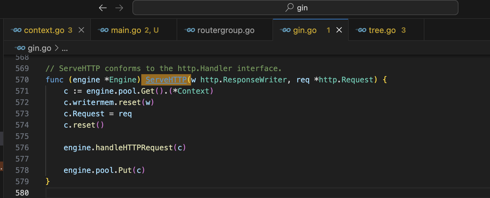
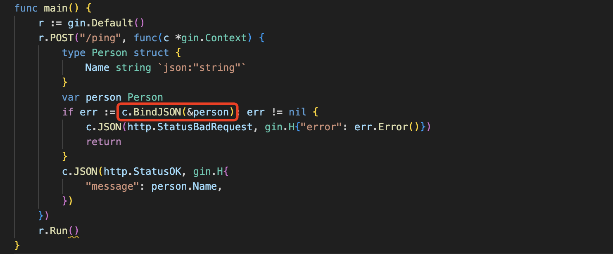
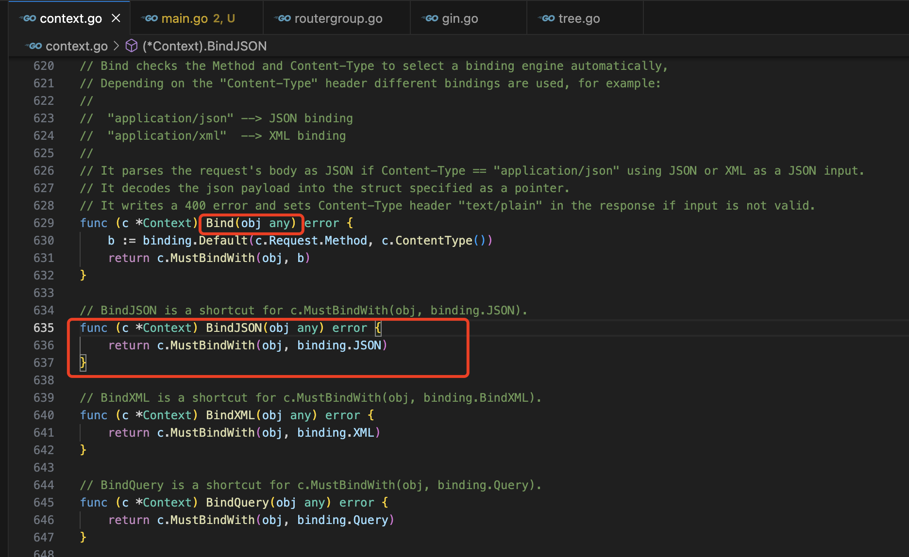
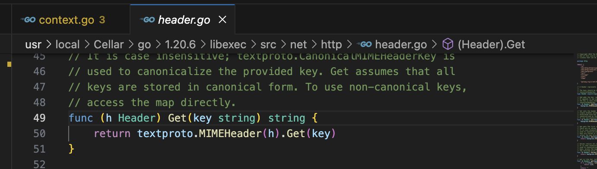

gin是一个知名的HTTP web框架，应用非常广泛。是用golang开发的。github项目地址为 https://github.com/gin-gonic/gin


## go-gin-example阅读

因为要阅读gin的源代码，所以想着先阅读完教如何 使用gin的示例代码，先大概了解gin是如何使用的。示例项目是https://github.com/eddycjy/go-gin-example。下面是我阅读完示例代码后的总结的一些比较重要的部分，当自己编码时可以参考。

读取配置和数据库初始化的过程，可以放在func init() 里，参考：

```go
func init() {
	setting.Setup() // 读取配置文件的所有部分，并对申明好了的全局配置变量赋值
	models.Setup() // 初始化mysql db，并自定义了Create Update Delete时的回调函数
	logging.Setup() // 初始化日志，是基于标准库里面的日志包初始化的
	gredis.Setup() // 初始化redis，包括设置连接redis时会调用的Dial函数
	util.Setup() // 设置pkg包里jwtSecret的值
}
```

项目里使用到了https://github.com/beego/beego框架，用了其validation包做数据验证，其他的包没有使用。

> beego框架可以用于开发包括传统的 Web 网站、API 服务、后台管理系统

validation包的使用方法可以参考：

```go
type auth struct {
	Username string `valid:"Required; MaxSize(50)"` // 这个地方要遵循 validation 的语法
	Password string `valid:"Required; MaxSize(50)"`
}
a := auth{Username: username, Password: password}
ok, _ := valid.Valid(&a)
```

用到了https://github.com/unknwon/com包，这个是针对 Go 编程语言常用函数的开源项目。

router目录存放了rest api的路由定义和rest api的rest部分，而且router的目录结构和路由的结构也是一样的

```shell
.
├── api
│   ├── auth.go
│   ├── upload.go
│   └── v1
│       ├── article.go
│       └── tag.go
└── router.go
```

> PS：除了这个项目，gin还提供了官方的example的项目，https://github.com/gin-gonic/examples，里面列举了一些gin的用法

## gin源代码阅读

因为对于gin的调用通常是类似这样写的：

```go
func main() {
	gin.SetMode(setting.ServerSetting.RunMode)

	routersInit := routers.InitRouter() // 注意
	readTimeout := setting.ServerSetting.ReadTimeout
	writeTimeout := setting.ServerSetting.WriteTimeout
	endPoint := fmt.Sprintf(":%d", setting.ServerSetting.HttpPort)
	maxHeaderBytes := 1 << 20
	server := &http.Server{
		Addr:           endPoint,
		Handler:        routersInit,
		ReadTimeout:    readTimeout,
		WriteTimeout:   writeTimeout,
		MaxHeaderBytes: maxHeaderBytes,
	}

	log.Printf("[info] start http server listening %s", endPoint)
	server.ListenAndServe()
}

func InitRouter() *gin.Engine {
	r := gin.New()
	apiv1 := r.Group("/api/v1")
	apiv1.Use(jwt.JWT())
	{
		//获取标签列表
		apiv1.GET("/tags", v1.GetTags)
    // ....
		//生成文章海报
		apiv1.POST("/articles/poster/generate", v1.GenerateArticlePoster)
	}
	return r
}
```

全局搜寻gin项目的代码，没有main.go文件，也没有main入口，所以gin代码只有被调用时才生效。根据上面的InitRouter函数中的代码，可以发现，其实：

```go
func New() *Engine {
}
```

可以理解为通常的入口文件。

返回的Engine实现了http的ServeHTTP方法

```go
type Handler interface {
	ServeHTTP(ResponseWriter, *Request)
}
```

具体的实现代码为：



这里是gin框架与外界调用之间的“对接点”。一个web框架的阅读，可以通过以下几个部分来阅读，

- 路由分组
- 输入数据解析与验证（比如json验证）
- 中间件支持
- 输出渲染
- 错误处理
- 日志

这几个部分也是一个请求的前后经过的几个步骤，首先在程序运行前定义好路由，然后运行。一个请求到达时，首先解析输入数据，然后经过中间件的处理，经过用户自定义的处理函数，最后渲染并返回输出。在这串运行过程中，可能会出错，那么就需要错误处理，也可能需要记录日志。

下面根据这几个部分来介绍。

### 路由分组

 gin的路径匹配部分使用的是基数树（Radix Trie）数据结构，这是一种多叉树，是一种更节省空间的Trie（前缀树）。也就是努力将多个节点合并为一个。基数树中作为唯一子结点的每个结点都与其父结点合并，每个内部结点的子结点数最多为基数树的基数 r，r 为正整数且等于2^n(n>=1)。[参考文章](https://cloud.tencent.com/developer/article/2255850)


### 输入数据解析与验证

以这个例子为例



这个例子中，BindJSON就是把http请求的json格式的内容解析成golang中的名为Person的struct。

本小节就是介绍类似BindJSON这样的功能gin是如何实现的，这里除了BindJSON，也可以写BindXML等等，BindXML会在当请求被容为xml格式时会把请求内容解析出来。

BindJSON定义在源代码中的context.go中：



所有和请求解析的函数都在该context.go中定义了，都是Context的方法，从`func (c *Context) Bind(obj any) error`到`func (c *Context) ShouldBindWith(obj any, b binding.Binding) error `。这里需要注意下第一个`func (c *Context) Bind(obj any) error `，这是比较特殊和实用的，因为这个函数会根据http请求的content-type自动找到不同content-type对应的输入解析函数。

在开始介绍其他的Bind相关函数之前，先介绍下基本且实用的`func (c *Context) Bind(obj any) error`。

#### Bind函数实现

如上图可以看到Bind函数的实现。

```go
func (c *Context) Bind(obj any) error {
	b := binding.Default(c.Request.Method, c.ContentType())
	return c.MustBindWith(obj, b)
}
```

首先是binding.Default(c.Request.Method, c.ContentType())第一个参数是c.Request.Method, c.Request.Method，c.Request为*http.Request类型，这里直接获取到了Method，没有任何多余的实现，而第二个 c.ContentType()是介绍如何获取请求的content-type的，其实现为：

```go
// context.go
// ContentType returns the Content-Type header of the request.
func (c *Context) ContentType() string {
	return filterFlags(c.requestHeader("Content-Type"))
}
```

```go
// context.go
func filterFlags(content string) string {
	for i, char := range content {
		if char == ' ' || char == ';' {
			return content[:i]
		}
	}
	return content
}

func (c *Context) requestHeader(key string) string {
	return c.Request.Header.Get(key)
}
```



可以看到实现的逻辑较为简单，最重要的还是调用了go标准库的net包中的`func (h Header) Get(key string) string`这个函数，才获取到了请求的content-type。

获取到了 binding.Default的两个参数后，下面是binding.Default的实现，这个函数的都是都是在binding包中的：

```go
// binding/binding.go
type Binding interface {
	Name() string
	Bind(*http.Request, any) error
}

func Default(method, contentType string) Binding {
	if method == http.MethodGet {
		return Form
	}

	switch contentType {
	case MIMEJSON:
		return JSON
	case MIMEXML, MIMEXML2:
		return XML
	case MIMEPROTOBUF:
		return ProtoBuf
	case MIMEMSGPACK, MIMEMSGPACK2:
		return MsgPack
	case MIMEYAML:
		return YAML
	case MIMETOML:
		return TOML
	case MIMEMultipartPOSTForm:
		return FormMultipart
	default: // case MIMEPOSTForm:
		return Form
	}
}
```

可以看到实现也很简单，就是根据string类型的输入即content-type，返回不同类型如JSON、XML等对Binding的实现。比如Form对Binding interface的实现为：

```go
// binding/binding.go
// These implement the Binding interface and can be used to bind the data
// present in the request to struct instances.
var (
	JSON          = jsonBinding{}
	XML           = xmlBinding{}
	Form          = formBinding{}
	Query         = queryBinding{}
	FormPost      = formPostBinding{}
	FormMultipart = formMultipartBinding{}
	ProtoBuf      = protobufBinding{}
	MsgPack       = msgpackBinding{}
	YAML          = yamlBinding{}
	Uri           = uriBinding{}
	Header        = headerBinding{}
	TOML          = tomlBinding{}
)
```

```go
// binding/form.go
type formBinding struct{}
type formPostBinding struct{}
type formMultipartBinding struct{}

func (formBinding) Name() string {
	return "form"
}

func (formBinding) Bind(req *http.Request, obj any) error {
  // req.ParseForm 还是调用了go标准库中http request对form格式的处理函数
	if err := req.ParseForm(); err != nil {
		return err
	}
  // ParseMultipartForm 也是调用了go标准库中的函数
	if err := req.ParseMultipartForm(defaultMemory); err != nil && !errors.Is(err, http.ErrNotMultipart) {
		return err
	}
	if err := mapForm(obj, req.Form); err != nil {
		return err
	}
	return validate(obj)
}
```

这里还需要注意mapForm的实现，mapForm的作用在http的form格式的请求已经被成功解析到req.Form后，将req.Form解析到目标对象obj中 。那么mapForm是如何实现的呢？

```go
func mapForm(ptr any, form map[string][]string) error {
  // mapFormByTag 不止被 mapForm 一个函数所调用，不同函数传递的tag可能不一样，这里传递的tag为form
	return mapFormByTag(ptr, form, "form")
}

func mapFormByTag(ptr any, form map[string][]string, tag string) error {
	// Check if ptr is a map
	ptrVal := reflect.ValueOf(ptr)
	var pointed any
	if ptrVal.Kind() == reflect.Ptr {
		ptrVal = ptrVal.Elem()
		pointed = ptrVal.Interface()
	}
	if ptrVal.Kind() == reflect.Map &&
		ptrVal.Type().Key().Kind() == reflect.String {
		if pointed != nil {
			ptr = pointed
		}
		return setFormMap(ptr, form)
	}

	return mappingByPtr(ptr, formSource(form), tag)
}
```

下面涉及setFormMap和mappingByPtr的代码都比较底层，这里就不贴出来了，主要作用就是根据反射给ptr赋值。

至此第一行执行完毕，下面就是执行`	return c.MustBindWith(obj, b)`

这个小节讲的是Bind的实现，最后执行的语句是` c.MustBindWith(obj, b)`，其实binding.go中和Bind函数同级别的其他函数比如`func (c *Context) BindJSON(obj any) error `，`func (c *Context) BindXML(obj any) error `等等，都用到了c.MustBindWith这个函数，所以下面将c.MustBindWith单独介绍。

```go
func (c *Context) MustBindWith(obj any, b binding.Binding) error {
	if err := c.ShouldBindWith(obj, b); err != nil {
		c.AbortWithError(http.StatusBadRequest, err).SetType(ErrorTypeBind) //nolint: errcheck
		return err
	}
	return nil
}
```

MustBindWith本质上还是在调用ShouldBindWith，下面介绍ShouldBindWith的实现，

#### ShouldBindWith的实现

```go
// context.go
// ShouldBindWith binds the passed struct pointer using the specified binding engine.
// See the binding package.
func (c *Context) ShouldBindWith(obj any, b binding.Binding) error {
	return b.Bind(c.Request, obj)
}
```

ShouldBindWith接受两个参数，第一个是要绑定的对象，为any即interface类型，第二个是绑定的实现方法，是一个interface，由json、xml等实现。

b.Bind(c.Request, obj)就是调用binding.Binding类型的b实现的interface。这里超级简单。


### 中间件支持


### 输出渲染


### 错误处理


### 日志


## gin阅读中的一些扩展

下面是阅读中的一些知识点的总结，这些知识点和gin的框架实现关系不大，都是一些比较独立的知识点。

1. gin源代码中很多地方都写了`go:build`，关于这个`go:build`，其实 go:build 是一个编译指令（build constraint），用于在不同的Go版本或操作系统之间条件编译代码。`!go1.20`表示如果Go版本小于1.20，那么以下代码块将会被编译，否则将被忽略。`go1.20` 表示如果Go版本等于1.20或更高，那么以下代码块将会被编译，否则将被忽略。

2. golang有个类型是any，是原生的，其作用和interface相同，其实是interface的别名


## 参考文章

[基数树简介](https://cloud.tencent.com/developer/article/2255850)

